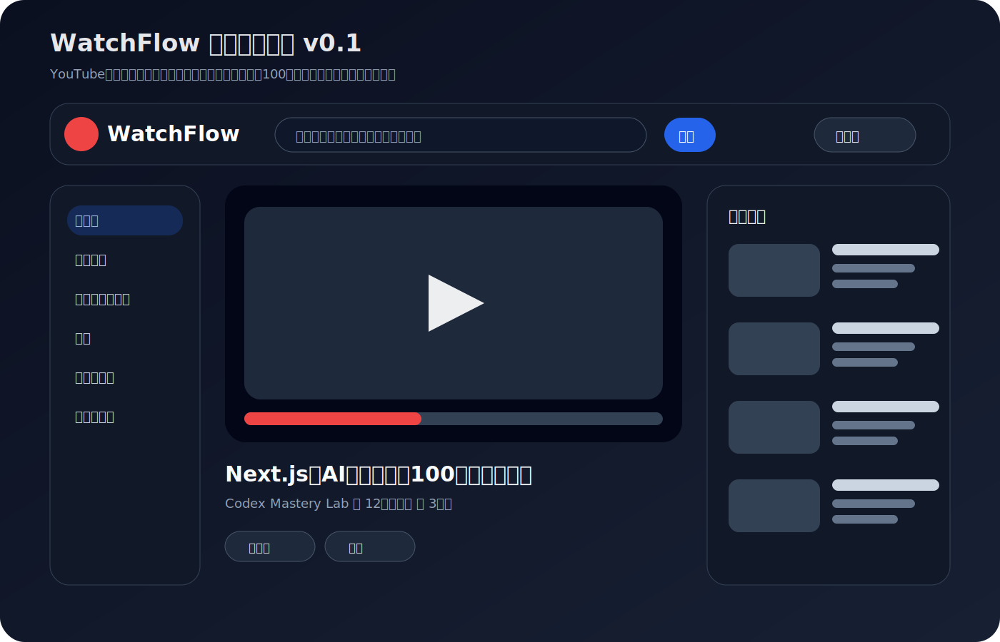
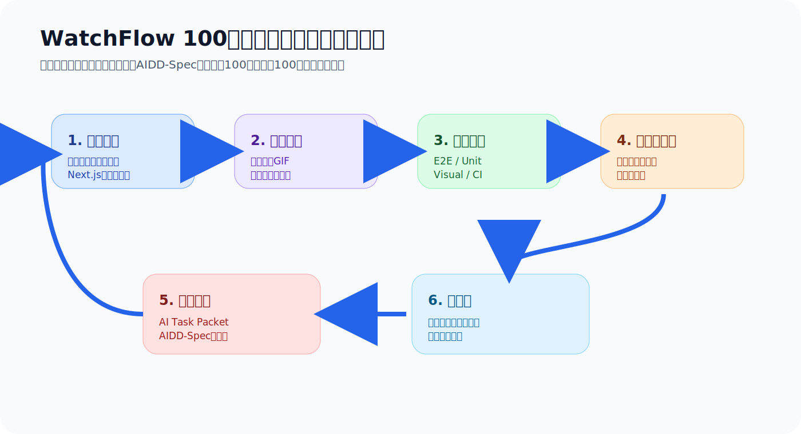
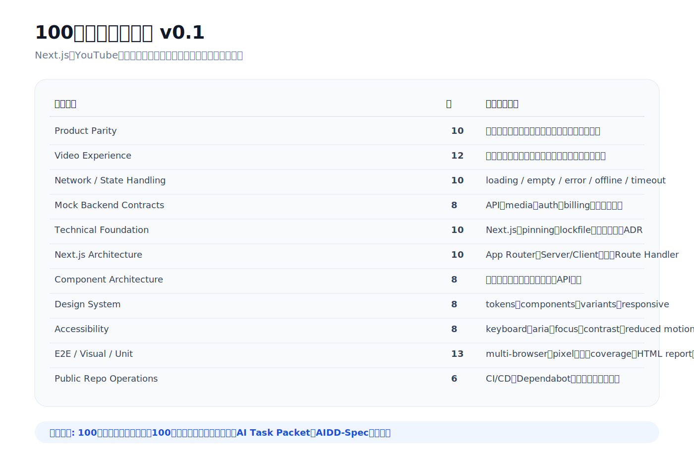

# WatchFlow 100点チャレンジ 第1回：YouTube風アプリでAI駆動開発の正解を探す

> 2026-06-27 / Codex Mastery Lab 新シリーズ  
> 想定読了時間: 約12分  
> 種別: Roadmap / Experiment Design / Scoring Rubric



## まず結論

これまでの小さなFAQ、ギャラリー、問い合わせフォームの実験で分かったことがある。小さな題材でも学びはある。しかし、読者にとって「何が足りないのか」が直感的に分かりにくい。

そこで、ここからは題材を変える。

**YouTube風の動画視聴Webアプリ「WatchFlow」を、Codexへの指示改善だけで100点に近づける。**

ただし、YouTubeのロゴ、商標、実データ、実APIをコピーするわけではない。読者がよく知っている「動画視聴サービス」という体験を題材にして、AIに何をどこまで指示すべきかを検証する。

終了条件は2つ。

```text
100点満点に到達する
または
100回試行する
```

毎回、Codexに渡した日本語プロンプト、生成されたアプリ、ブラウザ操作GIF、正解デザインとの画像比較、E2E/Unit/Visualテスト結果、CI結果、失点理由、追加したAIDD-Specルールを記録する。



## なぜYouTube風アプリなのか

YouTube風アプリは、誰でも完成形を想像しやすい。

- ホームに動画カードが並ぶ
- 検索できる
- 動画詳細ページがある
- 関連動画が出る
- コメントがある
- チャンネル情報がある
- 再生、停止、シーク、字幕、バッファリング、エラーがある
- ログイン状態や課金状態で体験が変わる

つまり、雑なAI生成アプリと理想状態の差分を説明しやすい。

「なんとなく動いた」では足りない。プロ品質を目指すなら、動画再生、通信制御、エラーハンドリング、アクセシビリティ、テスト、設計、公開リポジトリ運用まで見る必要がある。

この題材なら、AI駆動開発の難しさが見えやすい。

## 今回の前提

このシリーズでは、Next.jsを標準スタックにする。

理由は、実務で採用することが多いからである。AI駆動開発の標準を考えるなら、普段使わない技術で理想論を作るより、実際にチームが採用しやすい技術で検証した方がよい。

ただし、Next.jsを使っただけでは合格にしない。

Next.jsの使い方、採用パッケージ、バージョンpinning、lockfile、Node.jsバージョン、依存管理、App Router設計、Server/Client Component境界、テスト容易性、CI/CD、Dependabotまで採点する。

つまり、今回の問いはこうである。

> Next.jsでYouTube風動画サービスを作るとき、Codexにどこまで指示すれば、プロフェッショナル品質に近づくのか？

## フロントエンドだけではなく、ローカルモック込みで評価する

WatchFlowは、最初から本物のバックエンド、OAuth、Stripe、動画配信基盤を作るわけではない。

しかし、フロントエンド品質を100点で評価するには、フロントエンドだけでは足りない。

動画サービスには次が必要になる。

- 動画一覧API
- 検索API
- コメントAPI
- 認証状態
- 課金状態
- 動画メディア配信
- 通信遅延
- 404
- 500
- timeout
- session expired
- payment failed
- offline

そこで、方針はこうする。

> 本番サービスそのものは作らない。  
> ただし、本番で起きる状態をテストできるローカルモックは作る。

将来的には、次のような構成を目指す。

```text
/path/to/project-root/
  apps/
    web/              Next.jsアプリ
  mocks/
    api/              動画、検索、コメントAPI
    media/            mp4、poster、字幕、遅延、失敗モード
    auth/             anonymous / logged_in / premium / session_expired
    billing/          free / premium / payment_failed
  packages/
    design-system/
    test-utils/
    contracts/
  .github/
    workflows/
    dependabot.yml
```

公開記事では、個人ユーザー名を含むローカル絶対パスは出さない。`/path/to/project-root/` や `~/watchflow-lab/` のように伏せる。

## 100点ルーブリック v0.1

最初の採点基準はこれで始める。



| カテゴリ | 点 | 見るもの |
|---|---:|---|
| Product Parity | 10 | ホーム、検索、動画詳細、コメント、関連動画、チャンネル導線 |
| Video Experience | 12 | 再生、停止、シーク、音量、字幕、バッファリング、失敗、リトライ |
| Network / State Handling | 10 | loading、empty、error、offline、timeout、retry |
| Mock Backend Contracts | 8 | API、media、auth、billing、障害モードをローカルで再現できるか |
| Technical Foundation / Dependency Governance | 10 | Next.js、TypeScript、Node、pnpm、lockfile、version pinning、ADR |
| Next.js Architecture Fitness | 10 | App Router、Server/Client境界、Route Handler、loading/error/not-found |
| Component Architecture | 8 | ページ、feature、shared UI、service層の責務分離 |
| Design System | 8 | tokens、components、variants、responsive、focus、reduced motion |
| Accessibility | 8 | keyboard、aria、focus、contrast、字幕、reduced motion |
| E2E / Visual / Unit | 13 | マルチブラウザ、pixel基準、HTML report画像、coverage、境界値 |
| Public Repo Operations | 6 | GitHub Actions、Dependabot、README、license、artifact保存 |

最初から満点を取る必要はない。むしろ、Trial 001は低い点数でよい。

重要なのは、失点理由を毎回AIDD-Specに戻すことだ。

## 正解画像をどう扱うか

今回から、正解とする画像を必ず置く。

ただし、YouTubeそのものに対してpixel-perfectを目指すわけではない。商標や画面コピーの問題もあるし、YouTubeは地域、ログイン状態、A/Bテストで見た目が変わる。

そこで、次のルールにする。

1. YouTube風の体験を観察する
2. WatchFlow独自の参照デザインを作る
3. その参照デザイン画像を「正解画像」として保存する
4. 実際のWebアプリのスクリーンショットと比較する
5. 比較結果を記事に画像として載せる

つまり、pixel-perfectの対象は本物のYouTubeではなく、**承認済みのWatchFlow参照デザイン**である。

## テスト結果も画像で載せる

読み物として分かりやすくするため、テスト結果も文字だけで終わらせない。

毎回、少なくとも次を載せる。

- ブラウザ操作GIF
- 正解デザイン画像
- 実アプリのスクリーンショット
- 正解画像と実アプリの比較画像
- Playwright HTML reportのスクリーンショット
- ターミナルでのテスト結果スクリーンショット
- CI結果のスクリーンショット
- スコア表の画像

記事を読んだ人が、コードを見なくても「何が良くなり、何がまだ足りないか」を分かる状態にする。

## 国際対応とGDPRも見る

WatchFlowのUIは日本語ベースで作る。プロンプト、テスト名、サンプルデータ、エラー文、README、記事も日本語にする。

ただし、将来の国際対応も見る。

初回から完全なi18n実装を要求するわけではないが、次の観点は採点対象に入れる。

- UI文言を後から辞書化できるか
- 日付、数値、再生回数、通貨、タイムゾーンを局所化できるか
- CookieやlocalStorageを使うなら、目的が説明されているか
- 閲覧履歴、コメント、課金状態、認証状態のデータ分類があるか
- GDPR観点で、同意、削除要求、データエクスポート、保持期間の設計余地があるか

動画アプリは、見た目よりもデータの扱いが重い。ここを最初から評価対象にする。

## 公開GitHubリポジトリ前提にする

WatchFlowは、記事を読んだ人が実際に動かせる公開リポジトリにする前提で作る。

そのため、次もスコア対象にする。

- READMEのセットアップ手順
- `pnpm install` からの再現性
- Node.jsバージョン固定
- lockfile
- GitHub Actions
- Dependabot
- Playwright report artifact
- test-results artifact
- ライセンス
- YouTube非公式であることの明記
- 外部APIや秘密情報に依存しないこと

公開リポジトリで無料で使える機能は、使うべきなら正しく使う。使わないなら、なぜ使わないかを記録する。

## Trial 001でCodexに渡すプロンプト

初回は、Next.jsという組織制約だけは固定する。その他はかなり広めに渡し、Codexがどこまで自律的に作るかを見る。

```text
/path/to/project-root/ に、Next.js + TypeScriptで日本語UIのYouTube風動画視聴Webアプリ「WatchFlow」を作ってください。

目的は、YouTubeそのものをコピーすることではなく、動画視聴サービスとしてプロフェッショナル品質に近づけるためのAI駆動開発実験です。

必須条件:
- UI、サンプルデータ、エラー文、テスト名、READMEは日本語ベースにしてください。
- Next.js App Routerを使ってください。
- TypeScript strictを前提にしてください。
- package manager、Node.jsバージョン、lockfile、依存バージョン方針が再現可能になるようにしてください。
- YouTubeのロゴ、商標、実データ、実APIは使わないでください。
- 独自名 WatchFlow と独自の参照デザインで作ってください。
- 公開GitHubリポジトリで配布し、記事を読んだ人がローカルで動かせる前提にしてください。

最低限ほしい画面:
- ホーム
- 検索結果
- 動画詳細/再生画面
- チャンネル概要
- コメント欄
- 関連動画
- エラー状態

最低限ほしいローカルモック:
- 動画一覧API
- 検索API
- コメントAPI
- 認証状態モック anonymous / logged_in / premium / session_expired
- 課金状態モック free / premium / payment_failed
- 動画メディアの正常/遅延/404/失敗モード

動画再生まわりで確認したいこと:
- poster表示
- 再生/一時停止
- シーク
- 音量/ミュート
- 字幕またはキャプションの設計余地
- バッファリング表示
- 動画取得失敗時のエラー表示
- リトライ
- キーボード操作
- アクセシブルな操作名

テストと自動化:
- Unit Testを用意してください。
- Component TestまたはTesting Libraryベースのテストを用意してください。
- PlaywrightでChromium/Firefox/WebKitのE2Eを用意してください。
- Visual Regression用のスクリーンショット基準を用意してください。
- テスト結果やHTML reportをCI artifactとして保存できるようにしてください。
- GitHub Actionsを用意してください。
- Dependabotを設定してください。

設計:
- 1ファイル巨大実装にしないでください。
- design tokens、共有UI、feature単位のコンポーネント、API client、mock adapterを分けてください。
- 動画プレイヤーはClient Componentとして責務を分けてください。
- loading / empty / error / offline / timeout / retry状態を設計してください。
- 国際対応を視野に入れ、UI文言、日付、数値、再生回数、通貨、タイムゾーンを後から差し替えやすくしてください。
- GDPR観点として、閲覧履歴、コメント、課金状態、Cookie/storage、同意、削除要求、データエクスポート、保持期間を設計メモに残してください。

成果物:
- README.md
- docs/decisions/ に技術選定理由
- docs/testing.md
- docs/privacy-gdpr-readiness.md
- docs/score-self-review.md
- GitHub Actions設定
- Dependabot設定

最後に、実行したコマンド、成功/失敗したテスト、既知の制約、次に改善すべき点を日本語で報告してください。
```

このプロンプトは、完璧な指示ではない。むしろTrial 001として、どこまで足りないかを見るための出発点である。

## 第1回で作った標準ファイル

今回の準備として、次を作った。

```text
/path/to/project-root/standards/watchflow-100-point-rubric-v0.1.md
/path/to/project-root/standards/watchflow-nextjs-technical-contract-v0.1.md
/path/to/project-root/experiments/watchflow-trial-001/PROMPT.md
/path/to/project-root/experiments/watchflow-trial-001/README.md
```

これらは公開リポジトリに載せる前提の文書であり、個人ユーザー名を含む絶対パスは出さない。

## 次回やること

次回は、実際にTrial 001をCodexに投げる。

その後、以下を記事に載せる。

- 生成されたWatchFlowアプリ
- 操作GIF
- 正解デザイン画像との比較
- Playwright HTML report画像
- Unit Test / E2E / Visual Regression結果
- CI設定の有無
- Dependabot設定の有無
- 100点ルーブリックでの初回スコア
- 失点理由
- Trial 002に追加するAI Task Packet差分

## まとめ

このシリーズでは、AIに「いい感じに作って」と頼むだけでは終わらせない。

毎回、失点を記録し、なぜ失点したのかを考え、次の指示に変換する。

```text
雑な生成
  → 操作キャプチャ
  → 画像比較
  → テスト
  → 採点
  → 失点理由
  → AIDD-Spec更新
  → 再生成
```

このループを、100点または100試行まで続ける。

WatchFlowは、YouTube風アプリを作る企画ではない。Next.js、モックバックエンド、動画再生、通信制御、テスト自動化、デザインシステム、公開リポジトリ運用を通して、AI駆動開発に必要な共通説明書を作るための実験である。
