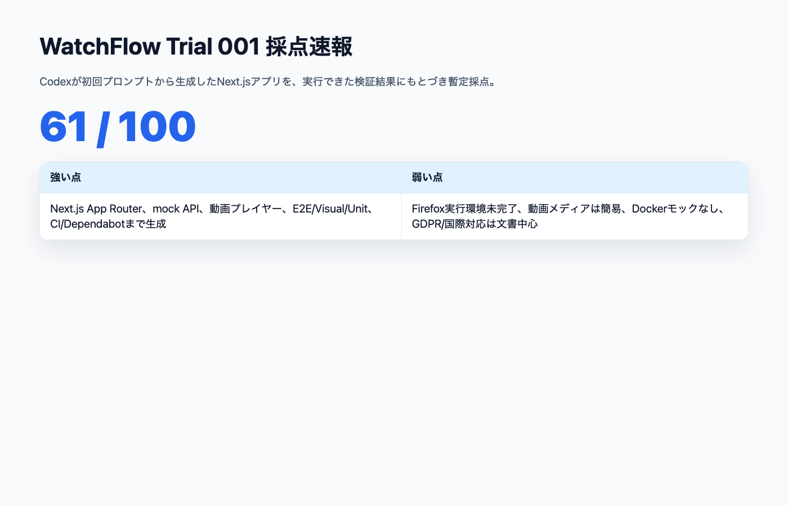
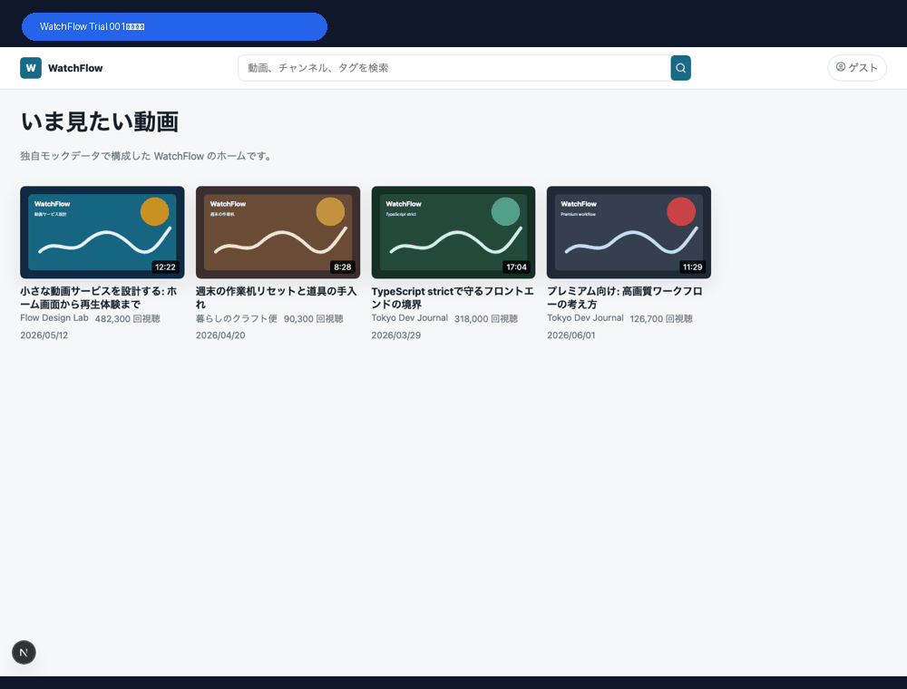
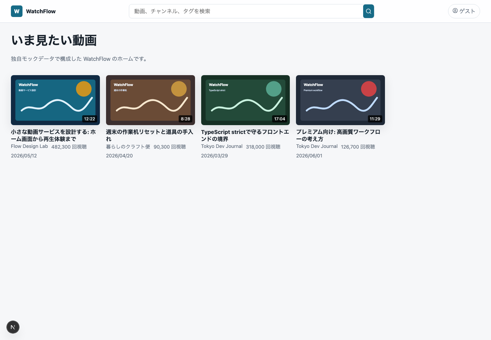
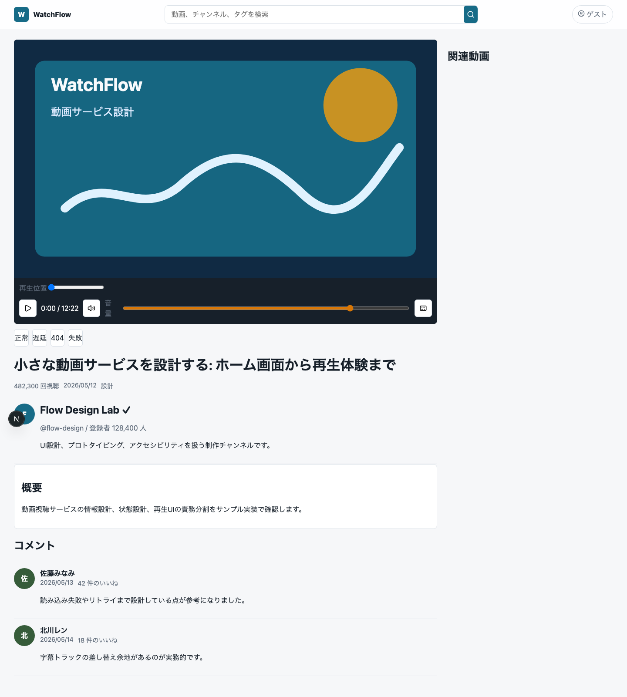
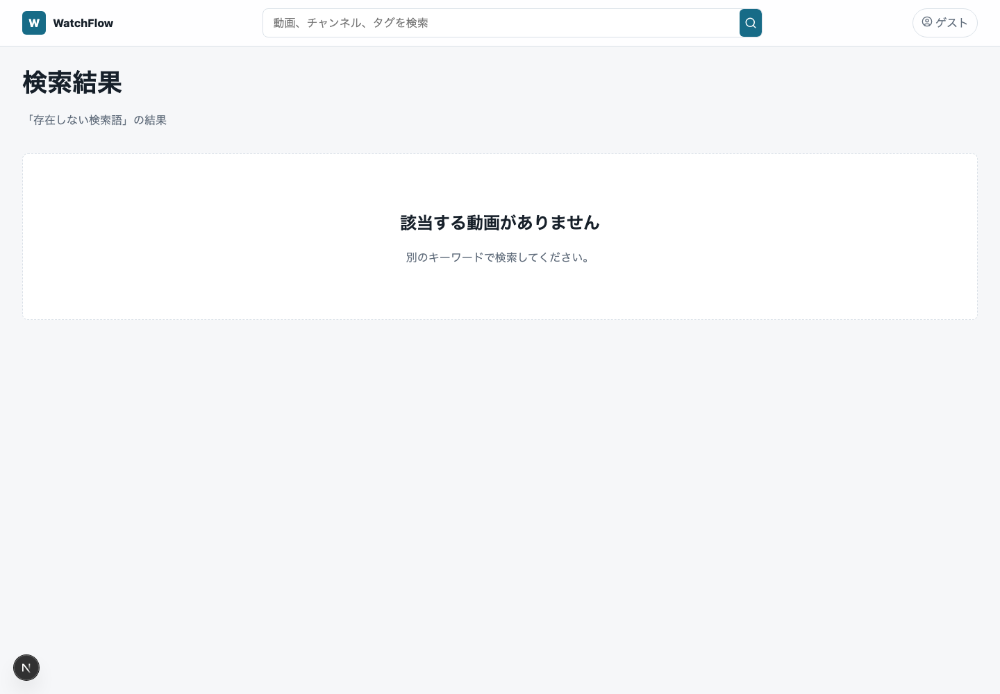
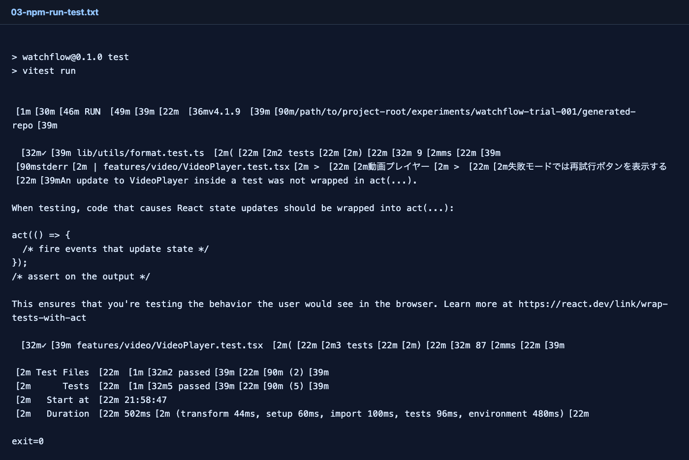
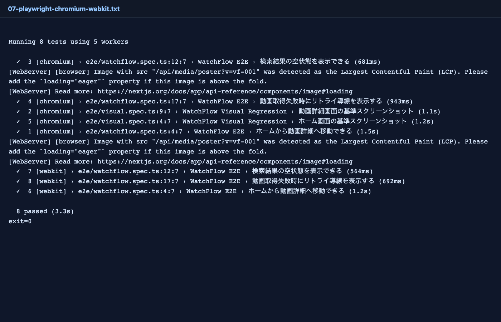
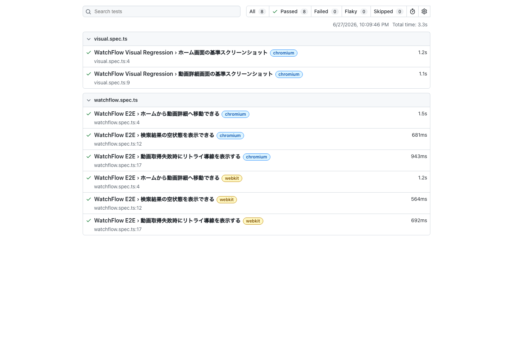

# WatchFlow Trial 001：雑プロンプトからNext.js動画アプリはどこまで作れるか

> 2026-06-27 / WatchFlow 100点チャレンジ  
> 対象: Trial 001 / Next.js / モック込み動画サービス  
> 結果: **61 / 100**



## まず結果

Trial 001では、前回作った初回プロンプトをCodexに渡し、Next.js + TypeScriptでYouTube風動画視聴アプリ「WatchFlow」を生成させた。

結論から言うと、初回としてはかなり作れた。

- Next.js App Router
- TypeScript strict
- 日本語UI
- mock API
- mock media
- auth / billing状態API
- 動画詳細ページ
- 検索ページ
- チャンネルページ
- コメント欄
- 動画プレイヤー
- Playwright E2E
- Visual Regression
- Vitest
- GitHub Actions
- Dependabot
- GDPR readiness doc
- 技術選定ADR

ここまで一気に出た。

一方で、100点にはまだ遠い。スコアは **61 / 100** とした。

## 生成されたアプリ



### ホーム



ホームは、検索バー、ゲスト状態、動画カード一覧を持っている。日本語UIで、独自名WatchFlowになっており、YouTubeのロゴや実データは使っていない。

ただし、動画視聴サービスとして見るとまだ薄い。

- サイドナビがない
- カテゴリレールがない
- ショート、履歴、登録チャンネル、プレイリスト導線がない
- 動画カードの情報量が少ない
- ホームの下半分がかなり空いている

「YouTube風」というより、「動画カードの一覧ページ」に近い。

### 動画詳細



動画詳細は、かなり良い出発点になっている。

- poster表示
- 再生/一時停止
- シーク
- 音量
- 字幕ボタン
- メディア状態切り替え
- 概要
- チャンネル概要
- コメント
- 関連動画欄

一方で、右カラムの関連動画は見出しだけが目立ち、初期表示で回遊体験が弱い。動画プレイヤーも、本格的な動画サービスとしてはまだ不足が多い。

不足しているもの:

- 再生速度
- 全画面
- Picture in Picture
- 字幕切り替えUI
- buffer量表示
- 実ストリーミング制御
- プレミアム状態による体験差分
- session expiredやpayment failedの画面反映

### 検索空状態



検索結果なしの空状態は実装されていた。これは良い。

ただし、検索結果ページ全体としては、ソート、フィルタ、候補表示、検索履歴、チャンネル/動画/プレイリストの種別表示まではない。

## 生成された構成

生成物は次のような構成だった。

```text
/path/to/project-root/experiments/watchflow-trial-001/generated-repo/
  app/
    api/
      auth/
      billing/
      comments/
      media/
      search/
      videos/
    channel/[id]/
    search/
    watch/[id]/
  features/
    channel/
    comments/
    layout/
    video/
  lib/
    api/
    i18n/
    mocks/
    privacy/
    utils/
  e2e/
    watchflow.spec.ts
    visual.spec.ts
  docs/
    decisions/
    privacy-gdpr-readiness.md
    score-self-review.md
    testing.md
  .github/
    workflows/ci.yml
    dependabot.yml
```

1ファイル巨大実装ではなく、`app/`、`features/`、`components/ui/`、`lib/` に分かれている。これはTrial 001としてはかなり良い。

ただし、`VideoPlayer.tsx` は165行あり、再生状態、UI、イベント処理、字幕ボタン、error/retryが集中している。100点を狙うなら、次回は次のように分けたい。

```text
VideoPlayerShell
PlayerControls
CaptionControls
usePlayerStateMachine
mediaAdapter
playerErrorMapper
```

## 依存関係と技術選定

`package.json` はこうなった。

```json
{
  "packageManager": "npm@10.9.8",
  "engines": {
    "node": ">=22.23.0 <23",
    "npm": ">=10.9.0 <11"
  },
  "dependencies": {
    "lucide-react": "1.21.0",
    "next": "16.2.9",
    "react": "19.2.7",
    "react-dom": "19.2.7"
  }
}
```

良い点:

- lockfileがある
- Node/npm versionが明示されている
- 依存バージョンがpinされている
- ADRに技術選定理由がある
- `npm audit` は0 vulnerabilities

気になる点:

- こちらの標準としてはpnpmを想定していたが、Codexはnpmを選んだ
- Next.js 16.2.9 / React 19.2.7 / TypeScript 6.0.3というかなり新しい組み合わせを選んだ
- 実務で安定版として採用してよいかは別途判断が必要
- 依存採用理由はあるが、バージョン採用理由はまだ弱い

ここはTrial 002で、package managerとバージョン方針をより明示する必要がある。

## 実行した検証

### lint / typecheck / unit / build

すべて通った。

```text
npm run lint       exit=0
npm run typecheck  exit=0
npm run test       exit=0
npm run build      exit=0
```

Unit Test結果:



ただし、VitestでReactの `act(...)` warning が出ている。テストは合格だが、ユーザー操作後の状態更新を正しく待てていない可能性がある。100点基準では失点にする。

### E2E / Visual Regression

最初の `npm run test:e2e` は一部失敗した。

理由は、FirefoxブラウザがローカルのPlaywright環境に入っていなかったためである。

```text
Firefox: browser executable doesn't exist
```

`npx playwright install firefox` も試したが、600秒でtimeoutした。そのため、今回は環境制約として記録し、Chromium / WebKitだけを再実行した。

Chromium / WebKitは合格した。

```text
npx playwright test --project=chromium --project=webkit
8 passed
```



Playwright HTML reportも生成された。



ただし、LCP対象画像に対してNext.jsが次のwarningを出している。

```text
Image with src "/api/media/poster?v=vf-001" was detected as the Largest Contentful Paint (LCP).
Please add the loading="eager" property if this image is above the fold.
```

これもTrial 002の改善対象にする。

## 採点

| カテゴリ | 配点 | Trial 001 | 理由 |
|---|---:|---:|---|
| Product Parity | 10 | 5 | ホーム、検索、動画詳細、コメント、チャンネルはあるが、サイドナビ、履歴、登録、プレイリスト、通知などが弱い |
| Video Experience | 12 | 7 | poster、再生/停止、シーク、音量、字幕track、失敗/リトライはある。再生速度、全画面、PiP、字幕切替UIはない |
| Network / State Handling | 10 | 6 | 検索空状態、メディア失敗、遅延、404、retryはある。offline、timeout、session expired、payment failedの画面反映は限定的 |
| Mock Backend Contracts | 8 | 5 | Route HandlerでAPI/auth/billing/mediaはあるが、docker-composeや独立mock service、テストからの状態制御はない |
| Technical Foundation / Dependency Governance | 10 | 6 | Node/npm/lockfile/pinning/ADRはある。pnpmではなくnpm、バージョン採用理由が弱い |
| Next.js Architecture Fitness | 10 | 7 | App Router、Route Handler、loading/error/not-found、Client VideoPlayer分離は良い。キャッシュ/Server Component戦略は浅い |
| Component Architecture | 8 | 6 | feature/ui/lib分離あり。VideoPlayerに責務が集中 |
| Design System | 8 | 4 | 独自見た目とCSS variablesはあるが、design token文書、variant体系、コンポーネントカタログはない |
| Accessibility | 8 | 5 | aria-label、role、button名、caption trackはある。axe検査、focus order、contrast証拠は不足 |
| E2E / Visual / Unit | 13 | 6 | Unit/Component/E2E/Visualあり。Firefox未実行、テスト数が少ない、coverage未取得 |
| Public Repo Operations | 6 | 4 | GitHub Actions、Dependabot、README、docsあり。license、artifact運用の実CI確認、商標注意が不足 |
| **合計** | **100** | **61** | 初回としては優秀だが、100点にはまだ遠い |

## Trial 001で分かったこと

雑プロンプトとはいえ、今回のプロンプトはかなり要求が多い。だから、Codexは最初から多くの成果物を出した。

特に良かったのは次の点。

- App Routerを使った
- Route Handlerでmock APIを作った
- 動画プレイヤーをClient Componentにした
- E2E、Visual、Unitを最初から入れた
- CIとDependabotも作った
- GDPR readiness docも作った

一方で、100点を狙うには「作った」だけでは足りない。

- Firefoxが実行できる状態までセットアップできていない
- 動画サービス特有の再生体験が浅い
- mock backendがRoute Handlerに閉じていて、障害注入が弱い
- 課金・認証状態がUI体験に十分接続されていない
- Design Systemが文書化されていない
- coverageやaxeがない
- バージョン選定理由が浅い

つまり、Trial 002では「何を作るか」ではなく、**どのように検証可能に作るか**をより強く指示する必要がある。

## Trial 002へ戻す指示差分

次回のAI Task Packetには、最低限これを追加する。

```text
- package managerはpnpm固定にする
- Next.js/React/TypeScriptの安定版バージョンを明示し、採用理由をADRに書く
- Playwright browsers installをセットアップ手順とCIに入れる
- Firefox未導入を事前検出するdoctor scriptを作る
- mock-api / mock-media / mock-auth / mock-billingをdocker-composeで独立サービス化する
- VideoPlayerをstate machine、media adapter、controls、captionsへ分解する
- payment_failed、session_expired、offline、timeoutを実画面とE2Eで確認する
- axeによるアクセシビリティ検査をE2Eに追加する
- Unit Testのcoverage閾値を設定する
- Design System文書とコンポーネントカタログを作る
- LCP対象posterのloading/eager優先度を明示する
```

## まとめ

Trial 001は、初回としてはかなり良い。

しかし、100点の動画サービス風アプリではない。

今回の一番大きな学びは、AIに「E2EもVisualもCIもDependabotも入れて」と書けば、かなりの箱は作るということだ。一方で、その箱が本当にプロ品質で回るか、失敗状態を制御できるか、ブラウザを揃えられるか、設計として保守できるかは別問題である。

次回は、WatchFlowを「作れるアプリ」から「検証可能なアプリ」へ寄せる。
