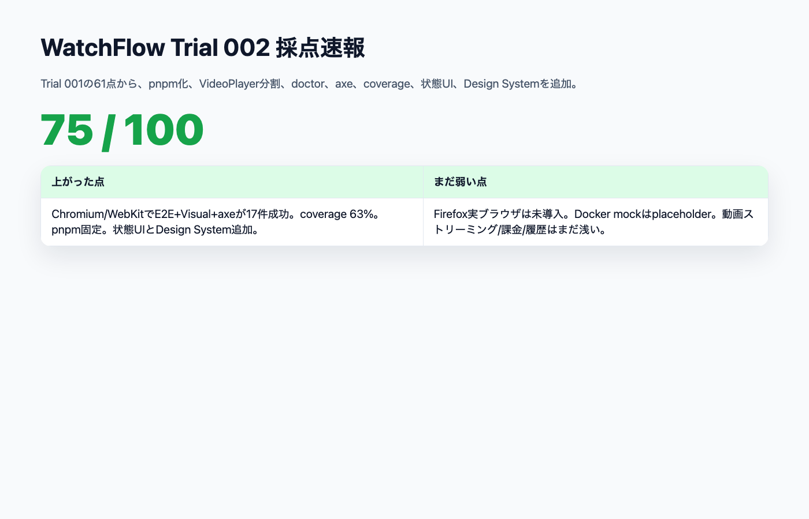
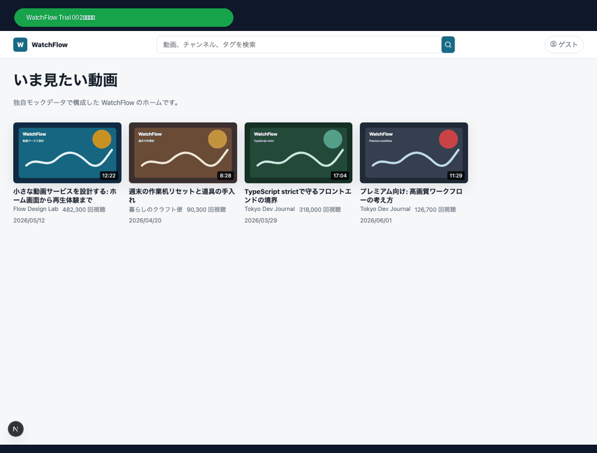
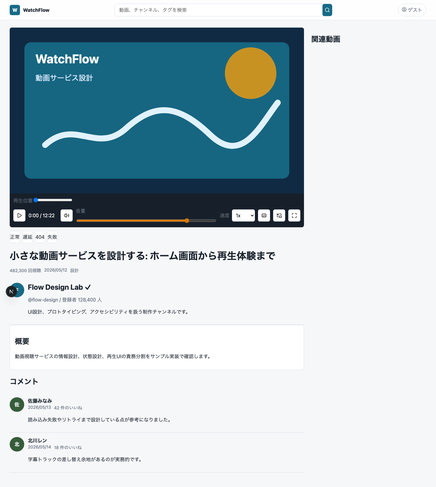
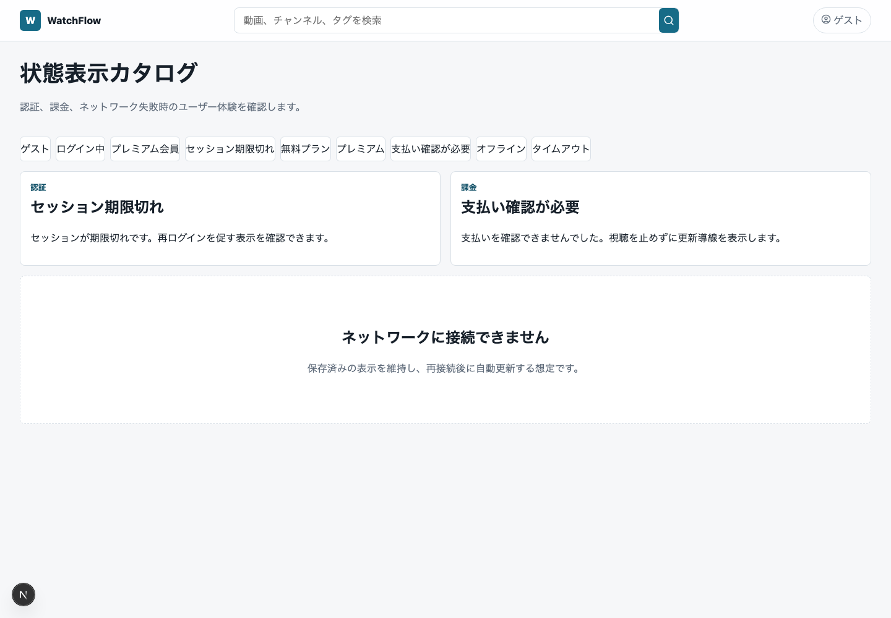
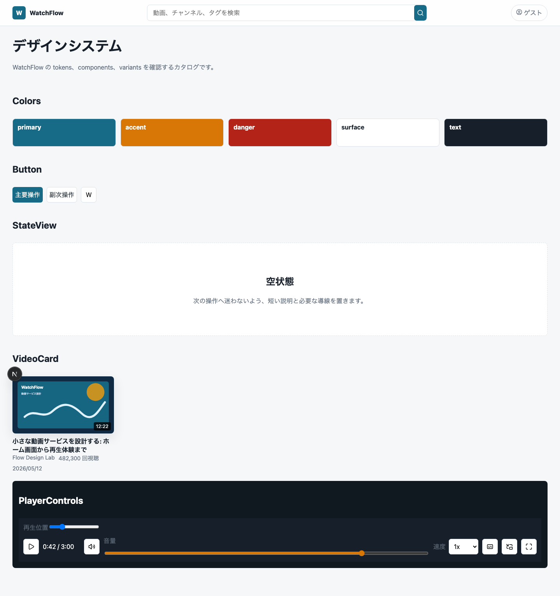
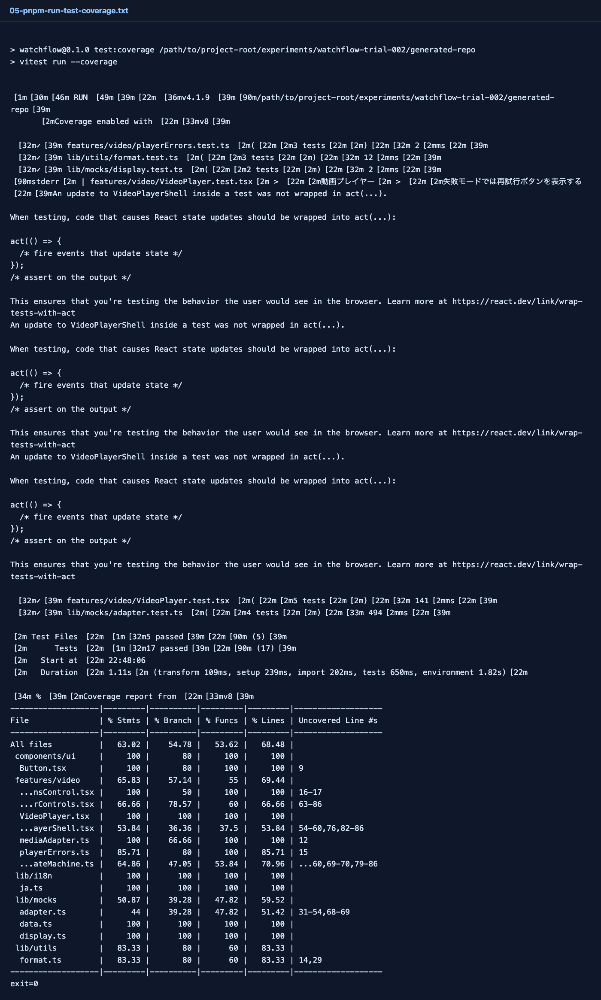
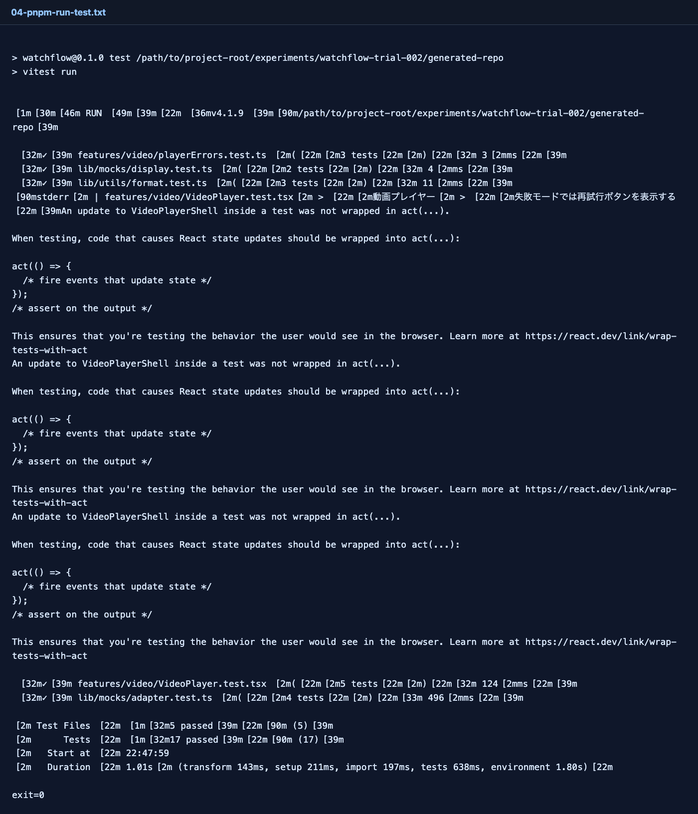
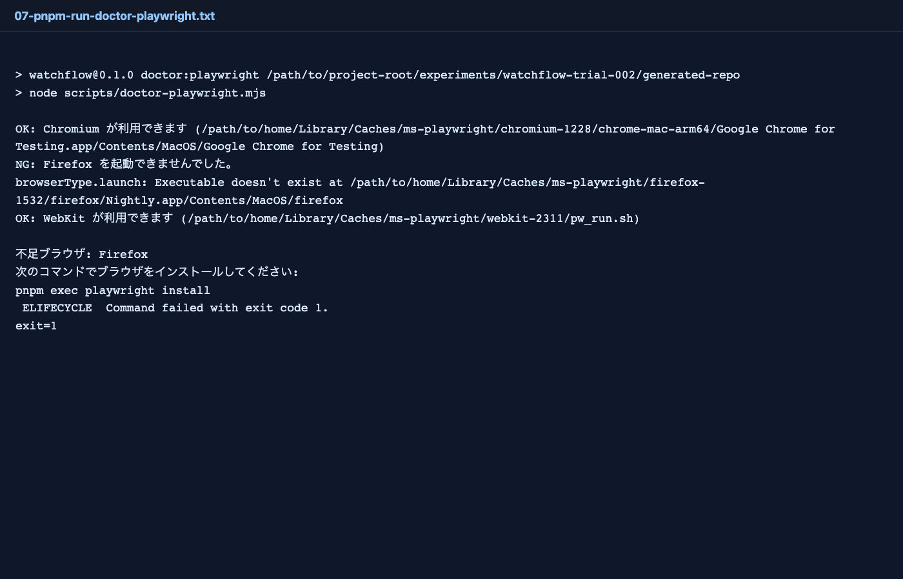
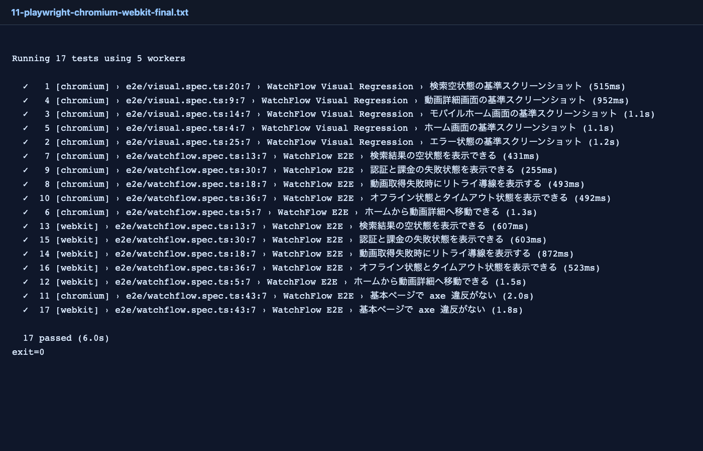
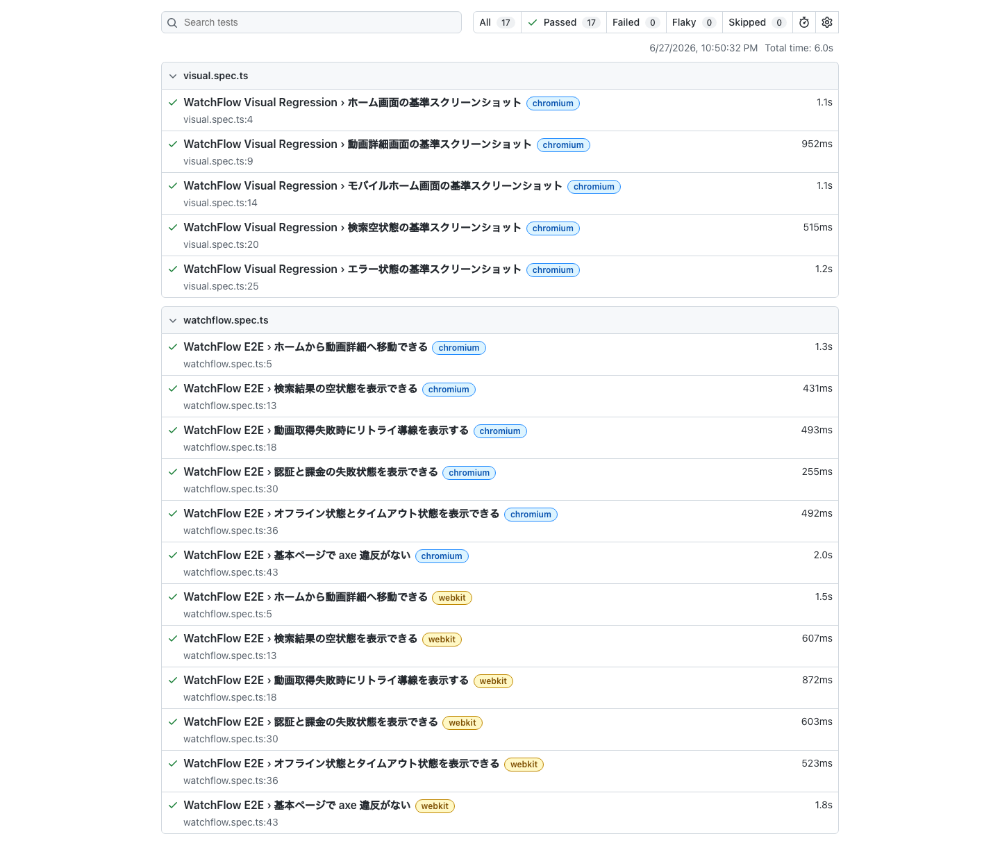

# WatchFlow Trial 002：61点から75点へ、AI Task Packetに失点を戻す

> 2026-06-27 / WatchFlow 100点チャレンジ  
> 対象: Trial 002 / pnpm / VideoPlayer分割 / 状態UI / axe / coverage  
> 結果: **75 / 100**



## 今回やったこと

Trial 001は **61 / 100** だった。

初回からNext.js App Router、mock API、動画プレイヤー、E2E、Visual Regression、Unit Test、GitHub Actions、Dependabotまで作れた。一方で、pnpmではなくnpm、Firefox未導入、VideoPlayerの責務集中、状態UI不足、Design System不足、axe/coverage不足が残った。

Trial 002では、その失点をそのままAI Task Packetへ戻した。

```text
Trial 001の失点
  → AI Task Packet差分
  → Codexに再投入
  → Trial 002生成
  → 実行検証
  → 再採点
```

結果は **75 / 100**。14点上がった。



## Trial 002で増えたもの

主な追加は次の通り。

- npmからpnpmへ移行
- Playwright doctor script追加
- VideoPlayerを分割
- 再生速度、字幕、全画面/PiP入口を追加
- session_expired / payment_failed / offline / timeout状態を画面化
- axe検査をE2Eへ追加
- coverage閾値を追加
- Unit Testを5件から17件へ増加
- Visual Regressionにモバイル、検索空状態、エラー状態を追加
- `docs/design-system.md` と簡易Design System画面を追加
- `docker-compose.yml` とmock service READMEを追加

## 画面

### ホーム


ホーム自体の大きな見た目はTrial 001と近い。ただし内部的にはpnpm化、テスト追加、状態UI追加、Design System追加が入っている。

Product Parityとしてはまだ弱い。

- サイドナビがない
- カテゴリレールが弱い
- 登録チャンネルがない
- 履歴がない
- プレイリストがない
- 通知風UIがない

YouTube風動画サービスとしては、まだ「動画一覧 + 詳細」に近い。

### 動画詳細



Trial 002では、VideoPlayerの責務分割が入った。

```text
VideoPlayer
VideoPlayerShell
PlayerControls
CaptionsControl
usePlayerStateMachine
mediaAdapter
playerErrors
```

UI上も、再生速度、字幕、全画面、PiPの入口が増えた。

ただし、100点基準ではまだ足りない。

- 実ストリーミングではない
- Range requestの検証がない
- buffer量の可視化がない
- low bandwidth / interrupted streamが弱い
- keyboard shortcutの網羅が浅い

### 状態UI



Trial 001では、auth/billing/network状態はデータやAPIとしてはあったが、ユーザー体験として弱かった。

Trial 002では、次の状態を画面化した。

- anonymous
- logged_in
- premium
- session_expired
- payment_failed
- offline
- timeout

E2Eでも、session_expired / payment_failed / offline / timeout を確認している。

### Design System



`docs/design-system.md` と `/design-system` 画面が追加された。

これで、AI Task Packetに「Design System」と書いたとき、最低限どのような証跡を残してほしいかが少し見えるようになった。

ただし、まだStorybookのような本格カタログではない。variant網羅、状態差分、アクセシビリティ検査、スクリーンショット基準まで含めるならTrial 003以降の課題になる。

## 実行した検証

### pnpm / lint / typecheck / unit / coverage / build

すべて実行した。

```text
pnpm install --frozen-lockfile  exit=0
pnpm run lint                   exit=0
pnpm run typecheck              exit=0
pnpm run test                   exit=0
pnpm run test:coverage          exit=0
pnpm run build                  exit=0
```

coverageは次の通り。

```text
Statements: 63.02%
Branches:   54.78%
Functions:  53.62%
Lines:      68.48%
```



Unit Testは17件に増えた。



ただし、Reactの `act(...)` warning はまだ残っている。これは合格ではなく、次回の失点として扱う。

### Playwright doctor

Trial 002では、Playwright doctor scriptが入った。



結果は、ChromiumとWebKitはOK、FirefoxはNG。

```text
OK: Chromium
NG: Firefox
OK: WebKit
```

これは一見失敗だが、Trial 001よりは前進している。Trial 001ではFirefox不足がE2E実行中に初めて分かった。Trial 002では、実行前にdoctorで検出できるようになった。

### E2E / Visual / axe

Chromium / WebKitでは通った。

```text
pnpm exec playwright test --project=chromium --project=webkit
17 passed
```



中身は以下を含む。

- ホームから動画詳細へ移動
- 検索結果の空状態
- 動画取得失敗時のリトライ
- 認証と課金の失敗状態
- オフライン状態とタイムアウト状態
- axe検査
- Visual Regression
- モバイルホーム
- 検索空状態
- 状態エラー画面

Playwright HTML reportも取得した。



## 採点

| カテゴリ | 配点 | Trial 001 | Trial 002 | 理由 |
|---|---:|---:|---:|---|
| Product Parity | 10 | 5 | 6 | 状態画面とDesign Systemは増えたが、動画サービス固有機能はまだ弱い |
| Video Experience | 12 | 7 | 8 | 再生速度、字幕、PiP/全画面入口、分割が入った |
| Network / State Handling | 10 | 6 | 8 | session_expired/payment_failed/offline/timeoutが画面とE2Eに入った |
| Mock Backend Contracts | 8 | 5 | 6 | docker-composeとmock READMEは入ったがplaceholder寄り |
| Technical Foundation | 10 | 6 | 8 | pnpm固定、doctor、coverage、ADR更新 |
| Next.js Architecture | 10 | 7 | 8 | design-system/states追加、Server/Client境界バグを修正 |
| Component Architecture | 8 | 6 | 7 | VideoPlayerを責務分割 |
| Design System | 8 | 4 | 6 | docsとカタログ画面を追加 |
| Accessibility | 8 | 5 | 7 | axe検査追加。ただしcolor-contrastは無効化中 |
| E2E / Visual / Unit | 13 | 6 | 8 | 17件E2E、coverage、Visual追加。Firefoxは未完了 |
| Public Repo Operations | 6 | 4 | 3 | CI未実行、Licenseや公開運用はまだ弱い |
| **合計** | **100** | **61** | **75** | +14点 |

## Trial 002で良かったこと

一番良かったのは、「失点をAI Task Packetへ戻す」サイクルがちゃんと効いたことだ。

Trial 001で失点した項目を具体的に書いたら、Codexはかなり素直に改善した。

- pnpmへ移行した
- doctorを作った
- coverageを入れた
- axeを入れた
- 状態UIを作った
- Visual対象を増やした
- VideoPlayerを分割した

つまり、AIに「品質を上げて」と言うより、前回の失点を具体的な契約として戻す方が効く。

## まだ100点に遠いところ

### 1. Firefox実ブラウザがまだない

doctorで不足は検出できたが、まだFirefoxで実行できていない。

Trial 003では、ローカルで無理ならCIでFirefox証拠を取る、あるいはbrowser cache戦略を明示する必要がある。

### 2. Docker Composeはplaceholder

`docker-compose.yml` とmock service READMEは入ったが、実際の独立Node serviceとしてはまだ薄い。

100点を目指すなら、少なくとも次が必要になる。

```text
mock-api
mock-media
mock-auth
mock-billing
```

それぞれ独立起動し、E2Eから状態を切り替えられるようにしたい。

### 3. 動画再生がまだ浅い

VideoPlayerは良くなったが、動画サービスとしてはまだ足りない。

- Range request
- slow stream
- interrupted stream
- 500
- subtitle切替
- buffered range
- keyboard shortcut網羅
- media error mapping

このあたりはTrial 003の主題にできる。

### 4. `act(...)` warningが残っている

Unit Testは17件に増えたが、Reactの `act(...)` warningが残っている。これは「テストは通るが、ユーザー操作後の状態更新を正しく待てていない」可能性がある。

100点チャレンジでは、warningも失点にする。

### 5. color contrastを無効化している

axe検査は入ったが、`color-contrast` ruleを無効化している。これは実務的には逃げなので、次回は有効化したい。

## Trial 003へ戻す指示差分

次回はこれをAI Task Packetに入れる。

```text
- Firefox実行問題を解決する。難しければCIでFirefox証拠を取る
- React act warningをゼロにする
- axe color-contrast ruleを有効化する
- mock-api / mock-media / mock-auth / mock-billingを独立Node serviceとして実装する
- docker-composeでweb + mock servicesを起動する
- media serverにRange request、slow stream、interrupted stream、404、500、subtitleを実装する
- VideoPlayerにbuffered range表示、keyboard shortcut test、playback rate testを追加する
- Product Parityとしてサイドナビ、カテゴリレール、登録チャンネル、履歴、プレイリスト、通知風UIを追加する
```

## まとめ

Trial 002では、61点から75点まで上がった。

大事なのは、今回の改善が偶然ではなく、Trial 001の失点をそのままAI Task Packetに戻した結果だということだ。

AI駆動開発の正解は、最初から完璧なプロンプトを書くことではなく、実行結果を採点し、失点を契約として戻し、再実行するサイクルにある。

次は75点から80点台を目指す。
