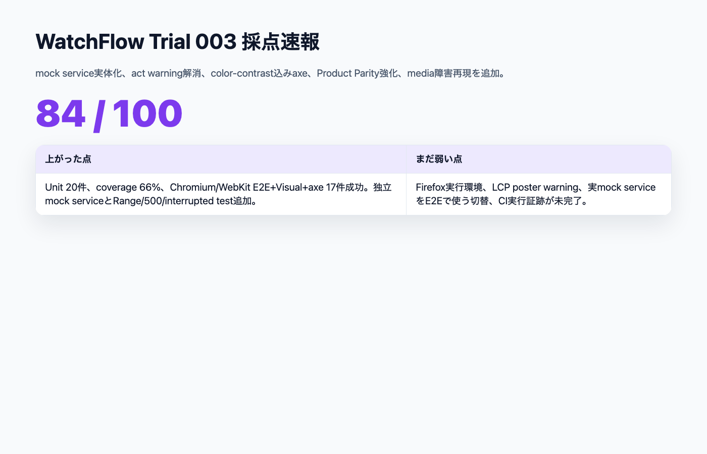
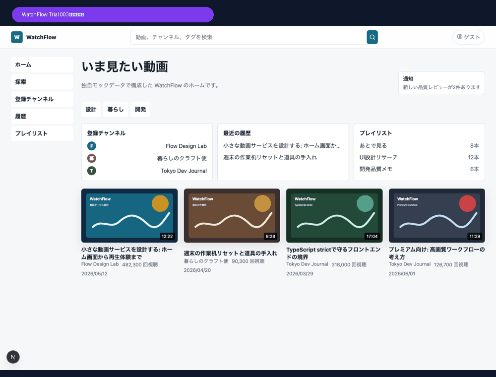
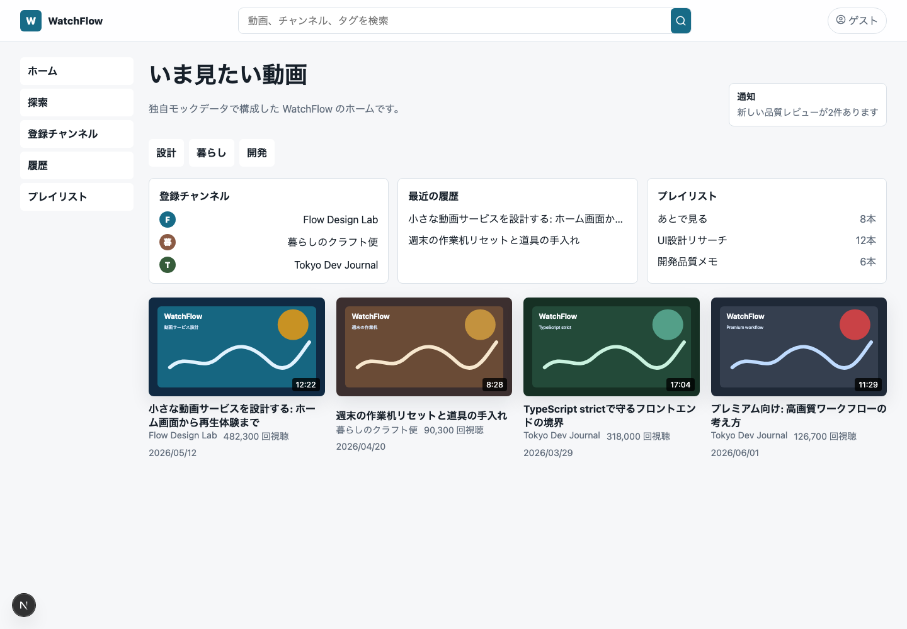
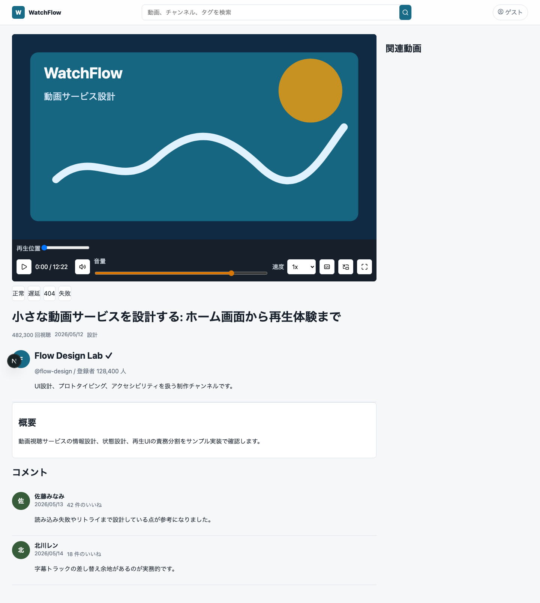
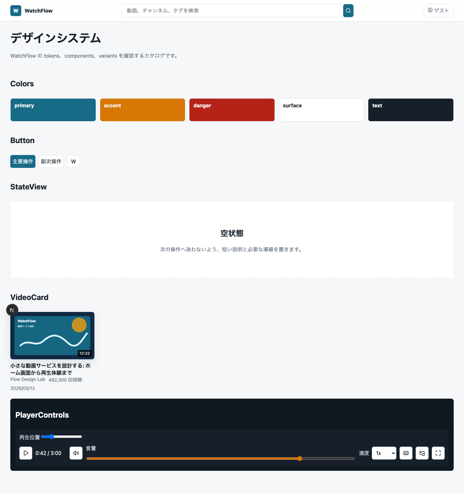
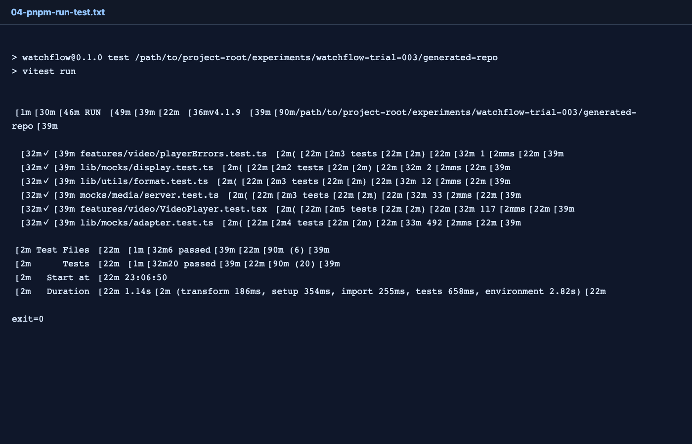
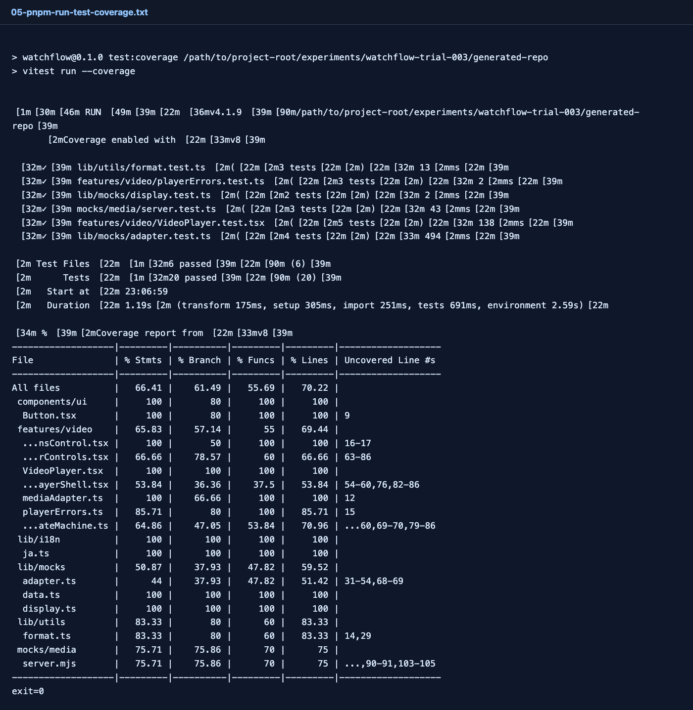
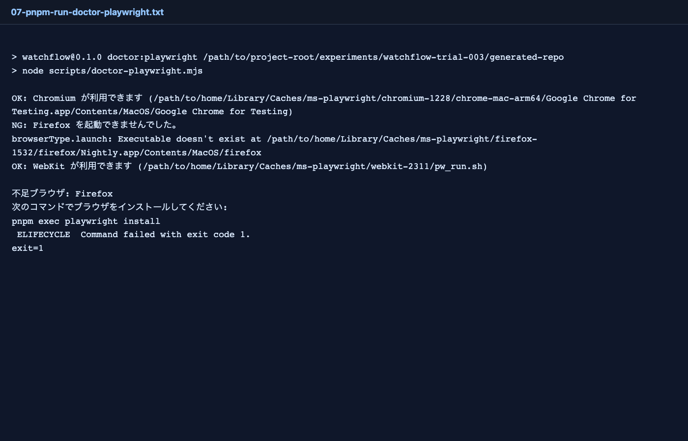
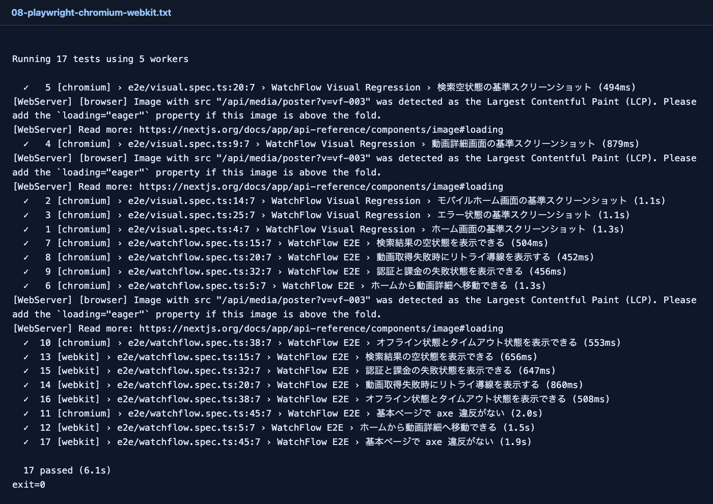

# WatchFlow Trial 003：75点から84点へ、mock serviceとアクセシビリティを詰める

> 2026-06-27 / WatchFlow 100点チャレンジ  
> 対象: Trial 003 / mock service実体化 / act warningゼロ / color-contrast込みaxe  
> 結果: **84 / 100**



## 結果

Trial 002は **75 / 100** だった。

残っていた大きな失点は、React `act(...)` warning、axeのcolor-contrast除外、placeholder寄りのmock service、動画メディア障害再現の浅さ、Product Parity不足だった。

Trial 003ではそこをAI Task Packetへ戻した。

結果は **84 / 100**。80点台に入った。



## 主な改善

- React `act(...)` warningが消えた
- axeの `color-contrast` 除外を外した
- Chromium/WebKitでE2E + Visual + axeが17件合格
- mock-api / mock-media / mock-auth / mock-billingの独立Node serviceを追加
- mock-mediaにRange request、500、interrupted、slow、captionを追加
- media service testを追加
- Unit Testが20件に増えた
- coverageがStatements 66.41%、Lines 70.22%へ上がった
- ホームにサイドナビ、カテゴリ、登録チャンネル、履歴、プレイリスト、通知風UIを追加

## 画面

### ホーム



Trial 003で一番見た目が変わったのはホーム画面だ。

Trial 002までは「動画カード一覧」感が強かった。Trial 003では、サイドナビ、カテゴリ、登録チャンネル、履歴、プレイリスト、通知風UIが入り、動画サービスらしい情報設計に少し近づいた。

まだ本物のYouTube風体験には遠いが、Product Parityは **6点から8点** に上げた。

### 動画詳細



VideoPlayer分割は維持。Trial 003ではmock-media側にRange request、500、interrupted streamを追加した。

ただし、E2Eが実際に独立mock-media serviceへ切り替わっているわけではない。まだNext.js Route Handlerと独立serviceが並存している状態なので、Trial 004ではE2Eをdocker-compose mock servicesへ接続したい。

### 状態UI


session_expired / payment_failed / offline / timeout の状態UIは維持。Trial 003では、mock service化により、将来的にE2Eから状態を外部制御しやすくする方向に進んだ。

### Design System



Trial 003では、color-contrast込みのaxe検査に通すため、色tokenを調整した。`color-contrast` を無効化したままでは100点に近づかないので、ここは良い前進だった。

## 実行した検証

```text
pnpm install --frozen-lockfile  exit=0
pnpm run lint                   exit=0
pnpm run typecheck              exit=0
pnpm run test                   exit=0
pnpm run test:coverage          exit=0
pnpm run build                  exit=0
```

Unit Testは20件合格。Trial 002で残っていたReact `act(...)` warningは消えた。



coverage:

```text
Statements: 66.41%
Branches:   61.49%
Functions:  55.69%
Lines:      70.22%
```



Playwright doctorは引き続きFirefox不足を検出する。



Chromium/WebKitではE2E + Visual + axeが通った。

```text
pnpm exec playwright test --project=chromium --project=webkit
17 passed
```



## 採点

| カテゴリ | 配点 | Trial 002 | Trial 003 | 理由 |
|---|---:|---:|---:|---|
| Product Parity | 10 | 6 | 8 | サイドナビ、カテゴリ、登録チャンネル、履歴、プレイリスト、通知風UIを追加 |
| Video Experience | 12 | 8 | 9 | Range/500/interruptedのmedia service test追加。LCP warningは残る |
| Network / State Handling | 10 | 8 | 8 | 状態UIは維持。mock service外部切替は未完 |
| Mock Backend Contracts | 8 | 6 | 7 | 独立Node http serviceを追加。E2E実依存切替はまだ |
| Technical Foundation | 10 | 8 | 8 | pnpm/coverage/doctor維持。Firefox環境は未解決 |
| Next.js Architecture | 10 | 8 | 8 | 外部mockとの接続設定は次回課題 |
| Component Architecture | 8 | 7 | 7 | VideoPlayer分割維持 |
| Design System | 8 | 6 | 7 | contrast対応と情報設計改善 |
| Accessibility | 8 | 7 | 8 | color-contrast込みaxe合格 |
| E2E / Visual / Unit | 13 | 8 | 10 | Unit 20件、coverage、Chromium/WebKit 17件合格 |
| Public Repo Operations | 6 | 3 | 4 | mock service docs追加。CI実行証跡/Licenseは未完 |
| **合計** | **100** | **75** | **84** | +9点 |

## 残っている壁

84点まで来たが、100点にはまだ距離がある。

1. Firefox実ブラウザがローカルにない
2. LCP対象poster warningが残っている
3. 独立mock serviceをE2Eの実依存として使っていない
4. CI上のFirefox/Artifact証跡がない
5. 課金、履歴、プレイリストはまだUI中心で、実データ操作が浅い

## Trial 004へ戻す指示差分

```text
- LCP poster warningを消す
- E2Eをdocker-compose mock services依存に切り替える
- Firefoxはローカルで無理ならGitHub Actions上の実行証跡を取る
- mock servicesに状態変更APIを追加する
- E2Eからauth/billing/network/media状態を切り替える
- CI artifact、License、公開READMEを強化する
```

## まとめ

Trial 003では、75点から84点まで上がった。

今回重要だったのは、単にUIを増やしたことではなく、**warningを失点として扱い、除外していたaxe ruleを戻し、placeholderだったmock serviceを実体化した**ことだ。

AI駆動開発の100点に近づくには、「見た目ができた」だけでなく、検証の逃げを減らしていく必要がある。

次は84点から90点台を狙う。
