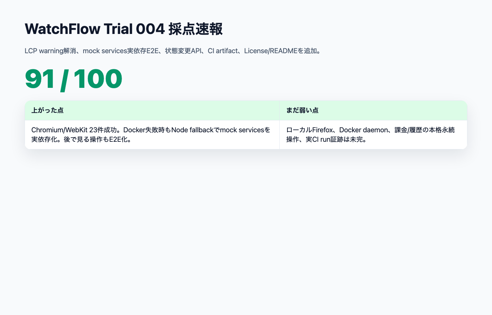
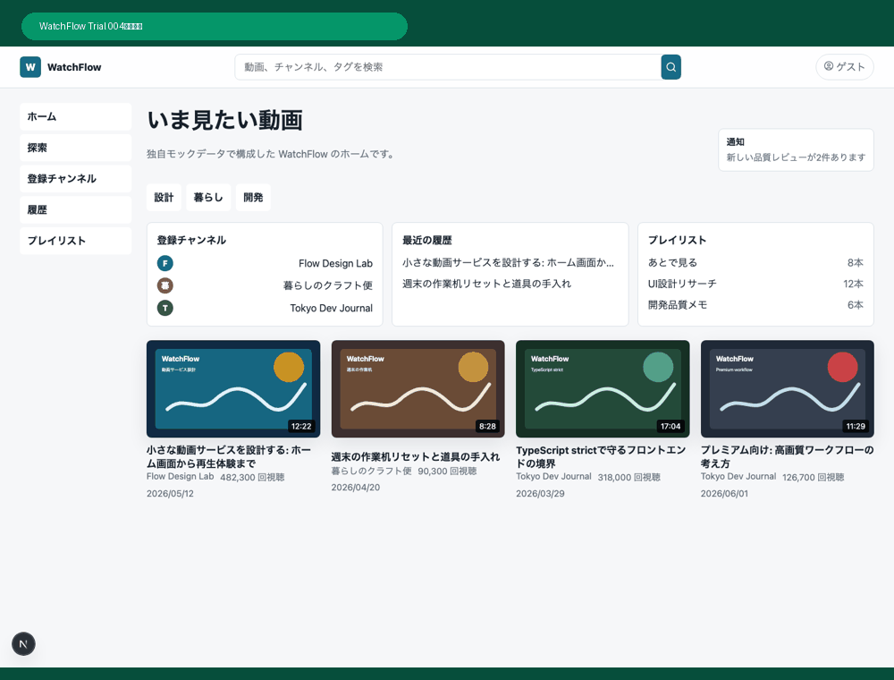
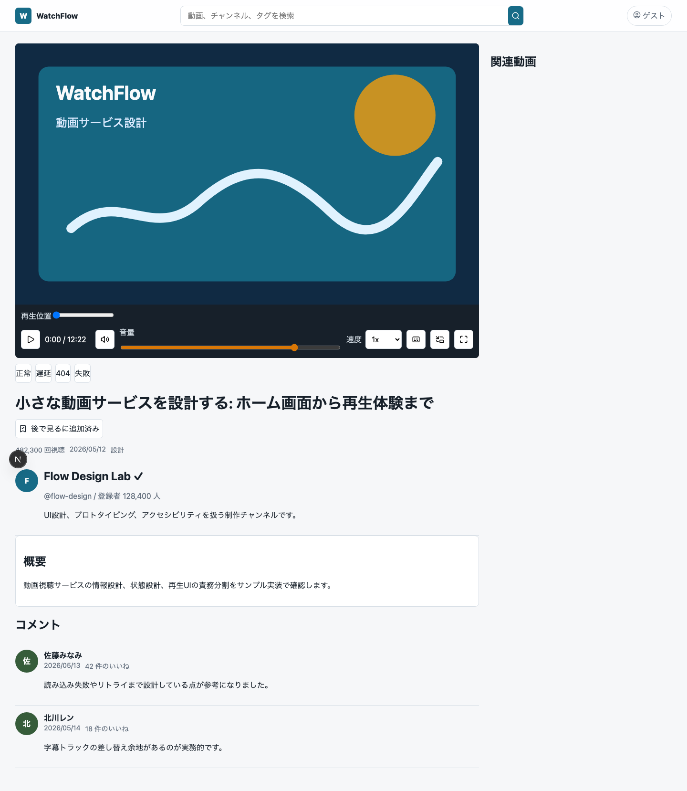
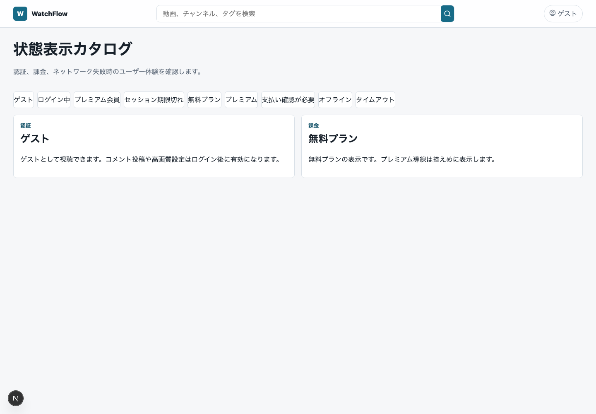
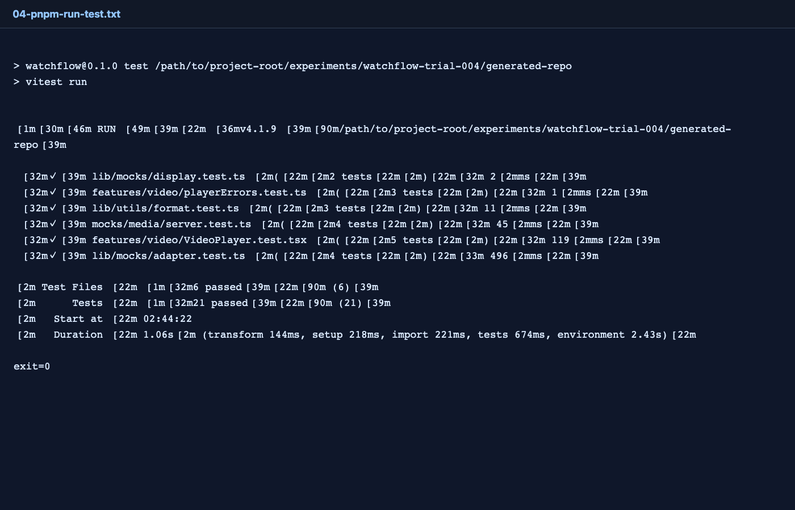
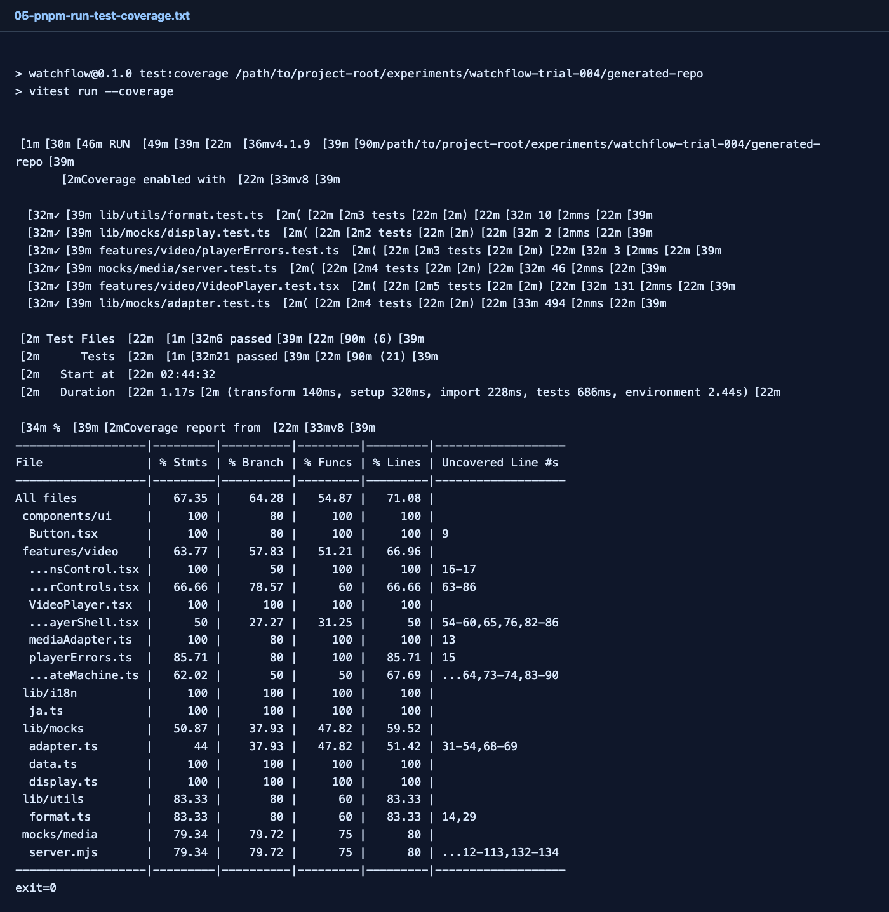
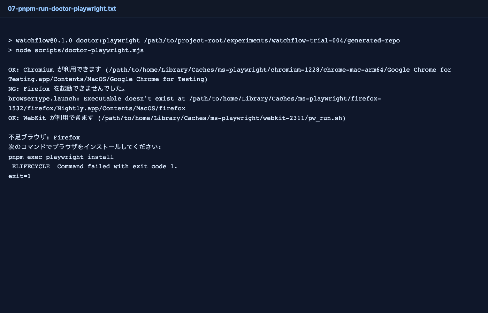
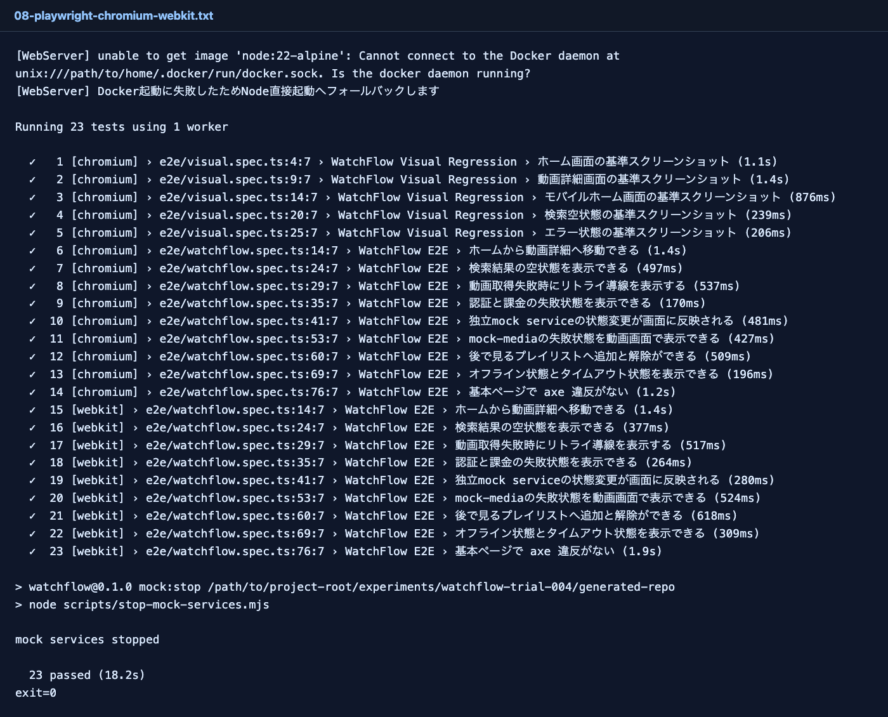

# WatchFlow Trial 004：84点から91点へ、mock serviceをE2Eの実依存にする

> 2026-06-27 / WatchFlow 100点チャレンジ  
> 対象: Trial 004 / LCP warning解消 / mock services実依存E2E / CI artifact / 公開README  
> 結果: **91 / 100**



## 結果

Trial 003は **84 / 100** だった。

残っていた大きな壁は、LCP poster warning、独立mock serviceをE2Eの実依存にできていないこと、CI artifact/Firefox証跡、License/公開README、そしてUIだけで終わっているProduct Parityだった。

Trial 004では、そのうち多くを実装に戻した。

結果は **91 / 100**。ようやく90点台に入った。



## 主な改善

- LCP poster warningがE2Eログから消えた
- `mock:start` / `mock:stop` を追加
- Docker Composeを優先し、Docker daemonがなければNode直接起動へfallback
- E2Eから独立mock serviceの `/__control/state` を操作
- auth / billing / media / network状態をE2Eで変更して画面反映を確認
- mock-media failureを動画画面で確認
- 「後で見る」追加/解除をE2E化
- CIに `pnpm exec playwright install --with-deps` とartifact uploadを追加
- `LICENSE` と公開repo向けREADMEを追加

## 画面

### ホーム


ホームの見た目はTrial 003を維持。Trial 004の中心はUI追加ではなく、裏側の検証可能性を上げることだった。

### 動画詳細


Trial 003で残っていたLCP poster warningは、今回のPlaywright実行ログでは出なくなった。

これは小さく見えるが重要だ。100点を狙うなら「通っているがwarningが出る」を放置しない方がいい。

### 後で見る



Trial 004では「後で見る」の追加/解除をE2Eで確認した。

```text
後で見るへ追加
後で見るに追加済み
解除して戻る
```

まだlocalStorageベースの簡易実装だが、UIだけのProduct Parityから一歩進んだ。

### mock service状態UI



E2Eから独立mock serviceの状態を変更し、画面へ反映されることを確認した。

```text
POST http://127.0.0.1:4010/__control/state
POST http://127.0.0.1:4020/__control/state
POST http://127.0.0.1:4030/__control/state
POST http://127.0.0.1:4040/__control/state
```

これで、Next.js Route Handlerだけを見ているE2Eから、mock backend contractを実依存にしたE2Eへ近づいた。

## 実行した検証

```text
pnpm install --frozen-lockfile  exit=0
pnpm run lint                   exit=0
pnpm run typecheck              exit=0
pnpm run test                   exit=0
pnpm run test:coverage          exit=0
pnpm run build                  exit=0
```

Unit Testは21件合格。



coverage:

```text
Statements: 67.35%
Branches:   64.28%
Functions:  54.87%
Lines:      71.08%
```



Playwright doctorは引き続きFirefox不足を検出する。



ただしChromium/WebKitは通った。

```text
pnpm exec playwright test --project=chromium --project=webkit
23 passed
```



Docker daemonは起動していなかったので、mock servicesはNode fallbackで起動した。

```text
Docker起動に失敗したためNode直接起動へフォールバックします
23 passed
```

これは妥協ではあるが、E2Eが完全に詰まらないようにした点は評価できる。

## 採点

| カテゴリ | 配点 | Trial 003 | Trial 004 | 理由 |
|---|---:|---:|---:|---|
| Product Parity | 10 | 8 | 9 | 後で見るの追加/解除操作が入った |
| Video Experience | 12 | 9 | 10 | LCP warningが消え、mock-media failureもE2E化 |
| Network / State Handling | 10 | 8 | 9 | control endpointで状態変更できる |
| Mock Backend Contracts | 8 | 7 | 8 | 独立mock serviceをE2E実依存化 |
| Technical Foundation | 10 | 8 | 9 | CI artifact/Playwright install/README整備 |
| Next.js Architecture | 10 | 8 | 9 | external mock boundaryが入った |
| Component Architecture | 8 | 7 | 7 | VideoPlayer分割維持。大幅追加はなし |
| Design System | 8 | 7 | 7 | Trial 003水準を維持 |
| Accessibility | 8 | 8 | 8 | color-contrast込みaxe合格維持 |
| E2E / Visual / Unit | 13 | 10 | 12 | Unit 21件、Chromium/WebKit 23件合格 |
| Public Repo Operations | 6 | 4 | 5 | LICENSE、公開README、CI artifact強化 |
| **合計** | **100** | **84** | **91** | +7点 |

## 残っている壁

91点まで来たが、100点ではない。

1. ローカルFirefox実行環境はまだない
2. Docker daemonが起動していないためdocker-compose pathは未確認
3. GitHub Actionsの実run証跡はまだ見ていない
4. 課金、履歴、プレイリストの永続データ操作はまだ浅い
5. coverage Functionsは54.87%でまだ低い

## Trial 005へ戻す指示差分

```text
- GitHub Actionsを実際に走らせ、Firefox込みのCI証跡を取得する
- Docker daemonありの環境でdocker-compose mock services pathを確認する
- coverage thresholdを段階的に導入する
- 履歴削除、プレイリスト永続化、premium権限制御をデータ操作として実装する
- READMEにCI badgeと記事リンクを追加する
```

## まとめ

Trial 004で、WatchFlowは **91 / 100** になった。

今回の一番大きな前進は、画面追加ではなく、**mock serviceをE2Eの実依存にしたこと**だ。

AI駆動開発で100点に近づくには、生成物の見た目だけでなく、検証対象を本番に近づける必要がある。Trial 004はその境界を一段進めた回になった。
