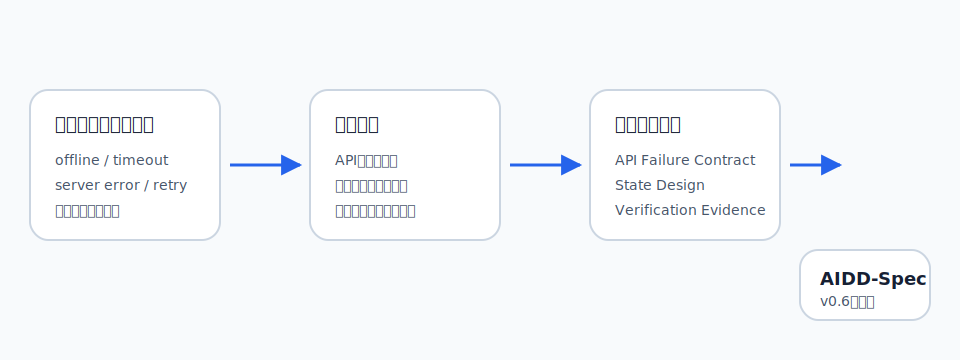
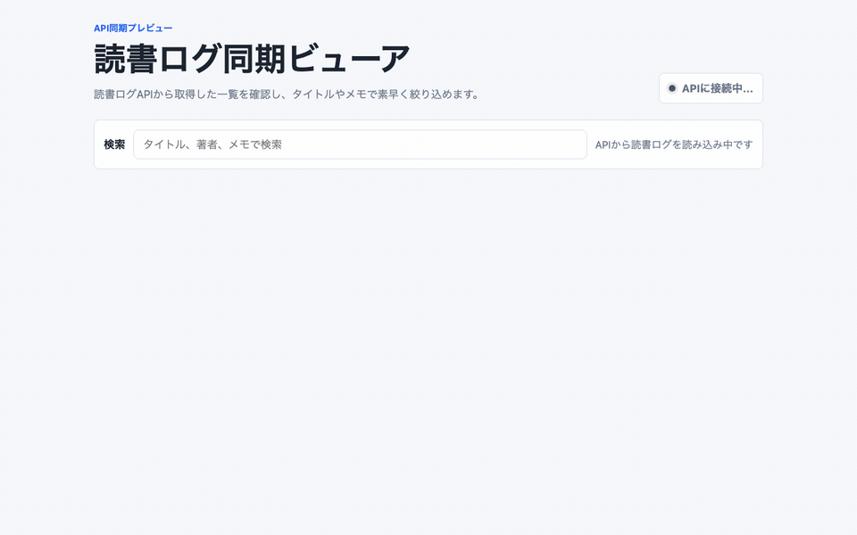
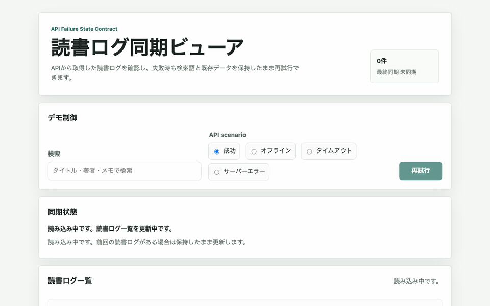
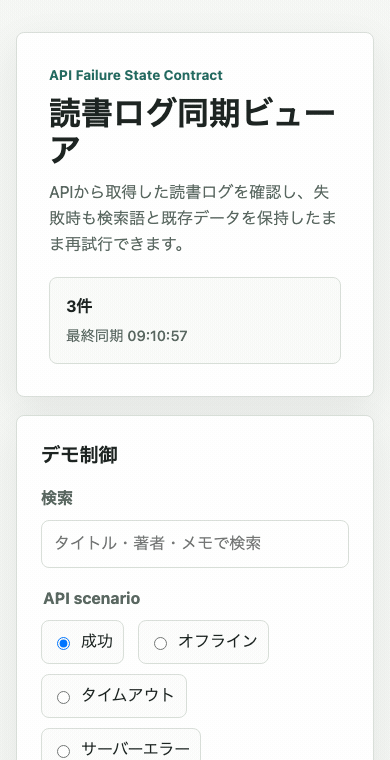

# 「APIから取る雰囲気」では足りない：失敗状態契約をAI Task Packetへ逆算する

> 2026-06-29 / Codex Mastery Lab 日次ドラフト  
> 想定読了時間: 約10分  
> 種別: Experiment / Template / Failure  
> 将来の書籍章: 第6章 Design Contract、第7章 System Contract、第9章 AI Task Packet、第10章 Verification Evidence、第12章 雑プロンプト vs AI Task Packet



## 前回の振り返り

前回はスマホフォームを題材にした。Codexに「スマホでも使いやすそう」と頼むだけでも、レスポンシブな見た目、visible label、必須属性、送信後の表示までは作れた。しかし、必須入力ごとの `aria-describedby`、エラー/成功/空状態の分離、送信後の結果領域focus、`:focus-visible`、`prefers-reduced-motion`、状態設計の証拠ファイルは抜けた。

そこで AIDD-Spec の AI Task Packet に Mobile Interaction Contract と State Design を足した。学びは単純だった。「スマホ対応」と書くだけでは、後工程が検査できない。何px幅で、どのタップ領域で、エラー時にどこへ戻すのかまで、チェックリストとして渡す必要がある。

今回は画面とAPIの境目を見る。APIは、成功すれば一覧が出る。しかし現場で困るのは、成功しなかったときだ。

## 今回やること

今日の題材は、日本語UIの「読書ログ同期ビューア」である。APIから読書ログ一覧を取得する雰囲気の小さな静的Webアプリを作る。読書ログには、タイトル、著者、読了日、メモ、同期状態を出す。検索入力でタイトルやメモを絞り込めるようにする。

検証したい問いはこれだ。

> Codexに「APIから一覧を読み込む画面」を雑に頼んだとき、offline / timeout / server error / retry / 入力保持 / 証拠ファイルは残るのか？

Webアプリでは「APIから取る」と言うだけで、それっぽい画面はできる。だが、後工程のレビュー担当や運用担当は、それでは判断できない。オフラインなら何を表示するのか。タイムアウトは何秒か。サーバーエラーで検索語は消えるのか。再試行ボタンはあるのか。エラーメッセージは利用者が次に何をすればよいか分かるのか。

料理のレシピで言えば、「煮込む」とだけ書かれていて、火加減、時間、焦げたときの戻し方がない状態に近い。成功時の皿だけを見るなら問題ないが、毎日の調理では失敗しやすいポイントが必要になる。API連携UIも同じで、成功画面だけでは説明書として足りない。

## 仮説

今回の仮説は次の通り。

> Codexは雑プロンプトでも、API読込風の遅延、一覧表示、検索、同期済み表示までは作れる。しかし、offline / timeout / server error を利用者が操作できるデモ制御、AbortControllerまたは明示的なtimeout、再試行、エラー時の入力保持、API_FAILURE_STATE_EVIDENCE.md は、AI Task Packetに明示しない限り抜けやすい。

監査カテゴリは3つに絞った。

1. Requirement Fit / State Design
2. API Contract / Operations
3. Build / Console / Verification Evidence

## 実験環境

```text
実行日時: 2026-06-29 09:01:49 JST
Machine: Apple M4 Mac mini / 16GB RAM / 256GB SSD
OS: macOS 26.5.1 / Build 25F80
Codex CLI: codex-cli 0.142.3
Disk: 228Gi total / 133Gi available
Repo: /path/to/project-root
Experiment: /path/to/project-root/experiments/2026-06-29-api-failure-state
```

実験前の `git status --short` では、前日からの未整理ディレクトリ `experiments/aidd-control-plane-mvp-003/` が残っていた。今日の実験は `experiments/2026-06-29-api-failure-state/` に閉じ、既存の未整理物とは混ぜない方針にした。

## Step 1: Codexに雑に作らせる

実際にCodexへ渡した雑プロンプトはこれである。

```text
このgitリポジトリ内で、experiments/2026-06-29-api-failure-state/vibe-app に、日本語UIの小さな静的Webアプリを作ってください。

アプリは「読書ログ同期ビューア」です。
- APIから読書ログ一覧を読み込んで表示する雰囲気にしてください
- 検索入力で本のタイトルやメモを絞り込めるようにしてください
- 読書ログにはタイトル、著者、読了日、メモ、同期状態を表示してください
- vanilla HTML/CSS/JavaScriptのみを使ってください
- 依存パッケージはインストールしないでください
- UI文言とサンプルデータは日本語にしてください
- 見た目はシンプルでよいですが、スマホでも読めるようにしてください
- 変更は vibe-app ディレクトリ内だけに閉じてください
- 可能なら node --check も実行して終了してください
```

実行コマンドは次の形にした。日本語プロンプトを直接シェルに埋め込まず、ファイルから読む方式である。

```bash
codex exec --sandbox danger-full-access "$(python3 -c 'from pathlib import Path; print(Path("experiments/2026-06-29-api-failure-state/prompt-vibe.txt").read_text())')" \
  | tee experiments/2026-06-29-api-failure-state/logs/codex-vibe.log
```

Codexが作ったファイルは3つだった。

```text
vibe-app/index.html
vibe-app/styles.css
vibe-app/script.js
```

良かった点は多い。`lang="ja"` と viewport があり、検索入力もある。読書ログは `textContent` 中心で描画され、外部資産もない。`node --check` も成功した。見た目も、読書ログのカード一覧として自然だった。

ただし、コードを読むと「APIから取得する雰囲気」は `setTimeout` で読込っぽくしているだけだった。offline、timeout、server error、retry の仕様はない。つまり、成功時の体験だけを見れば合格に見えるが、失敗時の説明書がない。

## Step 2: バイブ版をブラウザで操作する

操作GIFはこれである。



キャプチャとコンソール確認は以下で実行した。

```bash
node scripts/capture_app_gif.js \
  experiments/2026-06-29-api-failure-state/vibe-app \
  assets/2026-06-29-api-failure-state-vibe.gif
```

ブラウザコンソールは静かだった。

```text
No console messages captured.
```

見た目は悪くない。検索すると件数が変わり、カードも読みやすい。ここで「できた」と判断してしまうのが、AI駆動開発の怖いところだ。後工程は、成功画面だけではなく、壊れ方と戻し方を知りたい。

## Step 3: 静的監査を作る

今回の監査スクリプト `audit_api_failure_state.py` では、次をチェックした。

- `index.html` / `style.css` または `styles.css` / `script.js` があるか
- `lang="ja"` と viewport があるか
- API境界が関数として分離されているか
- loading / empty / success / error の状態文言があるか
- offline / timeout / server error を扱うか
- AbortController または明示的なtimeout制御があるか
- 再試行導線があるか
- 状態切替用のテスト/デモ制御があるか
- `aria-live` があるか
- エラー時に検索入力や既存データを消さない方針があるか
- 外部ネットワーク資産を使っていないか
- `console.log` で利用者入力を出していないか
- `API_FAILURE_STATE_EVIDENCE.md` があるか

実行コマンド:

```bash
node --check experiments/2026-06-29-api-failure-state/vibe-app/script.js
python3 experiments/2026-06-29-api-failure-state/audit_api_failure_state.py \
  experiments/2026-06-29-api-failure-state/vibe-app
```

結果はこうなった。

```text
合格: index.html / style.css / script.js が存在する
合格: 日本語UIで lang=ja と viewport がある
合格: API境界が関数として分離されている
不合格: loading / empty / success / error の状態文言がある
不合格: offline 状態を扱う
合格: timeout 状態を扱う
合格: server error / API失敗 状態を扱う
合格: AbortController または明示的なタイムアウト制御がある
不合格: 再試行ボタンまたは retry 導線がある
不合格: 状態切替用のテスト/デモ制御がある
合格: aria-live で状態変化を伝える
合格: エラー時に検索入力や既存データを消さない方針がある
合格: 外部ネットワーク資産を使っていない
合格: console.log で利用者入力を出していない
不合格: API_FAILURE_STATE_EVIDENCE.md がある
不合格: 証拠ファイルに失敗状態/検証コマンド/既知制約がある
SUMMARY: 10 passed / 6 failed
```

ここで注意したいのは、今回の静的監査が少し甘いことだ。`timeout` や `server error` は、文字列がたまたまメモや `setTimeout` に含まれていたため合格になった。これは監査スクリプト側の残課題である。ただ、それでも再試行、デモ制御、offline、証拠ファイルは落ちた。静的監査が甘くても、失敗状態契約が不足していることは見えた。

## Step 4: 欠陥を標準フォーマットで記録する

代表findingは次の通り。

```yaml
category: API Failure State / State Design
finding: バイブ版はAPI読込風の成功状態だけを実装し、offline、timeout、server error、retry、状態切替デモ、失敗時の入力保持方針、証拠ファイルを仕様として持っていなかった。
severity: high
observed_by: audit_api_failure_state.py and browser operation
ideal_state: APIに依存するUIは、成功/空/読み込み/オフライン/タイムアウト/サーバーエラーを利用者が確認でき、再試行と入力保持の方針が画面と証拠ファイルに残っている。
fix_instruction: API境界関数を分離し、success/offline/timeout/server-errorを切り替えるデモ制御、AbortControllerまたは明示的timeout、再試行ボタン、日本語エラー文言、API_FAILURE_STATE_EVIDENCE.mdを追加する。
needed_upstream_info:
  - State Design
  - API Failure State Contract
  - Verification Evidence
standard_update:
  document: AI Task Packet Standard
  field: api_failure_state_contract
codex_prompt_delta: |
  APIを呼ぶUIでは success/offline/timeout/server-error/empty を状態として定義し、再試行、入力保持、タイムアウト制御、証拠ファイルを必須にする。
verification:
  command: python3 experiments/2026-06-29-api-failure-state/audit_api_failure_state.py experiments/2026-06-29-api-failure-state/fixed-app
  expected: SUMMARY: 16 passed / 0 failed
```

もう1つのfindingは、監査そのものに関するものだ。

```yaml
category: Verification Evidence
finding: バイブ版にはAPI失敗状態の証拠ファイルがなく、監査スクリプトも一部文字列一致が甘かった。
severity: medium
ideal_state: 証拠ファイルにはオフライン、タイムアウト、サーバーエラー、再試行、検証コマンド、既知制約が残り、監査スクリプトは実挙動に近い確認へ育てる。
needed_upstream_info:
  - Verification Evidence
  - Learning Log
standard_update:
  document: AI Task Packet Standard
  field: verification_evidence.api_failure_state_file
```

## Step 5: AI Task Packet v0.6を作る

改善版では、Codexに AI Task Packet v0.6 を渡した。要点は次の通り。

```markdown
## API Failure Contract
- API境界関数で success / offline / timeout / server-error を同じ戻り値または例外契約で扱う。
- timeout は `AbortController` を使うか、明示的な `setTimeout` と `timeout` 判定を持つ。
- エラー文言は日本語で、利用者が次に押すべき「再試行」が分かる。
- `console.log` で検索語や読書メモを出さない。
- 外部ネットワーク資産は使わない。

## Verification Evidence
`fixed-app/API_FAILURE_STATE_EVIDENCE.md` を日本語で作る。必ず以下を含める。
- オフライン
- タイムアウト
- サーバーエラー
- 再試行
- 検証コマンド
- 既知制約
```

実行コマンド:

```bash
codex exec --sandbox danger-full-access "$(python3 -c 'from pathlib import Path; print(Path("experiments/2026-06-29-api-failure-state/prompt-fixed.txt").read_text())')" \
  | tee experiments/2026-06-29-api-failure-state/logs/codex-fixed.log
```

Codexは `fixed-app/` に次を作った。

```text
fixed-app/index.html
fixed-app/style.css
fixed-app/script.js
fixed-app/API_FAILURE_STATE_EVIDENCE.md
```

改善版では、画面に `success / offline / timeout / server-error` のラジオボタンが入り、再試行ボタンが追加された。`requestReadingLogs` というAPI境界関数も分離された。タイムアウトは `AbortController` と `setTimeout` で表現され、エラー時も検索入力と既存データを保持する方針がコードと証拠ファイルに残った。

## Step 6: 改善版をブラウザで操作する

通常操作のGIFはこれである。



失敗状態をスマホ幅で切り替えたGIFはこれである。



専用キャプチャでは、検索後に offline、timeout、server-error、success 復帰を順に操作した。

```bash
node experiments/2026-06-29-api-failure-state/capture_api_failure_gif.js \
  experiments/2026-06-29-api-failure-state/fixed-app \
  assets/2026-06-29-api-failure-state-fixed-api-states.gif
```

コンソールは静かだった。

```text
No console messages captured.
```

画面はバイブ版より少し実験用に見える。ラジオボタンで失敗状態を切り替えるため、プロダクト本番UIというより検証UIである。しかし、今回の目的は「後工程が確認できる説明書」を作ることなので、このデモ制御は価値がある。実APIがなくても、失敗状態の仕様を先に固定できる。

## Step 7: 再監査する

再実行したコマンド:

```bash
node --check experiments/2026-06-29-api-failure-state/fixed-app/script.js
python3 experiments/2026-06-29-api-failure-state/audit_api_failure_state.py \
  experiments/2026-06-29-api-failure-state/fixed-app
```

結果:

```text
合格: index.html / style.css / script.js が存在する
合格: 日本語UIで lang=ja と viewport がある
合格: API境界が関数として分離されている
合格: loading / empty / success / error の状態文言がある
合格: offline 状態を扱う
合格: timeout 状態を扱う
合格: server error / API失敗 状態を扱う
合格: AbortController または明示的なタイムアウト制御がある
合格: 再試行ボタンまたは retry 導線がある
合格: 状態切替用のテスト/デモ制御がある
合格: aria-live で状態変化を伝える
合格: エラー時に検索入力や既存データを消さない方針がある
合格: 外部ネットワーク資産を使っていない
合格: console.log で利用者入力を出していない
合格: API_FAILURE_STATE_EVIDENCE.md がある
合格: 証拠ファイルに失敗状態/検証コマンド/既知制約がある
SUMMARY: 16 passed / 0 failed
```

改善は明確だった。雑プロンプト版は `10 passed / 6 failed`、AI Task Packet版は `16 passed / 0 failed` になった。

ただし、これで完成ではない。今回の監査は静的チェック中心で、実際にPlaywrightのexpectで「offlineを選ぶとこの文言が出る」「timeoutでAbortされる」「server-errorからsuccessへ戻る」とまでは自動化していない。次回以降は、静的監査から機能E2Eへ一段進める必要がある。

## Step 8: 逆算する

今回の欠陥を前工程へ逆算すると、こうなる。

| 欠陥 | 必要だった前工程情報 | AIDD-Spec成果物 | AI Task Packetに入れるべき項目 |
|---|---|---|---|
| API成功状態しかない | API失敗シナリオ一覧 | State Design / API Contract | success / empty / offline / timeout / server_error |
| 再試行導線がない | 復帰操作の仕様 | Experience Contract | retry button / current scenario reuse |
| エラー時に入力保持方針がない | recovery方針 | State Design | preserve search inputs and existing data |
| 証拠ファイルがない | 完了時に残す証拠 | Verification Evidence | API_FAILURE_STATE_EVIDENCE.md |
| 監査が甘い | 実挙動テストの必要性 | Test Plan / Learning Log | Playwright negative tests |

つまり、最初からCodexに渡すべきだったものは、単なる「APIから一覧を取る画面」ではなかった。

```text
APIを呼ぶUIでは、成功状態だけでなく、空状態、読み込み中、オフライン、タイムアウト、サーバーエラーを画面で確認できるようにする。API境界関数をUI描画から分離し、再試行ボタンを置く。エラー時は検索入力と既存データを保持する。状態変化はaria-liveで伝える。検証証拠としてAPI_FAILURE_STATE_EVIDENCE.mdに失敗状態、再試行、検証コマンド、既知制約を日本語で残す。
```

## AIDD-Specへの反映

更新した標準ドキュメントは次の2つである。

- `standards/aidd-spec-ai-task-packet-standard-v0.1.md`
- `standards/templates/ai-task-packet-template-v0.1.md`

追加した項目は `api_failure_state_contract` である。

```yaml
api_failure_state_contract:
  boundary_function: string
  scenarios: []
  timeout_policy: string
  retry_policy: string
  state_preservation_policy: string
  user_message_contract: string
```

AIDD Control Planeにするなら、API呼び出しを含むUIタスクでは、success / offline / timeout / server_error / empty をフォームで選ばせる。選んだ状態ごとに、再試行導線、入力保持、エラーメッセージ、timeout制御、証拠ファイルの有無を自動監査する。価値は「AIにコードを書かせる」ことではなく、AIが省きやすい失敗状態を先に説明書へ変えることにある。

## 実務で使うならどうするか

実務では、API失敗状態を後回しにしない方がよい。特に以下の画面では、最初のタスクパケットに入れるべきである。

- 一覧取得画面
- 検索画面
- ダッシュボード
- 決済状態確認
- ファイルアップロード
- 認証後のプロフィール取得

「APIはあとでつなぐから」と言って成功画面だけを作ると、あとで失敗状態を足すときにUI構造が合わなくなる。失敗時の文言、再試行、既存データ保持、ローディング表示、空状態は、画面の骨格に関わる。最初から入れる方が、後から足すより安い。

## 今回の学び

1つ目の学びは、Codexは「APIから取得する雰囲気」をかなり自然に作るということだ。遅延、一覧、検索、同期済み表示までは雑プロンプトでも出た。

2つ目の学びは、その自然さが危ないということだ。見た目が自然だと、失敗状態がないことに気づきにくい。ブラウザで触っても、成功経路だけなら気持ちよく動く。

3つ目の学びは、AI Task Packetに `api_failure_state_contract` を入れると、Codexの出力が後工程寄りになることだ。改善版は見た目だけでなく、状態切替デモ、再試行、証拠ファイルまで残した。

最後に、監査スクリプト自体の改善余地も見えた。文字列一致だけでは甘い。次はPlaywrightで実際に状態を切り替え、画面文言と復帰動作を検証する必要がある。

## 明日から使えるチェックリスト

- [ ] APIを呼ぶUIに success / empty / loading / offline / timeout / server error を定義したか
- [ ] API境界関数をUI描画から分離したか
- [ ] エラー時の再試行ボタンを置いたか
- [ ] エラー時に検索入力や既存データを保持するか決めたか
- [ ] 利用者向けエラー文言に「次に何をすればよいか」を書いたか
- [ ] 状態変化を `aria-live` などで伝えるか
- [ ] 証拠ファイルに失敗状態、検証コマンド、既知制約を残したか

## 次回検証

次回は、今回の静的監査をPlaywrightの実HTTP/実ブラウザテストへ進めたい。具体的には、状態切替UIまたはmock endpointを使い、offline、timeout、server error、success復帰をE2Eで検証する。静的監査で見えた「合格に見えるが実挙動は確認していない」問題を潰す。

## 付録: 生ログ / 参照ファイル

- Experiment path: `experiments/2026-06-29-api-failure-state/`
- Vibe Codex log: `experiments/2026-06-29-api-failure-state/logs/codex-vibe.log`
- Fixed Codex log: `experiments/2026-06-29-api-failure-state/logs/codex-fixed.log`
- Vibe verification: `experiments/2026-06-29-api-failure-state/logs/vibe-verification.log`
- Fixed verification: `experiments/2026-06-29-api-failure-state/logs/fixed-verification.log`
- Vibe GIF: `assets/2026-06-29-api-failure-state-vibe.gif`
- Fixed GIF: `assets/2026-06-29-api-failure-state-fixed.gif`
- Fixed API states GIF: `assets/2026-06-29-api-failure-state-fixed-api-states.gif`
- Standards updated: `standards/aidd-spec-ai-task-packet-standard-v0.1.md`, `standards/templates/ai-task-packet-template-v0.1.md`
