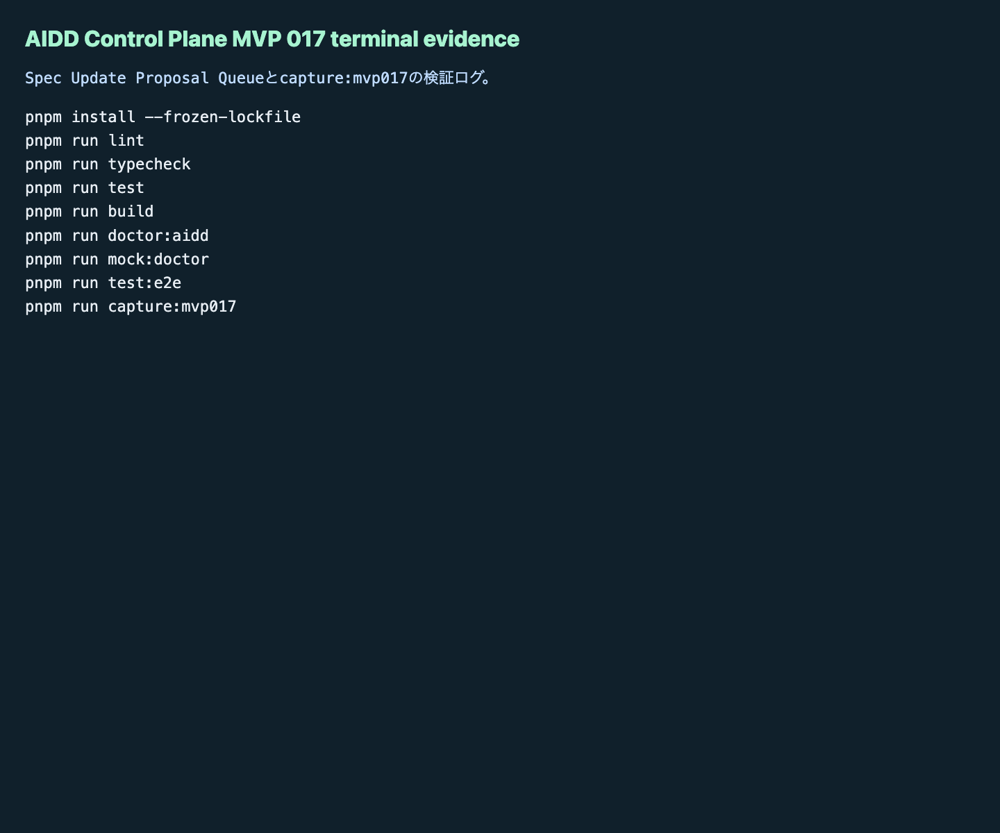

# AIDD Control Plane MVP 017：失敗ログを「標準更新候補」に戻すQueueを作った

前回のMVP 016では、GitHub Actions workflowの品質gateとartifact保存漏れを静的監査しました。`lint`や`test:e2e`が並んでいても、`playwright-report`や`test-results`が保存されていなければ、あとから人間もAIも再確認できません。

今回のMVP 017では、その次の詰まりを扱います。

> Review FindingやLearning Logは残った。でも、それが次回の標準・テンプレート・Codex promptに戻っていない。

料理でいえば、味見メモに「塩が足りない」と書いたのに、次のレシピには何も反映されていない状態です。AI駆動開発でも同じで、失敗を見つけただけでは品質は上がりません。再利用できるルールに戻して、次回の依頼文と検証条件に入れる必要があります。

## 読者の悩み

AIにアプリを作らせると、最後に次のようなメモが残りがちです。

- E2Eが一度落ちた
- 証跡画像が足りなかった
- CI artifact保存が漏れていた
- doctorコマンドが浅かった
- 次回はもっと明確に指示したい

しかし多くの場合、そのメモは「反省」で止まります。次回のProduct Brief、AI Task Packet、AIDD-Spec、検証計画へ戻らないため、同じ種類の失敗が繰り返されます。

AIDD Control PlaneをSaaSにするなら、ここを画面上のワークフローにする必要があります。

## 今回の仮説

今回の仮説は次です。

> Review FindingとLearning Logから、対象標準文書・target field・優先度・受け入れ条件・Codex prompt delta・検証コマンドを持つSpec Update Proposalを生成できれば、AIDD Control Planeは「失敗を眺めるツール」から「次回のAI依頼を改善するツール」へ近づく。

AIDD-Spec v0.1では、Verification Evidence、Review Record、Learning Log、Spec Improvementの流れを重視しています。MVP 017は、このうちSpec ImprovementをUI上で扱う小さな一歩です。

## 実験内容

`experiments/aidd-control-plane-mvp-017/generated-repo`に、MVP 016を引き継いだNext.js + TypeScriptアプリとして次を追加しました。

- UIセクション：`Spec Update Proposal Queue`
- empty / valid / failureの状態切替
- Review FindingとLearning Logから標準更新候補を作る評価関数
- 対象標準文書、target field、priority、acceptance criteria、Codex prompt delta、verification commandの表示
- 不足項目をfailureとして検出するdoctor / unit / E2E
- `capture:mvp017`による画面証跡生成

今回のQueueは、次のような情報を1つの候補として束ねます。

```text
finding
  -> ideal state
  -> needed upstream info
  -> target standard document
  -> target field
  -> priority
  -> acceptance criteria
  -> codex prompt delta
  -> verification command
```

単なるTODOではなく、「どの標準のどの欄を更新するか」「更新できたと言える条件は何か」「次回Codexにどう頼むか」まで持たせるのがポイントです。

## 画面キャプチャ

### empty / initial：まだ標準更新候補がない状態


初期状態では、まだ標準更新候補がありません。ここで大事なのは、空の画面を放置しないことです。「Review Findingが出たら、ここに候補として入る」という使い方が分かるようにしました。

### filled / valid：Review Findingを標準更新候補へ変換する


valid状態では、CIや証跡不足から得たReview Findingを、対象標準文書、target field、優先度、受け入れ条件、検証コマンドへ変換します。

今回の例では、`standards/aidd-control-plane-mvp-v0.1.md`へ戻す候補として表示しています。AIDD Control Plane SaaSの価値は、ここで「気づき」を終わらせず、次のAI Task Packetへ戻すことです。

### failure：標準更新候補そのものの不足を検出する


failure状態では、対象文書、acceptance criteria、Codex prompt delta、verification commandが足りない候補を検出します。

これは地味ですが重要です。標準更新候補にも品質があります。「あとで直す」だけでは弱く、どの文書に、どんな条件で、どう検証して反映するのかまで書かれていなければ、次回のAI依頼には使いにくいからです。

### terminal evidence：検証ログを画像として残す



terminal evidence画像も保存しました。記事で検証結果を語るだけでなく、実際に実行したログを画像として残すことで、一次情報として読めるようにしています。

## 失敗 / 修正

今回のCodex実装では、最初のビルドで次の問題が出ました。

```text
PageNotFoundError: Cannot find module for page: /_document
```

原因はNext.jsの依存バージョン解決まわりでした。Codexは`next`を`15.5.20`へ固定し、ビルドが通る状態へ修正しました。

もう1つの運用メモとして、画像キャプチャは最初にアプリサーバー未起動で失敗しました。

```text
page.goto: net::ERR_CONNECTION_REFUSED at http://127.0.0.1:3014/
```

これはアプリ品質ではなく、証跡取得手順の問題です。開発サーバーを起動したうえで`pnpm run capture:mvp017`を再実行し、empty / valid / failure / terminal evidenceの4画像を保存しました。

この失敗自体も、AIDD Control Planeの観点では有用です。SaaS化するなら、証跡取得前に「対象URLへ到達できるか」をdoctorで確認する余地があります。

## 検証ログ

独立検証として、Codexの自己申告ではなく次を個別に実行しました。

```text
pnpm install --frozen-lockfile: pass
pnpm run lint: pass
pnpm run typecheck: pass
pnpm run test: pass
pnpm run build: pass
pnpm run test:e2e: pass（Chromium / Firefox / WebKit、36 tests）
pnpm run doctor:aidd: pass
pnpm run capture:mvp017: pass
```

3ブラウザE2Eでは、MVP 017の追加テストを含めて36件が通りました。

```text
MVP 017の初期empty stateとworkflow artifact監査と標準更新候補Queueが表示される
Spec Update Proposal Queueでempty valid failureを切り替え、Codex prompt deltaを確認できる
36 passed
```

## 読者が使えるチェックリスト

| チェック項目 | 何を確認したいのか | なぜ必要か |
| --- | --- | --- |
| Review Findingがある | 失敗や不足が具体的に記録されているか | ぼんやりした反省では次回のAI依頼に使えないため |
| ideal stateがある | 何を満たせば理想状態か | 修正後の判断基準を揃えるため |
| needed upstream infoがある | どの入力情報が足りなかったか | 同じ失敗を次回の依頼前に防ぐため |
| target standard documentがある | どの標準文書へ戻すか | 学びを一回限りのメモで終わらせないため |
| target fieldがある | 文書内のどの欄を変えるか | レビュー時に更新箇所を追いやすくするため |
| acceptance criteriaがある | 更新完了の条件が明確か | 「直したつもり」を防ぐため |
| Codex prompt deltaがある | 次回AIに追加する依頼文があるか | 失敗を次回の作業入力へ戻すため |
| verification commandがある | 何で確認するか | 標準更新が実装と検証につながるため |

## SaaS / AIDD-Specへの接続

MVP 017で、AIDD Control Planeの流れは少しだけ閉じました。

```text
Verification Evidence
  -> Review Record
  -> Learning Log
  -> Spec Update Proposal Queue
  -> AI Task Packet Delta
  -> 次回Codex prompt
```

AIDD Control Planeは、別のコーディングエージェントを作るのではなく、AIに渡す前後の情報を整えるSaaSです。今回のSpec Update Proposal Queueは、その中心にある「学びを標準へ戻す」部分です。

noteで読まれる記事にするうえでも、ここは重要です。AIが量産した一般論ではなく、実際に失敗し、ログを取り、画面を撮り、次回の標準へ戻した一次情報だからです。

## 次回

次回の改善対象は、Spec Update Proposalをより実用的にすることです。候補としては次があります。

- Proposalの承認/却下/保留ステータス
- AIDD-Spec差分プレビュー
- AI Task Packetへの自動反映プレビュー
- 複数プロジェクト間で同じ失敗が何回起きたかの集計

まずは、標準更新候補をただ表示するだけでなく、「採用したらどのAI Task Packetがどう変わるか」を見えるようにするのが自然な次の一歩です。
