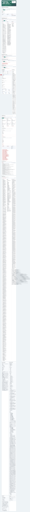
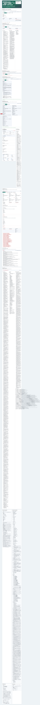
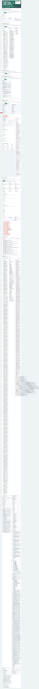
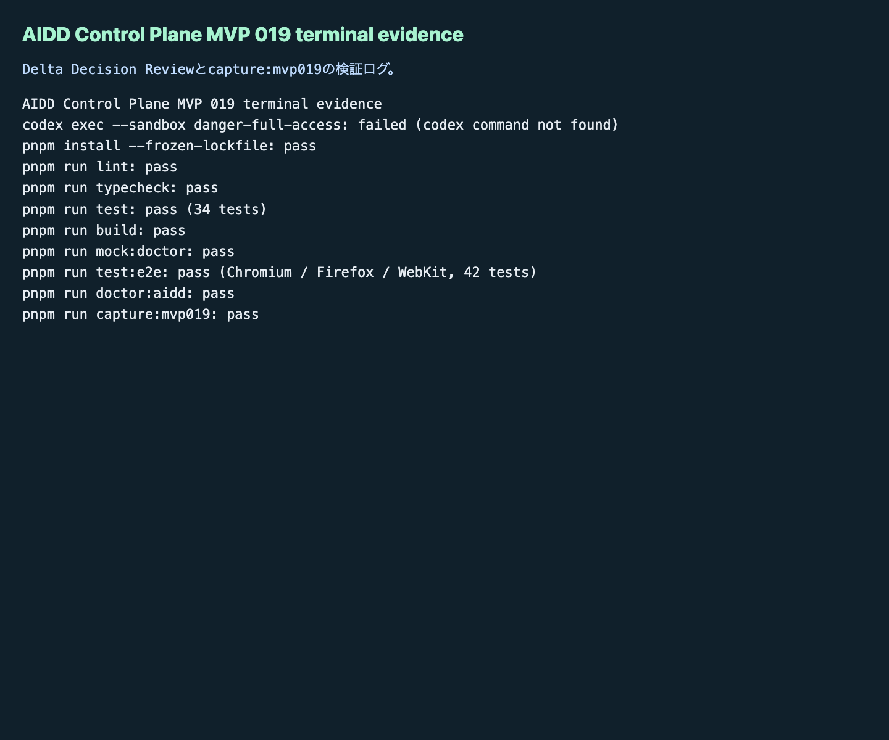

# AIDD Control Plane MVP 019：改善差分を「採用・却下・保留」に分けて次回AI依頼へ進める

MVP 018では、Spec Update Proposalを次回AI Task Packet差分として採用した場合に、before / after、追加acceptance criteria、verification command、Codex prompt patch、rollback conditionを見える化しました。

今回のMVP 019で扱った詰まりは、その次です。

> 差分プレビューは見えた。でも、それを本当に次回AI依頼へ入れてよいのか、誰が・なぜ判断したのかが残らない。

料理のレシピ改善でいえば、「次は塩を足す」「この調味料は今回は見送る」「もう少し試してから決める」が同じメモ欄に混ざっている状態です。AIへ渡す依頼文では、この混ざり方が危険です。採用済みの改善だけを次回の依頼へ入れ、却下や保留は理由つきで残す必要があります。

## 今回の仮説

今回の仮説は次です。

> AI Task Packet Deltaに、採用 / 却下 / 保留、decision owner、decision reason、decided at、next action、review evidence、rollback confirmedを持たせれば、AIDD Control Planeは「改善候補を作るSaaS」から「次回AI依頼へ入れてよい改善だけを選べるSaaS」へ近づく。

AIDD-Spec v0.1では、AI Task Packet、Verification Evidence、Review Record、Learning Log、Spec Improvementを往復させます。MVP 019は、この往復のうち `AI Task Packet Delta -> Review Record -> 次回AI Task Packet` を画面化する回です。

## 実験内容

`experiments/aidd-control-plane-mvp-019/generated-repo`に、MVP 018を引き継いだNext.js + TypeScriptアプリとして次を追加しました。

- UIセクション：`Delta Decision Review`
- empty / valid / failureの状態切替
- 採用 / 却下 / 保留の件数表示
- decision owner / decision reason / decided at
- next action / review evidence / rollback confirmed
- included in next packet
- 採用済みdeltaだけを次回AI Task Packet対象として集計
- 判断者不足、理由不足、rollback確認不足、採用なのにverification command不足、却下なのに再発防止メモ不足の検出
- Unit / E2E / doctor / capture script

Codex CLIは `codex: command not found` で実行できませんでした。そのため、Codex実装ステップの失敗を証跡として残し、Hermes側で実装と独立検証を完了しました。これは「AIの自己申告を信じず、実行ログで確認する」というAIDD-Specの運用に沿っています。

## 画面キャプチャ

### empty / initial：まだ判断待ちの差分がない状態



空の状態でも、「ここは採用判断を置く場所だ」と分かるようにしました。AIDD Control Planeでは、空欄も品質gateの一部です。

### filled / valid：採用・却下・保留を分ける



valid状態では、1件を採用、1件を却下、1件を保留として表示します。重要なのは、採用済みdeltaだけが「次回AI Task Packetへ入る」ことです。

これにより、学びを何でも次回依頼へ混ぜるのではなく、根拠、確認コマンド、戻し条件が揃った改善だけをAI入力へ進められます。

### failure：判断の品質不足を検出する



failure状態では、次を検出します。

- 判断者不足
- 判断理由不足
- rollback確認不足
- 採用なのにverification command不足
- 却下なのに再発防止メモ不足

「採用する」という判断にも品質があります。誰が、なぜ、何を証拠に、失敗時にどう戻すのかがなければ、次回AI依頼はまた曖昧になります。

### terminal evidence：検証ログを画像として残す



terminal evidence画像も保存しました。note記事としては、説明だけでなく、実際に動かしたログが一次情報になります。

## 失敗 / 修正

今回の明確な失敗は2つあります。

1つ目は、Codex CLIが環境に存在せず、`codex exec --sandbox danger-full-access` が `command not found` になったことです。これはCodex実装の実行証跡として残しました。

2つ目は、最初のE2Eで `判断理由不足` が2件表示され、Playwrightのstrict modeに引っかかったことです。テストを曖昧な部分一致から、`delta-mvp019-bad-001: 判断理由不足` のような具体的なfinding確認へ修正しました。

この修正はAIDD Control Planeらしい学びです。レビュー画面もテストも、「それっぽい文言が見える」ではなく、どのdeltaのどの不足かまで追える必要があります。

## 検証ログ

独立検証として、次を個別に実行しました。

```text
pnpm install --frozen-lockfile: pass
pnpm run lint: pass
pnpm run typecheck: pass
pnpm run test: pass（34 tests）
pnpm run build: pass
pnpm run mock:doctor: pass
pnpm run test:e2e: pass（Chromium / Firefox / WebKit、42 tests）
pnpm run doctor:aidd: pass
pnpm run capture:mvp019: pass
```

E2Eは3ブラウザで42件通りました。

```text
Delta Decision Reviewでempty valid failureを切り替え、採用済みdeltaだけを次回packet対象にできる
42 passed
```

## 読者が使えるチェックリスト

| チェック項目 | 何を確認したいのか | なぜ必要か |
| --- | --- | --- |
| decision statusがある | 採用 / 却下 / 保留が分かるか | 次回AI依頼へ入れる差分を選ぶため |
| decision ownerがある | 誰が判断したか | 後から判断根拠を確認できるようにするため |
| decision reasonがある | なぜその判断か | 改善差分を雰囲気で採用しないため |
| decided atがある | いつ判断したか | 古い判断と新しい判断を区別するため |
| review evidenceがある | どのログやfindingに基づくか | 根拠のない改善を混ぜないため |
| rollback confirmedがある | 失敗時の戻し方が確認済みか | 悪いルールを固定化しないため |
| verification commandがある | 採用後に何で確認するか | 次回AI依頼が実行証跡につながるため |
| rejected prevention noteがある | 却下理由と再発防止が残るか | 同じ曖昧な提案を繰り返さないため |

## SaaS / AIDD-Specへの接続

MVP 019で、AIDD Control Planeの改善ループは次に近づきました。

```text
Verification Evidence
  -> Review Record
  -> Learning Log
  -> Spec Update Proposal Queue
  -> AI Task Packet Delta Apply Preview
  -> Delta Decision Review
  -> 採用済みdeltaだけを次回Codex promptへ
```

AIDD Control Planeは、別のコーディングエージェントを作るSaaSではありません。AIに渡す前後の情報を、誰でも再現できる形に整えるSaaSです。

noteで読まれる記事にするうえでも、この実行ログは強い一次情報になります。AI量産記事ではなく、実際に失敗し、画面を作り、ログを取り、次の標準入力へ戻した記録だからです。

## 次回

次回の自然な改善対象は、採用済みdeltaをAI Task Packet Markdown差分として書き出す入口です。

候補は次です。

- adopted deltaだけをMarkdown patchへ変換する
- before / afterのAI Task Packet差分を画面で比較する
- 却下 / 保留deltaをLearning Logへ戻す
- Review Recordから採用履歴を一覧化する
- 複数プロジェクトで同じdeltaが採用されているかを見る

まずは、今回の採用判断を使って「次回AI Task Packetに実際に何が追加されるのか」をMarkdownとして確認できるようにするのがよさそうです。
