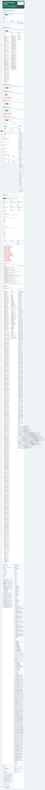
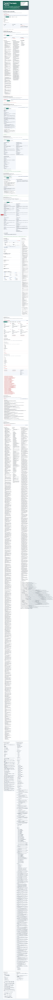
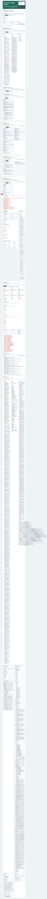
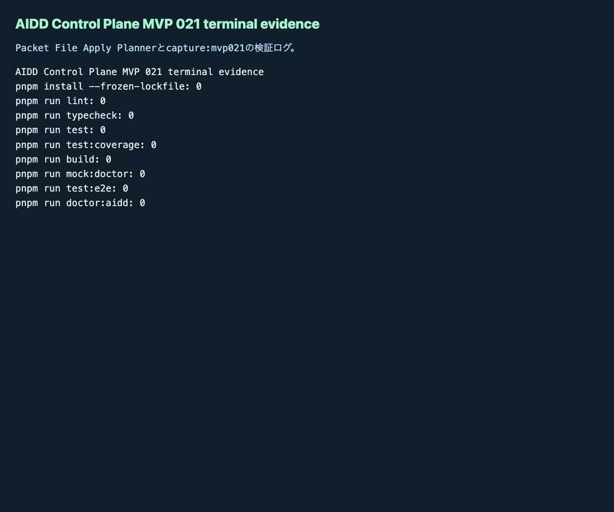

# AIDD Control Plane MVP 021：採用済みdeltaをファイルへ反映する前に、適用計画を作る

MVP 020では、採用済みdeltaだけを次回AI Task Packet Markdownへ書き出しました。今回のMVP 021では、その一歩先として、書き出したMarkdownを `AI_TASK_PACKET.md` や `CODEX_PROMPT.md` に反映する前の「適用計画」を画面化しました。

## 読者の悩み

AI駆動開発でよく起きるのは、改善案を見つけたあとです。

> 直すべきことは分かった。でも、次回のAI依頼ファイルのどこへ、どの文章を、どんな検証つきで足せばよいのか分からない。

改善メモをそのままAIへ渡すと、採用済み・却下・保留が混ざります。買い物リストでいえば「今夜必ず買うもの」と「今回は買わないもの」と「まだ検討中のもの」が同じ欄に並んでいる状態です。AIに渡すリストは、次に本当に使うものだけに分ける必要があります。

## 今回の仮説

仮説は次です。

> 採用済みdeltaのMarkdown exportを、対象ファイル・追記位置・before/after差分・検証コマンド・rollback手順・review evidenceつきの適用計画へ変換できれば、AIDD Control Planeは「画面で見える改善」から「次回AI依頼ファイルへ安全に戻す改善」へ進める。

AIDD-Spec v0.1では、AI Task Packet、Verification Evidence、Review Record、Learning Log、Spec Improvementを往復させます。MVP 021は、この往復のうち次の部分を担当します。

```text
Adopted Delta Markdown Exporter
  -> Packet File Apply Planner
  -> AI_TASK_PACKET.md / CODEX_PROMPT.md / VERIFICATION_PLAN.md / LEARNING_LOG.md
```

## 実験内容

`experiments/aidd-control-plane-mvp-021/generated-repo` に、MVP 020を引き継いだNext.js + TypeScriptアプリとして `Packet File Apply Planner` を追加しました。

主な追加点は次です。

- `empty` / `valid` / `failure` の状態切替
- valid状態で、採用済みdeltaだけを4つの対象ファイル計画へ含める
  - `AI_TASK_PACKET.md`
  - `CODEX_PROMPT.md`
  - `VERIFICATION_PLAN.md`
  - `LEARNING_LOG.md`
- 各ファイル計画に、Markdown見出し、before summary、after summary、insert position、verification command、rollback step、review evidenceを表示
- 却下 / 保留deltaはLearning Log戻し対象として分離
- failure状態で、target file不足、insert position不足、before/after差分不足、verification command不足、rollback step不足、review evidence不足、未採用delta混入を検出
- Unit / E2E / doctor / capture scriptを更新

Codex CLIは起動しましたが、600秒でタイムアウトしました。実装途中の差分は有用だったため、Hermes側で独立検証と修正を続けました。

## 画面キャプチャ

### empty / initial：まだ適用計画がない



empty状態では、まだファイルへ反映する計画がありません。ここで重要なのは、空の状態でも「export validの後にplanner validで適用計画を作る」と分かることです。

### filled / valid：4つの対象ファイルへ分けて計画する



valid状態では、採用済みの `delta-mvp019-001` だけが `AI_TASK_PACKET.md` / `CODEX_PROMPT.md` / `VERIFICATION_PLAN.md` の計画へ入ります。却下・保留deltaは `LEARNING_LOG.md` へ戻す対象として分離します。

AIDD Control Planeがやりたいのは、AIにすべてのメモを投げることではありません。次回AI依頼へ入れてよいものだけを、どのファイルのどこに足すかまで確認することです。

### failure：未採用delta混入と適用計画不足を検出する



failure状態では、次をReview Findingとして出します。

- target file不足
- insert position不足
- before/after差分不足
- verification command不足
- rollback step不足
- review evidence不足
- 未採用delta混入

「採用済みdeltaだけを反映する」と言いながら、却下deltaがAI依頼本文へ混ざると、次回のCodex実行はまた曖昧になります。MVP 021では、この混入をUI・Unit test・3ブラウザE2Eで確認しました。

### terminal evidence：検証ログも画像として残す



note記事として公開するなら、画面だけでなく「実際に検証したログ」を出すことが大事です。AI量産記事ではなく、実験した本人しか書けない一次情報にするためです。

## 失敗 / 修正

今回の主な失敗は2つです。

1つ目は、Codex実行が600秒でタイムアウトしたことです。ただし、`Packet File Apply Planner` の主要差分は生成されていたため、そこで止めずにHermes側で独立検証へ進めました。

2つ目は、E2Eの初回実行で古いNext.js dev serverが `3014` 番ポートに残っており、Playwrightが別MVPの画面を再利用して失敗したことです。プロセスを確認して停止し、再実行したところ3ブラウザ48件が通りました。

さらに、Codex生成のcapture scriptはデフォルトURLが `3015` になっていました。実際のPlaywright設定は `3014` だったため、`capture:mvp021` のデフォルトURLを `http://127.0.0.1:3014` に修正しました。

## 検証ログ

独立検証として、次を個別に実行しました。

```text
pnpm install --frozen-lockfile: pass
pnpm run lint: pass
pnpm run typecheck: pass
pnpm run test: pass
pnpm run test:coverage: pass
pnpm run build: pass
pnpm run mock:doctor: pass
pnpm run test:e2e: pass（Chromium / Firefox / WebKit、48 tests）
pnpm run doctor:aidd: pass
pnpm run capture:mvp021: pass
```

E2Eログでは次を確認できました。

```text
Packet File Apply Plannerでempty valid failureを切り替え、実ファイル適用前の計画を確認できる
48 passed
```

## 読者が使えるチェックリスト

| チェック項目 | 何を確認したいのか | なぜ必要か |
| --- | --- | --- |
| 対象ファイルが明確か | `AI_TASK_PACKET.md` など、どのファイルへ足すか | 改善メモをどこへ戻すか迷わないため |
| insert positionがあるか | どの見出しの前後へ入れるか | 追記場所が曖昧だとAI依頼が読みにくくなるため |
| before/after差分があるか | 追記前後で何が変わるか | 変更の意味をレビューできるようにするため |
| verification commandがあるか | 反映後に何を実行するか | 改善を気分ではなく検証へつなげるため |
| rollback stepがあるか | 失敗したときにどう戻すか | 悪いルールを固定化しないため |
| review evidenceがあるか | どのfindingやログから来た改善か | 根拠のないルール追加を防ぐため |
| 未採用deltaが混ざっていないか | 却下・保留deltaがAI依頼本文へ入らないか | AIを迷わせないため |
| Learning Log戻しがあるか | 却下・保留deltaを後で見返せるか | 消さずに再検討できるようにするため |

## AIDD-Spec / AIDD Control Plane SaaSへの接続

MVP 021で、AIDD Control Planeの改善ループは次の形になりました。

```text
Verification Evidence
  -> Review Record
  -> Learning Log
  -> Spec Update Proposal Queue
  -> AI Task Packet Delta Apply Preview
  -> Delta Decision Review
  -> Adopted Delta Markdown Exporter
  -> Packet File Apply Planner
  -> 次回AI依頼ファイルへ反映する準備
```

AIDD Control Planeは、別のコーディングエージェントを作るSaaSではありません。AIへ渡す前後の情報を、誰でも再現できる形に整えるSaaSです。

今回の `Packet File Apply Planner` は、SaaSとしては小さな一歩です。しかし、標準化の観点では重要です。改善を「思いつき」から「ファイル反映前にレビューできる適用計画」へ変えたからです。

## 次回

次回の自然な改善対象は、適用計画をさらに「安全なパッチ案」へ近づけることです。

候補は次です。

- before / afterのMarkdown diffを画面に表示する
- `AI_TASK_PACKET.md` と `CODEX_PROMPT.md` へのpatch案を生成する
- patch適用前のチェックリストをReview Recordへ保存する
- 複数deltaをまとめたときの競合を検出する
- 実ファイル反映はまだ自動化せず、まずは差分レビューを強化する

まずは、今回の適用計画を「どこへ足すか」から「どんな差分になるか」へ進めるのがよさそうです。
