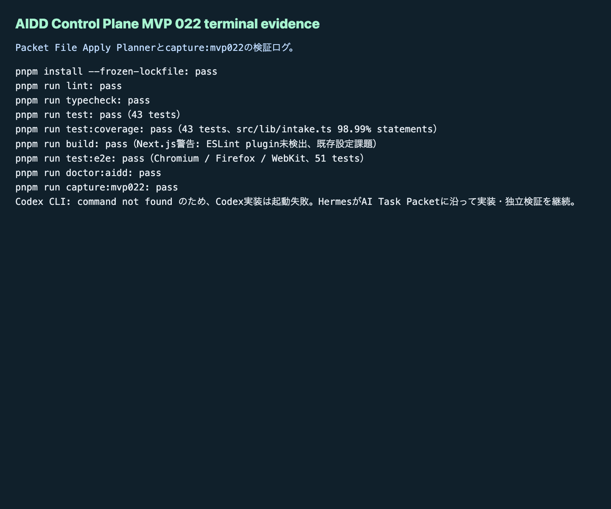

# AIDD Control Plane MVP 022：次回AI依頼ファイルを、書く前にドラフトとして確認する

MVP 021では、採用済みdeltaを `AI_TASK_PACKET.md` や `CODEX_PROMPT.md` へ反映する前の適用計画を作りました。今回のMVP 022では、その計画をさらに一歩進め、次回AIへ渡す4種類のファイル本文を「書く前のドラフト」として画面で確認できるようにしました。

## 読者の悩み

AI駆動開発では、改善点を見つけたあとに次の問題が起きます。

> 直すべきことは分かった。でも、次回のAI依頼ファイルに入れる本文を人間が毎回まとめ直すのは面倒だし、未採用の案まで混ざりそうで怖い。

買い物メモでいえば、「今日買うもの」「今回は買わないもの」「まだ迷っているもの」が同じ紙に残っている状態です。そのままAIへ渡すと、AIは買わないものまで買い物かごへ入れます。AIDD Control Planeが必要なのは、採用済みだけを次回の依頼本文へ入れ、未採用はLearning Logへ戻すための確認画面です。

## 今回の仮説

仮説は次です。

> Packet File Apply Plannerの適用計画から、`AI_TASK_PACKET.md` / `CODEX_PROMPT.md` / `VERIFICATION_PLAN.md` / `LEARNING_LOG.md` のドラフト本文、コピー用Codex prompt、検証コマンド、rollback conditionを生成できれば、AIDD Control Planeは「改善案の管理」から「次回AI依頼の安全な下書き作成」へ進める。

## 実験内容

`experiments/aidd-control-plane-mvp-022/generated-repo` に、Next.js + TypeScriptで `Packet Draft Workspace` を追加しました。

主な追加点は次です。

- `empty` / `valid` / `failure` の状態切替
- valid状態で4種類のドラフト本文を表示
  - `AI_TASK_PACKET.md`
  - `CODEX_PROMPT.md`
  - `VERIFICATION_PLAN.md`
  - `LEARNING_LOG.md`
- 各ドラフトに `draft status`、`source delta id`、反映されたMarkdown見出し、差分サマリ、コピー用本文プレビュー、実行前チェック、検証コマンド、rollback condition、AIDD-Spec接続を表示
- failure状態で、draft body不足、source delta id不足、verification command不足、rollback condition不足、file target重複または衝突、未採用delta混入、AIDD-Spec接続不足をReview Findingへ変換
- Unit / E2E / doctor / capture scriptをMVP 022向けに更新

Codex CLIは `codex: command not found` で起動できませんでした。そのため、今回はCodex実行失敗を証跡として残し、Hermes側でAI Task Packetに沿って実装と独立検証を続けました。

## 画面キャプチャ

### empty / initial：まだドラフト本文がない


empty状態では、まだ次回ファイルのドラフト本文はありません。ここでは「planner validの後にdraft validで4種類の次回ファイルドラフトを生成する」と分かることを確認します。

### filled / valid：4種類のドラフト本文とコピー用Codex promptが出る


valid状態では、`AI_TASK_PACKET.md` / `CODEX_PROMPT.md` / `VERIFICATION_PLAN.md` / `LEARNING_LOG.md` のドラフトが並びます。重要なのは、ただ文章を出すだけではなく、source delta id、verification command、rollback condition、AIDD-Spec接続を同じカードで確認できることです。

### failure：未採用delta混入とドラフト不足を止める


failure状態では、次をReview Findingとして表示します。

- draft body不足
- source delta id不足
- verification command不足
- rollback condition不足
- file target重複または衝突
- 未採用delta混入
- AIDD-Spec接続不足

「採用済みdeltaだけを入れる」と言いながら、却下deltaが `AI_TASK_PACKET.md` の本文へ混ざると、次回のCodex実行はまた曖昧になります。MVP 022では、この混入をUI・Unit test・3ブラウザE2Eで確認しました。

### terminal evidence：実際に通した検証ログ



note記事として公開するなら、画面だけでなく「実際に検証したログ」を見せることが大事です。AI量産記事ではなく、実験した本人しか書けない一次情報にするためです。

## 失敗 / 修正

今回の失敗は2つです。

1つ目は、Codex CLIがこの環境で見つからず、`codex: command not found` になったことです。自律ジョブのため質問で止めず、Codex起動失敗を記録したうえでHermes側が実装を継続しました。

2つ目は、E2Eの初回で `AIDD-Spec接続不足` の文言が複数要素に出て、Playwrightのstrict modeに引っかかったことです。これはアプリの失敗ではなくテストの指定が曖昧だったため、対象を `AI_TASK_PACKET.md: AIDD-Spec接続不足` の最初の要素に絞って再実行しました。再実行ではChromium / Firefox / WebKitの51件が通りました。

## 検証ログ

独立検証として、次を個別に実行しました。

```text
pnpm install --frozen-lockfile: pass
pnpm run lint: pass
pnpm run typecheck: pass
pnpm run test: pass（43 tests）
pnpm run build: pass（Next.js警告: ESLint plugin未検出、既存設定課題）
pnpm run test:e2e: pass（Chromium / Firefox / WebKit、51 tests）
pnpm run doctor:aidd: pass
pnpm run capture:mvp022: pass
```

E2Eログでは次を確認できました。

```text
Packet Draft Workspaceでempty valid failureを切り替え、次回ファイルドラフトを確認できる
51 passed
```

## 読者が使えるチェックリスト

| チェック項目 | 何を確認したいのか | なぜ必要か |
| --- | --- | --- |
| source delta idがある | どの改善案から来た本文か | 根拠のない追記を防ぐため |
| draft bodyがある | AIへ渡す本文が実際に生成されているか | 「計画だけ」で終わらせないため |
| verification commandがある | 反映後に何を実行するか | 完了条件を人間の記憶に依存させないため |
| rollback conditionがある | 失敗時にどう戻すか | 間違った追記を安全に止めるため |
| 未採用deltaが混ざらない | 却下・保留案がAI依頼本文へ入っていないか | AIが不要な修正まで実装しないようにするため |
| AIDD-Spec接続がある | AI Task Packet / Verification Evidence / Review Record / Learning Logへ戻るか | 一回限りのメモで終わらせず、標準へ学習を戻すため |

## SaaS / AIDD-Specへの接続

MVP 022で、AIDD Control Planeの流れは次のようになりました。

```text
Review Finding
  -> Spec Update Proposal Queue
  -> AI Task Packet Delta Apply Preview
  -> Delta Decision Review
  -> Adopted Delta Markdown Exporter
  -> Packet File Apply Planner
  -> Packet Draft Workspace
```

ここまで来ると、AIDD Control Planeは単なるチェックリストではなく、「次回AIに渡す依頼書を、採用済みの学習だけから安全に組み立てるSaaS」に近づきます。今回の標準更新として、`standards/aidd-control-plane-mvp-v0.1.md` に `Packet Draft Workspace` を追加しました。

## 次回

次は、ドラフト本文を実ファイルへ反映する前の最終レビュー、または安全なパッチ適用プレビューへ進めます。実ファイル自動書き換えに入る場合は、rollbackと差分確認をさらに厳しくします。
