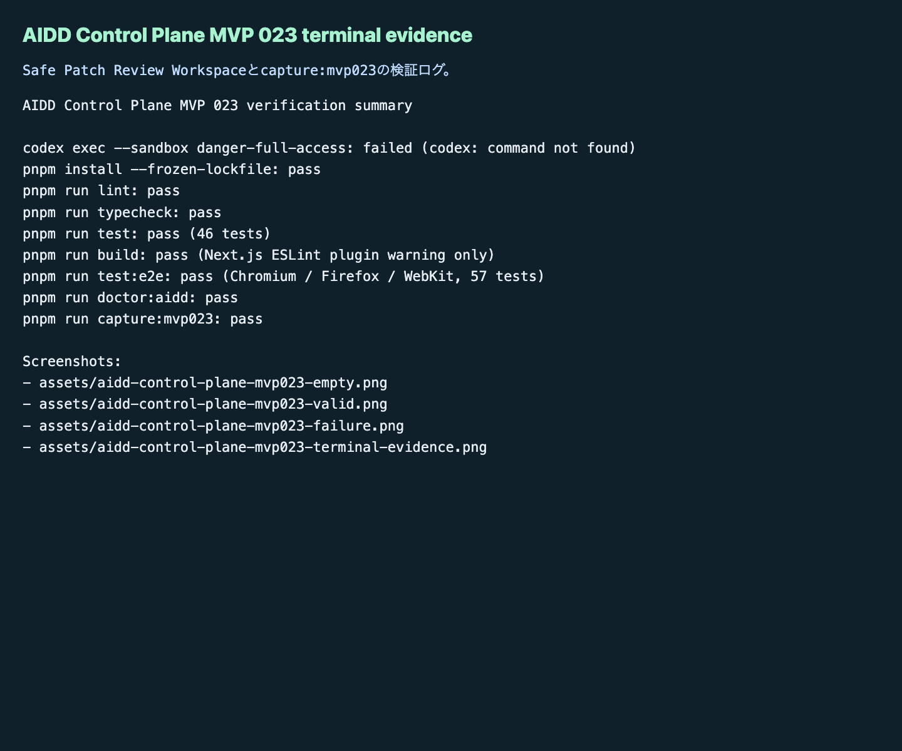

# AIDD Control Plane MVP 023：AIがファイルを書き換える前に、patch候補を安全確認する

MVP 022では、採用済みdeltaから `AI_TASK_PACKET.md` / `CODEX_PROMPT.md` / `VERIFICATION_PLAN.md` / `LEARNING_LOG.md` のドラフト本文を作りました。今回のMVP 023では、そのドラフトをすぐ実ファイルへ反映せず、いったん `Safe Patch Review Workspace` でpatch候補として確認する画面を作りました。

## 読者の悩み

AIに「この改善を次回依頼ファイルへ反映して」と頼むと、次のような怖さがあります。

> 書いてほしい場所は少しだけなのに、AIが関係ないファイルまで触ったらどうしよう。失敗したときに戻せるのかも分からない。

これは、家計簿で「今月の食費だけ直したい」のに、貯金欄や家賃欄までまとめて変更されるような不安です。AIDD Control Planeが必要なのは、AIに書き換えを任せる前に「どの欄を、何行だけ、どの確認後に変えるか」を見える化するためです。

## 今回の仮説

仮説は次です。

> Packet Draft Workspaceのドラフトを、target file、source draft id、diff summary、diff size、apply command、verification command、rollback command付きのpatch候補に変換できれば、AIDD Control Planeは「安全に反映する直前の確認台」まで進める。

## 実験内容

`experiments/aidd-control-plane-mvp-023/generated-repo` に、Next.js + TypeScriptで `Safe Patch Review Workspace` を追加しました。

主な追加点は次です。

- `empty` / `valid` / `failure` の状態切替
- valid状態で4ファイル分のpatch候補を表示
  - `AI_TASK_PACKET.md`
  - `CODEX_PROMPT.md`
  - `VERIFICATION_PLAN.md`
  - `LEARNING_LOG.md`
- 各patch候補に、patch id、target file、source draft id、diff summary、追加/削除行数、risk level、apply command、verification command、rollback command、reviewer checklist、AIDD-Spec接続を表示
- failure状態で、target file不足、source draft id不足、diff summary不足、verification command不足、rollback command不足、危険なtarget path、diff size過大、未採用delta混入、ローカルパス混入、AIDD-Spec接続不足をReview Findingへ変換
- Unit test、3ブラウザE2E、doctor、capture scriptをMVP 023向けに更新

Codex CLIは今回も `codex: command not found` で起動できませんでした。そのため、Codex実行失敗を証跡として残し、Hermes側でAI Task Packetに沿って実装と独立検証を続けました。

## 画面キャプチャ

### empty / initial：まだpatch候補がない


empty状態では、まだ実ファイルへ反映するpatch候補はありません。ここで大事なのは、ドラフト本文ができても、すぐに書き換えないことです。

### filled / valid：4ファイル分の安全なpatch候補を確認する


valid状態では、4種類のファイルに対して `git apply --check` 相当の事前確認、検証コマンド、rollback command、reviewer checklistを並べます。AIに任せる前に、人間が「この範囲ならよい」と判断できる形にします。

### failure：危険なtarget pathとローカルパス混入を止める


failure状態では、危険な `../outside/SECRET.md` のようなtarget path、diff size過大、未採用delta混入、ローカルパス混入をReview Findingとして表示します。

このチェックがないと、「改善案を反映するだけ」のつもりが、公開記事にローカルパスを混ぜたり、許可していないファイルを書き換えたりします。

### terminal evidence：実際に通した検証ログ



note記事として価値が出るのは、画面の紹介だけではなく「本当に検証したログ」があるときです。AI量産記事ではなく、実験した本人しか書けない一次情報にするためです。

## 失敗 / 修正

今回の失敗は2つです。

1つ目は、Codex CLIがこの環境で見つからず、`codex: command not found` になったことです。自律ジョブなので質問で止めず、失敗ログを残してHermes側で実装を継続しました。

2つ目は、E2E初回で `コピー用Codex prompt` というラベルが、Packet Draft WorkspaceとSafe Patch Review Workspaceの両方に一致してPlaywright strict modeに引っかかったことです。これはアプリの挙動ではなくテスト指定の曖昧さだったため、既存のPacket Draft Workspace側を `getByRole('article', { name: 'コピー用Codex prompt', exact: true })` に絞って再実行しました。再実行ではChromium / Firefox / WebKitの57件が通りました。

## 検証ログ

独立検証として、次を個別に実行しました。

```text
pnpm install --frozen-lockfile: pass
pnpm run lint: pass
pnpm run typecheck: pass
pnpm run test: pass（46 tests）
pnpm run build: pass（Next.js警告: ESLint plugin未検出、既存設定課題）
pnpm run test:e2e: pass（Chromium / Firefox / WebKit、57 tests）
pnpm run doctor:aidd: pass
pnpm run capture:mvp023: pass
```

## 読者が使えるチェックリスト

| チェック項目 | 何を確認したいのか | なぜ必要か |
| --- | --- | --- |
| target fileが許可リスト内 | 書き換えるファイルが4種類のAI依頼ファイルだけか | AIが関係ないファイルへ触るのを防ぐため |
| source draft idがある | どのドラフト・deltaから来たpatchか | 根拠不明の変更を止めるため |
| diff summaryがある | 何が変わるpatchか | レビュー時に差分の意味をすぐ判断するため |
| diff sizeが大きすぎない | 一度に変える行数がレビュー可能か | 大きすぎる変更は見落としが増えるため |
| verification commandがある | patch後に何を実行するか | 「動いた気がする」で終わらせないため |
| rollback commandがある | 失敗時にどう戻すか | 安全に試せる状態を作るため |
| 未採用deltaが混ざらない | 却下・保留案がpatchに入っていないか | AIが不要な修正まで実装しないようにするため |
| ローカルパスが混ざらない | `/Users/...` のような公開不可情報がないか | 記事・preview・artifactの公開事故を防ぐため |
| AIDD-Spec接続がある | AI Task Packet / Verification Evidence / Review Record / Learning Logへ戻るか | 一回限りの修正で終わらせないため |

## SaaS / AIDD-Specへの接続

MVP 023で、AIDD Control Planeの流れは次のようになりました。

```text
Review Finding
  -> Spec Update Proposal Queue
  -> AI Task Packet Delta Apply Preview
  -> Delta Decision Review
  -> Adopted Delta Markdown Exporter
  -> Packet File Apply Planner
  -> Packet Draft Workspace
  -> Safe Patch Review Workspace
```

今回の標準更新として、`standards/aidd-control-plane-mvp-v0.1.md` に `Safe Patch Review Workspace` を追加しました。

## 次回

次は、Safe Patch Reviewで承認されたpatchを「実際にはまだ適用しない」プレビューから、さらに一歩進めて、適用前後のdiff bundleとrollback evidenceを保存する方向へ進めます。自動適用に入る場合も、まずはdry-runと差分保存を必須にします。
