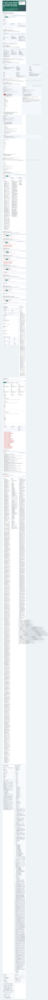
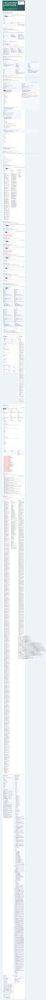
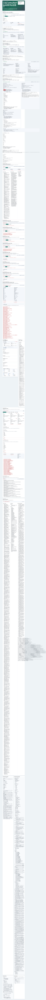
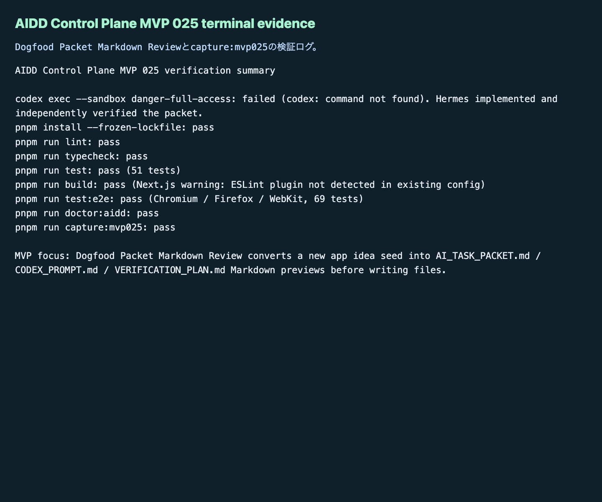

# AIDD Control Plane MVP 025：アプリ案を、いきなり実装依頼にしない

MVP 024では、AIが作ったpatch候補をすぐ適用せず、diff bundleとrollback evidenceを確認しました。今回はその一歩手前です。ユーザーが「こういうアプリを作りたい」と入力したとき、いきなりCodexへ丸投げするのではなく、`AI_TASK_PACKET.md` / `CODEX_PROMPT.md` / `VERIFICATION_PLAN.md` のMarkdownとして読める状態にしてから渡す実験をしました。

## 読者の悩み

AIにアプリ案を投げると、最初の体験は速いです。しかし、あとで困ることがあります。

> mock backendがない。失敗状態がない。E2Eが1ブラウザだけ。検証ログが記事に使えない。公式サービスっぽい素材やコピーが混ざる。

これは買い物前のメモを作らずにスーパーへ行くようなものです。雰囲気で買えますが、必要な材料が抜けたり、予算を超えたりします。AIDD Control Planeでは、AIへ頼む前に「何を作るか」「何を作らないか」「どう検証するか」を、共通のメモとして確認できる必要があります。

## 今回の仮説

仮説は次です。

> Dogfood App Idea Packet Seedを、3つのMarkdown反映前プレビューに分解できれば、AIDD Control Planeは「作りたいもの」から「検証可能なAI依頼」へ進む入口になる。

ここでいう3つのMarkdownは次です。

- `AI_TASK_PACKET.md`: 何を作るか、mock service、failure state、acceptance criteria
- `CODEX_PROMPT.md`: Codexへ渡す実装依頼
- `VERIFICATION_PLAN.md`: どのコマンドと証跡で確認するか

## 実験内容

`experiments/aidd-control-plane-mvp-025/generated-repo` に、Next.js + TypeScriptで `Dogfood Packet Markdown Review` を追加しました。

主な追加点は次です。

- 新規アプリ案seedから3ファイル分のMarkdown previewを生成
- 各previewに `diff summary` / `preflight checks` / `verification command` / `rollback condition` を表示
- copy bundleとして3ファイル分をまとめて確認
- 実在IP、公式素材、ローカルパス、host名、プライベートネットワークURL、浅い検証、Firefox除外を反映前チェックに含める
- Unit testと3ブラウザE2Eに `Dogfood Packet Markdown Review` の確認を追加

Codex CLIは今回も `codex: command not found` で起動できませんでした。失敗ログは `artifacts/terminal/codex-exec.txt` に残し、Hermes側で実装と独立検証を続けました。

## 画面キャプチャ

### empty / initial：反映前レビューを常に見える場所へ置く



empty状態でも、Dogfood Packet Markdown Reviewの枠は見えます。AIDD Control Planeは「便利な生成ボタン」ではなく、AIへ渡す前に何を確認するかを見せるSaaSだからです。

### filled / valid：3つのMarkdownを読む



valid状態では、`AI_TASK_PACKET.md` / `CODEX_PROMPT.md` / `VERIFICATION_PLAN.md` の3つに分けて表示します。1つの長いプロンプトに混ぜるより、読者やレビュアーが「要件」「実装依頼」「検証計画」を分けて確認できます。

### failure：反映前チェックで止める



今回のfailure画面では、周辺の既存チェックも含めて「戻せないpatch」「ローカルパス混入」「証跡不足」を止める流れを確認できます。Markdown previewを実ファイルへ反映する前に、こうしたチェックを通すことで、AIが作った便利そうな文章をそのまま公開物へ混ぜる事故を減らします。

### terminal evidence：実際に通した検証ログ



note記事として強いのは、きれいな説明よりも「本当に動かし、失敗し、直したログ」です。AI量産記事ではなく、実験した本人しか書けない一次情報にするため、今回もterminal evidenceを画像にしました。

## 失敗 / 修正

今回の失敗は2つです。

1つ目は、Codex CLIがこの環境で見つからなかったことです。自律ジョブなので止まらず、`codex-exec.txt` に失敗を保存し、Hermes実装として進めました。

2つ目は、E2Eの初回追加後にPlaywrightのdev server接続が不安定になったことです。既存MVPと同じ `3017` を使っていたため、MVP 025では `3018` に分け、3ブラウザで再実行しました。最終的にはChromium / Firefox / WebKitで69 testsが通りました。

## 検証ログ

独立検証として、次を個別に実行しました。

```text
pnpm install --frozen-lockfile: pass
pnpm run lint: pass
pnpm run typecheck: pass
pnpm run test: pass（51 tests）
pnpm run build: pass（Next.js警告: ESLint plugin未検出、既存設定課題）
pnpm run test:e2e: pass（Chromium / Firefox / WebKit、69 tests）
pnpm run doctor:aidd: pass
pnpm run capture:mvp025: pass
```

## 読者が使えるチェックリスト

| チェック項目 | 何を確認したいのか | なぜ必要か |
| --- | --- | --- |
| AI_TASK_PACKET.mdを分ける | 要件、非ゴール、mock service、failure stateが読めるか | AIへの依頼が雰囲気だけになるのを防ぐため |
| CODEX_PROMPT.mdを分ける | Codexへ渡す実装依頼が公開可能で検証可能か | 実装者向けの指示と記事向け説明を混ぜないため |
| VERIFICATION_PLAN.mdを分ける | lint/typecheck/test/build/e2e/doctor/CI artifactが明記されているか | 「動いた気がする」で完了にしないため |
| preflight checksがある | 実在IP、公式素材、ローカルパス、host名、プライベートネットワークURLがないか | 公開事故を防ぐため |
| rollback conditionがある | どの条件なら反映しないか | 失敗時に戻せる判断を先に決めるため |
| 3ブラウザE2Eを残す | Chromium / Firefox / WebKitで同じ体験か | 1ブラウザだけの見た目確認で終わらせないため |
| terminal evidenceを残す | 実行ログが記事とレビューに使えるか | 一次情報として再現性を示すため |

## SaaS / AIDD-Specへの接続

MVP 025で、AIDD Control Planeの流れは次のようになりました。

```text
Project Intake Wizard
  -> Dogfood App Idea Packet Seed
  -> Dogfood Packet Markdown Review
  -> AI_TASK_PACKET.md / CODEX_PROMPT.md / VERIFICATION_PLAN.md preview
  -> Safe Patch Review
  -> Diff Bundle & Rollback Evidence Workspace
```

標準としては、AIDD-Spec v0.1の `AI Task Packet` と `Verification Evidence` を、SaaS画面上で作るための前段です。ユーザーが「何を作りたいか」を書いた瞬間に、AIが必要とする共通説明と検証メモへ変換する方向へ近づきました。

## 次回

次回は、Markdown previewをさらに実用に近づけ、承認済みpreviewから安全なfile apply planへ接続します。まだ自動適用ではなく、差分、before/after、rollback条件、検証コマンドを確認してから進める形にします。
