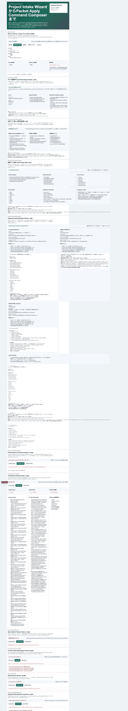
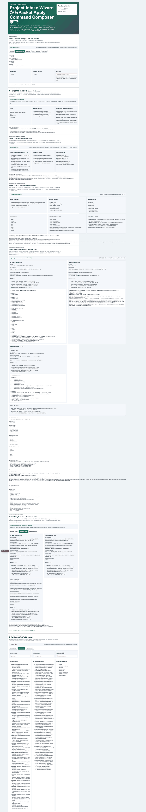
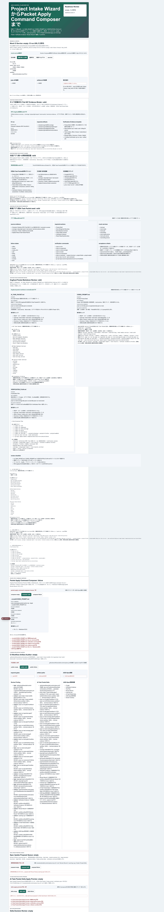
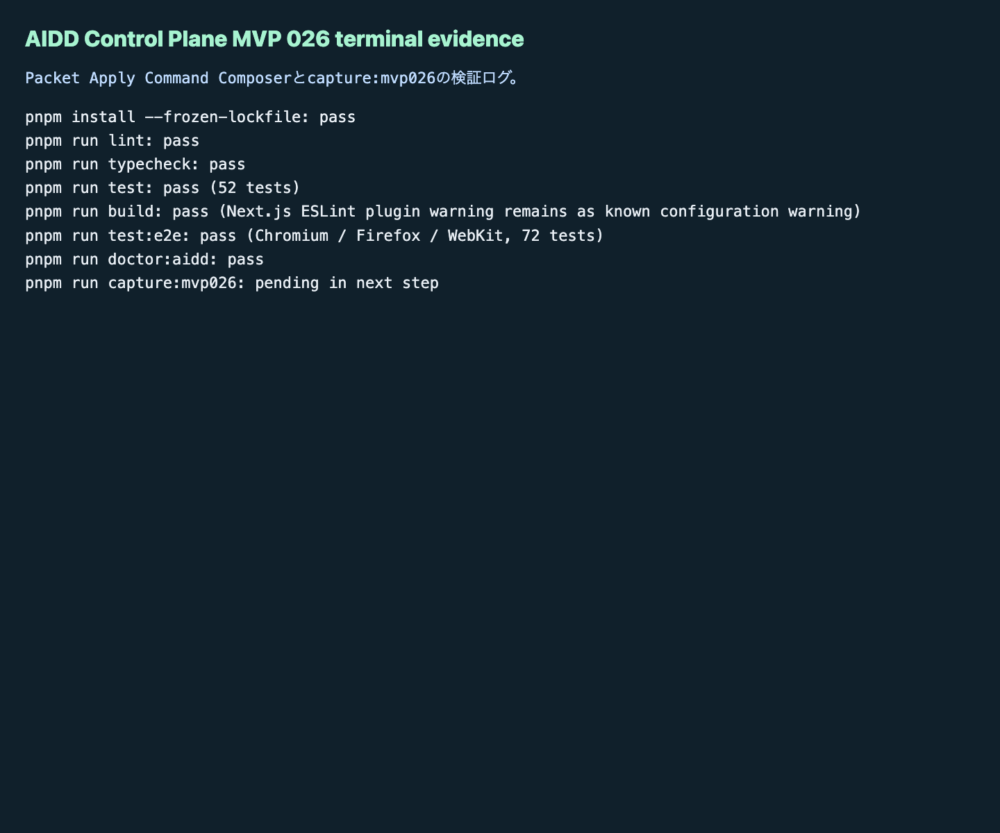

# AIDD Control Plane MVP 026：AIに渡す前に「実行コマンド」も止める

MVP 025では、アプリ案から `AI_TASK_PACKET.md` / `CODEX_PROMPT.md` / `VERIFICATION_PLAN.md` のMarkdown previewを作りました。今回は、そのpreviewをすぐファイルへ書き込むのではなく、反映直前の `apply command` / `dry-run` / `verification` / `rollback` / `evidence path` として確認する画面を追加しました。

## 読者の悩み

AIにMarkdownを書かせるところまでは簡単です。しかし、次の一手で事故が起きます。

> 良さそうなMarkdownを、そのまま実ファイルへ反映してしまう。戻し方がない。dry-runログがない。どの検証ログを残すか決まっていない。

これは、買い物メモを作ったあとに、レジ前で財布・予算・返品条件を確認しないまま会計するようなものです。メモが正しくても、最後の手順が雑だと困ります。AIDD Control Planeでは「何を書くか」だけでなく、「どう安全に反映し、何を証跡として残すか」まで見える必要があります。

## 今回の仮説

仮説は次です。

> 承認済みMarkdown previewを、反映直前のコマンド計画へ変換できれば、AIDD Control Planeは「良いプロンプト生成ツール」から「安全なAI駆動開発フローの入口」へ近づく。

MVP 026では `Packet Apply Command Composer` を追加し、次をUI上で確認できるようにしました。

- target file
- apply command
- dry-run command
- verification command
- rollback command
- terminal evidence path
- preflight checks
- reviewed markdown状態

## 実験内容

`experiments/aidd-control-plane-mvp-026/generated-repo` に、MVP 025をベースにしたNext.js + TypeScriptアプリを作り、Packet Apply Command Composerを追加しました。

Codex CLIは起動しましたが、60秒でタイムアウトしました。ログは `artifacts/terminal/codex-exec.txt` に残し、部分的に生成された型を整理しながらHermes側で実装を完了しました。Codexの自己申告ではなく、以降の独立検証で判断しています。

## 画面キャプチャ

### empty / initial：まだ反映計画がない状態



empty状態では、apply command planがまだ存在しないことを明示します。ここで重要なのは、空でもゲートが見えていることです。ユーザーが「次に何を埋めるべきか」を迷わないようにします。

### filled / valid：dry-runとrollbackまで揃った状態



valid状態では、3つのMarkdownファイルそれぞれに対して、apply command、dry-run command、verification command、rollback command、evidence pathを表示します。AIに「反映して」と頼む前に、戻し方と検証ログの保存先まで確認できます。

### failure：危険なtarget pathと未レビューMarkdownを止める



failure状態では、`../unsafe/CODEX_PROMPT.md` のような危険なtarget path、rollback不足、verification不足、未レビューMarkdown混入、AIDD-Spec接続不足を止めます。便利そうな自動適用より、「止めるべきものを止める」ことを優先しました。

### terminal evidence：実際に通した検証ログ



noteで読まれる記事にするなら、きれいな主張だけでは弱いです。どのコマンドを実行し、どこで失敗し、どう直したかが一次情報になります。

## 失敗 / 修正

今回の失敗は2つです。

1つ目は、Codex実行がタイムアウトしたことです。ただし、途中で一部の型だけ生成されていたため、重複定義が発生しました。`PacketApplyCommandComposer` の型を1系統に整理し、`typecheck` を通しました。

2つ目は、`doctor:aidd` がMVP 025のpackage名を期待して失敗したことです。MVP 026用に、必要ファイル、script、UI token、unit test token、E2E token、capture tokenを確認するdoctorへ更新しました。

## 検証ログ

独立検証として、次を個別に実行しました。

```text
pnpm install --frozen-lockfile: pass
pnpm run lint: pass
pnpm run typecheck: pass
pnpm run test: pass（52 tests）
pnpm run build: pass（Next.js警告: ESLint plugin未検出、既存設定課題）
pnpm run test:e2e: pass（Chromium / Firefox / WebKit、72 tests）
pnpm run doctor:aidd: pass
pnpm run capture:mvp026: pass
```

## 読者が使えるチェックリスト

| チェック項目 | 何を確認したいのか | なぜ必要か |
| --- | --- | --- |
| apply commandを分ける | どのファイルへ何を反映するか | 雰囲気で実ファイルを書き換えないため |
| dry-run commandを必須にする | 反映前に安全確認できるか | 失敗を本番反映前に見つけるため |
| verification commandを残す | 反映後に何を通すか | 「書いた」だけで完了にしないため |
| rollback commandを残す | 失敗時に戻せるか | 戻し方がない自動化を避けるため |
| evidence pathを決める | terminal evidenceをどこへ保存するか | 記事・レビュー・CI artifactへ再利用するため |
| 未レビューMarkdownを止める | 承認前の文章が混ざっていないか | AIの下書きをそのまま公開物へ混ぜないため |
| 危険なtarget pathを止める | `../` や絶対パスがないか | ワークスペース外の破壊を防ぐため |

## SaaS / AIDD-Specへの接続

MVP 026で、AIDD Control Planeの流れは次に進みました。

```text
Project Intake Wizard
  -> Dogfood App Idea Packet Seed
  -> Dogfood Packet Markdown Review
  -> Packet Apply Command Composer
  -> dry-run / verification / rollback / terminal evidence
```

AIDD-Spec v0.1では、AI Task PacketとVerification Evidenceが中心です。今回のComposerは、両者をつなぐ「反映直前の手順メモ」です。料理でいえば、レシピを書いたあとに、火をつける前の安全確認と片付け方を確認する段階に近いです。

## 次回

次回は、Composerで作ったコマンド計画を、実際のfile apply planへさらに近づけます。まだ自動適用を急がず、dry-run結果、diff bundle、rollback evidence、terminal evidenceを同じ単位で保存する方向を進めます。
