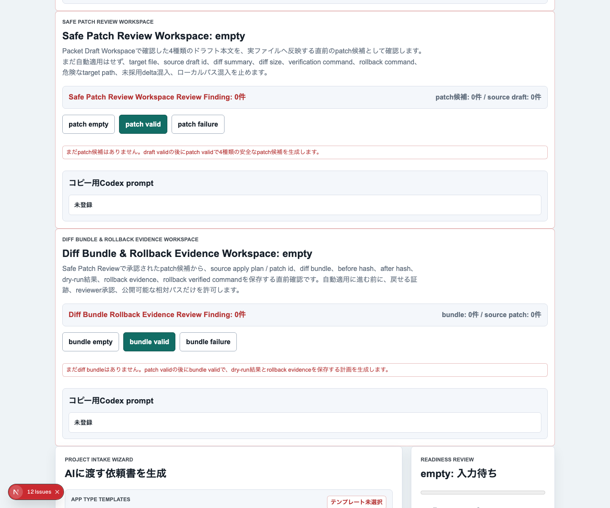
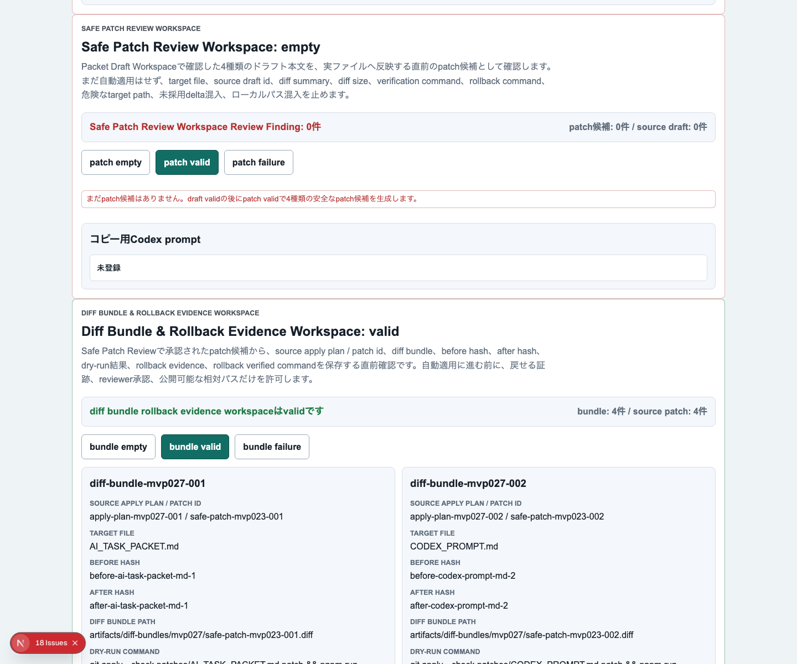
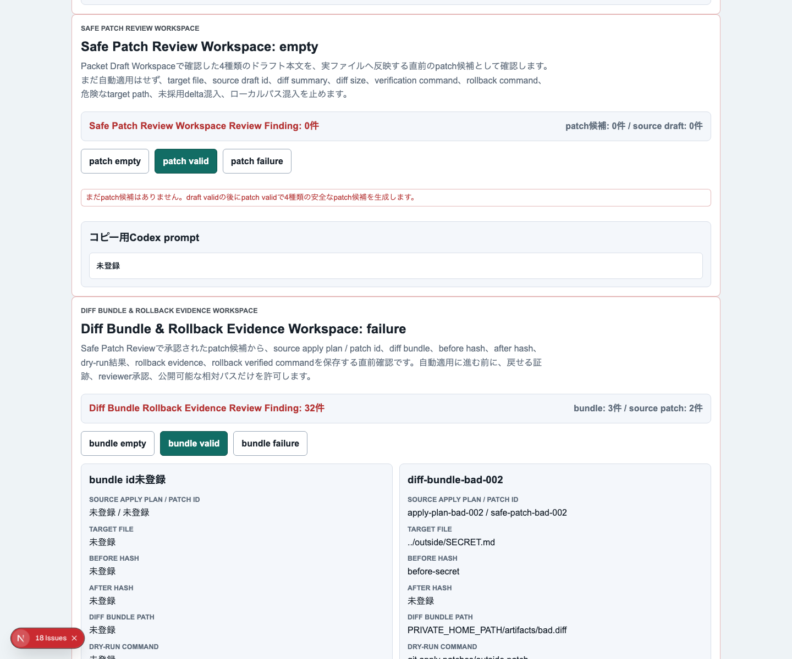
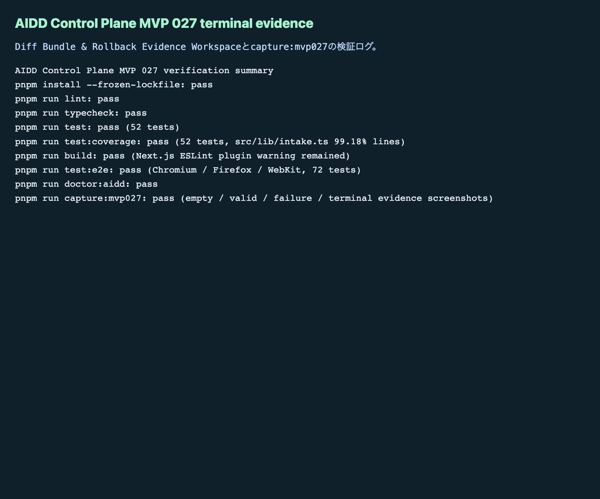

# AIDD Control Plane MVP 027：patchを当てる前に、戻せる証跡を束ねる

MVP 026では、AIが作ったMarkdown previewを実ファイルへ反映する直前に、`apply command` / `dry-run` / `verification` / `rollback` / `evidence path` を確認する画面を作りました。今回はその一歩先です。まだ自動適用は急がず、patch候補を **diff bundle / dry-run結果 / rollback evidence / verification command** の単位で束ねる `Diff Bundle & Rollback Evidence Workspace` を追加しました。

## 読者の悩み

AIに「この差分を当てて」と頼むと、画面上はうまく見えることがあります。しかし後から困るのは、次のような状況です。

> 差分ファイルはある。でもdry-runしたか分からない。戻し方の証跡がない。どの検証コマンドを通したかも曖昧。記事やレビューに使える記録が残っていない。

これは、料理でいうと、レシピを見て調理を始める前に、材料、火加減、失敗したときの戻し方、片付け場所を確認しないまま進める状態に近いです。AI駆動開発でも、patchを当てる前に「何を変えるか」だけでなく「戻せるか」「検証したか」「記録が残るか」を確認する必要があります。

## 今回の仮説

仮説は次です。

> diff bundle単位でdry-run、rollback evidence、verification command、reviewer承認を束ねれば、AIDD Control Planeは「AIが作った差分を安全に扱う作業台」に近づく。

MVP 027では、次をUIに出しました。

- bundle id
- source apply plan / patch id
- target file
- before hash / after hash
- diff bundle path
- dry-run command / dry-run status
- rollback evidence path
- rollback verified command
- verification command
- reviewer checklist
- AIDD-Spec接続

## 実験内容

`experiments/aidd-control-plane-mvp-027/generated-repo` に、MVP 026をベースにしたNext.js + TypeScriptアプリを作りました。Codex CLIに実装を依頼しましたが、600秒でタイムアウトしました。ただし実装差分はほぼ生成されていたため、Hermes側で独立検証を継続しました。

今回もCodexの自己申告は採用せず、`pnpm install --frozen-lockfile` から `test:e2e`、`doctor:aidd` まで個別に実行して確認しています。

## 画面キャプチャ

### empty / initial：まだdiff bundleがない状態



empty状態でも、Diff Bundle & Rollback Evidence Workspaceのゲートを見える場所に置きました。ユーザーが「次に何を集めるべきか」を迷わないようにするためです。

### filled / valid：dry-runとrollback evidenceが揃った状態



valid状態では、複数のbundleが `before hash` / `after hash` / `diff bundle path` / `dry-run status` / `rollback evidence path` / `verification command` を持ちます。AIDD-Spec v0.1のVerification Evidence、Review Record、Rollback Plan、Learning Logに接続していることも表示します。

### failure：戻せないpatchを止める



failure状態では、`../` を含むtarget path、絶対パス、dry-run未実行、rollback evidence不足、verification command不足、reviewer未承認、ローカルパスやhost名の混入、AIDD-Spec接続不足をReview Findingとして表示します。

### terminal evidence：実際に通した検証ログ



noteで読まれる一次情報にするには、成功画面だけでは弱いです。どのコマンドを実行したか、何件のテストが通ったか、警告が残ったかを画像として残しました。

## 失敗 / 修正

今回の失敗は、Codex CLIが600秒でタイムアウトしたことです。MVP 026でもCodexが途中停止しましたが、今回は実装自体は概ね生成されていました。そこで、次の方針にしました。

1. Codexログを `artifacts/terminal/codex-exec.txt` に保存する
2. 生成された差分をHermesが独立検証する
3. 失敗したら修正、通ったら証跡として残す

もう一つの小さな注意点は、`next build` が「Next.js pluginがESLint設定に検出されない」という警告を出したことです。build自体は成功していますが、次回以降の改善候補として残します。

## 検証ログ

独立検証として、次を個別に実行しました。

```text
pnpm install --frozen-lockfile: pass
pnpm run lint: pass
pnpm run typecheck: pass
pnpm run test: pass（52 tests）
pnpm run test:coverage: pass（src/lib/intake.ts lines 99.18%）
pnpm run build: pass（Next.js ESLint plugin警告あり）
pnpm run test:e2e: pass（Chromium / Firefox / WebKit、72 tests）
pnpm run doctor:aidd: pass
pnpm run capture:mvp027: pass
```

## 読者が使えるチェックリスト

| チェック項目 | 何を確認したいのか | なぜ必要か |
| --- | --- | --- |
| bundle idを付ける | 差分単位を一意に追跡できるか | 後から記事・レビュー・CI artifactで参照するため |
| before / after hashを残す | 適用前後の内容が識別できるか | 「何が変わったか」を曖昧にしないため |
| dry-run statusを見る | 実適用前に壊れないことを確認したか | 失敗を本適用前に止めるため |
| rollback evidenceを残す | 戻せる証跡があるか | 自動化で最も怖い「戻せない変更」を避けるため |
| verification commandを入れる | 適用後に何を通すか | patch適用だけで完了にしないため |
| reviewer承認を明示する | 人間または上位エージェントが確認したか | AI下書きの無審査反映を避けるため |
| ローカルパス・host名を検出する | 公開記事やartifactに環境情報が混ざらないか | note公開・GitHub公開で不要な情報漏れを防ぐため |
| AIDD-Spec接続を表示する | どの標準artifactに戻るか | 単発UIではなく標準化された開発フローにするため |

## SaaS / AIDD-Specへの接続

MVP 027で、AIDD Control Planeの流れは次のようになりました。

```text
Project Intake Wizard
  -> Dogfood App Idea Packet Seed
  -> Dogfood Packet Markdown Review
  -> Packet Apply Command Composer
  -> Diff Bundle & Rollback Evidence Workspace
  -> dry-run / rollback evidence / verification evidence / review finding
```

AIDD-Spec v0.1では、AI Task PacketとVerification Evidenceを分けて考えます。今回のWorkspaceは、その間にある「patchを当てる前の安全確認」です。AIに任せる範囲を増やすほど、この確認リストが重要になります。

## 次回

次回は、Diff Bundleで束ねた証跡を、実際のapply plan履歴またはreview recordへ保存する方向に進めます。自動適用そのものより先に、採用・却下・保留の判断と、その理由を後から追える状態を強化します。
