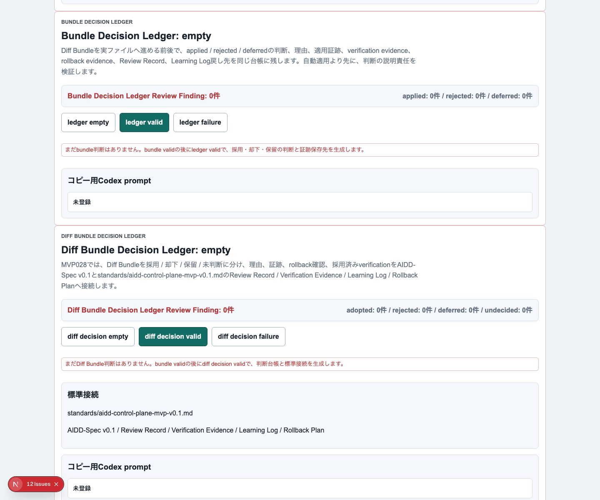
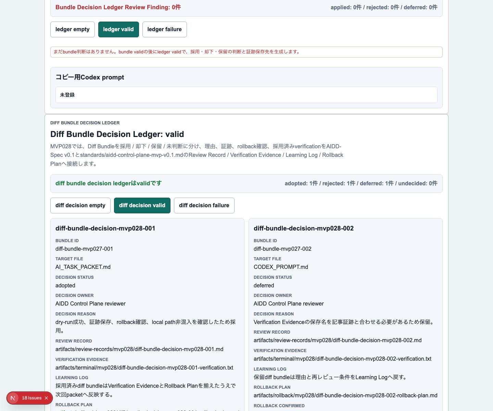
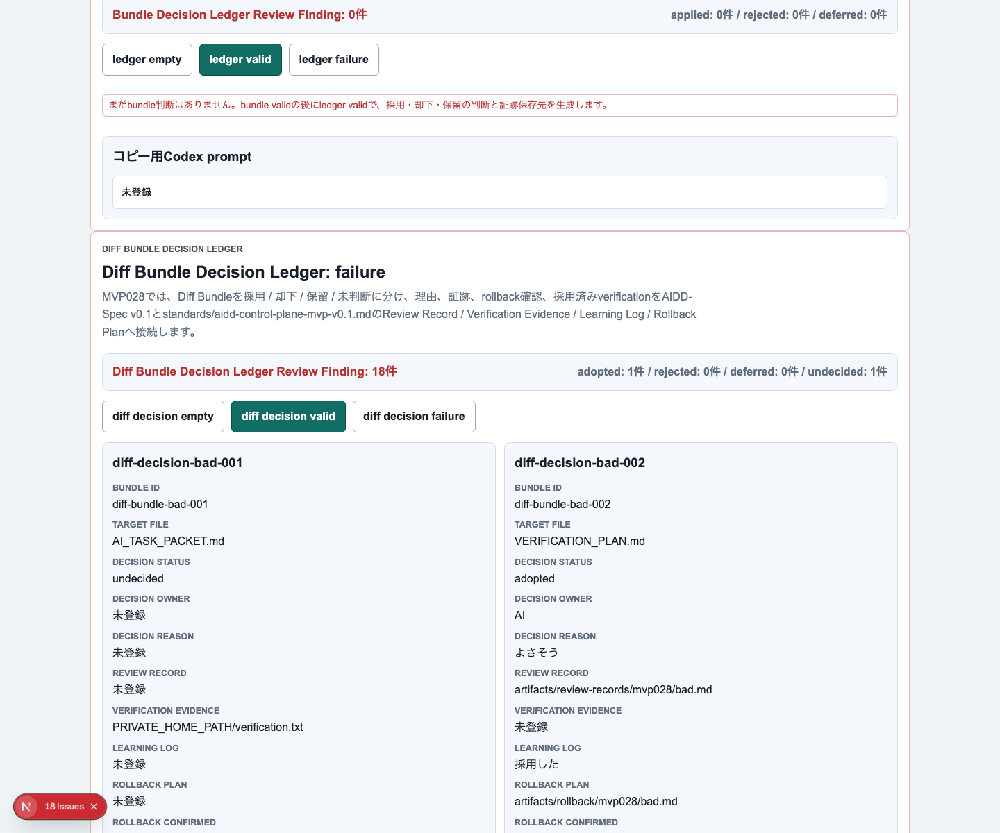
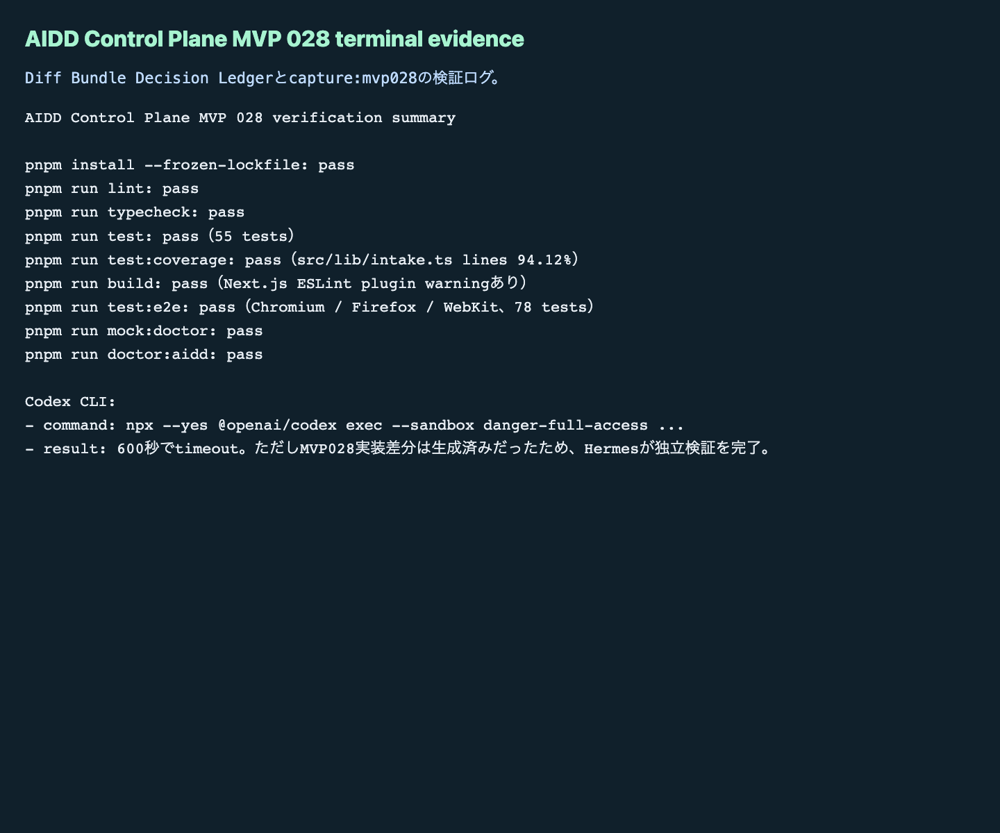

# AIDD Control Plane MVP 028：patchを当てる前に「採用・却下・保留」の理由を残す

MVP 027では、AIが作ったpatch候補を `diff bundle / dry-run結果 / rollback evidence / verification command` の単位で束ねました。今回はその次です。bundleを見て「採用する」「却下する」「いったん保留する」を決めるだけでなく、**なぜそう判断したか、誰が判断したか、どの証跡を見たか、採用済みだけが次へ進むか** を残す `Diff Bundle Decision Ledger` を追加しました。

## 読者の悩み

AIに差分を作らせると、最初に困るのは「動くかどうか」です。しかし、少し開発が進むと別の問題が出ます。

> どの差分を採用したのかは、なんとなく分かる。でも、却下した理由、保留した理由、後で戻す手順、次回AIに渡さない条件が残っていない。

これは、買い物リストで「買ったもの」だけを残し、「買わなかった理由」や「次回買う条件」を残していない状態に近いです。AI駆動開発では、採用した差分だけでなく、却下・保留の理由も次回のAI Task Packetに効きます。

## 今回の仮説

仮説は次です。

> diff bundleごとに採用 / 却下 / 保留を台帳化し、Review Record / Verification Evidence / Learning Log / Rollback Planへ接続すれば、AI差分を安全に次回packetへ戻せる。

MVP 028では、次の項目をDecision Ledgerに入れました。

- bundle id
- source patch id
- target file
- decision（adopted / rejected / deferred / undecided）
- decision owner
- decision reason
- review evidence path
- next action
- rollback confirmed
- verification command
- AIDD-Spec接続

## 実験内容

`experiments/aidd-control-plane-mvp-028/generated-repo` に、MVP 027をベースにしたNext.js + TypeScriptアプリを作りました。

最初にローカルの `codex` コマンドを呼びましたが、環境上 `codex: command not found` でした。その後、`npx --yes @openai/codex exec --sandbox danger-full-access` で実行できました。ただしCodexは600秒でタイムアウトしました。実装差分は生成されていたため、Codexの自己申告ではなく、Hermes側で独立検証を最後まで行いました。

## 画面キャプチャ

### empty / initial：まだ判断対象bundleがない状態



empty状態では、まだDiff Bundle判断がないことと、次にbundle validを作ってからledger validへ進むことを表示します。重要なのは、判断前でも「何を集めれば次へ進めるか」が見えていることです。

### filled / valid：採用・却下・保留が理由付きで残る状態



valid状態では、adopted / rejected / deferred がそれぞれ1件ずつ表示されます。採用済みbundleだけが次回AI Task Packetへ進み、却下と保留はLearning Logへ戻す、という境界をUI上で明示しました。

### failure：未判断や証跡不足を止める状態



failure状態では、未判断、理由不足、証跡不足、rollback未確認、ローカルパスやhost名の混入、採用済みなのにverification commandがない状態をReview Findingとして表示します。

### terminal evidence：実際に通した検証ログ



今回も、画面だけではなくterminal evidenceを残しました。note記事としては「こう作れます」よりも「このコマンドを実際に通しました」のほうが一次情報として強いからです。

## 失敗 / 修正

失敗は2つありました。

1つ目は、`codex` コマンドが見つからなかったことです。これは `npx --yes @openai/codex` に切り替えて回避しました。

2つ目は、Codex実行が600秒でタイムアウトしたことです。ただし、差分自体は生成されていたため、そこで止めずに、独立検証へ進めました。AIの完了メッセージを信用するのではなく、lint / typecheck / unit test / build / 3ブラウザE2E / doctorを個別に実行して確認しています。

## 検証ログ

```text
pnpm install --frozen-lockfile: pass
pnpm run lint: pass
pnpm run typecheck: pass
pnpm run test: pass（55 tests）
pnpm run test:coverage: pass（src/lib/intake.ts lines 94.12%）
pnpm run build: pass（Next.js ESLint plugin警告あり）
pnpm run test:e2e: pass（Chromium / Firefox / WebKit、78 tests）
pnpm run mock:doctor: pass
pnpm run doctor:aidd: pass
pnpm run capture:mvp028: pass
```

## 読者が使えるチェックリスト

| チェック項目 | 何を確認したいのか | なぜ必要か |
| --- | --- | --- |
| decisionを必ず付ける | 採用・却下・保留・未判断を区別できるか | 未判断の差分が次へ混ざるのを防ぐため |
| decision reasonを残す | なぜその判断になったか | 次回AIが同じ失敗差分を再生成しないようにするため |
| decision ownerを残す | 誰が確認したか | AI任せの無審査適用を避けるため |
| review evidence pathを残す | どの証跡を見たか | 後で記事・レビュー・CI artifactと照合するため |
| rollback confirmedを見る | 戻せる条件を確認したか | 自動化で最も怖い「戻せない変更」を避けるため |
| adoptedだけにverification commandを要求する | 採用差分を何で検証するか | 採用したのにテストしない状態を防ぐため |
| rejected / deferredをLearning Logへ戻す | 採用しなかった理由を残す | 次回AI Task Packetの改善材料にするため |
| local path / host名を検出する | 公開できない情報が混ざっていないか | note・GitHub・artifact公開で不要な情報漏れを防ぐため |

## SaaS / AIDD-Specへの接続

MVP 028で、AIDD Control Planeの流れは次のようになりました。

```text
Safe Patch Review Workspace
  -> Diff Bundle & Rollback Evidence Workspace
  -> Diff Bundle Decision Ledger
  -> Review Record / Verification Evidence / Learning Log / Rollback Plan
  -> 次回AI Task Packet / Codex prompt
```

AIDD-Spec v0.1では、AI Task PacketとVerification Evidenceだけでなく、Review RecordとLearning Logが重要です。採用した差分だけを見ていると、AIは同じ失敗を繰り返します。却下・保留の理由を標準artifactへ戻すことで、次回のAI依頼が少しずつ良くなります。

## 次回

次回は、Decision Ledgerで採用されたbundleだけを、実際の次回AI Task Packet / Verification Plan / Codex promptへ反映する直前の「採用済みbundle exporter」に進めます。自動適用より先に、採用済みだけが混ざること、未判断や保留が混ざらないことをさらに強く確認します。
