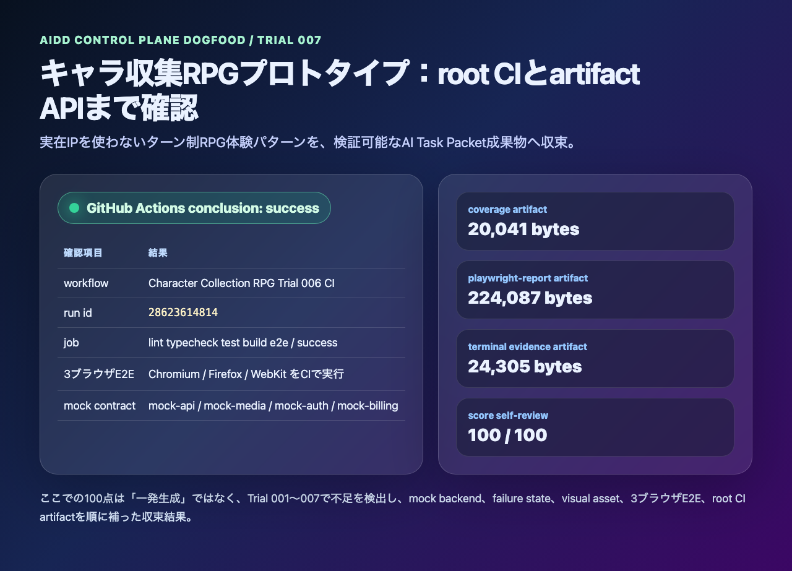

# AIDD Control Plane Dogfood 007：RPGプロトタイプをCI artifact込みで100点へ収束させる

> 2026-07-03 / Codex Mastery Lab  
> 対象: AIDD Control Plane Dogfood / キャラ収集ターン制RPG / GitHub Actions成功確認・artifact API確認  
> 結果: **root CIのsuccessとcoverage / playwright-report / test-results / terminal evidence artifactを確認し、自己採点を100/100へ更新した**



## 前回の振り返り

Trial 006では、キャラ収集ターン制RPGプロトタイプのroot GitHub Actions workflowを追加した。

```text
.github/workflows/character-collection-rpg-trial006-ci.yml
```

workflowの中では、generated repoをworking directoryにして次のgateを実行するようにした。

```text
pnpm install --frozen-lockfile
pnpm exec playwright install --with-deps
pnpm run lint
pnpm run typecheck
pnpm run test
pnpm run test:coverage
pnpm run build
pnpm run doctor:playwright
pnpm run mock:doctor
pnpm run test:e2e
```

ただし、Trial 006の記事時点では「workflowを追加した」段階であり、GitHub Actions上の成功とartifact APIの中身までは記事化していなかった。app-clone labの100点条件では、ここを曖昧にしない。

## 今回の目的

Trial 007では、アプリ機能を増やさず、検証証跡の最後の穴を埋めた。

```text
- GitHub Actionsのrunがsuccessか確認する
- job内の主要stepがsuccessか確認する
- coverage / playwright-report / test-results / terminal evidence artifactが存在するか確認する
- docs/score-self-review.mdをCI成功込みの最終評価へ更新する
- preview連載順へTrial 007を追加する
```

AIDD Control Plane Dogfoodとしての意味は、単に「ゲーム画面が作れた」ではない。作りたいアプリの曖昧な願望を、第三者が検証できるAI Task Packetと証跡へ変換できたかを見る。

## GitHub Actions確認結果

確認したrunは次の通り。

```text
workflow: Character Collection RPG Trial 006 CI
run id: 28623614814
conclusion: success
url: https://github.com/ttostudio/codex-mastery-lab/actions/runs/28623614814
```

`gh run view`では、1つのjobが成功していた。

| job | result |
| --- | --- |
| lint typecheck test build e2e | success |

主要stepもsuccessだった。

| step | result |
| --- | --- |
| Install dependencies | success |
| Install Playwright browsers | success |
| Lint | success |
| Typecheck | success |
| Test | success |
| Coverage | success |
| Build | success |
| Playwright Doctor | success |
| Mock Doctor | success |
| E2E Chromium Firefox WebKit | success |
| Upload coverage | success |
| Upload playwright-report | success |
| Upload test-results | success |
| Upload terminal evidence | success |

## artifact API確認結果

GitHub artifact APIでは、必要な4種類がすべて存在し、`expired=false`だった。

| artifact | size | expired |
| --- | ---: | --- |
| character-rpg-trial006-terminal-evidence | 24,305 bytes | false |
| character-rpg-trial006-test-results | 168 bytes | false |
| character-rpg-trial006-playwright-report | 224,087 bytes | false |
| character-rpg-trial006-coverage | 20,041 bytes | false |

この確認で、Trial 006のroot CI workflowは「書かれているだけ」ではなく、実際にGitHub Actionsで走り、証跡を保存していることが分かった。

## score-self-reviewの更新

`generated-repo/docs/score-self-review.md`を更新し、CI success欄を次の状態へ変えた。

```text
CI success: root GitHub Actions run 28623614814 が conclusion: success。
artifact APIでcoverage / playwright-report / test-results / terminal evidenceの4 artifactを確認。
```

最終点は100/100にした。

ただし、ここは言い方に注意する。これは「最初のCodex生成が一発で100点だった」という意味ではない。Trial 001〜007で不足を観測し、次のように順番に補った結果だ。

| trial | 補ったもの |
| --- | --- |
| Trial 001 | 商標非利用のRPG体験パターン、基本画面、初期記事 |
| Trial 002 | original visual assetsと画面密度 |
| Trial 003 | battle / reward / failure stateの見える証跡 |
| Trial 004 | mock backend contractの整理 |
| Trial 005 | 4 service mock、media failure、billing/auth state、axe、3ブラウザE2E |
| Trial 006 | root GitHub Actions workflowとartifact保存 |
| Trial 007 | CI successとartifact API確認、100点自己採点 |

## AIDD-Spec / AIDD Control Planeへの学び

今回の差分は小さいが、標準化には重要だった。

```yaml
observed_gap:
  finding: workflowを追加しただけではCI証跡として不十分
  risk: ローカルでは通ったが、第三者がGitHub Actions artifactで再確認できない
ideal_state:
  - root workflowがsuccessである
  - coverage / playwright-report / test-results / terminal evidenceがartifactとして保存される
  - artifact APIで存在と期限切れでないことを確認する
standard_update:
  document: Verification Evidence
  field: ci_artifact_confirmation_required
codex_prompt_delta: |
  root GitHub Actionsのrun結果をgh run viewで確認し、artifact APIでcoverage、playwright-report、test-results、terminal evidenceを列挙してから100点と判断する。
verification:
  command: gh run view <run-id> && gh api repos/:owner/:repo/actions/runs/<run-id>/artifacts
  expected: conclusion success and required artifacts present
```

料理で言えば、完成写真だけで「できました」と言わず、材料表、手順、温度、味見結果、保存容器まで残すようなものだ。AIDD Control Planeが扱うべきなのは、AIに作らせる指示だけでなく、作った後に信じてよいかを判断する証跡一式だと再確認できた。

## 今回保存したterminal evidence

```text
experiments/character-collection-rpg-trial-001/artifacts/character-collection-rpg-trial-007/terminal/
  00-verification-summary.txt
  01-gh-run-view.txt
  02-gh-artifacts.txt
  03-capture-ci-card.txt
```

## 次回

Trial 008では、100点へ収束したRPG dogfoodをAIDD Control Plane側へ戻す。具体的には、今回の「CI artifact確認」をSaaS画面のVerification Evidence Reader / Artifact Evidence Binderで扱える形へ変換し、次のアプリ案にも再利用できるテンプレートにする。
