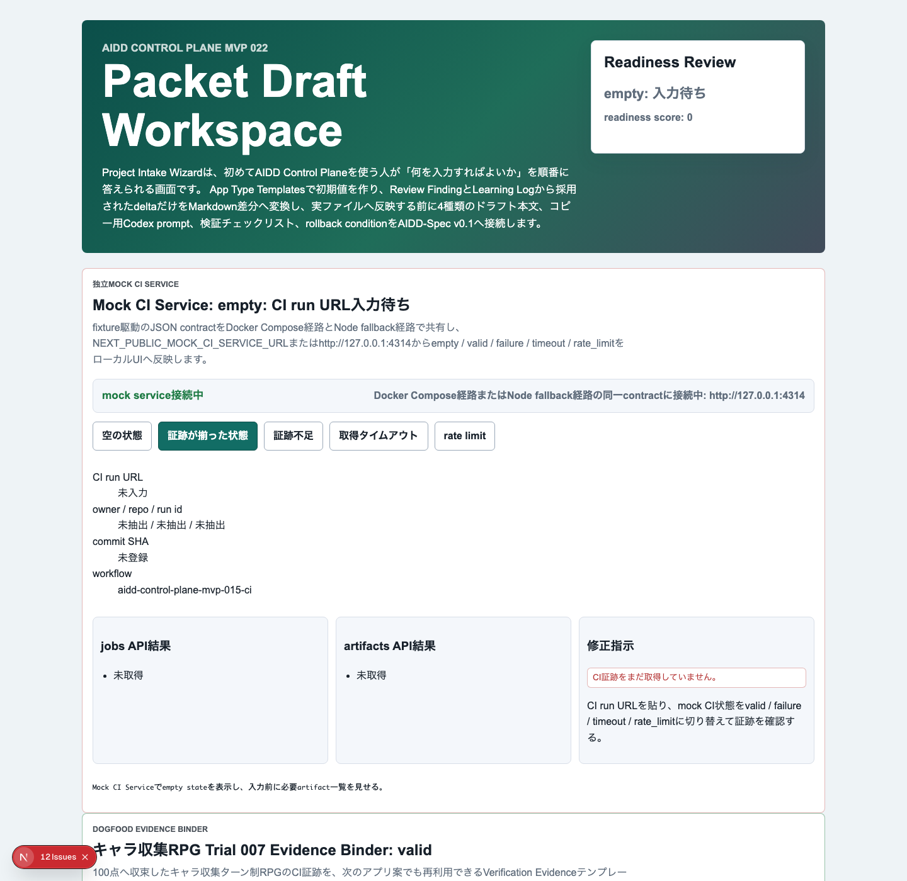

# AIDD Control Plane Dogfood 008：RPGのCI証跡を、次のAI Task Packetへ再利用できる形に戻す

> 2026-07-03 / Codex Mastery Lab  
> 対象: AIDD Control Plane Dogfood / キャラ収集ターン制RPG / Verification Evidence Binder  
> 結果: **Trial 007のCI successとartifact API確認を、AIDD Control Plane画面のDogfood Evidence Binderへ戻し、3ブラウザE2Eで確認した**



## 前回の振り返り

Trial 007では、キャラ収集ターン制RPGプロトタイプについて、root GitHub Actionsの成功とartifact APIを確認した。

```text
workflow: Character Collection RPG Trial 006 CI
run id: 28623614814
conclusion: success
artifacts:
  - character-rpg-trial006-terminal-evidence
  - character-rpg-trial006-test-results
  - character-rpg-trial006-playwright-report
  - character-rpg-trial006-coverage
```

これでRPGプロトタイプ単体は100点クラスへ収束した。ただし、AIDD Control Planeのdogfoodとしては、ここで終わると弱い。重要なのは「1回うまくいった」ではなく、次のアプリ案でも同じ確認をAI Task Packetへ入れられることだ。

料理で言えば、成功した料理の写真だけを残すのではなく、買い物リスト、手順、味見ポイント、保存方法まで次回用のメモに戻すようなものだ。

## 今回の目的

Trial 008では、ゲーム機能そのものは増やしていない。代わりに、Trial 007の証跡をAIDD Control Plane側へ戻した。

追加した画面は次のパネルである。

```text
Dogfood Evidence Binder
キャラ収集RPG Trial 007 Evidence Binder: valid
```

このパネルでは、次を同じ検証単位として表示する。

| 項目 | 内容 |
| --- | --- |
| CI run | workflow名、run id、conclusion |
| required artifacts | coverage / playwright-report / test-results / terminal evidence |
| Verification Evidence template | Product Brief、Mock backend、Failure states、Browser Matrix、CI Artifact Confirmation |
| 次回AI Task Packet Delta | run id、artifact API、expired=false確認、商標非利用境界、mock contract、再検証コマンド |

## 実装した差分

AIDD Control Plane MVP 022の画面に、RPG dogfood専用のEvidence Binderパネルを追加した。

```text
experiments/aidd-control-plane-mvp-022/generated-repo/app/page.tsx
```

E2Eにも、RPG Trial 007の証跡がUIに出ていることを確認するテストを追加した。

```text
RPG Trial 007のCI証跡をDogfood Evidence Binderとして表示する
```

確認している代表項目は次の通り。

```text
- heading: キャラ収集RPG Trial 007 Evidence Binder: valid
- workflow: Character Collection RPG Trial 006 CI
- run id: 28623614814
- artifact: character-rpg-trial006-coverage
- browser matrix: Chromium / Firefox / WebKit
- AI Task Packet Delta: artifact API結果をVerification Evidenceへ転記する
```

## 検証結果

今回も、画面追加だけで終わらせず、品質ゲートを実行した。

| command | result |
| --- | --- |
| `pnpm run lint` | pass |
| `pnpm run typecheck` | pass |
| `pnpm run test` | 43 passed |
| `pnpm run test:coverage` | pass |
| `pnpm run build` | pass |
| `pnpm run doctor:aidd` | pass |
| `pnpm run mock:doctor` | pass |
| `pnpm run test:e2e` | 54 passed |

3ブラウザE2Eの結果は次の通り。

```text
Running 54 tests using 1 worker
...
54 passed (1.1m)
```

新規テストもChromium / Firefox / WebKitで通った。

```text
✓ [chromium] RPG Trial 007のCI証跡をDogfood Evidence Binderとして表示する
✓ [firefox]  RPG Trial 007のCI証跡をDogfood Evidence Binderとして表示する
✓ [webkit]   RPG Trial 007のCI証跡をDogfood Evidence Binderとして表示する
```

terminal evidenceは次に保存した。

```text
experiments/character-collection-rpg-trial-001/artifacts/character-collection-rpg-trial-008/terminal/
  00-verification-summary.txt
  trial008-lint.txt
  trial008-typecheck.txt
  trial008-test.txt
  trial008-coverage.txt
  trial008-build.txt
  trial008-doctor-aidd.txt
  trial008-mock-doctor.txt
  trial008-e2e.txt
```

## AIDD-Specへの戻し

今回の学びは、次の標準更新候補にできる。

```yaml
observed_gap:
  finding: 100点へ収束したdogfood結果が、次のAI Task Packetへ再利用されない
  risk: 成功した検証手順が記事内の説明で止まり、次のアプリ生成時にまた抜ける
ideal_state:
  - CI run id、conclusion、job、artifact API結果をVerification Evidenceへ束ねる
  - coverage / playwright-report / test-results / terminal evidenceを必須artifactとして扱う
  - 商標非利用境界、mock backend contract、failure states、3ブラウザE2Eをテンプレート化する
standard_update:
  document: Verification Evidence
  field: reusable_dogfood_evidence_binder
codex_prompt_delta: |
  既存dogfoodの成功証跡を確認し、run id、artifact API、browser matrix、mock contract、failure statesを次回AI Task Packetへ転記する。
verification:
  command: pnpm run test:e2e
  expected: Dogfood Evidence BinderがChromium / Firefox / WebKitで表示される
```

AIDD Control Planeの価値は、AIに「RPGっぽいものを作って」と頼むことではない。作りたいものを、非侵害境界、mock service、failure state、CI artifact、次回改善deltaへ分け、次の依頼に戻せることだ。

## 今回の対応表

| skill / AGENTS.mdのルール | 今回防いだこと |
| --- | --- |
| CI artifactまで確認する | `success`という文章だけで終わらず、artifact名をUIに戻した |
| Evidence and article | スクリーンショット、terminal log、記事、previewを揃えた |
| 3ブラウザE2E | Evidence Binderの表示をChromium / Firefox / WebKitで確認した |
| 過大主張しない | Trial 001〜007で収束した100点を、次回用テンプレートへ戻す作業として記録した |
| 商標非利用 | 画面内でも実在IP・ロゴ・公式素材・公式文言を使わず、体験パターンと証跡だけを扱った |

## 次回

次回は、このDogfood Evidence Binderをさらに進め、AIDD Control Planeの「次回AI Task Packet生成」に直接混ぜる。つまり、ユーザーが新しいアプリ案を入力したとき、過去dogfoodの成功証跡から必要なmock service、failure state、CI artifact確認を自動で初期提案できるようにする。
