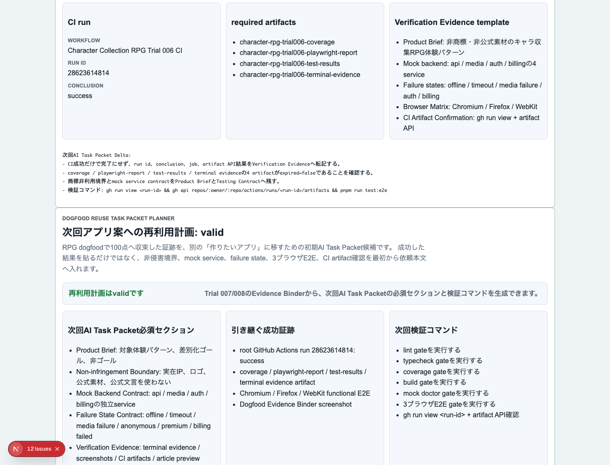

# AIDD Control Plane Dogfood 009：成功したRPG証跡を、次回AI Task Packetの初期値へ戻す

> 2026-07-03 / Codex Mastery Lab  
> 対象: AIDD Control Plane Dogfood / キャラ収集ターン制RPG / Evidence Reuse Task Packet Planner  
> 結果: **Trial 007/008のCI・artifact・3ブラウザE2E証跡を、次回アプリ案へ再利用するAI Task Packet seedとしてUI化し、60本の3ブラウザE2Eで確認した**



## 前回の振り返り

Trial 008では、キャラ収集RPG Trial 007のCI successとartifact API確認を、AIDD Control Plane側のDogfood Evidence Binderへ戻した。

```text
workflow: Character Collection RPG Trial 006 CI
run id: 28623614814
conclusion: success
artifacts:
  - character-rpg-trial006-terminal-evidence
  - character-rpg-trial006-test-results
  - character-rpg-trial006-playwright-report
  - character-rpg-trial006-coverage
```

これで「RPGプロトタイプが100点クラスへ収束した」ことは見えるようになった。ただし、AIDD Control Planeの本来の価値は、成功した1回を眺めることではない。次に別のアプリ案が来たとき、同じ抜け漏れを最初から防げるAI Task Packetへ戻せることだ。

## 今回の目的

Trial 009では、AIDD Control Plane MVP 023の画面に次のパネルを追加した。

```text
Dogfood Reuse Task Packet Planner
次回アプリ案への再利用計画: valid
```

これは、RPG dogfoodの成功証跡から、次回AI Task Packetへ入れる初期条件を作るためのパネルである。

料理にたとえると、完成写真だけでなく、次に同じ失敗をしないための買い物リストと味見ポイントを残すようなものだ。AIDD Control Planeでは、成功したCI runやartifact名を「次回の持ち物リスト」に戻す。

## 実装したこと

`experiments/aidd-control-plane-mvp-023/generated-repo/app/page.tsx`へ、Dogfood Reuse Task Packet Plannerを追加した。

画面では次を表示する。

| 項目 | 内容 |
| --- | --- |
| 次回AI Task Packet必須セクション | Product Brief / Non-infringement Boundary / Mock Backend Contract / Failure State Contract / Verification Evidence |
| 引き継ぐ成功証跡 | root GitHub Actions run 28623614814、coverage、playwright-report、test-results、terminal evidence、3ブラウザE2E |
| 次回検証コマンド | lint / typecheck / coverage / build / mock doctor / 3ブラウザE2E / gh run view + artifact API |
| コピー用seed | 次回アプリ案へ渡すAI Task Packetの初期文章 |

E2Eには次のテストを追加した。

```text
RPG dogfood証跡から次回AI Task Packet再利用計画を表示する
```

確認した代表項目は次の通り。

```text
- heading: 次回アプリ案への再利用計画: valid
- Non-infringement Boundary
- Mock Backend Contract: api / media / auth / billingの独立service
- root GitHub Actions run 28623614814: success
- mock-api / mock-media / mock-auth / mock-billing
- 初期生成品質と最終収束品質を分けて報告する
```

## 途中で見つかった失敗

最初のE2Eでは1本の既存テストが3ブラウザで失敗した。

```text
strict mode violation:
getByText('pnpm run mock:doctor', { exact: true }) resolved to 2 elements
```

原因は、新しく追加したReuse Plannerにも、既存のCI Workflow Artifact Auditorにも、同じ`pnpm run mock:doctor`という完全一致テキストが出たことだった。

これはAIDD Control Planeらしい失敗だった。人間には同じコマンドが2か所に出ていても読めるが、Playwrightの厳密なlocatorでは「どちらを見ればよいか」が曖昧になる。

修正として、Reuse Planner側の表示を次のように変えた。

```text
pnpm run mock:doctor
  -> mock doctor gateを実行する

pnpm run test:e2e
  -> 3ブラウザE2E gateを実行する
```

これにより、既存テストの意図を壊さず、新パネルの意味も残せた。

## 検証結果

今回のローカル検証は次の通り。

| command | result |
| --- | --- |
| `pnpm run lint` | pass |
| `pnpm run typecheck` | pass |
| `pnpm run test` | 46 passed |
| `pnpm run test:coverage` | pass |
| `pnpm run build` | pass |
| `pnpm run doctor:aidd` | pass |
| `pnpm run mock:doctor` | pass |
| `pnpm run test:e2e` | 60 passed |

E2Eは20シナリオ × Chromium / Firefox / WebKitで、合計60本が通った。

```text
60 passed (2.0m)
```

terminal evidenceは次に保存した。

```text
experiments/character-collection-rpg-trial-001/artifacts/character-collection-rpg-trial-009/terminal/
  00-verification-summary.txt
  trial009-lint-rerun.txt
  trial009-typecheck.txt
  trial009-test.txt
  trial009-coverage.txt
  trial009-build-rerun.txt
  trial009-doctor-aidd.txt
  trial009-mock-doctor.txt
  trial009-e2e-rerun.txt
```

スクリーンショットは次に保存した。

```text
assets/2026-07-03-character-collection-rpg-trial-009-reuse-planner.png
```

## AIDD-Specへの戻し

今回の学びは、次の標準更新候補にできる。

```yaml
observed_gap:
  finding: 成功したdogfood証跡が、次回アプリ案のAI Task Packet初期値へ自動反映されない
  risk: 次のアプリでもmock backend、failure state、3ブラウザE2E、CI artifact確認が抜ける
ideal_state:
  - 過去dogfoodのrun id、artifact、browser matrix、非侵害境界を次回AI Task Packet seedへ戻す
  - 成功証跡だけでなく、途中で直した失敗もprompt deltaへ入れる
  - 初期生成品質と最終収束品質を分けて報告する条件を含める
standard_update:
  document: AI Task Packet / Verification Evidence
  field: dogfood_evidence_reuse_seed
codex_prompt_delta: |
  過去dogfoodの成功証跡から、Non-infringement Boundary、mock-api/mock-media/mock-auth/mock-billing、failure states、3ブラウザE2E、root CI artifact確認を次回AI Task Packetへ初期投入する。
verification:
  command: pnpm run test:e2e
  expected: Dogfood Reuse Task Packet PlannerがChromium / Firefox / WebKitで表示される
```

## 今回の対応表

| skill / AGENTS.mdのルール | 今回防いだこと |
| --- | --- |
| Evidence and article | 成功証跡を記事だけでなくUIの再利用パネルへ戻した |
| 3ブラウザE2E | 新規Reuse PlannerをChromium / Firefox / WebKitで確認した |
| 過大主張しない | 「一発で100点」ではなく、Trial 001〜009で収束し再利用可能になったと記録した |
| 商標非利用 | 次回AI Task Packet seedにも、実在IP・ロゴ・公式素材・公式文言を使わない境界を入れた |
| Tool verification | 追加後にstrict locator collisionを実際のE2Eで見つけ、修正して再実行した |

## 次回

次回は、このReuse Plannerをさらに進め、ユーザーが新しいアプリ案を入力したときに、過去dogfood証跡からAI Task Packetの下書きを自動生成するところまで近づける。具体的には、アプリ種別テンプレートとDogfood Evidence Binderをつなぎ、入力フォームの段階で「このアプリならmock serviceとfailure stateは何が必要か」を先に提案できるようにする。
