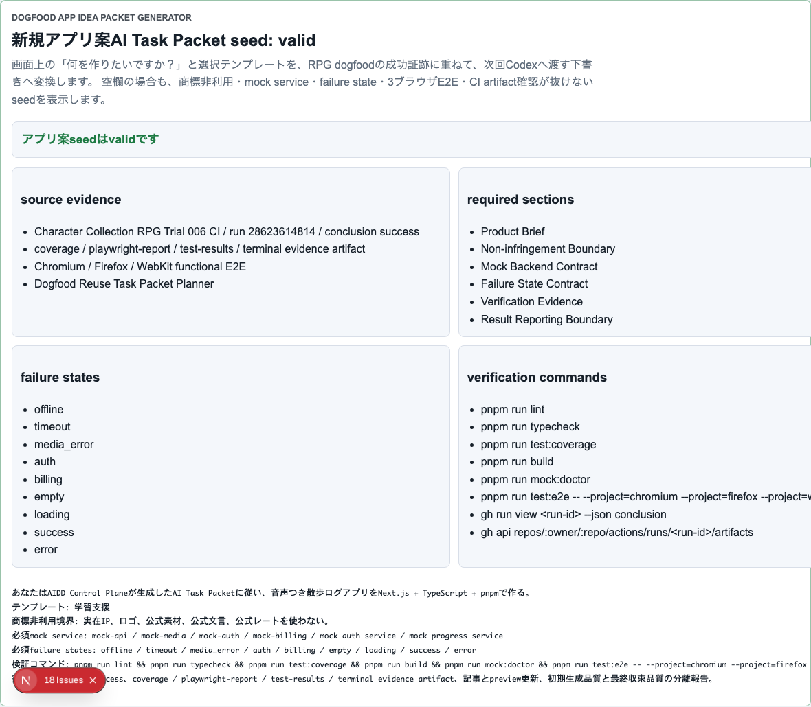

# AIDD Control Plane Dogfood 010：新しいアプリ案を、過去RPG証跡つきAI Task Packet seedへ変換する

> 2026-07-03 / Codex Mastery Lab  
> 対象: AIDD Control Plane Dogfood / キャラ収集ターン制RPG / App Idea Packet Generator  
> 結果: **RPG dogfoodの成功証跡を、新規アプリ案入力からAI Task Packet seedへ自動反映し、66本の3ブラウザE2Eで確認した**



## 前回の振り返り

Trial 009では、成功したRPG dogfood証跡を「次回AI Task Packetの初期値」へ戻すReuse Plannerを作った。

```text
Dogfood Reuse Task Packet Planner
次回アプリ案への再利用計画: valid
```

ただし、まだ弱点があった。画面には再利用条件が出ているが、ユーザーが実際に「次はこのアプリを作りたい」と入力したとき、そのアプリ名・テンプレートと証跡が結びついていなかった。

料理でいうと、前回うまくいった買い物リストは残っているが、今日作りたい料理名に合わせて自動で持ち物リストを書き換えてはいない状態だった。

## 今回の目的

Trial 010では、AIDD Control Planeの画面に次を追加した。

```text
Dogfood App Idea Packet Generator
新規アプリ案AI Task Packet seed: valid
```

これは、画面上の「何を作りたいですか？」とアプリ種別テンプレートを、RPG dogfoodの成功証跡に重ねるパネルである。

例として、次の入力を使った。

```text
アプリ案: 音声つき散歩ログアプリ
テンプレート: 学習支援
```

ここから、次回Codexへ渡すseedに次を自動で入れる。

- Non-infringement Boundary
- Mock Backend Contract
- Failure State Contract
- Verification Evidence
- mock-api / mock-media / mock-auth / mock-billing
- offline / timeout / media_error / auth / billing
- 3ブラウザE2E
- GitHub Actions run確認とartifact API確認
- 初期生成品質と最終収束品質を分けて報告する条件

## 実装したこと

`src/lib/intake.ts` に `generateDogfoodAppIdeaPacketSeed` を追加した。

この関数は、アプリ案とテンプレートIDから、次の構造を返す。

```text
status
sourceEvidence
appIdea
templateName
requiredSections
mockServices
failureStates
verificationCommands
acceptanceCriteria
codexPromptSeed
```

UI側では `app/page.tsx` に `Dogfood App Idea Packet Generator` セクションを追加した。空欄でも「商標非利用の新しいアプリ体験パターン」という安全な初期値を出し、アプリ案が入力されたらseedへ反映する。

## 途中で見つかった失敗

今回も、Trial 009と同じ種類の失敗が出た。

```text
strict mode violation:
getByText('pnpm run mock:doctor', { exact: true }) resolved to 2 elements
```

原因は、新しいApp Idea Packet Generatorにも `pnpm run mock:doctor` が表示され、既存のCI Workflow Artifact Auditorテストが画面全体から完全一致で探していたためである。

修正は、テストの意図を狭めることにした。

```text
page.getByLabel("CI Workflow Artifact Auditor: valid")
  .getByText("pnpm run mock:doctor", { exact: true })
```

これで「CI workflow auditor内にそのコマンドがある」という本来の確認になり、新しいパネルと衝突しなくなった。

この失敗は、AIDD Control Planeで重要な学びでもある。同じ品質ゲート名は複数パネルに出て当然なので、E2Eは画面全体検索ではなく、意味のある範囲に絞るべきである。

## 検証結果

今回のローカル検証は次の通り。

| command | result |
| --- | --- |
| `pnpm run lint` | pass |
| `pnpm run typecheck` | pass |
| `pnpm run test` | 50 passed |
| `pnpm run test:coverage` | pass |
| `pnpm run build` | pass |
| `pnpm run doctor:aidd` | pass |
| `pnpm run mock:doctor` | pass |
| `pnpm run test:e2e` | 66 passed |

E2Eは22シナリオ × Chromium / Firefox / WebKitで、合計66本が通った。

```text
66 passed (2.0m)
```

terminal evidenceは次に保存した。

```text
experiments/character-collection-rpg-trial-001/artifacts/character-collection-rpg-trial-010/terminal/
  trial010-lint.txt
  trial010-typecheck.txt
  trial010-test.txt
  trial010-coverage.txt
  trial010-build.txt
  trial010-doctor-aidd.txt
  trial010-mock-doctor.txt
  trial010-e2e-rerun.txt
  trial010-capture.txt
```

スクリーンショットは次に保存した。

```text
assets/2026-07-03-character-collection-rpg-trial-010-app-idea-seed.png
```

## AIDD-Specへの戻し

今回の学びは、次の標準更新候補にできる。

```yaml
observed_gap:
  finding: 再利用計画が新規アプリ案入力と結びついていない
  risk: ユーザーの具体的なアプリ案に、mock serviceやCI artifact確認が反映されない
ideal_state:
  - app ideaとtemplateからAI Task Packet seedを生成する
  - 過去dogfoodの成功証跡をsource evidenceとして明示する
  - E2E locatorは同じ文言が複数パネルに出ても壊れないよう範囲指定する
standard_update:
  document: AI Task Packet / Project Intake Wizard / Verification Evidence
  field: app_idea_to_packet_seed
codex_prompt_delta: |
  新規アプリ案を受け取ったら、過去dogfoodの成功証跡からNon-infringement Boundary、mock services、failure states、3ブラウザE2E、CI artifact確認をAI Task Packet seedへ初期投入する。
verification:
  command: pnpm run test:e2e
  expected: 新規アプリ案AI Task Packet seedがChromium / Firefox / WebKitで表示される
```

## 今回の対応表

| skill / AGENTS.mdのルール | 今回防いだこと |
| --- | --- |
| AIDD Control Planeは作りたいアプリをTask Packetへ変換する | 「再利用計画を眺める」から「アプリ案入力に反映する」へ進めた |
| 商標非利用 | seedに実在IP・ロゴ・公式素材・公式文言・公式レートを使わない条件を入れた |
| Mock backend contract | どのアプリ案でもmock-api / mock-media / mock-auth / mock-billingを初期提案に入れた |
| 3ブラウザE2E | 新規seed表示をChromium / Firefox / WebKitで確認した |
| Tool verification | strict locator collisionを実行で見つけ、範囲指定テストへ直して再実行した |
| 過大主張しない | Trial 001〜010で100点クラスへ収束し、再利用seedへ進んだと記録した |

## 次回

次回は、このseedをさらに進める。候補は、生成したAI Task Packet seedを画面内でMarkdownとして確認し、`AI_TASK_PACKET.md` / `CODEX_PROMPT.md` / `VERIFICATION_PLAN.md` へ安全に反映する前の差分レビューに接続することだ。

AIDD Control Planeの価値は、AIに「それっぽいアプリ」を作らせることではない。作りたいものを、非侵害境界、mock service、failure state、検証コマンド、CI artifact、記事証跡まで含む共通説明へ変換し、次の実装で抜け漏れを減らすことにある。
