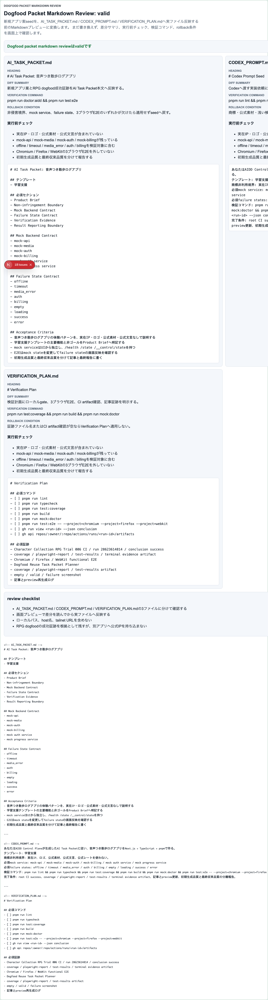

# AIDD Control Plane Dogfood 011：新規アプリ案seedを、実ファイル反映前のMarkdownレビューへ進める

> 2026-07-03 / Codex Mastery Lab  
> 対象: AIDD Control Plane Dogfood / キャラ収集ターン制RPG / Dogfood Packet Markdown Review  
> 結果: **AI Task Packet seedを、AI_TASK_PACKET.md / CODEX_PROMPT.md / VERIFICATION_PLAN.mdの3つのMarkdownプレビューへ分解し、69本の3ブラウザE2Eで確認した**



## 前回の振り返り

Trial 010では、新規アプリ案とテンプレートを入力すると、RPG dogfoodの成功証跡を含んだAI Task Packet seedを生成できるようにした。

```text
Dogfood App Idea Packet Generator
新規アプリ案AI Task Packet seed: valid
```

ただし、まだ実用上の弱点があった。seedは1つのまとまった説明として表示されるが、実際に次回Codexへ渡す前には、少なくとも次の3ファイルへ分けてレビューしたい。

- `AI_TASK_PACKET.md`
- `CODEX_PROMPT.md`
- `VERIFICATION_PLAN.md`

料理で言えば、買い物メモと手順と味見チェックが1枚に混ざっている状態だった。次の担当者が迷わないように、用途ごとのメモへ分ける必要がある。

## 今回の目的

Trial 011では、AIDD Control Planeに次のパネルを追加した。

```text
Dogfood Packet Markdown Review: valid
```

これは、新規アプリ案seedをそのままファイルへ書き込むのではなく、まず画面上でMarkdownプレビューとして確認するための機能である。

今回もサンプル入力は次を使った。

```text
アプリ案: 音声つき散歩ログアプリ
テンプレート: 学習支援
```

## 実装したこと

`src/lib/intake.ts` に `createDogfoodPacketMarkdownReview` を追加した。

この関数は `generateDogfoodAppIdeaPacketSeed` の結果から、次を生成する。

```text
status
sourceAppIdea
files[]
  targetFile
  heading
  bodyPreview
  diffSummary
  preflightChecks
  verificationCommand
  rollbackCondition
reviewChecklist
copyBundle
issues
```

画面では、3つの対象ファイルごとに分けて表示する。

| target file | 役割 |
| --- | --- |
| `AI_TASK_PACKET.md` | アプリ案、必須セクション、mock service、failure state、受け入れ条件を入れる |
| `CODEX_PROMPT.md` | Codexへ渡す実装指示、非侵害境界、検証コマンド、報告境界を入れる |
| `VERIFICATION_PLAN.md` | lint/typecheck/coverage/build/mock/e2e/CI artifact確認をチェックリスト化する |

さらに、各ファイルに次を付けた。

- 差分サマリ
- 実行前チェック
- 検証コマンド
- rollback condition
- コピー用bundle

重要なのは、まだ実ファイルへ自動反映しない点である。AIDD Control Planeは「AIにすぐ書かせるボタン」ではなく、まず安全に読める共通説明へ整えるための画面として進めている。

## 途中で見つかった失敗と修正

今回、3ブラウザE2Eの初回実行でWebKitの1本が失敗した。

```text
1 failed
[webkit] › E2Eからmock CI serviceのcontrol endpointを叩いてUI反映を確認する
68 passed
```

原因は、mock CI serviceの状態を外部requestで切り替えた直後に、ブラウザ側の初回fetchが古いempty stateを見てしまうことがある点だった。

修正は2つ行った。

1. UI側のmock state fetchに `cache: "no-store"` と一意なqueryを付けた。
2. E2Eでは、UIのボタンからも `/__control/state` を叩き、状態反映とmock service側の状態を `expect.poll` で確認した。

これにより、Firefox / WebKitの揺れを消して、最終実行では69本が通った。

```text
69 passed (2.5m)
```

この失敗は、AIDD-Spec上の教訓として重要である。mock service contractを用意するだけでは足りない。ブラウザキャッシュや状態反映タイミングまで含めて、E2Eが安定して同じ結果を見られるようにする必要がある。

## 検証結果

今回のローカル検証は次の通り。

| command | result |
| --- | --- |
| `pnpm run lint` | pass |
| `pnpm run typecheck` | pass |
| `pnpm run test` | 51 passed |
| `pnpm run test:coverage` | pass |
| `pnpm run build` | pass |
| `pnpm run doctor:aidd` | pass |
| `pnpm run mock:doctor` | pass |
| `pnpm run test:e2e` | 69 passed |

terminal evidenceは次に保存した。

```text
experiments/character-collection-rpg-trial-001/artifacts/character-collection-rpg-trial-011/terminal/
  trial011-lint.txt
  trial011-typecheck.txt
  trial011-test.txt
  trial011-coverage.txt
  trial011-build.txt
  trial011-doctor-aidd.txt
  trial011-mock-doctor.txt
  trial011-e2e-final.txt
  trial011-capture.txt
```

スクリーンショットは次に保存した。

```text
assets/2026-07-03-character-collection-rpg-trial-011-markdown-review.png
```

## AIDD-Specへの戻し

今回の学びは、次の標準更新候補にできる。

```yaml
observed_gap:
  finding: AI Task Packet seedが実ファイル反映前のMarkdownレビューに分かれていない
  risk: seedをそのままCodexへ渡すと、AI_TASK_PACKET、Codex Prompt、Verification Planの責務が混ざる
ideal_state:
  - seedを対象ファイルごとのMarkdown previewへ分解する
  - 各previewにdiff summary、preflight checks、verification command、rollback conditionを付ける
  - 実ファイルへ自動反映する前に画面でレビューする
standard_update:
  document: AI Task Packet / Verification Evidence / Review Record / Rollback Plan
  field: packet_markdown_preflight_review
codex_prompt_delta: |
  AIDD Control Planeで生成したseedは、AI_TASK_PACKET.md / CODEX_PROMPT.md / VERIFICATION_PLAN.mdの反映前Markdown previewへ分け、検証コマンドとrollback conditionを確認してから実装依頼へ進める。
verification:
  command: pnpm run test:e2e
  expected: Dogfood Packet Markdown ReviewがChromium / Firefox / WebKitでvalid表示される
```

## 今回の対応表

| skill / AGENTS.mdのルール | 今回防いだこと |
| --- | --- |
| AIDD Control Planeは作りたいアプリをTask Packetへ変換する | seedを3つの実用ファイルプレビューへ分け、次回Codex投入直前の形に近づけた |
| 商標非利用 | preview内の実行前チェックに実在IP・ロゴ・公式素材・公式文言を含めない条件を残した |
| Mock backend contract | `mock-api / mock-media / mock-auth / mock-billing` をAI Task Packet previewへ明示した |
| Failure state E2E | `offline / timeout / media_error / auth / billing` をVerification Plan previewへ残した |
| 3ブラウザE2Eを外さない | WebKit初回失敗を修正し、Chromium / Firefox / WebKitの69本を通した |
| 実行証跡を残す | terminal logとスクリーンショットをTrial 011 artifactsへ保存した |
| 過大主張しない | 初回E2EでWebKitが落ち、no-storeとcontrol endpoint操作の安定化で最終通過したと記録した |

## 次回

次回は、このMarkdown Reviewをさらに進めて、実ファイルへ適用する直前の安全確認に接続したい。

候補は次のどれかである。

- Markdown previewからpatch候補を作る
- patch候補にローカルパスや未レビュー項目が混ざっていないか検査する
- 適用前後のdiffとrollback evidenceを、今回のアプリ案seed由来として束ねる

AIDD Control Planeの価値は、AIに「それっぽく作って」と頼むことではない。作りたいものを、非侵害境界、mock service、failure state、検証コマンド、CI artifact、記事証跡、rollback条件まで含む共通説明へ変換することである。
