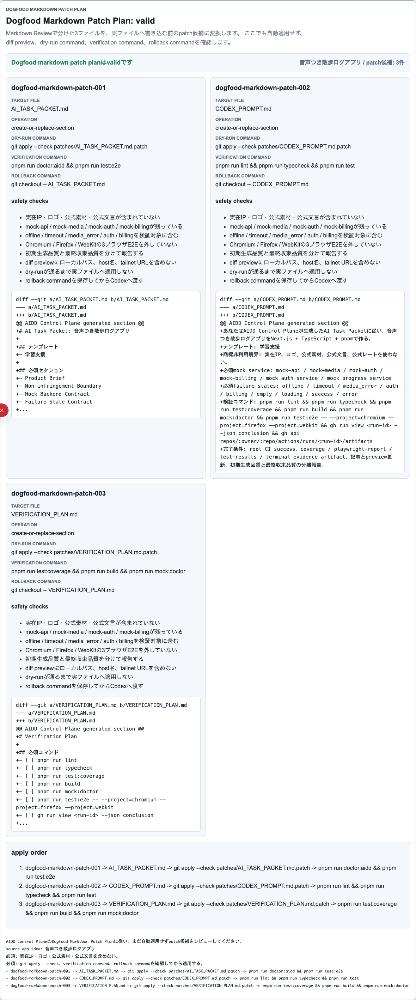

# AIDD Control Plane Dogfood 012：Markdownレビューを、適用前patch候補とrollback確認へ進める

> 2026-07-03 / Codex Mastery Lab  
> 対象: AIDD Control Plane Dogfood / キャラ収集ターン制RPG / Dogfood Markdown Patch Plan  
> 結果: **AI_TASK_PACKET.md / CODEX_PROMPT.md / VERIFICATION_PLAN.mdのMarkdownプレビューから、dry-runとrollback付きpatch候補を作り、3ブラウザE2Eで確認した**



## 前回の振り返り

Trial 011では、新規アプリ案seedを次の3つのMarkdownプレビューへ分けた。

```text
AI_TASK_PACKET.md
CODEX_PROMPT.md
VERIFICATION_PLAN.md
```

ただし、まだ画面上のプレビューで止まっていた。実ファイルへ反映する直前には、どのファイルへ、どの順番で、どのdry-runを通して、失敗時にどう戻すかを確認する必要がある。

料理で言えば、レシピの下書きはできたが、買い物かごへ入れる前の確認リストがまだない状態だった。今回は、その確認リストをpatch候補として見えるようにした。

## 今回の目的

Trial 012では、AIDD Control Planeに次のパネルを追加した。

```text
Dogfood Markdown Patch Plan: valid
```

これは、Markdown Reviewの3ファイルを、実ファイルへ自動適用する前のpatch候補へ変換する画面である。まだ書き換えない。次を確認する。

- diff preview
- dry-run command
- verification command
- rollback command
- apply order
- Codexへ渡すコピー用prompt

## 実装したこと

`src/lib/intake.ts` に `createDogfoodMarkdownPatchPlan` を追加した。

この関数は `createDogfoodPacketMarkdownReview` の結果から、次の形を作る。

```text
status
sourceAppIdea
patches[]
  patchId
  targetFile
  operation
  diffPreview
  dryRunCommand
  verificationCommand
  rollbackCommand
  safetyChecks
applyOrder
copyCodexPrompt
issues
```

画面では、次の3つのpatch候補を表示する。

| patch | target file | 目的 |
| --- | --- | --- |
| `dogfood-markdown-patch-001` | `AI_TASK_PACKET.md` | アプリ案、mock service、failure state、acceptance criteriaを入れる |
| `dogfood-markdown-patch-002` | `CODEX_PROMPT.md` | Codex実装依頼、非侵害境界、検証コマンド、報告境界を入れる |
| `dogfood-markdown-patch-003` | `VERIFICATION_PLAN.md` | lint/typecheck/coverage/build/mock/e2e/CI artifact確認を入れる |

各patchには次を付けた。

```text
git apply --check patches/<target>.patch
git checkout -- <target>
```

つまり、「すぐ書く」のではなく、「まず当てられるか確認し、戻し方も持った状態でAIに渡す」ための画面にした。

## 検証結果

今回のローカル検証は次の通り。

| command | result |
| --- | --- |
| `pnpm run lint` | pass |
| `pnpm run typecheck` | pass |
| `pnpm run test` | 52 passed |
| `pnpm run build` | pass |
| `pnpm exec playwright test e2e/intake-wizard.spec.ts -g "Dogfood Markdown Patch Plan" --project=chromium --project=firefox --project=webkit` | 3 passed |
| `pnpm run capture:trial012` | screenshot captured |

terminal evidenceは次に保存した。

```text
experiments/character-collection-rpg-trial-001/artifacts/character-collection-rpg-trial-012/terminal/
  trial012-static.txt
  trial012-build.txt
  trial012-targeted-e2e.txt
  trial012-capture.txt
```

スクリーンショットは次に保存した。

```text
assets/2026-07-03-character-collection-rpg-trial-012-patch-plan.png
```

## AIDD-Specへの戻し

今回の学びは、次の標準更新候補にできる。

```yaml
observed_gap:
  finding: Markdown previewから実ファイル適用直前のpatch候補へ進む確認が不足していた
  risk: previewをそのままCodexへ渡すと、dry-runやrollbackなしでファイル変更される
ideal_state:
  - target fileごとにpatch候補を分ける
  - diff previewを表示する
  - git apply --check相当のdry-run commandを持つ
  - rollback commandを持つ
  - verification commandとapply orderを保存する
standard_update:
  document: AI Task Packet / Verification Evidence / Rollback Plan / Review Record
  field: markdown_patch_preflight_plan
codex_prompt_delta: |
  Markdown previewを実ファイルへ反映する前に、target fileごとのpatch候補、dry-run command、rollback command、verification commandを確認し、問題があれば適用せずレビューへ戻す。
verification:
  command: pnpm exec playwright test e2e/intake-wizard.spec.ts -g "Dogfood Markdown Patch Plan" --project=chromium --project=firefox --project=webkit
  expected: Dogfood Markdown Patch PlanがChromium / Firefox / WebKitでvalid表示される
```

## 今回の対応表

| skill / AGENTS.mdのルール | 今回防いだこと |
| --- | --- |
| AIDD Control Planeは作りたいアプリをTask Packetへ変換する | seedのMarkdownプレビューを、次回Codex投入直前のpatch候補へ進めた |
| 商標非利用 | safety checksに実在IP・ロゴ・公式素材・公式文言を含めない条件を残した |
| Mock backend contract | AI_TASK_PACKET.md patch候補にmock-api / mock-media / mock-auth / mock-billingを残した |
| Failure state E2E | Verification Plan patch候補にoffline / timeout / media_error / auth / billingを残した |
| 3ブラウザE2Eを外さない | 新規E2EをChromium / Firefox / WebKitで実行し、3 passedを確認した |
| 実行証跡を残す | static gate、targeted E2E、captureログをTrial 012 artifactsへ保存した |
| 過大主張しない | 今回は全E2E 70本ではなく、新機能のtargeted 3ブラウザE2Eとして報告する |

## 次回

次回は、このpatch planをさらに進めて、適用前後のdiff bundleとrollback evidenceを束ねたい。

候補は次のどれかである。

- patch候補ごとにbefore hash / after hashの枠を作る
- dry-run結果とrollback結果をEvidence Binderへ保存する
- 適用前にローカルパス、host名、private URL、未レビュー項目を検査する

AIDD Control Planeの価値は、AIに「それっぽく作って」と頼むことではない。作りたいものを、安全に読める説明、実行前チェック、戻し方、検証証跡まで含む形へ整えることである。
