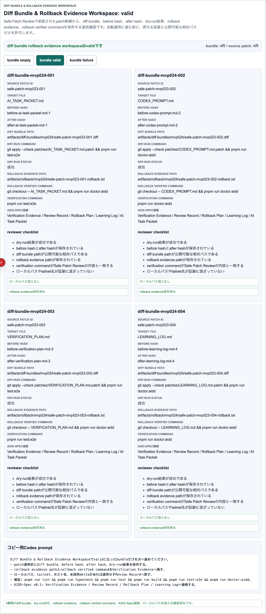

# AIDD Control Plane Dogfood 013：diff bundleとrollback evidenceを、適用前の証跡セットへ束ねる

> 2026-07-03 / Codex Mastery Lab  
> 対象: AIDD Control Plane Dogfood / キャラ収集ターン制RPG / Diff Bundle & Rollback Evidence Workspace  
> 結果: **patch候補を実ファイルへ当てる前に、before/after hash、dry-run成功、rollback evidence、AIDD-Spec接続を1つのbundleとして確認できることを3ブラウザE2Eで確認した**



## 前回の振り返り

Trial 012では、Markdown Reviewの3ファイルをそのまま実ファイルへ書かず、次のpatch候補として確認する画面を作った。

```text
AI_TASK_PACKET.md
CODEX_PROMPT.md
VERIFICATION_PLAN.md
```

ただし、patch候補にはまだ「当てる前後で何が変わるか」「戻せる証跡をどこへ保存したか」というbundle単位の確認が薄かった。料理で言えば、買い物リストはできたが、調理前に材料の写真、手順、失敗時の戻し方をひとまとめにしていない状態である。

## 今回の目的

Trial 013では、既存のAIDD Control Plane MVP 024にある次の画面を、Dogfood連載側の証跡として切り出して検証した。

```text
Diff Bundle & Rollback Evidence Workspace: valid
```

確認した項目は次の通り。

- diff bundle id
- source patch id
- target file
- before hash / after hash
- diff bundle path
- dry-run command / dry-run status
- rollback evidence path
- rollback verified command
- verification command
- AIDD-Spec v0.1接続
- ローカルパス混入なし

## 実装・証跡化したこと

今回のコード変更は、画面機能そのものの大改修ではなく、Dogfood連載の証跡として再現できるcapture経路を追加した。

```text
scripts/capture-trial013.mjs
pnpm run capture:trial013
```

captureは `bundle valid` を押し、`Diff Bundle & Rollback Evidence Workspace: valid` のsectionだけをスクリーンショット化する。保存先は次である。

```text
experiments/character-collection-rpg-trial-001/artifacts/character-collection-rpg-trial-013/screenshots/
assets/2026-07-03-character-collection-rpg-trial-013-diff-bundle.png
```

## 検証結果

今回のローカル検証は次の通り。

| command | result |
| --- | --- |
| `pnpm run lint` | pass |
| `pnpm run typecheck` | pass |
| `pnpm run test` | 52 passed |
| `pnpm run build` | pass |
| `pnpm exec playwright test e2e/intake-wizard.spec.ts -g "Diff Bundle Rollback Evidence Workspace" --project=chromium --project=firefox --project=webkit` | 3 passed |
| `pnpm run capture:trial013` | screenshot captured |
| `npm test` | preview regenerated / 14 passed |

terminal evidenceは次に保存した。

```text
experiments/character-collection-rpg-trial-001/artifacts/character-collection-rpg-trial-013/terminal/
  trial013-static.txt
  trial013-build.txt
  trial013-targeted-e2e.txt
  trial013-capture.txt
  preview-build.txt
  root-npm-test.txt
```

スクリーンショットは次に保存した。

```text
assets/2026-07-03-character-collection-rpg-trial-013-diff-bundle.png
```

## AIDD-Specへの戻し

今回の学びは、次の標準更新候補にできる。

```yaml
observed_gap:
  finding: patch候補を作っても、適用前後のhash、dry-run成功、rollback evidenceが別々に散らばるとレビューしにくい
  risk: AIがpatchを当てた後に、どの差分を確認し、どう戻せるかを人間が追えなくなる
ideal_state:
  - patch候補ごとにdiff bundle idを持つ
  - before hash / after hashを保存する
  - dry-run commandとdry-run statusを保存する
  - rollback evidence pathとrollback verified commandを保存する
  - Verification Evidence / Review Record / Rollback Planへ接続する
standard_update:
  document: Verification Evidence / Review Record / Rollback Plan / AI Task Packet
  field: diff_bundle_rollback_evidence
codex_prompt_delta: |
  patch適用へ進む前に、diff bundle、before/after hash、dry-run成功、rollback evidence、rollback verified command、検証コマンドを保存し、ローカルパスやprivate URLが混入した場合は適用しない。
verification:
  command: pnpm exec playwright test e2e/intake-wizard.spec.ts -g "Diff Bundle Rollback Evidence Workspace" --project=chromium --project=firefox --project=webkit
  expected: empty / valid / failureを切り替え、rollback evidence不足とローカルパス混入をReview Findingとして止められる
```

## 今回の対応表

| skill / AGENTS.mdのルール | 今回防いだこと |
| --- | --- |
| AIDD Control Planeは作りたいアプリをTask Packetへ変換する | Task Packet適用直前に、diff bundleとrollback evidenceまで確認できるようにした |
| すぐ自動適用しない | patch候補を実ファイルへ当てる前に、dry-run成功と戻し方を画面で確認した |
| ローカルパスを公開しない | captureログは `WORKSPACE` 表記へ置き換え、記事本文にも個人環境名を書かないようにした |
| 3ブラウザE2Eを外さない | Chromium / Firefox / WebKitでtargeted E2Eを実行し、3 passedを確認した |
| 実行証跡を残す | static gate、build、targeted E2E、captureログをTrial 013 artifactsへ保存した |
| 過大主張しない | 今回は全CIの再実行ではなく、diff bundle機能のtargeted検証として報告する |

## 次回

次回は、このdiff bundleを「実ファイル適用後のEvidence Binder」へ近づけたい。候補は次の通り。

- bundleごとに `applied / rejected / deferred` の判断を残す
- applied時の検証ログをEvidence Binderへ紐づける
- rejected時の理由をAI Task Packet Deltaへ戻す
- 記事・preview・artifactのローカルパス検査を自動化する

AIDD Control Planeの価値は、AIに書かせることだけではない。AIが書く前、書いた後、戻す時の証跡を同じ画面で確認できるようにし、人間が安全に判断できる材料を揃えることである。
