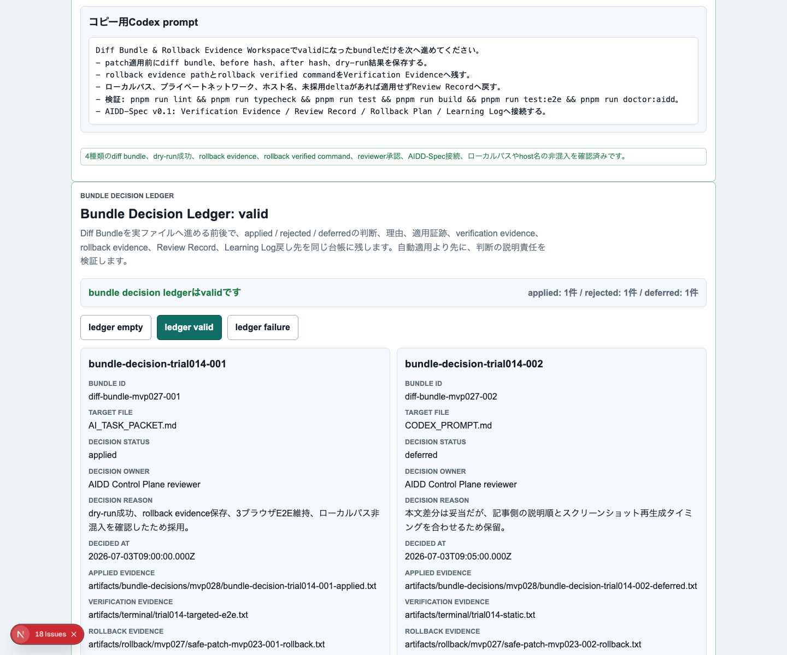
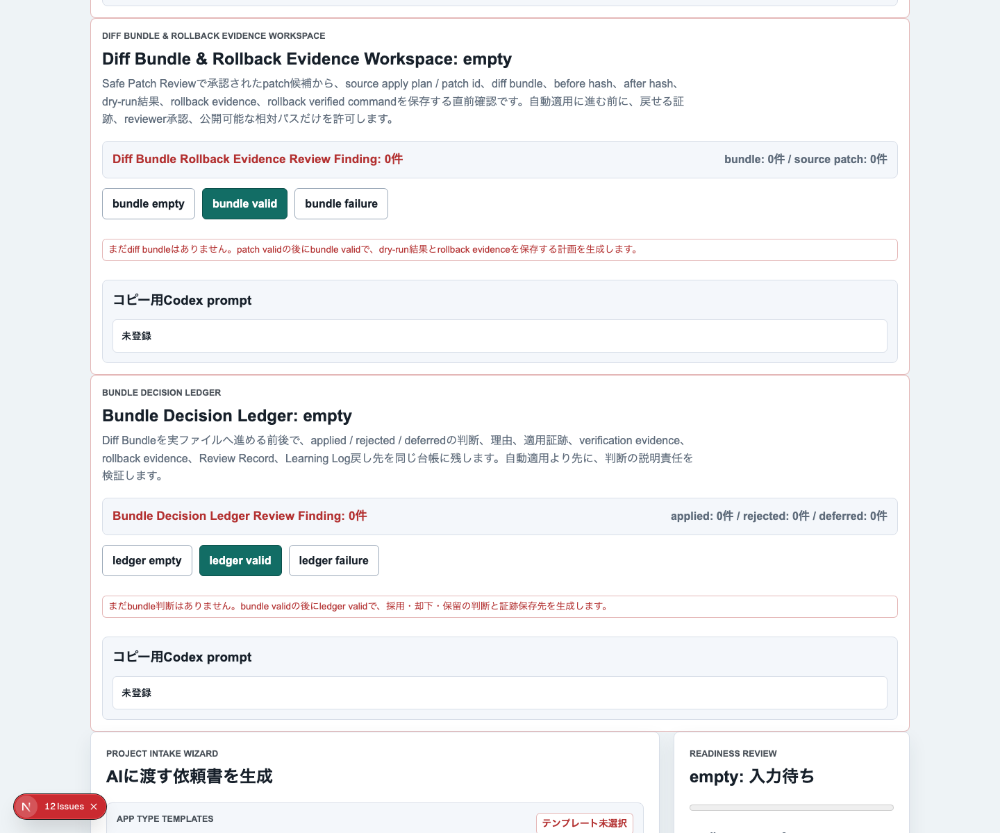
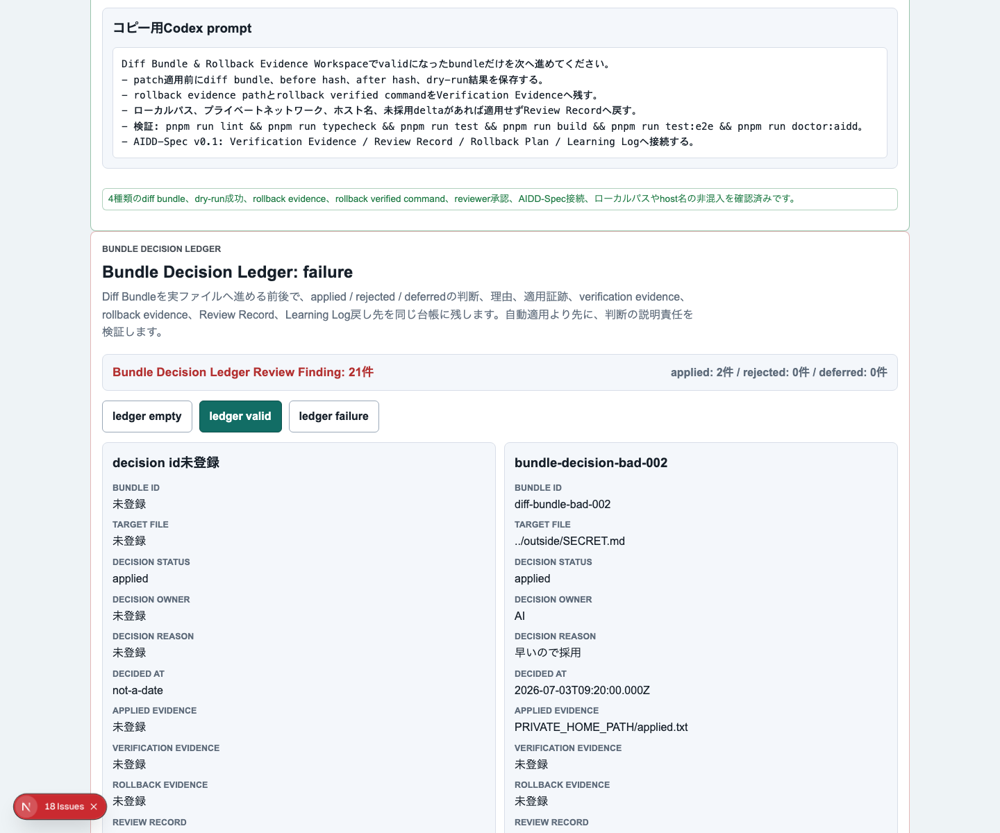

# AIDD Control Plane Dogfood 014：Diff Bundleを、採用・却下・保留の判断台帳へ進める

> 2026-07-03 / Codex Mastery Lab  
> 対象: AIDD Control Plane Dogfood / キャラ収集ターン制RPG / Bundle Decision Ledger  
> 結果: **Diff Bundleを実ファイルへ進める前後で、applied / rejected / deferred、判断理由、verification evidence、rollback evidence、Review Record、Learning Log戻し先を束ねる台帳を追加し、3ブラウザE2Eで確認した**



## 前回の振り返り

Trial 013では、patch候補を実ファイルへ当てる前に、diff bundle、before / after hash、dry-run成功、rollback evidenceを1つの証跡セットとして確認できるようにした。

ただし、まだ次の問いが残っていた。

```text
このbundleは採用したのか。
却下したなら、なぜか。
保留したなら、いつ何を満たせば再レビューするのか。
その判断はReview RecordやLearning Logへ戻ったのか。
```

AI駆動開発では、差分そのものだけでなく「なぜ通したか / なぜ止めたか」が後から読めないと、次回のAI Task Packetが改善されない。買い物メモでいえば、買った物だけでなく「今回は買わなかった理由」「次回買う条件」も残す必要がある。

## 今回の目的

Trial 014では、AIDD Control Plane側に **Bundle Decision Ledger** を追加した。これはDiff Bundle & Rollback Evidence Workspaceの次に置く判断台帳である。

扱う項目は次の通り。

- decision id
- source bundle id
- target file
- decision status: `applied / rejected / deferred`
- decision owner
- decision reason
- applied evidence path
- verification evidence path
- rollback evidence path
- review record path
- Learning Log entry
- Next Task Packet Delta
- reviewer approved
- ローカルパス・host名混入検出

## 実装したこと

今回の主な変更は、`experiments/aidd-control-plane-mvp-027/generated-repo` にBundle Decision Ledgerのdomain model、UI、E2E、capture経路を追加したことである。

```text
src/lib/intake.ts
  createEmptyBundleDecisionLedger
  createValidBundleDecisionLedger
  createFailureBundleDecisionLedger
  evaluateBundleDecisionLedger

app/page.tsx
  Bundle Decision Ledger section

e2e/intake-wizard.spec.ts
  Bundle Decision Ledgerでapplied rejected deferredの判断と証跡保存先を確認できる

scripts/capture-trial014.mjs
  empty / valid / failure screenshot capture
```

## 画面証跡

### empty：まだ判断がない



emptyでは、bundle validの後にledger validへ進む導線を出す。差分を作っただけで自動適用に進まないための停止線である。

### valid：採用・却下・保留を理由つきで保存


validでは、3件の判断を表示する。

| status | 意味 |
| --- | --- |
| applied | dry-run、rollback evidence、verification evidence、Review Recordが揃ったため採用 |
| deferred | 差分自体は妥当だが、証跡や記事更新タイミングを合わせるため保留 |
| rejected | 現在のCI gateとずれているため実ファイルには適用せずLearning Logへ戻す |

### failure：判断理由なし・戻せない適用を止める



failureでは、decision id不足、bundle id不足、target file不足、危険なtarget path、decision owner不足、rollback evidence不足、reviewer未承認、非公開パス混入をReview Findingとして止める。

## 検証結果

今回実行した検証は次の通り。

| command | result |
| --- | --- |
| `pnpm run lint` | pass |
| `pnpm run typecheck` | pass |
| `pnpm run test` | 52 passed |
| `pnpm run build` | pass（Next.js ESLint plugin警告は既存と同種） |
| `pnpm exec playwright test e2e/intake-wizard.spec.ts -g "Bundle Decision Ledger" --project=chromium --project=firefox --project=webkit` | 3 passed |
| `pnpm run capture:trial014` | screenshot captured |

terminal evidenceは次に保存した。

```text
experiments/character-collection-rpg-trial-001/artifacts/character-collection-rpg-trial-014/terminal/
  trial014-static.txt
  trial014-targeted-e2e.txt
  trial014-capture.txt
```

スクリーンショットは次に保存した。

```text
assets/2026-07-03-character-collection-rpg-trial-014-bundle-ledger-empty.png
assets/2026-07-03-character-collection-rpg-trial-014-bundle-ledger-valid.png
assets/2026-07-03-character-collection-rpg-trial-014-bundle-ledger-failure.png
```

## AIDD-Specへの戻し

```yaml
observed_gap:
  finding: diff bundleとrollback evidenceが揃っても、採用・却下・保留の判断理由が残らないと次回AI Task Packetへ学習が戻らない
  risk: AIが同じ危険なpatchを再提案し、人間もなぜ止めたかを追えなくなる
ideal_state:
  - bundleごとに applied / rejected / deferred を保存する
  - decision owner と decision reason を必須にする
  - applied evidence / verification evidence / rollback evidence / review record path を束ねる
  - rejected / deferred は Learning Log と Next Task Packet Delta へ戻す
standard_update:
  document: Review Record / Verification Evidence / Rollback Plan / Learning Log / AI Task Packet
  field: bundle_decision_ledger
codex_prompt_delta: |
  Diff Bundleを実ファイルへ進める前に、Bundle Decision Ledgerへ採用・却下・保留の判断、理由、証跡path、rollback evidence、Learning Log戻し先を保存する。判断理由、reviewer承認、rollback evidence、ローカルパス検査が欠けるbundleは適用しない。
verification:
  command: pnpm exec playwright test e2e/intake-wizard.spec.ts -g "Bundle Decision Ledger" --project=chromium --project=firefox --project=webkit
  expected: empty / valid / failureを切り替え、判断理由なし・戻せない適用・ローカルパス混入を止める
```

## 今回の対応表

| skill / AGENTS.mdのルール | 今回防いだこと |
| --- | --- |
| 自動適用より証跡とreviewを優先する | Diff Bundleから直接実ファイルへ進まず、判断台帳を挟んだ |
| Failure stateをE2Eから確認する | ledger empty / valid / failureをChromium / Firefox / WebKitで確認した |
| ローカルパスを公開しない | 非公開パスやhost名混入をfailure issueとして扱った |
| 過大主張しない | 今回はroot CI全体ではなく、Bundle Decision Ledgerのtargeted検証として報告する |
| AIDD-Specへ戻す | Review Record、Verification Evidence、Rollback Plan、Learning Log、AI Task Packetの更新候補に変換した |

## 次回

次回は、Bundle Decision Ledgerを実際の「適用後Evidence Binder」へつなげる。候補は次の通り。

- applied bundleの検証ログをEvidence Binderへ自動集約する
- rejected / deferredの理由から次回AI Task Packet Deltaを自動生成する
- 記事・preview・artifactのローカルパス検査を公開前gateとして固定する

AIDD Control Planeの価値は、AIが差分を作ることだけではない。差分を採用する、止める、後回しにする判断を、次回の依頼書へ戻せる形で保存することにある。
