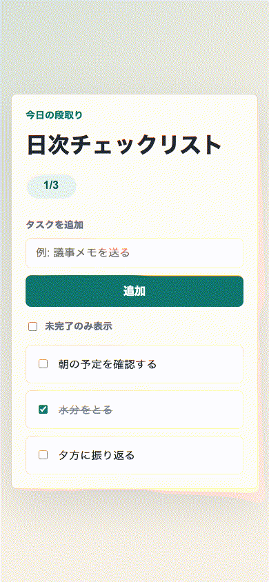
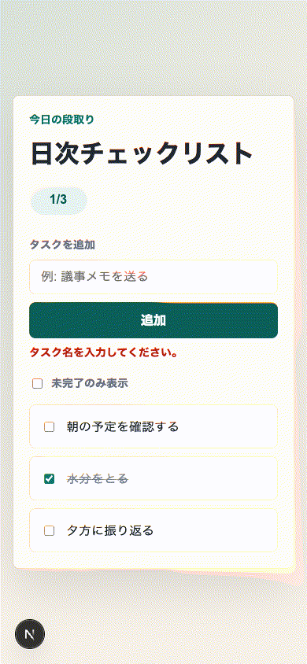

# 「E2Eが1本通った」だけでは足りない：Verification Evidence LiteをAI Task Packetへ逆算する

> 想定読了時間: 約10分  
> 記事種別: Experiment / Template  
> 将来の書籍章: 第9章 AI Task Packet、第10章 Verification Evidence、第11章 Learning Log、第12章 雑プロンプト vs AI Task Packet

## 今日の問い

今日の問いはこれです。

> 小さなWebアプリで「E2Eが通った」と言えるだけでは、後工程のレビュー、記事化、次回改善には何が足りないのか。

AI駆動開発では、Codexが短時間でそれっぽいUIとテストを作ってくれます。これは便利です。しかし現場で困るのは、そのあとです。

- どの受け入れ条件を満たしたのか分からない
- どのコマンドを実行すれば再確認できるのか分からない
- スクリーンショットやGIFが、どの仕様の証拠なのか分からない
- 残リスクが書かれていないので、次の担当者が同じ穴を踏む
- 「できました」というチャットだけが残り、後から検査できない

料理のレシピでいえば、「おいしくできました」とだけ書かれていて、材料、分量、加熱時間、失敗しやすいところが残っていない状態です。次の人は再現できません。AIDD-Specで作りたいのは、AIにも人間にも再現できる共通説明書です。だから今回は **Verification Evidence Lite** を題材にしました。

## 前回の振り返り

直近のAIDD Control Plane MVPでは、Review FindingからAI Task Packet Delta、採用済みdelta、次回ファイルドラフトへつなげてきました。そこで見えてきたのは、改善案を安全に次回へ渡すには「どの証拠を採用したのか」が必要だということです。

今回の小さな実験では、SaaS画面ではなく、まず1つのミニアプリを使って、Verification Evidenceの最小形を逆算します。

## 今回やること

題材は「日次チェックリスト」アプリです。機能は小さくしました。

- タスクを追加する
- 完了を切り替える
- 未完了のみ表示する

あえて最初は雑なバイブコーディングで作ります。その後、監査して、後工程が必要とする証拠を洗い出し、Codexへの再指示に変換します。

## 実験環境

```text
実行日時: Fri Jul  3 09:07:39 JST 2026
OS: macOS 26.5.1 Build 25F80
Codex CLI: codex-cli 0.142.5（npx -y @openai/codex 経由）
Node: v22.23.1
pnpm: 11.9.0
ディスク: WORKSPACE で十分な空き
実験ディレクトリ: experiments/2026-07-03-verification-evidence-lite-001
```

最初に `codex --version` を直接叩くと `codex: command not found` でした。前回記事でも同じ失敗がありました。今回は `npx -y @openai/codex --version` では起動できたので、Codex CLIはnpx経由で実行しました。この失敗も、Verification Evidenceとして残しています。

## Step 0: 実験計画を書く

まず `PLAN.md` を置きました。今日の監査カテゴリは次の3つです。

1. Verification Evidence: 実行コマンド、証拠ファイル、受け入れ条件対応が残るか
2. Requirement Fit: 主要操作が本当に満たされるか
3. Accessibility: ラベル、フォーカス、状態説明があるか

パスは次です。

```text
experiments/2026-07-03-verification-evidence-lite-001/PLAN.md
```

## Step 1: Codexに雑に作らせる

実際にCodexへ渡したプロンプトです。

```text
実験ディレクトリ experiments/2026-07-03-verification-evidence-lite-001/generated-repo に、Next.js + TypeScript + pnpm の小さな日本語UIアプリを作ってください。題材は「日次チェックリスト」。雑なバイブコーディング版として、まず見た目と基本操作を優先してください。必須: package.json、src/app/page.tsx、src/app/layout.tsx、src/app/globals.css、README.md、簡単なPlaywrightテスト1本。UI文言・テスト名は日本語。操作はタスク追加、完了切替、未完了のみ表示。重い依存は追加しないでください。生成後に実行すべきコマンドもREADMEへ書いてください。
```

実行コマンドはこれです。

```bash
npx -y @openai/codex exec --sandbox danger-full-access '<上記プロンプト>' 2>&1 | tee experiments/2026-07-03-verification-evidence-lite-001/logs/codex-vibe.log
```

Codexは `generated-repo` にNext.jsアプリを作りました。主なファイルは次です。

```text
package.json
src/app/page.tsx
src/app/layout.tsx
src/app/globals.css
playwright.config.ts
tests/e2e/daily-checklist.spec.ts
README.md
```

Codex自身の報告では、次のコマンドを確認したと言っています。

```text
pnpm install
pnpm run typecheck
pnpm run lint
pnpm run build
pnpm exec playwright install chromium
pnpm run test:e2e
```

ただし、ここで重要なのは「Codexが確認したと言った」だけではEvidenceとして弱いことです。Hermes側でも同じコマンドを実行してログを保存しました。

## Step 2: バイブ版を検証する

実行ログの要点です。

```text
pnpm install: pass
pnpm run typecheck: pass
pnpm run lint: pass
pnpm run build: pass
pnpm run test:e2e: 1 passed
```

E2Eは1本でした。

```text
✓ タスク追加、完了切替、未完了のみ表示ができる
1 passed
```

ブラウザ操作もPlaywrightで行い、スクリーンショットからGIFを作りました。



コンソールログも保存しました。

```text
experiments/2026-07-03-verification-evidence-lite-001/logs/browser-console-vibe.txt
(console messageなし)
```

見た目と基本操作は十分です。入力して、チェックして、未完了だけにできます。では、これで「完了」と言ってよいでしょうか。今回の答えは「まだ足りない」です。

## Step 3: 監査結果

標準フォーマットで記録すると、主な欠陥は次です。

```yaml
findings:
  - category: Verification Evidence
    finding: E2Eが1本にまとまっており、受け入れ条件IDと証拠コマンドの対応がない
    severity: high
    observed_by: manual review / tests/e2e/daily-checklist.spec.ts
    ideal_state: 各受け入れ条件にID、操作、期待結果、証拠コマンドがあり、E2Eテスト名にもIDが入る
    fix_instruction: docs/ACCEPTANCE_CRITERIA.md と docs/VERIFICATION_EVIDENCE.md を作り、E2EをAC単位に分割する
    needed_upstream_info:
      - Acceptance Criteria Matrix
      - Verification Evidence Template
      - AI Task Packet
    standard_update:
      document: standards/templates/verification-evidence-template-v0.1.md
      field: Lite acceptance_criteria / evidence_command / residual_risks
    codex_prompt_delta: |
      Verification Evidence Liteとして、受け入れ条件ごとにIDを付け、操作、期待結果、証拠コマンド、保存するログ/スクリーンショット/GIF、残リスクを docs/ に残してください。
    verification:
      command: pnpm run doctor:evidence && pnpm run test:e2e
      expected: pass

  - category: Accessibility
    finding: 空入力時にユーザーへ説明が出ず、完了数も「完了数」という短いaria-labelだけだった
    severity: medium
    observed_by: manual UI review
    ideal_state: 空入力エラーはaria-liveで伝わり、完了数や空状態は日本語文として意味が伝わる
    fix_instruction: 空入力エラー、一覧件数、空状態メッセージ、完了数のアクセシブル名を追加する
    needed_upstream_info:
      - Accessibility Contract
      - State Design
    standard_update:
      document: Verification Evidence Lite
      field: artifacts.console_log / acceptance_criteria.expected_result
    verification:
      command: pnpm run test:e2e -- --grep AC-003
      expected: pass
```

バイブ版の問題は、アプリが壊れていることではありません。むしろ、アプリは動いています。問題は、後工程の人が「何が確認済みなのか」を読み解くための証拠が薄いことです。

## Step 4: 修正プロンプト

次に、後工程から逆算した指示をCodexへ渡しました。

```text
experiments/2026-07-03-verification-evidence-lite-001/generated-repo を改善してください。目的は Verification Evidence Lite の検証です。日本語UIは維持し、重い依存は追加しません。次を実装してください: 1) docs/ACCEPTANCE_CRITERIA.md に受け入れ条件ID、操作、期待結果、証拠コマンドを書く。2) docs/VERIFICATION_EVIDENCE.md に今回の品質ゲート、ログ保存先、スクリーンショット/GIF保存先、残リスクを書く。3) Playwrightテストを受け入れ条件IDごとに3本へ分け、テスト名は日本語にする。4) 空入力時に日本語のエラーメッセージを aria-live で表示し、空状態/完了数もスクリーンリーダーに意味が伝わるようにする。5) package.json に doctor:evidence スクリプトを追加し、docs/ACCEPTANCE_CRITERIA.md と docs/VERIFICATION_EVIDENCE.md と Playwrightテストの存在を確認する軽いNodeスクリプト scripts/doctor-evidence.mjs を作る。6) READMEへ検証手順を追記する。
```

ここでポイントは、「証拠を残して」と曖昧に言わなかったことです。どのファイルに、どの項目を、どのコマンドで確認できるようにするかまで指定しました。

## Step 5: 修正版の結果

Codexは次を追加・修正しました。

```text
docs/ACCEPTANCE_CRITERIA.md
docs/VERIFICATION_EVIDENCE.md
scripts/doctor-evidence.mjs
package.json の doctor:evidence
Playwright E2Eを AC-001 / AC-002 / AC-003 の3本へ分割
空入力エラー aria-live
完了数と空状態のアクセシブル名
```

再検証ログです。

```text
$ pnpm run doctor:evidence
OK docs/ACCEPTANCE_CRITERIA.md
OK docs/VERIFICATION_EVIDENCE.md
OK tests/e2e/daily-checklist.spec.ts
OK Verification Evidence Lite の最低限の証跡が揃っています。

$ pnpm run typecheck
pass

$ pnpm run lint
pass

$ pnpm run build
✓ Compiled successfully

$ pnpm run test:e2e
✓ AC-001 タスクを追加すると一覧の先頭に表示される
✓ AC-002 完了を切り替えると完了数が更新される
✓ AC-003 空入力エラーと未完了なしの空状態が伝わる
3 passed
```

修正版のブラウザ操作GIFです。



空入力エラー、タスク追加、全完了後の空状態まで確認できました。コンソールログも保存済みです。

```text
experiments/2026-07-03-verification-evidence-lite-001/logs/browser-console-fixed.txt
(console messageなし)
```

## Step 6: 逆算する

今回の欠陥から、前工程で必要だった情報を表にします。

| 欠陥 | 必要だった前工程情報 | AIDD-Spec成果物 | AI Task Packetに入れるべき項目 |
|---|---|---|---|
| E2Eが1本で、何を証明したか曖昧 | 受け入れ条件ID、操作、期待結果 | Acceptance Criteria Matrix | `AC-001` 形式のIDとE2Eテスト名へのID埋め込み |
| ログやGIFの保存先が後付け | 証拠保存先、品質ゲート、残リスク | Verification Evidence | `log_file`、`screenshots_or_gifs`、`residual_risks` |
| 空入力や空状態の説明が弱い | 状態設計、アクセシビリティ期待値 | Accessibility Contract / State Design | `aria-live`、空状態文言、アクセシブル名 |
| Codexの「確認済み」だけでは追跡できない | 独立検証コマンド | Verification Evidence / Review Record | Hermes側でも実行し、ログへ保存する |

つまり、最初からCodexに渡すべきだったのは次です。

```text
Verification Evidence Liteとして、受け入れ条件ごとにIDを付け、操作、期待結果、証拠コマンド、保存するログ/スクリーンショット/GIF、残リスクを docs/ に残してください。Playwrightテスト名にも受け入れ条件IDを含め、pnpm run doctor:evidence で証跡ファイルとIDの存在を確認できるようにしてください。
```

## AIDD-Specへの反映

`standards/templates/verification-evidence-template-v0.1.md` に Lite v0.2 の追記を入れました。追加した主な項目は次です。

```yaml
acceptance_criteria:
  - id: "AC-001"
    user_action: ""
    expected_result: ""
    evidence_command: ""
artifacts:
  screenshots_or_gifs: []
  console_log: ""
  diff_summary: ""
residual_risks:
  - ""
```

また、次の更新も行いました。

- `book/outline.md`: 今日の記事を第9章、第10章、第11章、第12章へ接続
- `backlog.md`: Verification Evidenceの最初の標準化を完了扱いに更新し、次回候補を追加
- `scripts/build_preview.py`: `verification-evidence-lite-*.png/gif` をプレビューのassetsへコピー対象に追加

## SaaS化した場合の機能仮説

AIDD Control Planeにすると、今回の `doctor:evidence` はUIと自動検査になります。

- Acceptance Criteria IDがないと完了にできない
- 各IDに証拠コマンドがないと警告する
- ログファイルが存在しないとReview Findingにする
- GIFまたはスクリーンショットがないと記事化前チェックで止める
- 残リスクが空欄なら「対象外が未説明」と表示する
- 採用する学びだけを次回AI Task Packetへdeltaとして送る

価値は、AIにコードを書かせることではありません。AIが作った成果物を、次の人が検査できる状態へ整えることです。

## 今回の学び

1. 小さいアプリでも、E2Eが1本だけだと証拠として弱い。
2. 受け入れ条件IDをテスト名に入れるだけで、ログの読みやすさが大きく変わる。
3. `doctor:evidence` のような軽い検査は、重いCIを待たずに証跡不足を止められる。
4. アクセシビリティの期待値も、Verification Evidenceに含めると後工程で見落としにくい。
5. Codexの自己申告と、Hermes側の独立検証ログは分けて残すべき。

## 明日から使えるチェックリスト

- [ ] 受け入れ条件に `AC-001` のようなIDを付けたか
- [ ] E2Eテスト名に受け入れ条件IDを入れたか
- [ ] 各IDに証拠コマンドを書いたか
- [ ] ログ保存先、スクリーンショット/GIF保存先を書いたか
- [ ] 残リスクを書いたか
- [ ] 「できました」というチャットだけをEvidence扱いしていないか

## 次回検証

次は、Verification Evidence LiteをAIDD Control Plane側の自動doctor UIへ接続したいです。ログ、GIF、残リスクが足りないと、画面上で完了できないようにする。そこまでできると、AIDD Control Planeは「チェックリストを表示するツール」から「証拠不足を止めるControl Plane」へ一歩進みます。

## 付録: 生ログ / 参照ファイル

- Experiment path: `experiments/2026-07-03-verification-evidence-lite-001`
- Vibe Codex log: `logs/codex-vibe.log`
- Fix Codex log: `logs/codex-fix.log`
- Vibe verification logs: `logs/typecheck-vibe.txt`, `logs/lint-vibe.txt`, `logs/build-vibe.txt`, `logs/e2e-vibe.txt`
- Fixed verification logs: `logs/doctor-evidence-fixed.txt`, `logs/typecheck-fixed.txt`, `logs/lint-fixed.txt`, `logs/build-fixed.txt`, `logs/e2e-fixed.txt`
- Assets: `assets/verification-evidence-lite-vibe.gif`, `assets/verification-evidence-lite-fixed.gif`
- Standard updated: `standards/templates/verification-evidence-template-v0.1.md`
