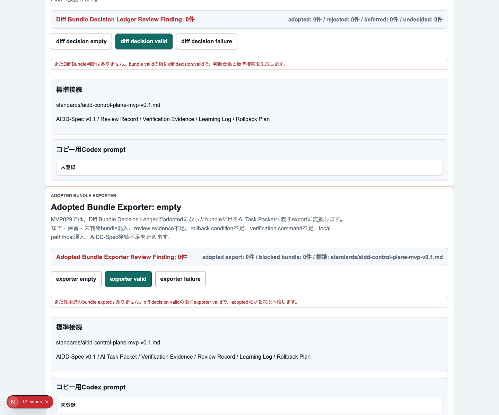
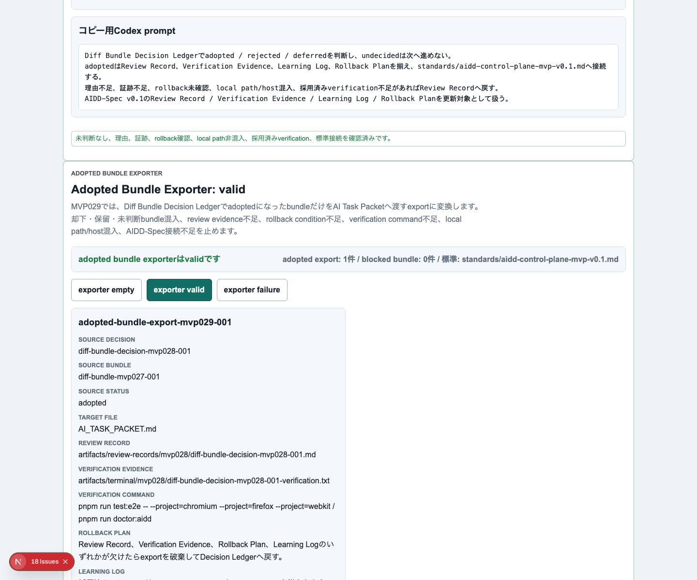
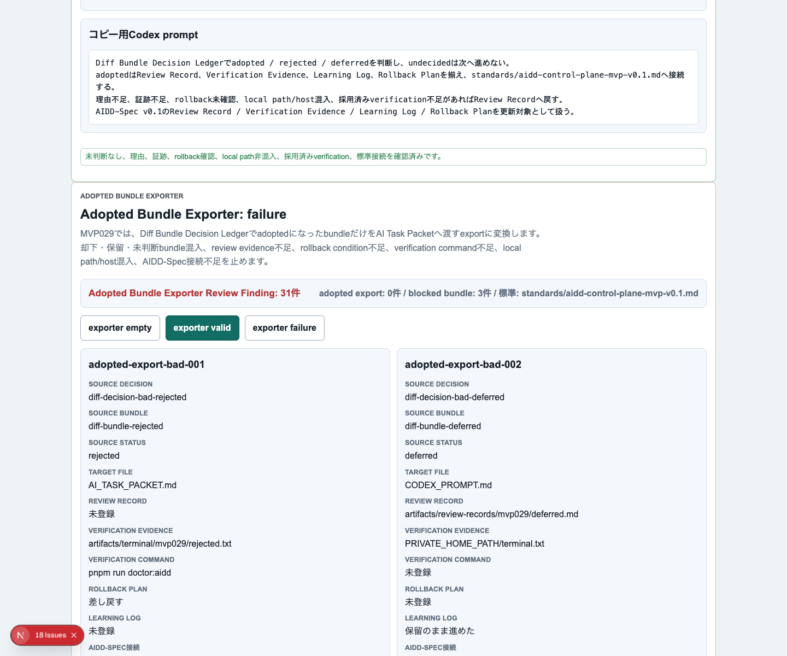
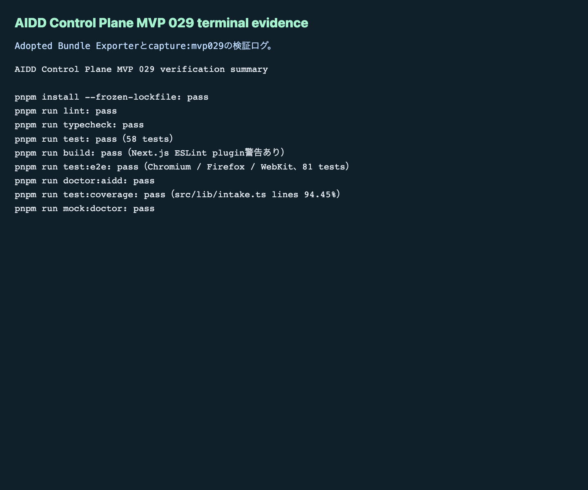

# AIDD Control Plane MVP 029：採用済みbundleだけを次回AI依頼へ書き出す

MVP 028では、AIが作ったdiff bundleを「採用・却下・保留」に分け、理由と証跡をDecision Ledgerへ残しました。今回はその次です。**採用済みbundleだけ**を次回のAI Task Packet / Verification Plan / Codex promptへ書き出す `Adopted Bundle Exporter` を作りました。

## 読者の悩み

AIに修正案をたくさん出させると、最初は「どれが良い案か」を選ぶだけで精一杯です。しかし、実際の開発では次の問題が起きます。

> 採用した差分だけを次回AI依頼へ渡したいのに、却下・保留・未判断の差分まで混ざってしまう。

これは、旅行の持ち物リストで「持っていく」と決めたものだけをスーツケースに入れたいのに、「買うか迷っているもの」や「今回は不要なもの」まで一緒に詰めてしまう状態に近いです。AI駆動開発でも、次回AIに渡す材料は選別済みである必要があります。

## 今回の仮説

仮説は次です。

> Decision LedgerでadoptedになったbundleだけをExport対象にし、却下・保留・未判断bundle、証跡不足、rollback不足、ローカル情報混入を止めれば、次回AI Task Packetの品質を保てる。

MVP 029では、次の項目をExporterに入れました。

- source bundle id
- source decision status
- target packet section
- Markdown section
- Verification Plan patch
- Codex prompt patch
- rollback condition
- review evidence path
- verification command
- Learning Log戻し
- AIDD-Spec接続

## 実験内容

`experiments/aidd-control-plane-mvp-029/generated-repo` に、MVP 028をベースにしたNext.js + TypeScriptアプリを作りました。Codexには `Adopted Bundle Exporter` の実装を依頼し、その後Hermes側で独立検証しました。

今回のポイントは、自動適用ではありません。まだ実ファイルへ反映する前に、次回AIへ渡してよい材料だけを確認する段階です。

```text
Diff Bundle Decision Ledger
  -> Adopted Bundle Exporter
  -> 次回AI Task Packet / Verification Plan / Codex prompt
```

## 画面キャプチャ

### empty / initial：まだ採用済みbundleがない状態



empty状態では、まだexport対象がないことと、先にDecision Ledgerで採用判断が必要なことを表示します。何もない画面でも「次に何を集めれば進めるか」を見せるのがAIDD Control Planeの役割です。

### filled / valid：採用済みbundleだけを書き出す状態



valid状態では、adoptedになったbundleだけがexport候補になります。AI Task Packet、Verification Evidence、Review Record、Learning Log、Rollback Planへの接続も同じ画面で確認できます。

### failure：未採用bundleや証跡不足を止める状態



failure状態では、却下bundle、保留bundle、未判断bundleの混入を止めます。さらに、review evidence不足、rollback condition不足、verification command不足、ローカルパスやhost名の混入、AIDD-Spec接続不足もReview Findingとして表示します。

### terminal evidence：実際に通した検証ログ



画面がそれらしく見えるだけでは不十分です。今回もterminal evidenceを残し、「実際に検証した一次情報」として記事に載せました。

## 失敗 / 修正

今回の実装では、Codexの生成後にそのまま信じず、個別コマンドで検証しました。Next.js buildでは既存と同じく `Next.js plugin was not detected in your ESLint configuration` 警告が出ました。build自体は成功していますが、これは「完全に警告ゼロ」とは言えないため、次回以降の品質改善候補として残します。

また、terminal logにはローカル絶対パスやローカルホスト表記が混ざりやすいので、記事・preview・artifact向けログは `WORKSPACE` / `LOCAL_HOST` へ置換しました。Markdown本文だけでなく、証跡画像に出る文字も対象にしています。

## 検証ログ

```text
pnpm install --frozen-lockfile: pass
pnpm run lint: pass
pnpm run typecheck: pass
pnpm run test: pass（58 tests）
pnpm run test:coverage: pass（src/lib/intake.ts lines 94.45%）
pnpm run build: pass（Next.js ESLint plugin警告あり）
pnpm run test:e2e: pass（Chromium / Firefox / WebKit、81 tests）
pnpm run doctor:aidd: pass
pnpm run mock:doctor: pass
pnpm run capture:mvp029: pass
```

## 読者が使えるチェックリスト

| チェック項目 | 何を確認したいのか | なぜ必要か |
| --- | --- | --- |
| adoptedだけをexportする | 採用済みbundleだけが次回AI依頼へ入るか | 却下・保留・未判断の材料が再混入するのを防ぐため |
| review evidenceを必須にする | どの証跡を見て採用したか | 後から判断理由を追えるようにするため |
| verification commandを残す | 次回AIが何を通せば完了か | 「直したつもり」を防ぎ、検証条件を固定するため |
| rollback conditionを書く | どの条件なら戻すか | AI差分を安全に扱うため |
| Learning Log戻しを用意する | 未採用理由を次回改善へ戻すか | AIに同じ失敗を繰り返させないため |
| local path / host名を検出する | 公開できない情報が混ざっていないか | note・GitHub・artifact公開時の不要な情報漏れを避けるため |
| AIDD-Spec接続を見る | AI Task Packet / Verification Evidence / Review Record / Learning Log / Rollback Planにつながっているか | 単なるUI部品ではなく、標準artifactの流れとして扱うため |

## SaaS / AIDD-Specへの接続

MVP 029で、AIDD Control Planeの差分レビュー後半は次の形になりました。

```text
Diff Bundle & Rollback Evidence Workspace
  -> Diff Bundle Decision Ledger
  -> Adopted Bundle Exporter
  -> 次回AI Task Packet / Verification Plan / Codex prompt
```

AIDD-Spec v0.1では、AI Task Packetだけを良くしても十分ではありません。検証証跡、レビュー記録、学習ログ、戻し方がセットになっていないと、AIは次回も曖昧な材料から作業します。

このExporterは、AIDD Control Planeを「コードを書くAI」ではなく、「AIへ渡す材料を選別し、検証可能な形に整えるSaaS」に近づける部品です。

## 次回

次回は、採用済みbundle exportを実ファイルに反映する直前の `Packet File Apply Planner` / `Apply Command Composer` との接続をさらに強くします。特に、exportされたMarkdownがどのファイルのどの見出しへ入るのか、dry-runとrollback evidenceまで一画面で追える状態に進めます。
