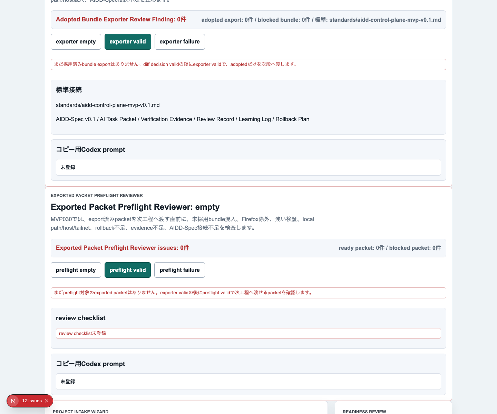
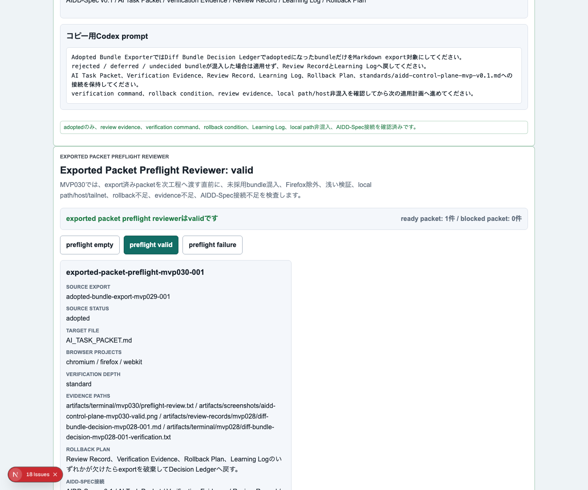
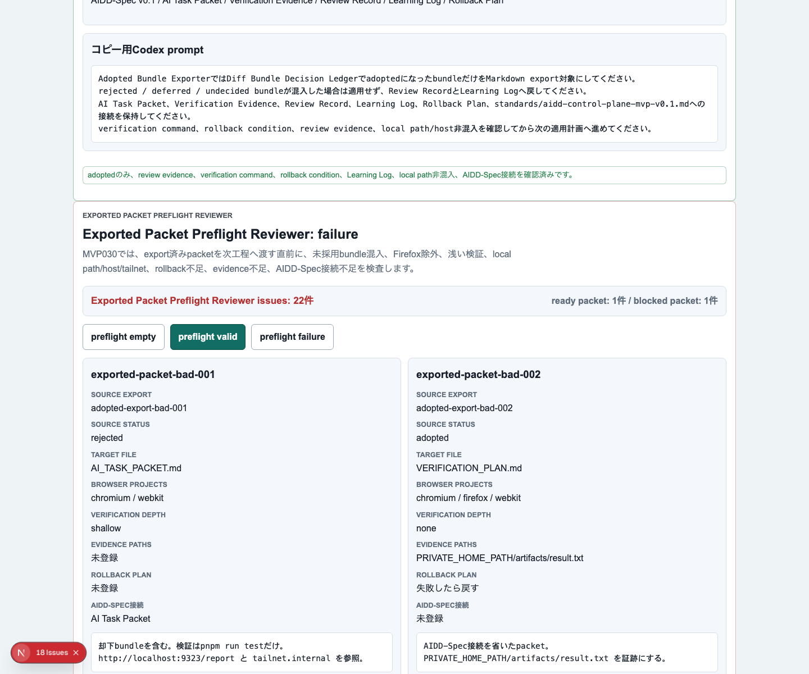
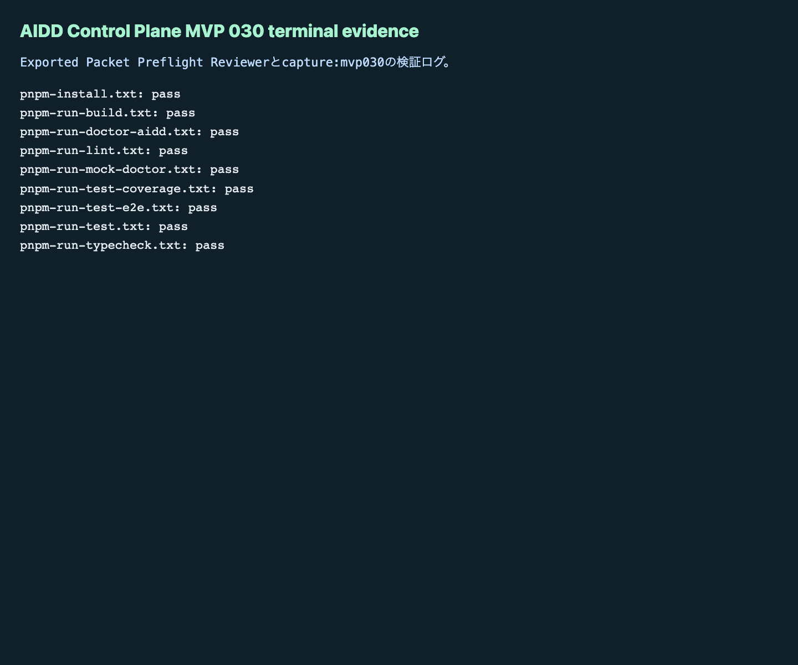

# AIDD Control Plane MVP 030：AIに渡す直前のpacketをもう一度止める

MVP 029では、Decision Ledgerで採用済みになったbundleだけを、次回AI Task Packet / Verification Plan / Codex promptへ書き出す `Adopted Bundle Exporter` を作りました。今回はその次です。exportされたpacket一式をCodexへ渡す直前に確認する **Exported Packet Preflight Reviewer** を追加しました。

## 読者の悩み

AI駆動開発では、良さそうな指示文ができた瞬間に「では次のAIへ投げよう」と進めたくなります。しかし、ここで次のような事故が起きます。

> 採用済みbundleだけを使うはずが、却下案や保留案が混ざる。Firefoxを外した浅いE2Eだけになっている。rollbackや証跡保存先が空のまま、AIへ渡してしまう。

これは、旅行前に持ち物リストを作ったのに、出発直前の確認をしないまま家を出る状態に近いです。リストがあっても、財布・チケット・薬・充電器の最終確認をしないと困ります。AI Task Packetも同じで、AIへ渡す直前の確認が必要です。

## 今回の仮説

仮説は次です。

> Adopted Bundle Exporterの出力を、次回AIへ渡す直前にpreflight reviewできれば、未採用bundle、浅い検証、Firefox除外、ローカル情報、rollback不足、証跡不足を止められる。

MVP 030では、次の確認項目を追加しました。

- packet id / source export id
- source decision status
- target file
- Markdown body
- browser projects（Chromium / Firefox / WebKit）
- verification depth
- evidence paths
- rollback plan
- AIDD-Spec connections
- local path / host / tailnet混入検出

## 実験内容

`experiments/aidd-control-plane-mvp-030/generated-repo` に、MVP 029をベースにしたNext.js + TypeScriptアプリを作りました。Codexには `Exported Packet Preflight Reviewer` の実装を依頼しましたが、600秒でタイムアウトしました。そこで、生成された差分をHermes側で独立検証し、必要なログと画像証跡を保存しました。

今回もCodexの自己申告ではなく、個別コマンドの結果を証跡にしています。

```text
Adopted Bundle Exporter
  -> Exported Packet Preflight Reviewer
  -> 次回Codex実行へ渡してよいpacketだけを残す
```

## 画面キャプチャ

### empty / initial：まだpreflight対象がない状態



empty状態では、まだpreflight対象のexported packetがないことを表示します。ここで重要なのは、空の画面でも「先にexporter validまで進める」という次の行動が見えることです。

### filled / valid：AIへ渡してよいpacketだけが揃った状態



valid状態では、採用済みbundle由来のpacketだけが並びます。Chromium / Firefox / WebKitの3ブラウザ、標準的な検証深度、rollback plan、evidence path、AIDD-Spec接続が同じ場所で確認できます。

### failure：危険なpacketを止める状態



failure状態では、却下bundle混入、Firefox除外、浅い検証、local path / host / tailnet混入、rollback不足、evidence不足、AIDD-Spec接続不足をReview Findingとして表示します。便利な自動実行より、まず止めるべきものを止める設計です。

### terminal evidence：実際に通した検証ログ



記事に載せるための主張ではなく、実際に実行した一次情報としてterminal evidenceを残しました。

## 失敗 / 修正

今回の失敗は、Codex実装が600秒でタイムアウトしたことです。ただし、差分は十分に生成されていたため、Hermes側で独立検証へ進めました。

もう1つの注意点は、capture時にdev serverのログへローカルURLが出ることです。公開用のterminal logとterminal evidence画像では、ローカルパスやhost名を `WORKSPACE` / `LOCAL_NETWORK` へ置換しました。

## 検証ログ

```text
pnpm install --frozen-lockfile: pass
pnpm run lint: pass
pnpm run typecheck: pass
pnpm run test: pass（61 tests）
pnpm run test:coverage: pass（src/lib/intake.ts lines 94.73%）
pnpm run build: pass（Next.js ESLint plugin警告あり）
pnpm run test:e2e: pass（Chromium / Firefox / WebKit、84 tests）
pnpm run doctor:aidd: pass
pnpm run mock:doctor: pass
pnpm run capture:mvp030: pass
```

## 読者が使えるチェックリスト

| チェック項目 | 何を確認したいのか | なぜ必要か |
| --- | --- | --- |
| 未採用bundle混入を止める | rejected / deferred / undecidedが次回AI依頼に入っていないか | 一度却下した案をAIが再利用してしまうのを防ぐため |
| Firefoxを含める | ChromiumだけのE2Eに落ちていないか | 3ブラウザで崩れる差分を早く見つけるため |
| 浅い検証を止める | `pnpm run test` だけで完了扱いにしていないか | UI・build・doctor・E2Eまで含めた完了条件を守るため |
| local path / host / tailnetを検出する | 公開できない環境情報が混ざっていないか | note・GitHub・artifactへ不要な情報を出さないため |
| rollback planを確認する | 失敗時に何を戻すか書かれているか | AI差分を安全に試すため |
| evidence pathを確認する | どのログ・画像・reportを残すか決まっているか | 後から「本当に検証したか」を追えるようにするため |
| AIDD-Spec接続を確認する | AI Task Packet / Verification Evidence / Review Record / Learning Log / Rollback Planへつながっているか | 単なるプロンプトではなく、再現可能な開発フローにするため |

## SaaS / AIDD-Specへの接続

MVP 030で、AIDD Control Planeの差分レビュー後半は次の形になりました。

```text
Diff Bundle Decision Ledger
  -> Adopted Bundle Exporter
  -> Exported Packet Preflight Reviewer
  -> 次回AI実行
```

AIDD Control Planeは「別のコード生成AI」ではなく、AIへ渡す材料を整え、検証できる状態にするSaaSです。MVP 030は、AIへ渡す直前の最後の持ち物チェックにあたります。

noteで読まれる記事にするうえでも、強いのはAI量産記事ではありません。実際に作り、壊れ、直し、検証ログとスクリーンショットを残した一次情報です。

## 次回

次は、preflightでvalidになったpacketを実際のCodex run queueへ積む前の **Run Authorization Gate** を作るのが自然です。誰が、どのpacketを、どの検証条件でAIに渡してよいと判断したのかを、さらに明確にします。
