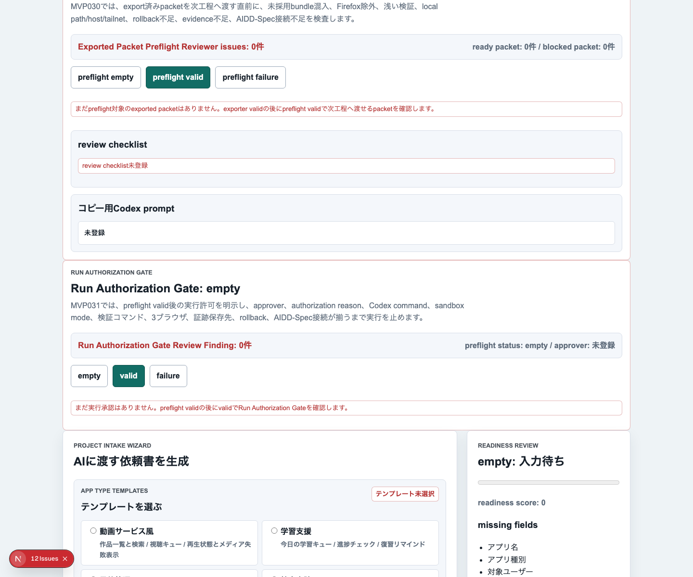
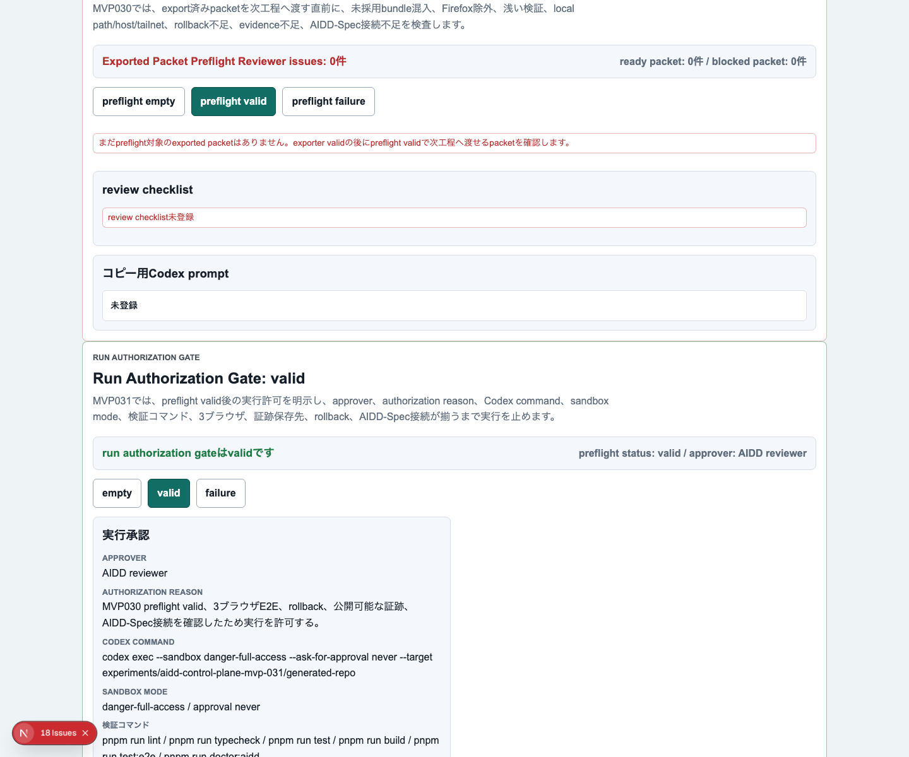
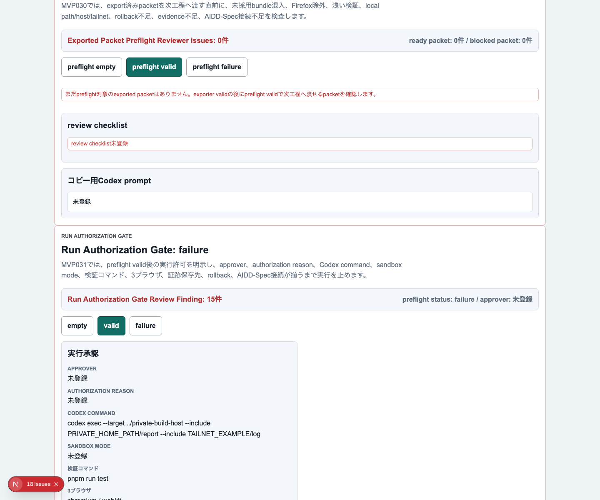
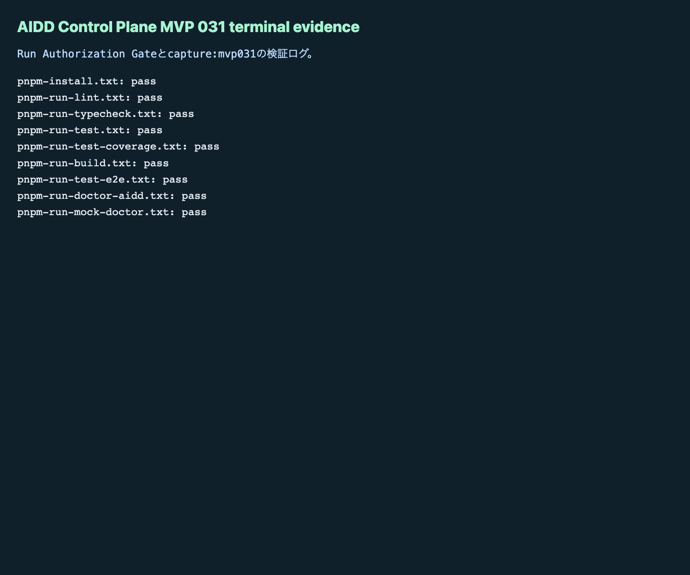

# AIDD Control Plane MVP 031：AI実行の直前に「誰が許可したか」を残す

MVP 030では、export済みpacketをCodexへ渡す直前に確認する `Exported Packet Preflight Reviewer` を作りました。今回はその次です。preflightでvalidになったpacketを、実際のCodex run queueへ積む前に止める **Run Authorization Gate** を追加しました。

## 読者の悩み

AI駆動開発では、良いAI Task PacketとCodex promptができたあとに、最後の事故が起きます。

> 「preflightは通ったはず」と思って実行したが、誰が承認したのか、どの検証条件で実行してよいと判断したのか、失敗時にどこへ戻すのかが残っていない。

これは、旅行前の持ち物チェックを終えたあと、最終的に「この便で出発してよい」と確認した人と条件を残さない状態に近いです。持ち物リストが正しくても、出発許可の記録がないと、後から「なぜこの判断で進めたのか」を説明できません。

## 今回の仮説

仮説は次です。

> preflight validなpacketでも、Codex実行前にapprover、authorization reason、Codex command、sandbox mode、検証コマンド、3ブラウザ、証跡保存先、rollback、AIDD-Spec接続を確認すれば、AI実行の判断をReview Recordとして残せる。

MVP 031では、次の項目をRun Authorization Gateで確認します。

- preflight status
- approver
- authorization reason
- Codex command
- sandbox mode
- required verification commands
- browser projects（Chromium / Firefox / WebKit）
- evidence path
- rollback plan
- AIDD-Spec connections

## 実験内容

`experiments/aidd-control-plane-mvp-031/generated-repo` に、MVP 030をベースにしたNext.js + TypeScriptアプリを作りました。CodexにはRun Authorization Gateの型、評価関数、UI、Vitest、Playwright E2E、capture script、doctor更新を依頼しました。

今回もCodexの自己申告は採用せず、Hermes側で個別コマンドを実行し、terminal logとスクリーンショットを保存しました。

```text
Exported Packet Preflight Reviewer
  -> Run Authorization Gate
  -> Codex run queueへ積む前の実行許可
```

## 画面キャプチャ

### empty / initial：まだ実行承認がない状態



empty状態では、まだ実行承認がないことを表示します。ここで重要なのは、「preflight validの後にRun Authorization Gateを確認する」という次の行動が見えることです。

### filled / valid：実行してよい条件がそろった状態



valid状態では、approver、authorization reason、Codex command、sandbox mode、検証コマンド、Chromium / Firefox / WebKit、証跡保存先、rollback、AIDD-Spec接続を同じ場所で確認できます。

### failure：実行前に止める状態



failure状態では、preflight failure、承認者不足、理由不足、危険なcommand、Firefox除外、浅い検証、local path / host / tailnet / private network URL混入、evidence path不足、rollback不足、AIDD-Spec接続不足をReview Findingとして表示します。

### terminal evidence：実際に通した検証ログ



記事に載せるための飾りではなく、実際に実行した一次情報としてterminal evidenceを残しました。

## 失敗 / 修正

今回の失敗は、最初のdev server起動で `pnpm run dev -- --hostname 127.0.0.1 --port 3030` を使ったところ、Next.jsが `--hostname` をプロジェクトディレクトリとして解釈して終了したことです。修正として `pnpm exec next dev -H 127.0.0.1 -p 3030` に切り替え、captureを実行しました。

もう1つの注意点は、capture script内のterminal evidence生成でローカルパスやネットワーク名を公開用に置換することです。公開する記事・preview・画像には、環境依存の情報を残さない方針を継続しました。

## 検証ログ

```text
pnpm install --frozen-lockfile: pass
pnpm run lint: pass
pnpm run typecheck: pass
pnpm run test: pass
pnpm run build: pass
pnpm run test:e2e: pass（Chromium / Firefox / WebKit）
pnpm run doctor:aidd: pass
pnpm run mock:doctor: pass
pnpm run capture:mvp031: pass
```

## 読者が使えるチェックリスト

| チェック項目 | 何を確認したいのか | なぜ必要か |
| --- | --- | --- |
| preflight validだけを進める | preflight failureや未確認packetを実行していないか | AIに渡す直前の品質確認を飛ばさないため |
| approverを残す | 誰が実行してよいと判断したか | 後から判断の責任と文脈を追えるようにするため |
| authorization reasonを書く | なぜ実行してよいのか | 「なんとなく実行」を減らし、レビュー可能にするため |
| Codex commandを確認する | どのcommandを実行するか、危険なtarget pathがないか | 意図しない場所への変更や実行を防ぐため |
| sandbox modeを確認する | 実行権限とリスクを理解しているか | 強い権限で動かす場合の判断を明示するため |
| Firefoxを含める | ChromiumだけのE2Eに落ちていないか | 3ブラウザで壊れるUI差分を見逃さないため |
| shallow verificationを止める | `pnpm run test` だけで完了扱いにしていないか | lint/typecheck/build/E2E/doctorまで含めた完了条件を守るため |
| evidence pathを確認する | ログと画像の保存先が決まっているか | 後で「本当に検証したか」を確認できるようにするため |
| rollback planを確認する | 失敗時に何を戻すか | AI実行の失敗を次回改善へ戻すため |
| local path / host / tailnetを検出する | 公開できない環境情報が混ざっていないか | noteやGitHubへ不要な情報を出さないため |

## SaaS / AIDD-Specへの接続

MVP 031で、AIDD Control Planeの「次のAI実行へ進める」直前の流れは次の形になりました。

```text
Adopted Bundle Exporter
  -> Exported Packet Preflight Reviewer
  -> Run Authorization Gate
  -> Codex run queue
```

AIDD Control Planeは、別のコード生成AIではありません。AIへ渡す材料を整え、検証できる条件をそろえ、実行判断を証跡として残すSaaSです。MVP 031は、AI実行前の「最後に誰がOKしたか」を残す部品です。

noteで読まれる記事にするうえでも、強いのはAI量産記事ではありません。実際に作り、失敗し、直し、ログとスクリーンショットを残した一次情報です。

## 次回

次は、Run Authorization Gateでvalidになった実行許可を、実際の **Codex Run Queue** として並べるのが自然です。実行待ち、実行中、成功、失敗、証跡不足を同じ画面で見えるようにすると、AIDD Control PlaneがよりSaaSらしい操作体験に近づきます。
