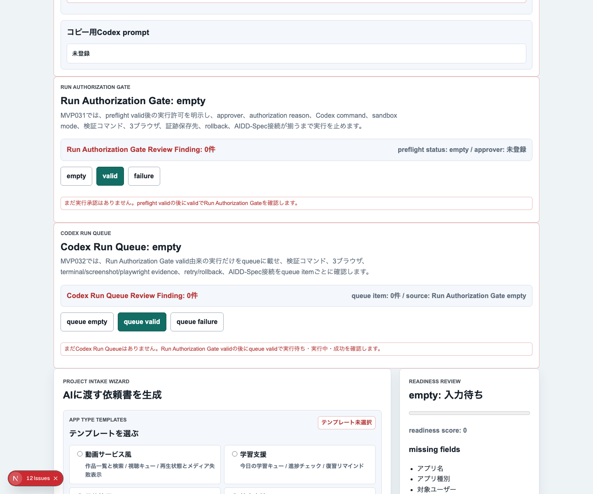
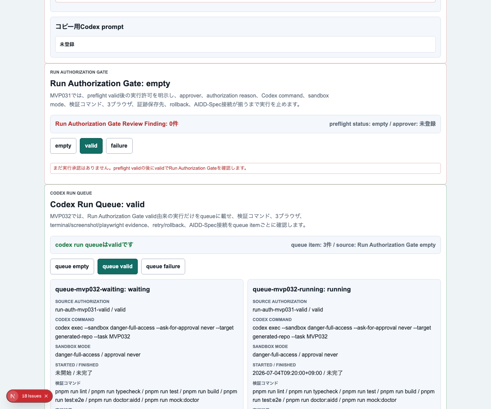
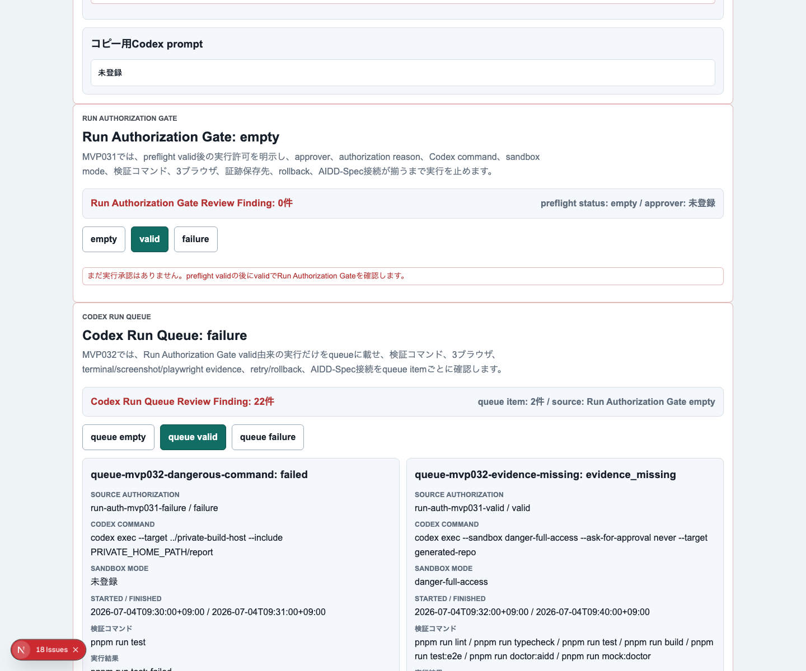
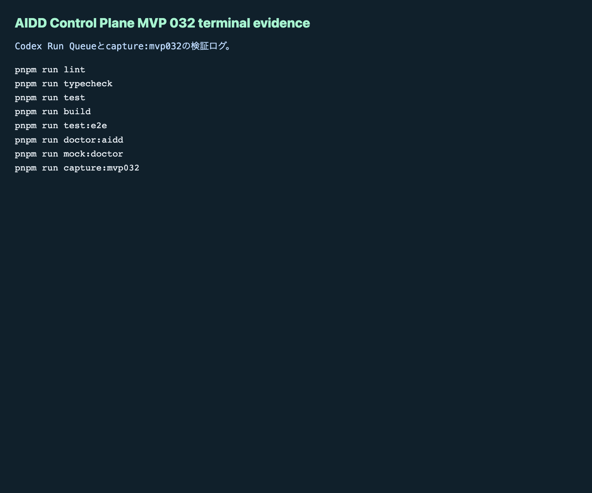

# AIDD Control Plane MVP 032：Codex実行をQueueとして追跡する

> 2026-07-04 / Codex Mastery Lab  
> 記事種別: Experiment / SaaS  
> 将来の書籍章: 第9章 AI Task Packet、第10章 Verification Evidence、第11章 Learning Log、第18章 AIDD Control PlaneのMVP

## タイトル案

Codexに「実行してよい」と言った後を迷子にしない：Run QueueをVerification Evidenceへつなぐ

## 今日の問い

MVP 031では、Codexを動かす直前に **Run Authorization Gate** を置きました。つまり、preflight validなpacketについて、誰が、どの理由で、どの検証条件で実行を許可したのかを残す画面です。

ただし、ここで終わるとまだ弱いです。実行前の承認が残っていても、実際にCodexをqueueへ積んだ後に、次の情報が散らばるからです。

- 実行待ちなのか、実行中なのか、終わったのか
- 成功したのか、失敗したのか、証跡だけ不足しているのか
- lint / typecheck / test / build / E2E / doctorを本当に実行したのか
- Chromium / Firefox / WebKitの3ブラウザを維持したのか
- terminal log、screenshot、Playwright reportはどこにあるのか
- 失敗時にretryするのか、rollbackするのか
- その結果をReview Record / Learning Logへどう戻すのか

今日の問いは次です。

> Run Authorization GateでvalidになったCodex実行を、Codex Run Queueとして追跡すれば、実行後の証跡不足や失敗をReview Record / Learning Logへ戻しやすくなるか。

## 前回の振り返り

前回のMVP 031では、`Exported Packet Preflight Reviewer` の後に `Run Authorization Gate` を追加しました。

```text
Adopted Bundle Exporter
  -> Exported Packet Preflight Reviewer
  -> Run Authorization Gate
  -> Codex run queue
```

MVP 031で分かったことは、AI Task PacketやCodex promptの中身が良くても、「最後に誰がOKしたのか」が残っていないと後から説明できない、ということでした。

これは旅行の持ち物リストに近いです。荷物がそろっていても、最終的に「この便で出発してよい」と判断した人と条件が残っていないと、トラブル時に振り返れません。

今回のMVP 032では、その次の段階として、実行許可されたものを実際にqueueへ載せた後の状態を扱います。

## 今回やること

今回は、`experiments/aidd-control-plane-mvp-032/generated-repo` にMVP 031をコピーし、Codex CLIへ日本語プロンプトを渡して、AIDD Control Planeに **Codex Run Queue** を追加しました。

実装対象は次です。

1. `src/lib/intake.ts` に `CodexRunQueueItem`、sample factory、評価関数を追加する
2. UIに `Codex Run Queue` セクションを追加する
3. empty / valid / failure を切り替えるボタンを追加する
4. Vitest / Playwright E2E / doctor / capture script を更新する
5. 実行ログとスクリーンショットを証跡として保存する

今回の監査カテゴリは次の3つに絞りました。

| 監査カテゴリ | 見たいこと |
| --- | --- |
| Operations / Maintenance | queue投入後の状態、証跡、retry、rollbackを追えるか |
| Requirement Fit | Run Authorization GateからRun Queueへ接続できているか |
| Build / Lint / Console | Next.js / TypeScript / Vitest / 3ブラウザE2Eが通るか |

## 実験環境

```text
Date: Sat Jul  4 09:00:56 JST 2026
Codex CLI: codex-cli 0.142.3
OS: macOS 26.5.1
Disk: 228Gi total / 111Gi available
Repo: codex-mastery-lab
Experiment: experiments/aidd-control-plane-mvp-032
```

## 実験計画

実験前に `PLAN.md` を作りました。

```text
# PLAN: AIDD Control Plane MVP 032 / Codex Run Queue

## 今日の問い
Run Authorization Gateでvalidになった実行許可を、Codex Run Queueとして並べると、実行待ち・実行中・成功・失敗・証跡不足をAI実行の前後でレビューできるか。

## 後工程からの逆算
- 後工程: Review Record / Learning Log / Verification Evidenceが、どのCodex実行がどの状態で終わったかを必要とする。
- 欠陥仮説: 実行許可だけでは、queue投入後の状態、ログ、artifact、retry、rollbackが散らばる。
- 逆算される前工程: AI Task Packetに queue item id、source authorization id、status model、required evidence、retry/rollback policy を含める。
```

ここで重要なのは、今回も「こういうSaaS画面が欲しい」から始めていないことです。後工程であるReview Record / Learning Log / Verification Evidenceが何を必要とするかから逆算しました。

## 実際にCodexへ渡した日本語プロンプト

今回のプロンプトは `experiments/aidd-control-plane-mvp-032/PROMPT_JA.md` に保存しました。抜粋ではなく、実際に渡した原文です。

```text
あなたはCodex Mastery Labの実装担当です。既存のAIDD Control Plane MVP031をベースに、MVP032として「Codex Run Queue」を追加してください。

制約:
- 作業範囲はこのgenerated-repo内だけ。
- UI文言、テスト名、サンプルデータは日本語中心。
- 既存のRun Authorization Gateを壊さず、その次の段階として表示する。
- 重い依存は追加しない。

実装したい内容:
1. src/lib/intake.ts に CodexRunQueueItem / Review / sample factory / evaluate関数を追加する。
   - queue itemは sourceAuthorizationId, status(waiting/running/succeeded/failed/evidence_missing), codexCommand, sandboxMode, startedAt/finishedAt, requiredVerificationCommands, actualVerificationResults, browserProjects, evidencePaths, retryPolicy, rollbackPlan, reviewFindings, aiddSpecConnections を持つ。
   - valid sampleは waiting/running/succeeded を含み、failure sampleは failed/evidence_missing/危険command/Firefox除外/浅い検証/証跡不足/rollback不足を含む。
   - evaluateは「Run Authorization Gate valid由来か」「危険なcommandでないか」「Chromium/Firefox/WebKitを含むか」「lint/typecheck/test/build/test:e2e/doctor:aidd/mock:doctorがあるか」「terminal/screenshot/playwright evidenceがあるか」「retry/rollbackがあるか」「AIDD-Spec接続があるか」をfinding化する。
2. UI(app/page.tsx等)にMVP032見出しとCodex Run Queueセクションを追加する。
   - empty/valid/failureを切り替えるボタンを用意する。
   - validでは実行待ち・実行中・成功のqueueカード、検証コマンド、3ブラウザ、証跡、retry/rollback、AIDD-Spec接続を見せる。
   - failureでは失敗・証跡不足・危険command・Firefox除外・浅い検証などをReview Findingとして見せる。
3. VitestとPlaywright E2EをMVP032に合わせて追加/更新する。
4. doctor:aidd / mock:doctorに必要ならMVP032チェックを追加する。
5. capture scriptを追加し package.json に capture:mvp032 を追加する。assets相当のスクリーンショットを empty/valid/failure/terminal evidence で保存できるようにする。
6. READMEやdocsがあればMVP032の説明を短く更新する。

完了条件:
- pnpm run lint / typecheck / test / build / test:e2e / doctor:aidd / mock:doctor が通る想定の実装にする。
- 変更後に自分で軽い確認コマンドを実行し、結果を要約してください。
```

Codex CLIの実行コマンドは次です。

```bash
codex exec --sandbox danger-full-access "Please read ../PROMPT_JA.md and implement it. Work only in this generated-repo. Save a concise summary of checks you ran in ../artifacts/aidd-control-plane-mvp-032/terminal/codex-summary.txt."
```

日本語本文を直接CLI引数に入れると、実行環境のセキュリティスキャンがconfusable文字として止めることがありました。そのため、プロンプト本文はMarkdownへ保存し、Codexには「そのファイルを読んで実装して」と依頼しました。これは失敗ではなく、cron実行環境で安全に長い日本語プロンプトを扱うための運用メモです。

## Codex実行で起きたこと

Codexは実装を進めましたが、最後に自分で `pnpm run build` を確認するところで600秒timeoutしました。

```text
codex exec ...
...
もう一度 `.next` を消して build を確認します。
exec
/bin/zsh -lc 'rm -rf .next && pnpm run build'

[Command timed out after 600s]
```

ここでCodexの自己申告を採用せず、Hermes側で個別に品質ゲートを実行し直しました。AI駆動開発で大事なのは「AIが通ったと言った」ではなく、「こちらの環境で本当に通ったログがある」ことです。

## 画面キャプチャ

### empty：まだqueueがない状態



empty状態では、Run Authorization Gate validの後にqueue validで実行待ち・実行中・成功を確認する、という次の行動を明示しました。

### valid：実行待ち・実行中・成功を並べる



valid状態では、次の3つのqueue itemを表示します。

- `queue-mvp032-waiting: waiting`
- `queue-mvp032-running: running`
- `queue-mvp032-succeeded: succeeded`

それぞれに、Codex command、sandbox mode、required verification commands、actual results、3ブラウザ、証跡パス、retry policy、rollback plan、AIDD-Spec接続を持たせました。

### failure：実行後に止めるべき状態



failure状態では、次のようなReview Findingを表示します。

- Run Authorization Gate valid由来でない
- 危険なcommand
- Firefox除外
- 浅い検証
- screenshot evidence不足
- playwright evidence不足
- rollback不足
- AIDD-Spec接続不足

実行前に止めるのがMVP 031、実行後の状態と証跡不足を止めるのがMVP 032、という責務分担です。

### 操作GIF：empty→valid→failure


記事用には、empty、valid、failureの3画面を人間が確認する順番で見られるGIFも作りました。

### terminal evidence



capture scriptでは、terminal evidence画像も生成しました。公開用にローカルパスやホスト名は置換しています。

## 実行した品質ゲート

Hermes側で実行した結果は次です。

```text
pnpm run lint: pass
pnpm run typecheck: pass
pnpm run test: pass（63 tests）
pnpm run test:coverage: pass
pnpm run build: pass
pnpm run test:e2e: pass（90 tests / Chromium, Firefox, WebKit）
pnpm run doctor:aidd: pass
pnpm run mock:doctor: pass
pnpm run capture:mvp032: pass
```

E2Eの対象ブラウザはChromium / Firefox / WebKitです。

```text
Running 90 tests using 1 worker
...
90 passed (1.9m)
```

buildでは次の警告が出ました。

```text
⚠ The Next.js plugin was not detected in your ESLint configuration.
```

これは既存構成から続いているESLint plugin検出警告です。今回のMVP 032の機能検証は通りましたが、次回以降の整備候補として残します。

## 生成・更新された主なファイル

```text
experiments/aidd-control-plane-mvp-032/PLAN.md
experiments/aidd-control-plane-mvp-032/PROMPT_JA.md
experiments/aidd-control-plane-mvp-032/generated-repo/src/lib/intake.ts
experiments/aidd-control-plane-mvp-032/generated-repo/app/page.tsx
experiments/aidd-control-plane-mvp-032/generated-repo/tests/intake.test.ts
experiments/aidd-control-plane-mvp-032/generated-repo/e2e/intake-wizard.spec.ts
experiments/aidd-control-plane-mvp-032/generated-repo/scripts/capture-mvp032.mjs
experiments/aidd-control-plane-mvp-032/generated-repo/scripts/doctor-aidd.mjs
assets/aidd-control-plane-mvp032-empty.png
assets/aidd-control-plane-mvp032-valid.png
assets/aidd-control-plane-mvp032-failure.png
assets/aidd-control-plane-mvp032-terminal-evidence.png
```

## 監査結果

```yaml
findings:
  - category: Operations / Maintenance
    finding: 実行許可だけでは、Codex実行後の状態、証跡、retry、rollbackがReview Recordへ戻らない
    severity: high
    observed_by: MVP031からMVP032への逆算
    ideal_state: Run Authorization Gate valid由来のCodex実行をqueue itemとして追跡し、waiting/running/succeeded/failed/evidence_missingを表示する
    fix_instruction: Codex Run Queueにsource authorization id、status、required/actual verification、browser projects、evidence paths、retry policy、rollback plan、AIDD-Spec connectionsを持たせる
    needed_upstream_info:
      - Run Authorization Gate
      - Verification Evidence
      - Review Record
      - Learning Log
      - Rollback Plan
    standard_update:
      document: standards/aidd-control-plane-mvp-v0.1.md
      field: MVP機能 / Codex Run Queue
    codex_prompt_delta: |
      Codex実行を承認した後は、queue itemとして実行待ち・実行中・成功・失敗・証跡不足を追跡し、terminal/screenshot/playwright evidence、retry policy、rollback plan、AIDD-Spec接続をReview Findingへ戻してください。
    verification:
      command: pnpm run test:e2e
      expected: Chromium / Firefox / WebKitでCodex Run Queueのempty/valid/failureが通る
```

## 後工程から前工程へ逆算したこと

今回の欠陥は「実行許可はあるが、実行後の状態が散らばる」でした。そこから逆算すると、AI Task PacketやRun Authorization Gateに次の情報が必要です。

| 後工程で困ること | 前工程で渡すべき情報 | AIDD-Spec成果物 |
| --- | --- | --- |
| どの承認から実行されたか分からない | source authorization id | Review Record / Run Authorization Gate |
| 成功・失敗・証跡不足が混ざる | status model: waiting/running/succeeded/failed/evidence_missing | Verification Evidence |
| E2EがChromiumだけになる | browser projects: Chromium / Firefox / WebKit | AI Task Packet / Verification Plan |
| ログだけで画像やPlaywright reportがない | terminal/screenshot/playwright evidence paths | Verification Evidence |
| 失敗時に再実行条件が曖昧 | retry policy | Maintenance Runbook |
| 戻し方がない | rollback plan | Rollback Plan |
| 学びが次回に戻らない | AIDD-Spec connections / Learning Log target | Learning Log |

つまり、Codexに最初から渡すAI Task Packetには、実装内容だけでなく、実行queueで必要になる識別子と証跡要件も含めるべきです。

## AIDD-Specへの反映

`standards/aidd-control-plane-mvp-v0.1.md` に `Codex Run Queue` を追加しました。

```text
Codex Run Queue:
Run Authorization Gateで承認されたCodex実行を、実行待ち・実行中・成功・失敗・証跡不足として追跡し、Verification Evidence / Review Record / Learning Logへ戻す。
```

これでAIDD Control Planeの流れは次のようになりました。

```text
Adopted Bundle Exporter
  -> Exported Packet Preflight Reviewer
  -> Run Authorization Gate
  -> Codex Run Queue
  -> Verification Evidence / Review Record / Learning Log
```

## SaaS化した場合の機能仮説

AIDD Control PlaneがSaaSになる場合、Codex Run Queueは単なるジョブ一覧ではありません。次のような役割を持ちます。

- 承認済みpacketだけをqueueへ入れる
- 実行中のログをVerification Evidenceに紐づける
- 失敗したjobをReview Findingへ分類する
- 証跡不足だけのjobを「成功」扱いにしない
- retry policyに沿って再実行可否を出す
- rollback planがない実行を危険扱いにする
- 学びを次回AI Task Packet deltaへ戻す

AIにコードを書かせるSaaSではなく、AI実行の入力、承認、実行状態、検証証跡、学習ログを束ねるSaaSです。

## 今回の学び

1. **実行許可と実行結果は別物**  
   Run Authorization Gateがvalidでも、queue投入後の失敗や証跡不足は起きます。

2. **成功と証跡不足を分ける必要がある**  
   コマンドが通っても、terminal log、screenshot、Playwright reportが揃わなければ、公開記事や監査には弱いです。

3. **3ブラウザE2Eはqueue itemの属性にするべき**  
   E2E設定ファイルに書くだけではなく、queue item上でもChromium / Firefox / WebKitを表示することで、浅い検証を見つけやすくなります。

4. **Codex自身のtimeoutは記事価値になる**  
   今回、Codexは最後のbuild確認でtimeoutしました。そこで止まらず、Hermes側で個別検証を走らせ、実ログを残しました。この「AIの作業をAIの自己申告で終えない」姿勢がAIDD-Specの中心です。

## 明日から使えるチェックリスト

- [ ] Codex実行前にRun Authorization Gateで承認者、理由、command、sandbox、検証条件を残したか
- [ ] queue itemにsource authorization idがあるか
- [ ] statusがwaiting/running/succeeded/failed/evidence_missingで分かれているか
- [ ] required verification commandsにlint/typecheck/test/build/E2E/doctor/mock doctorがあるか
- [ ] Chromium / Firefox / WebKitがqueue itemに明記されているか
- [ ] terminal/screenshot/playwright evidenceの保存先があるか
- [ ] retry policyとrollback planがあるか
- [ ] Review FindingをLearning Logと次回AI Task Packet deltaへ戻せるか

## 次回予告

次は、Codex Run Queueの結果を **Verification Evidence Run Detail** として掘り下げるのが自然です。queue itemごとに、各コマンドの開始時刻、終了時刻、exit code、artifact path、失敗時の分類を持たせると、AIDD Control Planeがより実運用に近づきます。

## 付録: 生ログ / 参照ファイル

- Experiment path: `experiments/aidd-control-plane-mvp-032`
- Codex prompt: `experiments/aidd-control-plane-mvp-032/PROMPT_JA.md`
- Terminal logs: `experiments/aidd-control-plane-mvp-032/artifacts/aidd-control-plane-mvp-032/terminal/`
- Screenshots: `assets/aidd-control-plane-mvp032-*.png`
- Standard updated: `standards/aidd-control-plane-mvp-v0.1.md`
