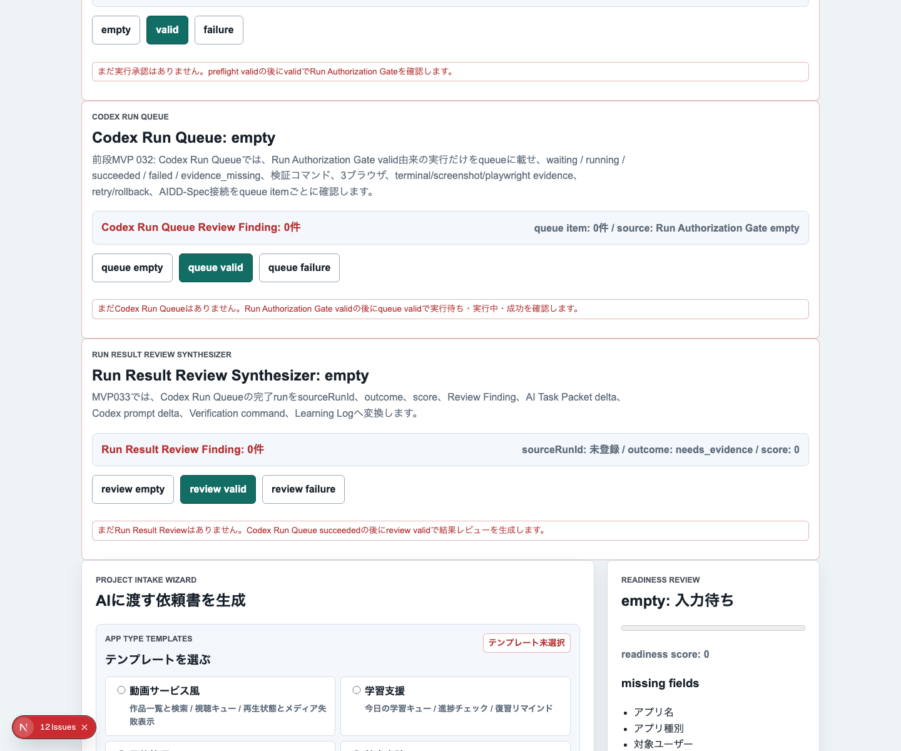
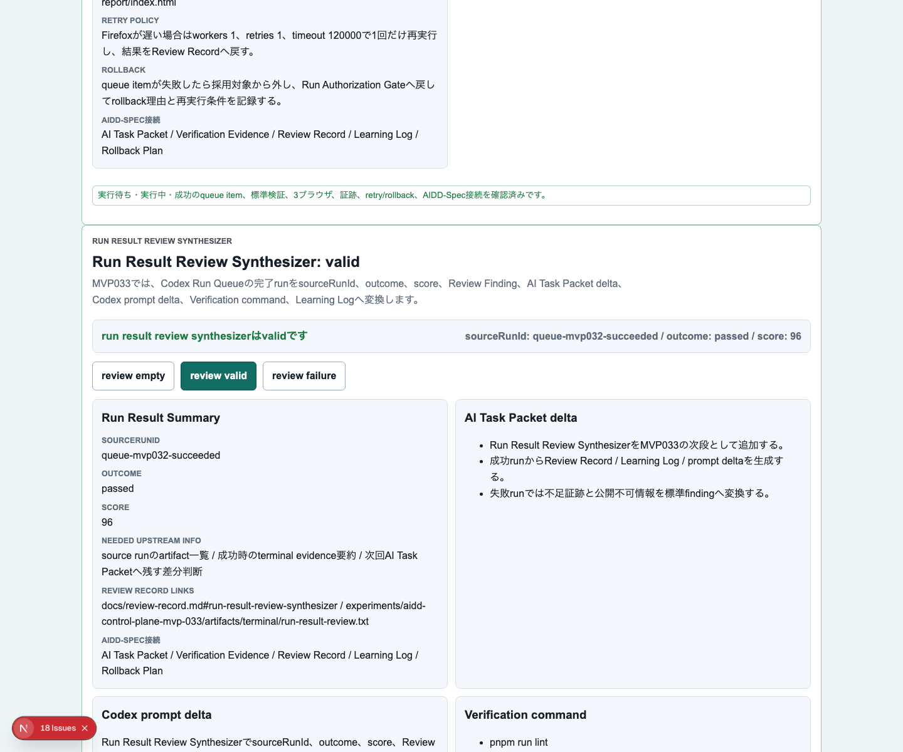
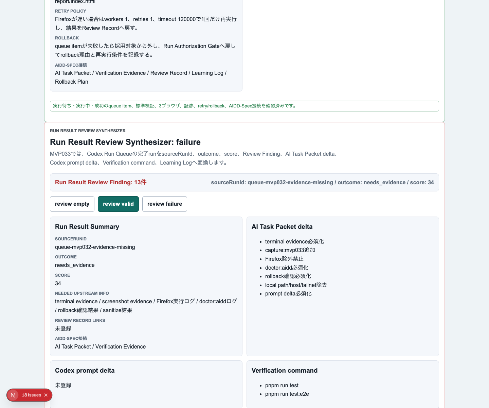
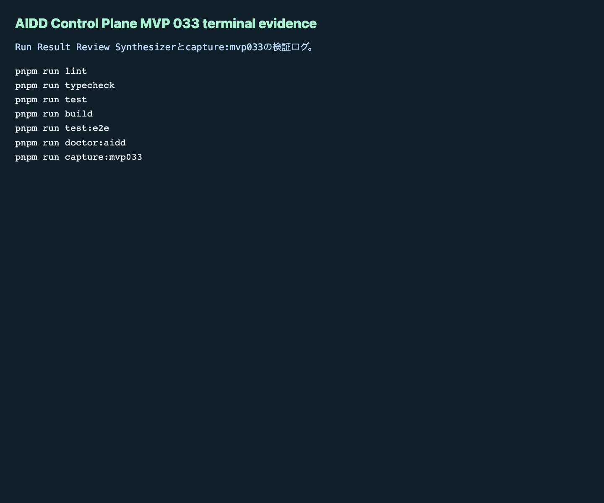

# AIDD Control Plane MVP 033：実行結果を次回AI指示へ戻す

> 2026-07-04 / Codex Mastery Lab  
> 記事種別: Experiment / SaaS  
> 将来の書籍章: 第10章 Verification Evidence、第11章 Learning Log、第18章 AIDD Control PlaneのMVP

## 読者の悩み

AIに実装を任せると、最後にこうなりがちです。

- 「テストは通りました」と言われたが、どのログを見ればよいか分からない
- 失敗したとき、次にAIへ何を頼めばよいか分からない
- スクリーンショット、Playwright report、terminal logが別々に散らばる
- 成功した回でも、次回に引き継ぐ学びが残らない

MVP 032では、Codex実行を **Run Queue** として追跡しました。今回はその次です。実行結果を読んで、Review Record、Learning Log、AI Task Packet delta、Codex prompt deltaへ戻すところまでをSaaS画面にしました。

## 今回の仮説

> Codex Run Queueの結果を、標準Review Finding形式へ合成できれば、ユーザーは「ログを眺める」だけで終わらず、次回AIへ渡す改善指示まで作れる。

料理で言えば、食べ終わったあとに「次は塩を少なめ」「火を弱める」「この材料は先に切る」とメモして、次のレシピへ戻す作業です。AI駆動開発でも、成功/失敗を次の指示へ戻さないと、毎回同じ失敗をします。

## 実験内容

今回作ったのは **Run Result Review Synthesizer** です。

```text
Run Authorization Gate
  -> Codex Run Queue
  -> Run Result Review Synthesizer
  -> Review Record / Learning Log / AI Task Packet delta / Codex prompt delta
```

実装前に `experiments/aidd-control-plane-mvp-033/README.md`、`AI_TASK_PACKET.md`、`CODEX_PROMPT.md` を作成し、Codex CLIへ日本語プロンプトを渡しました。

主な実装は次です。

1. `RunResultReview` / `RunResultFinding` / evaluatorを追加
2. UIに `Run Result Review Synthesizer` セクションを追加
3. empty / valid / failureを切り替え可能にする
4. failureでは terminal evidence不足、screenshot不足、Firefox除外、doctor未実行、rollback未確認、local path混入、prompt delta不足を検出
5. Vitest / Playwright / doctor / capture scriptを更新

## 画面キャプチャ

### empty：まだ実行結果レビューがない



### valid：成功runをReview RecordとLearning Logへ戻す



### failure：証跡不足や公開不可情報をReview Findingへ変換



### terminal evidence



## 失敗と修正

Codex実行中、`pnpm run test:e2e` が一度600秒でtimeoutしました。ここではCodexの自己申告を採用せず、独立検証として同じコマンドを個別に再実行しました。

結果として、独立実行ではChromium / Firefox / WebKitの3ブラウザで **93 tests passed** しました。つまり、失敗はアプリ品質というよりCodex実行枠のtimeoutとして記録し、再現可能な検証ログを別途保存しました。

今回の学びは、AIDD Control Plane自身にも必要なルールです。

- AI実行ログがtimeoutしたら、timeout自体を証跡として残す
- ただし、独立検証が可能なら個別コマンドで再確認する
- 成功/失敗の分類だけでなく、次回AI Task Packetへ戻すdeltaを作る

## 検証ログ

保存先は `experiments/aidd-control-plane-mvp-033/artifacts/aidd-control-plane-mvp-033/terminal/` です。

| コマンド | 結果 |
| --- | --- |
| `pnpm install --frozen-lockfile` | pass |
| `pnpm run lint` | pass |
| `pnpm run typecheck` | pass |
| `pnpm run test` | 64 tests passed |
| `pnpm run test:coverage` | pass |
| `pnpm run build` | pass |
| `pnpm run test:e2e` | 93 tests passed / Chromium, Firefox, WebKit |
| `pnpm run doctor:aidd` | pass |
| `pnpm run mock:doctor` | pass |
| `pnpm run capture:mvp033` | pass |

`doctor:aidd` の要約です。

```text
doctor:aidd passed
checked files: 20
checked MVP: AIDD Control Plane MVP 033 Run Result Review Synthesizer
```

## 読者が使えるチェックリスト

| チェック項目 | 何を確認したいのか | なぜ必要か |
| --- | --- | --- |
| source run idがある | どのAI実行の結果か追えるか | 後からログと画面を結びつけるため |
| terminal evidenceがある | lint/typecheck/test/build/e2e/doctorの実ログがあるか | 「通ったはず」を防ぐため |
| screenshot evidenceがある | empty/valid/failureが目で確認できるか | 記事・レビュー・デモで説明できるようにするため |
| 3ブラウザE2Eを保つ | Chromium / Firefox / WebKitを除外していないか | 片方だけ動くUIを見逃さないため |
| doctor:aiddを通す | AIDD固有の必須tokenやcapture scriptがあるか | 一般テストだけでは見えない運用条件を守るため |
| rollback確認がある | 失敗時に戻す条件が残っているか | 実験を安全に続けるため |
| local path/host/private networkを除去する | 公開記事や証跡にローカル環境名が混ざっていないか | 公開可能な一次情報にするため |
| prompt deltaがある | 次回AIへ何を直させるか書けているか | 同じ失敗を繰り返さないため |

## AIDD-Spec / SaaSへの接続

今回、`standards/aidd-control-plane-mvp-v0.1.md` に `Run Result Review Synthesizer` を追加しました。

AIDD-Spec上の意味は、Verification Evidenceを集めるだけでは不十分ということです。証跡を次の標準artifactへ戻す必要があります。

- Verification Evidence: 実行ログと画像を保存する
- Review Record: 何が良く、何が不足か分類する
- Learning Log: 次回に残す学びを保存する
- AI Task Packet Delta: 次回AIへの入力を改善する
- Codex Prompt Delta: 実際の依頼文へ反映する

AIDD Control Plane SaaSとしては、ここが「ログ置き場」と「AI開発支援SaaS」の差になります。ログを保存するだけではなく、次に何を頼むべきかまで出すことが価値です。

## noteで強い一次情報とは何か

今回の記事は、AIで量産した一般論ではありません。実際にCodexを走らせ、timeoutを踏み、独立検証し、スクリーンショットを撮り、標準文書を更新しています。

noteで読まれる可能性があるのは、こうした本人しか書けない一次情報です。成功だけでなく、失敗、修正、証跡、次回の改善指示まで残すことで、読者が自分の現場へ持ち帰れる内容になります。

## 次回

次は、Run Result Reviewで作ったdeltaを、複数runの比較や採用判断へ進めるのが自然です。候補は **MVP 034: Multi-run Learning Diff** です。

成功runと失敗runを並べ、どのdeltaを標準へ採用するか、どれを保留するかを判断できるようにします。
