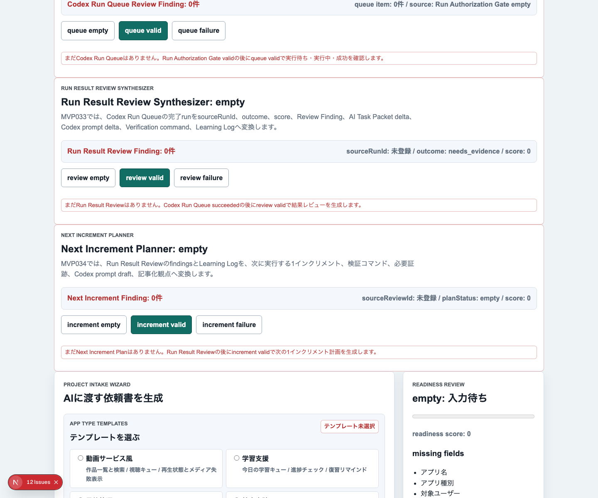
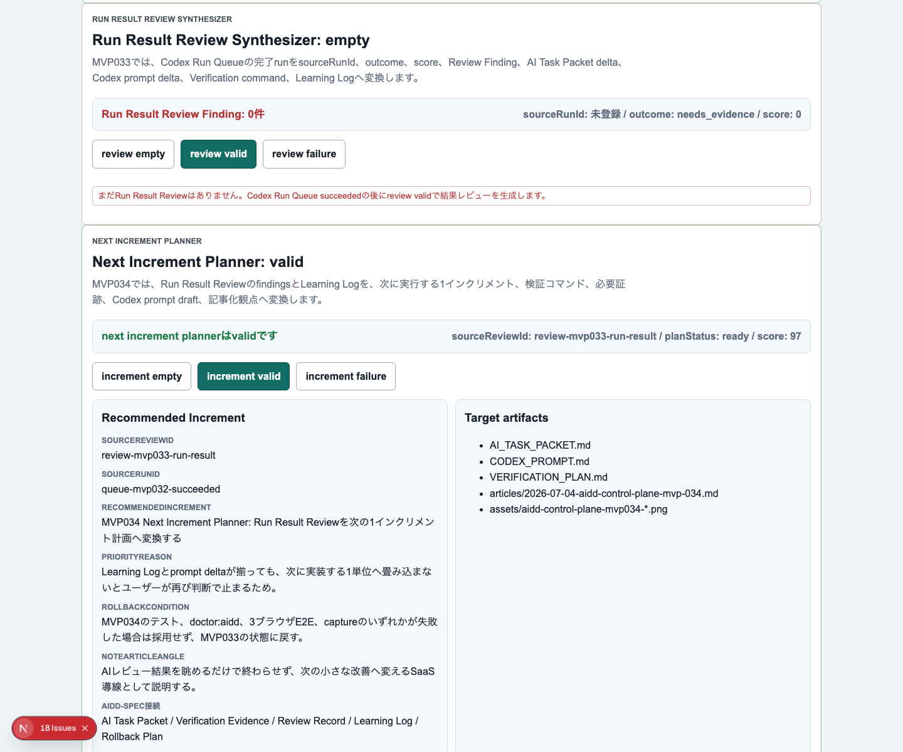
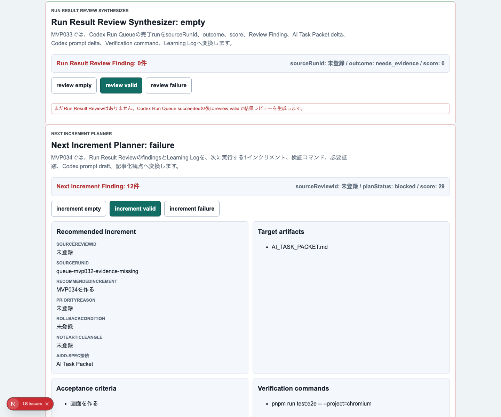
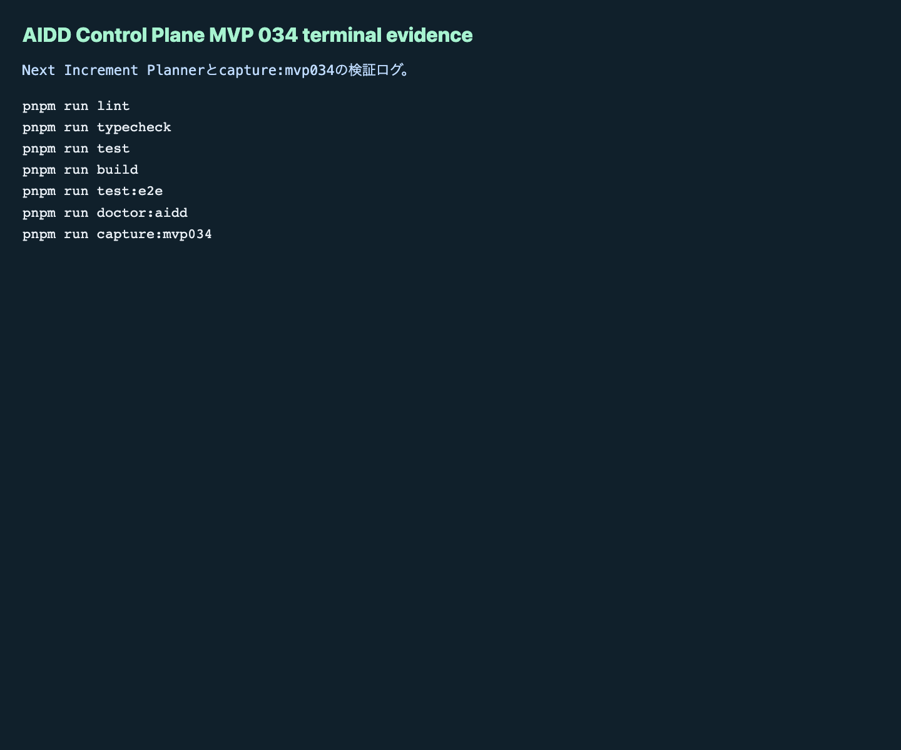

# AIDD Control Plane MVP 034：AIレビュー結果を「次の1インクリメント」へ変える

> 2026-07-04 / Codex Mastery Lab  
> 記事種別: Experiment / SaaS  
> 将来の書籍章: 第10章 Verification Evidence、第11章 Learning Log、第18章 AIDD Control PlaneのMVP

## 読者の悩み

AIに実装を任せたあと、ログやスクリーンショットを集めても、最後にこう迷いませんか。

- 失敗理由は分かったが、次に何を直すべきか分からない
- 改善点が多すぎて、次のAI依頼がまた大きくなる
- Review FindingやLearning Logを書いても、AI Task Packetへ戻らない
- note記事にできる一次情報はあるのに、どの切り口で書くか決まらない

MVP 033では、Codex Run Queueの結果を **Run Result Review Synthesizer** でReview Finding / Learning Log / prompt deltaへ戻しました。今回はその次です。レビュー結果を、次に実行する **1インクリメントだけ** の計画へ畳み込みました。

## 今回の仮説

> Run Result ReviewとLearning LogをNext Increment Planへ変換できれば、ユーザーは「分かったけど次が決まらない」状態から抜け出し、AIへ渡せる小さな改善単位を継続できる。

料理で言えば、食後の反省メモを「次回は塩を少なめにする」「焼き時間を2分短くする」のような1つの改善へ絞る作業です。反省が10個あっても、次の一皿で全部直そうとすると失敗します。AI駆動開発でも同じで、次の依頼は小さく、検証できる形にする必要があります。

## 実験内容

今回作ったのは **Next Increment Planner** です。

```text
Codex Run Queue
  -> Run Result Review Synthesizer
  -> Next Increment Planner
  -> AI_TASK_PACKET.md / CODEX_PROMPT.md / Verification Evidence / note記事
```

実装前に `experiments/aidd-control-plane-mvp-034/README.md`、`AI_TASK_PACKET.md`、`CODEX_PROMPT.md` を作成しました。Codex CLIは今回のcron環境では `codex: command not found` で起動できなかったため、その失敗ログを証跡として保存し、同じAI Task Packetに沿って手動実装と独立検証を行いました。

主な追加は次です。

1. `NextIncrementPlan` / `NextIncrementFinding` / evaluatorを追加
2. UIに `Next Increment Planner` セクションを追加
3. empty / valid / failureを切り替え可能にする
4. validでは、推奨インクリメント、優先理由、対象artifact、受け入れ条件、検証コマンド、必要証跡、Codex prompt draft、rollback条件、記事化観点を表示
5. failureでは、source review不足、priority不足、acceptance criteria不足、Firefox除外、terminal evidence不足、failure screenshot不足、rollback不足、公開不可情報混入を検出

## 画面キャプチャ

### empty：まだ次の改善単位がない



### valid：次の1インクリメントが決まっている



### failure：次回計画として危ない状態を止める



### terminal evidence



## 失敗と修正

最初の失敗はCodex実行です。cron環境では `codex` コマンドが見つからず、実装を委譲できませんでした。ここで「Codexができなかったから終了」にはせず、AI Task PacketとCodex promptを先に残し、同じ要件に沿って実装しました。

次の失敗はE2Eでした。`Learning Log links` の中で、見出しとリスト項目の両方が `Learning Log` に一致し、Playwright strict modeで失敗しました。これはアプリの状態ではなく、テストの指定が曖昧だったためです。期待値を `Learning Log: 成功/失敗を次回1インクリメントへ戻す` に絞り、Chromium / Firefox / WebKitの3ブラウザで再実行しました。

## 検証ログ

保存先は `experiments/aidd-control-plane-mvp-034/artifacts/aidd-control-plane-mvp-034/terminal/` です。

| コマンド | 結果 |
| --- | --- |
| `pnpm install --frozen-lockfile` | pass |
| `pnpm run lint` | pass |
| `pnpm run typecheck` | pass |
| `pnpm run test` | 65 tests passed |
| `pnpm run test:coverage` | pass |
| `pnpm run build` | pass |
| `pnpm run test:e2e` | 96 tests passed / Chromium, Firefox, WebKit |
| `pnpm run doctor:aidd` | pass |
| `pnpm run mock:doctor` | pass |
| `pnpm run capture:mvp034` | pass |

`doctor:aidd` の要約です。

```text
doctor:aidd passed
checked files: 21
checked MVP: AIDD Control Plane MVP 034 Next Increment Planner
```

## 読者が使えるチェックリスト

| チェック項目 | 何を確認したいのか | なぜ必要か |
| --- | --- | --- |
| source review idがある | どのレビュー結果から次回計画を作ったか | 学びの出どころを追えるようにするため |
| 1インクリメントに絞る | 次回AI依頼が大きすぎないか | 改善と検証を小さく完了させるため |
| priority reasonを書く | なぜこの改善を先にやるのか | 後から判断を見直せるようにするため |
| acceptance criteriaを書く | 何ができたら完了か | 「雰囲気で良さそう」を防ぐため |
| 3ブラウザE2Eを残す | FirefoxやWebKitを除外していないか | 片方だけ動くUIを見逃さないため |
| required evidenceを書く | terminal、empty/valid/failure画像、preview確認があるか | 記事化とレビューに使える一次情報にするため |
| rollback conditionを書く | 失敗時に採用を止める条件があるか | 自動化しても危険な変更を止めるため |
| local path/host/tailnetを除去する | 公開不可情報が混ざっていないか | 公開可能な記事と証跡にするため |

## AIDD-Spec / SaaSへの接続

今回、`standards/aidd-control-plane-mvp-v0.1.md` に `Next Increment Planner` を追加しました。

AIDD Control Planeは、単にAIへコードを書かせる画面ではありません。今回の価値は、レビュー結果を次の小さな実行単位へ戻すことです。

- Review Record: 何が不足しているかを分類する
- Learning Log: 次回に持ち越す学びを残す
- Next Increment Planner: 学びを1つの実行計画へ絞る
- AI Task Packet / Codex prompt: 次のAI依頼へ渡す
- Verification Evidence: 実行後にまた証跡を残す

この循環ができると、AI駆動開発は「毎回リセット」ではなく、少しずつ良くなる手順になります。

## 次回

次は、Next Increment Planを実際のIssue / queue / packet更新へ渡す手前で、どの計画を採用するか、誰が承認したか、どの証跡を添付したかをさらに明確にします。候補は **Increment Execution Brief / Next Run Packet Composer** です。
