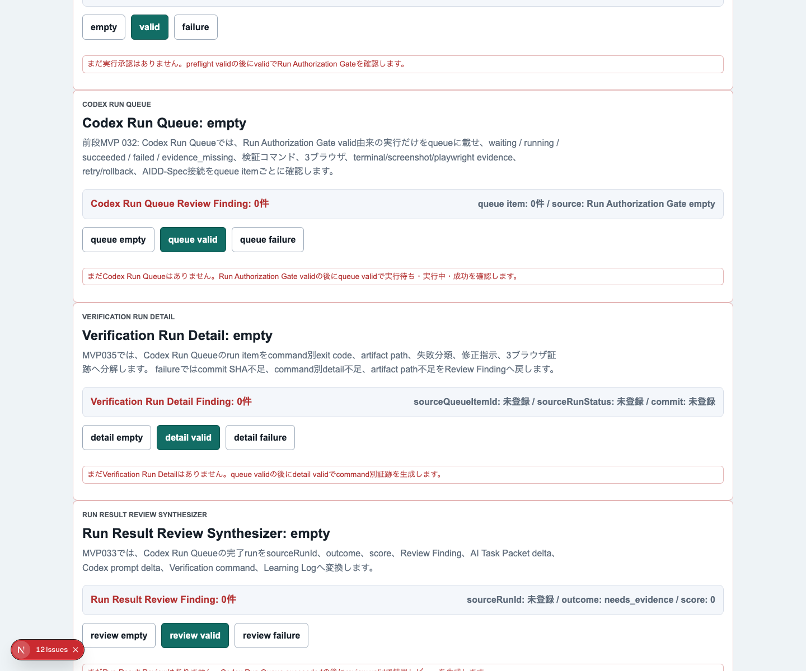
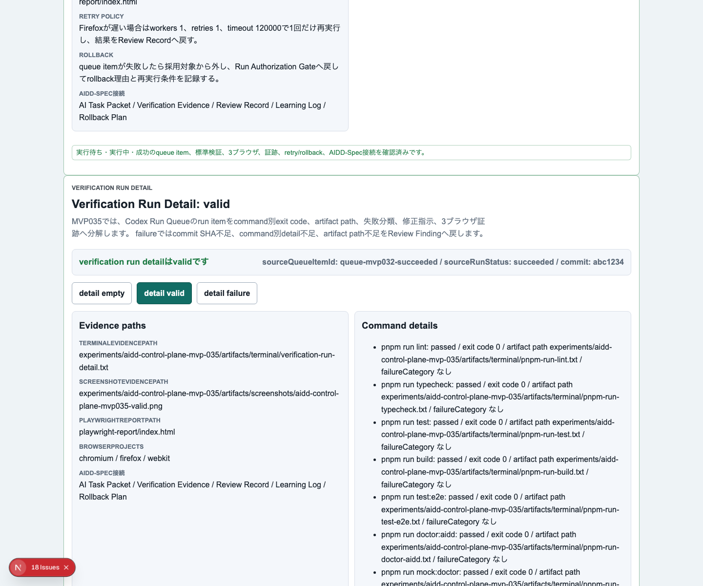
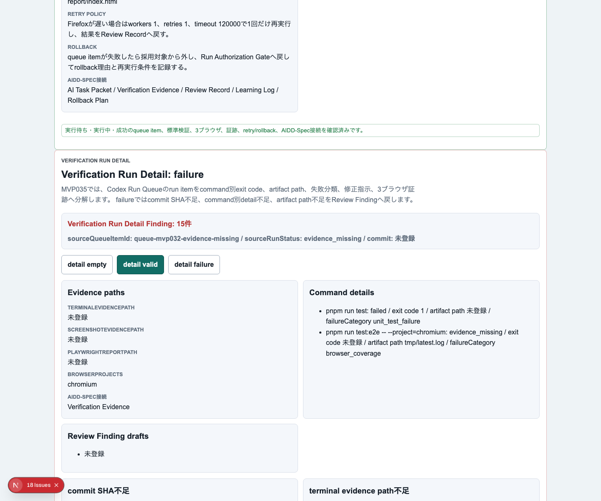
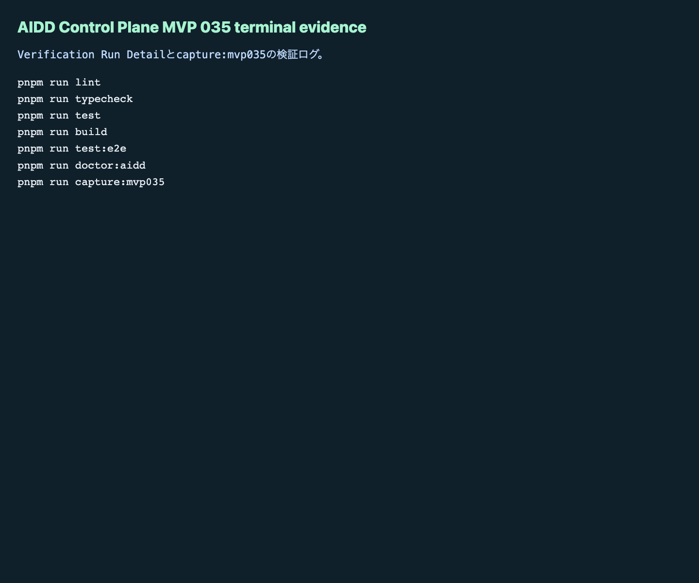

# AIDD Control Plane MVP 035：E2E成功を「command別の証跡」に分解する

> 2026-07-04 / Codex Mastery Lab  
> 記事種別: Experiment / SaaS  
> 将来の書籍章: 第10章 Verification Evidence、第11章 Review Record、第18章 AIDD Control PlaneのMVP

## 読者の悩み

AIに実装を任せて、最後に「テストは通りました」と報告されても、次のように不安が残ります。

- どのコマンドが実行されたのか分からない
- exit codeやログ保存先が見えない
- Firefoxだけ除外されていても気づきにくい
- 失敗したとき、原因分類と修正指示が次回依頼へ戻らない
- note記事に載せる一次情報として、証跡の粒度が粗い

MVP 034では、Run Result ReviewとLearning Logから **次の1インクリメント** を決める `Next Increment Planner` を作りました。今回は、その手前の証跡粒度を細かくします。Codex Run Queueのitemを、command別exit code、artifact path、失敗分類、修正指示へ分解する **Verification Run Detail** を追加しました。

## 今回の仮説

> Codex Run Queueのrun itemをcommand別のVerification Evidenceへ展開できれば、成功/失敗の粗い報告ではなく、Review FindingとLearning Logへ戻せる一次情報になる。

家計簿で言えば、「今月は赤字でした」だけでは直せません。食費、交通費、サブスクのどれが原因か分かると、次の行動が決まります。AI駆動開発でも、「E2E失敗」だけではなく、どのcommand、どのartifact、どの失敗分類なのかを分ける必要があります。

## 実験内容

今回作ったのは **Verification Run Detail** です。

```text
Run Authorization Gate
  -> Codex Run Queue
  -> Verification Run Detail
  -> Run Result Review Synthesizer
  -> Next Increment Planner
```

実装前に `experiments/aidd-control-plane-mvp-035/README.md`、`AI_TASK_PACKET.md`、`CODEX_PROMPT.md` を作成しました。Codex CLIは今回のcron環境でも `codex: command not found` で起動できなかったため、失敗ログを証跡として保存し、同じAI Task Packetに沿って手動実装と独立検証を行いました。

追加した主な要素は次です。

1. `VerificationRunDetail` / `VerificationCommandDetail` / evaluatorを追加
2. UIに `Verification Run Detail` セクションを追加
3. empty / valid / failureを切り替え可能にする
4. validでは、source queue item、commit SHA、command別status / exit code / artifact path、3ブラウザ、terminal/screenshot/playwright evidence、Review Finding draftを表示
5. failureでは、commit SHA不足、command別detail不足、artifact path不足、Firefox除外、証跡不足、AIDD-Spec接続不足を検出

## 画面キャプチャ

### empty：まだcommand別証跡がない



### valid：command別exit codeとartifact pathが揃っている



### failure：粗い証跡を止める



### terminal evidence



## 失敗と修正

最初の失敗はCodex実行です。cron環境では `codex` コマンドが見つからず、Codexへ実装を委譲できませんでした。ここでは「Codexが動かないから終了」にはせず、AI Task PacketとCodex promptを残し、同じ要件で手動実装しました。

次の失敗はE2Eでした。初回は前MVPの見出し `MVP 035: Next Increment Planner` を期待していたため、現在の `MVP 035: Verification Run Detail` と合わず失敗しました。また `chromium / firefox / webkit` の文字列が複数箇所にあり、Playwright strict modeで曖昧になりました。期待見出しを更新し、対象を `Verification Run Detail details` 内に限定して再実行しました。

さらに、途中でPlaywrightのdev serverがポートに残り、`page.goto` が `net::ERR_ABORTED` になりました。残っていたローカルdev serverを停止し、3ブラウザE2Eを再実行して成功しました。

## 検証ログ

保存先は `experiments/aidd-control-plane-mvp-035/artifacts/aidd-control-plane-mvp-035/terminal/` です。

| コマンド | 結果 |
| --- | --- |
| `pnpm install --frozen-lockfile` | pass |
| `pnpm run lint` | pass |
| `pnpm run typecheck` | pass |
| `pnpm run test` | 66 tests passed |
| `pnpm run test:coverage` | pass |
| `pnpm run build` | pass |
| `pnpm run test:e2e` | 99 tests passed / Chromium, Firefox, WebKit |
| `pnpm run doctor:aidd` | pass |
| `pnpm run mock:doctor` | pass |
| `pnpm run capture:mvp035` | pass |

`doctor:aidd` の要約です。

```text
doctor:aidd passed
checked MVP: AIDD Control Plane MVP 035 Verification Run Detail
```

## 読者が使えるチェックリスト

| チェック項目 | 何を確認したいのか | なぜ必要か |
| --- | --- | --- |
| command別に記録する | lint/typecheck/test/build/e2e/doctorを分けているか | 「テスト通過」という粗い報告を防ぐため |
| exit codeを残す | 成功/失敗が機械的に確認できるか | 人間の要約だけに依存しないため |
| artifact pathを書く | ログやレポートへ辿れるか | 後からレビュー・記事化できる一次情報にするため |
| failure categoryを書く | 失敗原因が分類されているか | 次回AI Task Packetへ戻しやすくするため |
| repair instructionを書く | 次に何を直すか分かるか | 失敗ログを改善指示へ変換するため |
| Chromium / Firefox / WebKitを確認する | 3ブラウザを除外していないか | 片方だけ動くUIを見逃さないため |
| terminal / screenshot / playwright evidenceを揃える | 証跡が複数角度で残っているか | note記事とレビューの説得力を上げるため |
| AIDD-Spec接続を書く | Verification Evidence / Review Record / Learning Logへつながるか | SaaS内で学びを次回へ戻すため |

## AIDD-Spec / SaaSへの接続

今回、`standards/aidd-control-plane-mvp-v0.1.md` に `Verification Run Detail` を追加しました。

AIDD Control Planeは、AIにコードを書かせるだけの画面ではありません。今回の価値は、実行結果を「どのコマンドの、どの証跡か」まで分解することです。

- Codex Run Queue: run itemの状態を追跡する
- Verification Run Detail: command別のexit codeとartifact pathへ分解する
- Run Result Review: 失敗分類をReview Findingへ変換する
- Learning Log: 次回AI Task Packetへ戻す
- Next Increment Planner: 次に実行する1インクリメントへ絞る

これにより、AI駆動開発は「なんとなく通った」から「後で追える証跡がある」に近づきます。

## 次回

次回は、Verification Run DetailをRun Result Reviewへさらに強く接続し、失敗分類ごとにAI Task Packet deltaを自動生成する導線を改善します。特に、failed / evidence_missing / timeoutを別々に扱い、次回Codex promptへ戻す粒度を上げます。
