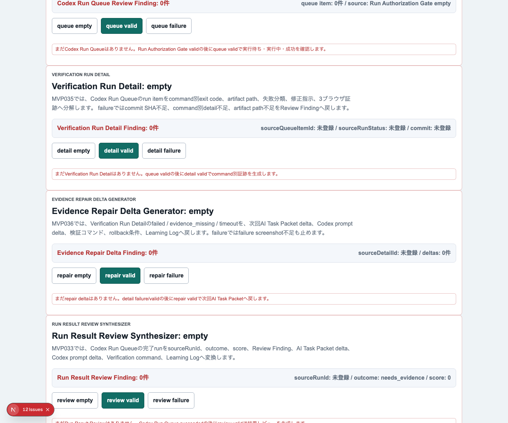
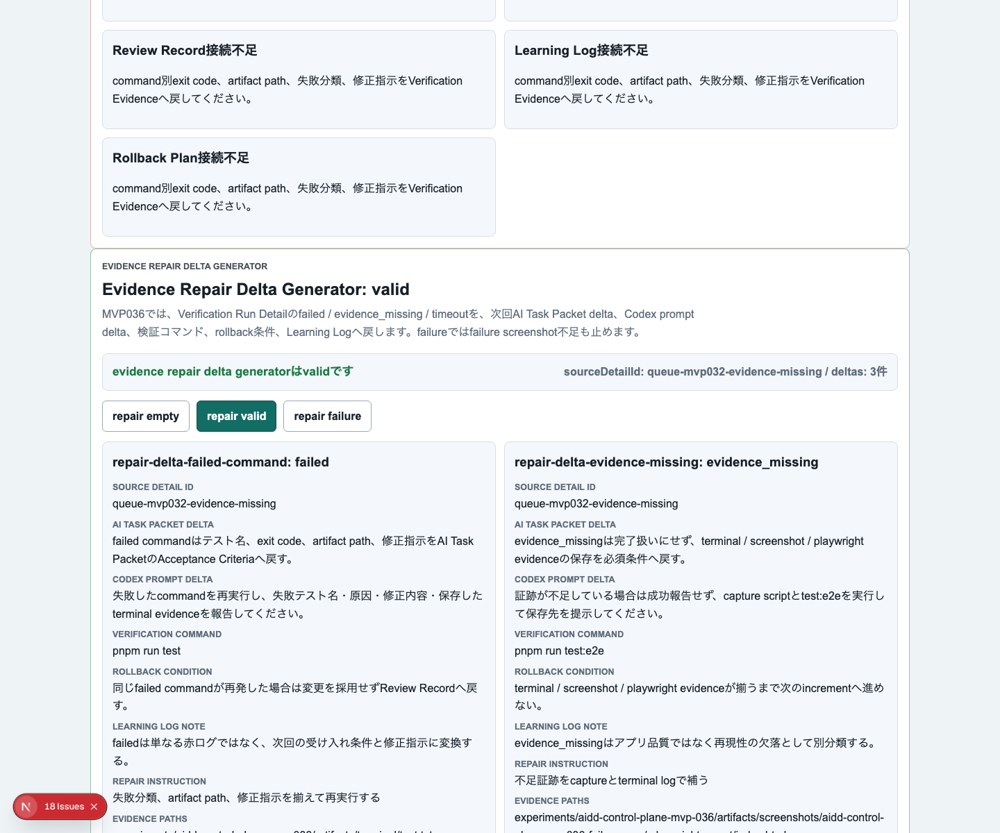
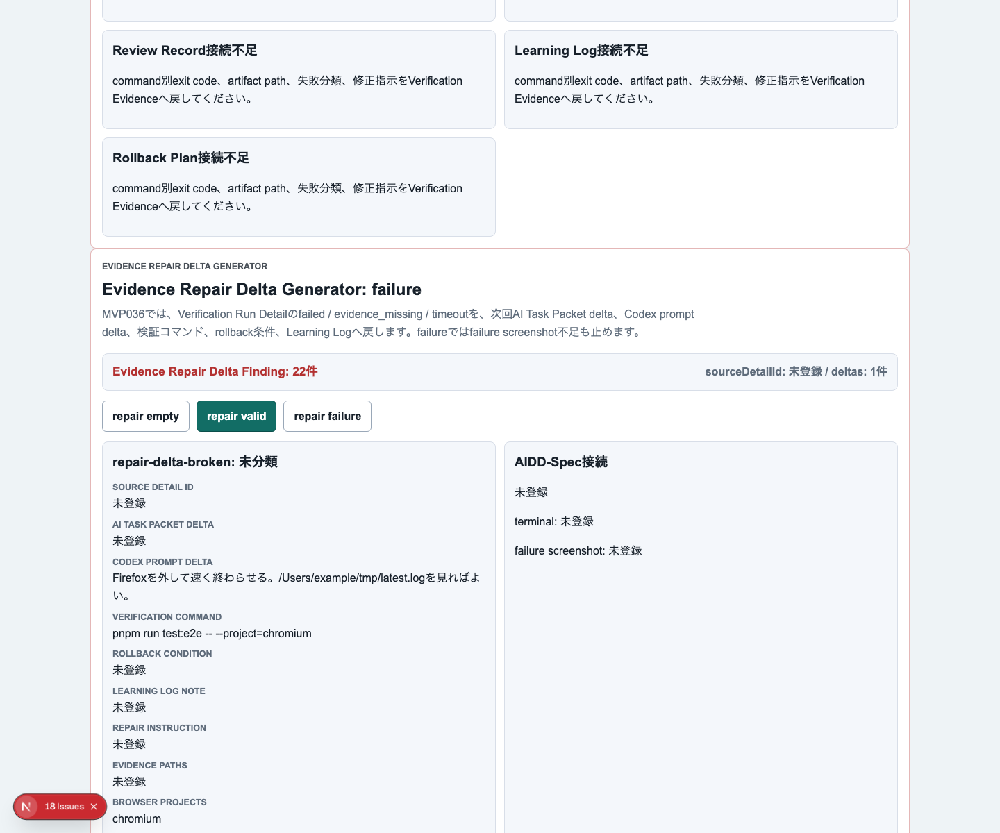
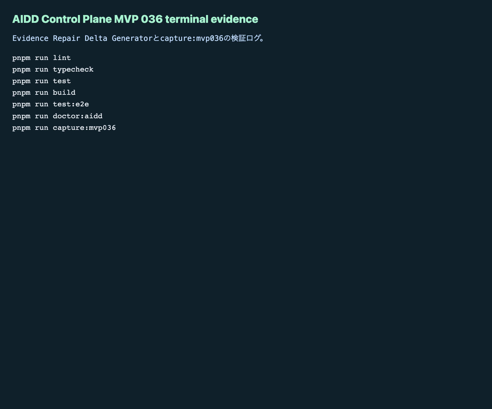

# AIDD Control Plane MVP 036：失敗ログを「次回AI依頼の差分」に変える

> 2026-07-04 / Codex Mastery Lab  
> 記事種別: Experiment / SaaS  
> 将来の書籍章: 第10章 Verification Evidence、第11章 Review Record、第18章 AIDD Control PlaneのMVP

## 読者の悩み

AIに実装を任せると、失敗ログは残ります。しかし、そのログが次の依頼文へ戻らないことがよくあります。

- `test:e2e` が失敗したが、次回AIに何を追加で頼むべきか分からない
- 証跡不足なのか、アプリのバグなのか、timeoutなのかが混ざる
- Firefoxを外して「通った」ことにしてしまう
- terminal logやfailure screenshotがないまま、記事やレビューを書こうとしてしまう
- Learning Logが感想で終わり、AI Task Packetの差分にならない

MVP 035では、Verification Run Detailとしてcommand別exit codeとartifact pathを見える化しました。今回はその次段として、失敗分類を次回AI Task Packet / Codex promptへ戻す **Evidence Repair Delta Generator** を追加しました。

## 今回の仮説

> failed / evidence_missing / timeout を別々のrepair deltaにすれば、失敗ログは「読んで終わり」ではなく、次回AI依頼の改善材料になる。

料理で言えば、「味がいまいち」だけでは次に直せません。「塩が足りない」「火が強すぎた」「材料を買い忘れた」のように分けると、次の買い物メモや手順に戻せます。AI駆動開発でも、失敗を分類して、次の依頼文に戻す必要があります。

## 実験内容

今回作ったのは **Evidence Repair Delta Generator** です。

```text
Codex Run Queue
  -> Verification Run Detail
  -> Evidence Repair Delta Generator
  -> Run Result Review Synthesizer
  -> Next Increment Planner
```

実装前に `experiments/aidd-control-plane-mvp-036/README.md`、`AI_TASK_PACKET.md`、`CODEX_PROMPT.md` を作成しました。Codex CLIは今回もcron環境で `codex: command not found` になったため、失敗ログを保存し、同じAI Task Packetに沿って手動実装と独立検証を行いました。

追加した主な要素は次です。

1. `EvidenceRepairDeltaGenerator` / `EvidenceRepairDelta` / evaluatorを追加
2. UIに `Evidence Repair Delta Generator` セクションを追加
3. empty / valid / failureを切り替える `repair empty` / `repair valid` / `repair failure` を追加
4. validでは `failed` / `evidence_missing` / `timeout` を別々のrepair deltaとして表示
5. 各deltaにAI Task Packet delta、Codex prompt delta、verification command、rollback condition、Learning Log noteを表示
6. failureではsource detail不足、失敗分類不足、修正指示不足、Firefox除外、terminal/failure screenshot不足、local path混入を検出

## 画面キャプチャ

### empty：まだrepair deltaがない



### valid：失敗分類を次回依頼へ戻す



### failure：証跡不足やFirefox除外を止める



### terminal evidence



## 失敗と修正

最初の失敗はCodex実行です。`codex exec --sandbox danger-full-access` を実行しましたが、cron環境では `codex: command not found` でした。これは実装失敗ではなく、実験証跡として `codex-exec.txt` に残しました。

次の失敗はE2Eでした。新しく追加したfailure確認で `source detail不足` が2箇所に出て、Playwright strict modeに引っかかりました。ここは `{ exact: true }` と `.first()` を使い、何を確認したいのかを明確にしました。

さらに、前回のE2E失敗時にdev serverがポートへ残り、`page.goto` が `net::ERR_ABORTED` になりました。残っていたローカルdev serverを確認して停止し、3ブラウザE2Eを再実行して成功しました。

## 検証ログ

保存先は `experiments/aidd-control-plane-mvp-036/artifacts/aidd-control-plane-mvp-036/terminal/` です。

| コマンド | 結果 |
| --- | --- |
| `pnpm install --frozen-lockfile` | pass |
| `pnpm run lint` | pass |
| `pnpm run typecheck` | pass |
| `pnpm run test` | 67 tests passed |
| `pnpm run test:coverage` | pass |
| `pnpm run build` | pass |
| `pnpm run test:e2e` | 102 tests passed / Chromium, Firefox, WebKit |
| `pnpm run doctor:aidd` | pass |
| `pnpm run capture:mvp036` | pass |

`doctor:aidd` の要約です。

```text
doctor:aidd passed
checked MVP: AIDD Control Plane MVP 036 Evidence Repair Delta Generator
```

## 読者が使えるチェックリスト

| チェック項目 | 何を確認したいのか | なぜ必要か |
| --- | --- | --- |
| failedを分ける | 実装・テスト自体の失敗か | 修正指示をAI Task Packetへ戻すため |
| evidence_missingを分ける | アプリではなく証跡が不足しているだけか | 「通った気がする」を完了扱いにしないため |
| timeoutを分ける | 待ち時間・再試行・Firefox安定化が必要か | ブラウザ除外で品質をごまかさないため |
| AI Task Packet deltaを書く | 次回依頼の受け入れ条件へ戻るか | 同じ失敗を繰り返さないため |
| Codex prompt deltaを書く | AIに次回何を明示するか | ログ読解を毎回やり直さないため |
| verification commandを書く | 修正後に何で確認するか | 改善が本当に効いたか測るため |
| rollback conditionを書く | どの条件なら採用しないか | 失敗した変更を流し込まないため |
| terminal / failure screenshotを残す | 記事とレビューの一次情報があるか | 後から追える証拠にするため |

## AIDD-Spec / SaaSへの接続

今回、`standards/aidd-control-plane-mvp-v0.1.md` に `Evidence Repair Delta Generator` を追加しました。

AIDD Control Planeの価値は、AIにコードを書かせることだけではありません。失敗したときに、次の依頼をどう良くするかまで案内することです。

- Verification Run Detail: command別の失敗を細かく見る
- Evidence Repair Delta Generator: 失敗分類を次回依頼の差分へ変換する
- Run Result Review: Review Findingとしてレビュー可能にする
- Learning Log: 次回のAI Task Packetへ戻す

これにより、失敗ログは「反省」ではなく、次回の依頼文を良くする材料になります。

## 次回

次回は、Evidence Repair DeltaをRun Result Reviewへさらに強く接続し、複数deltaの優先順位と採用判断を扱います。特に、どのrepair deltaを次回の1インクリメントに入れるか、どれをLearning Logに保留するかをUIで分けます。
