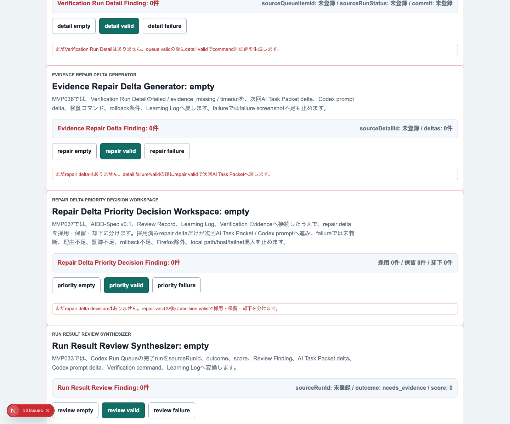
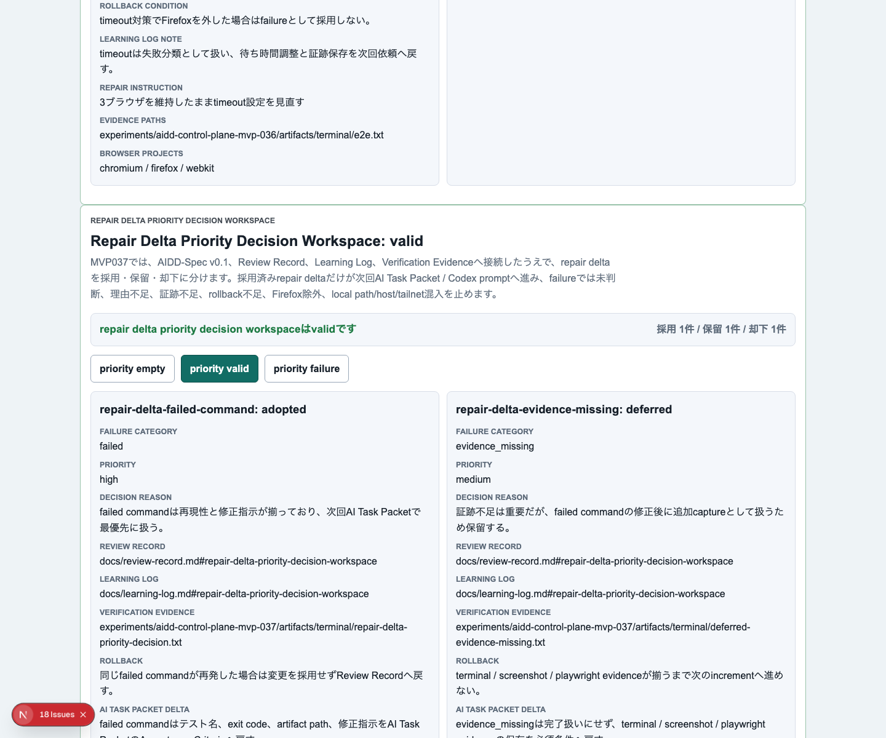
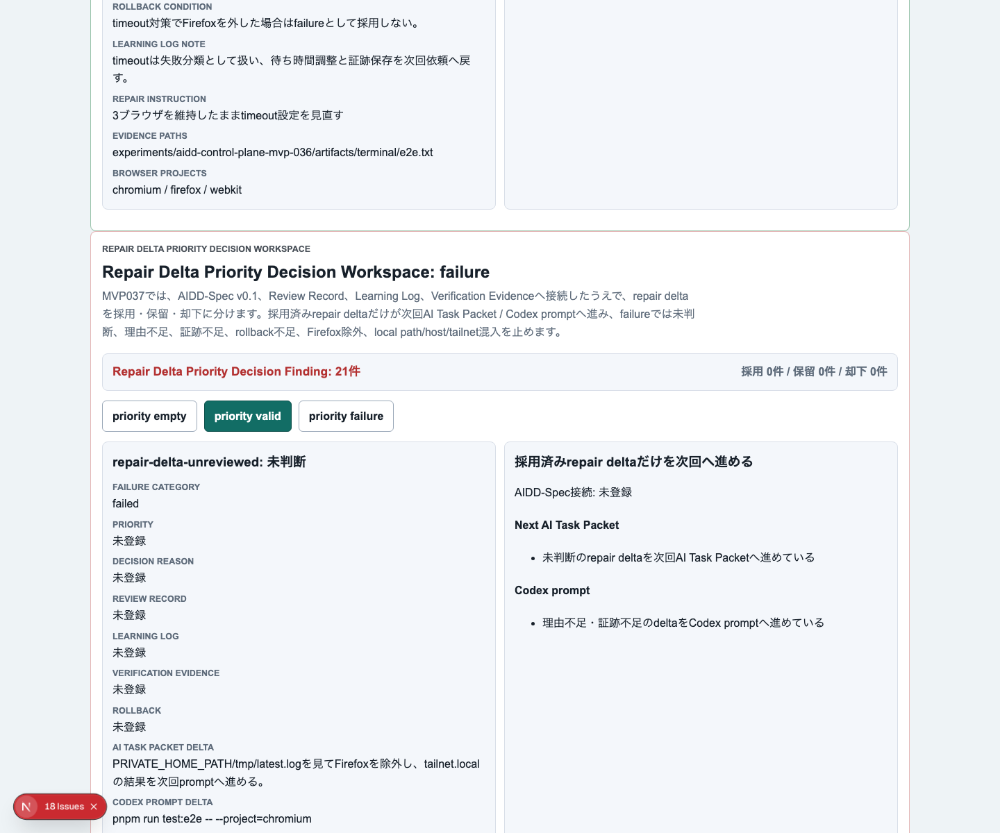
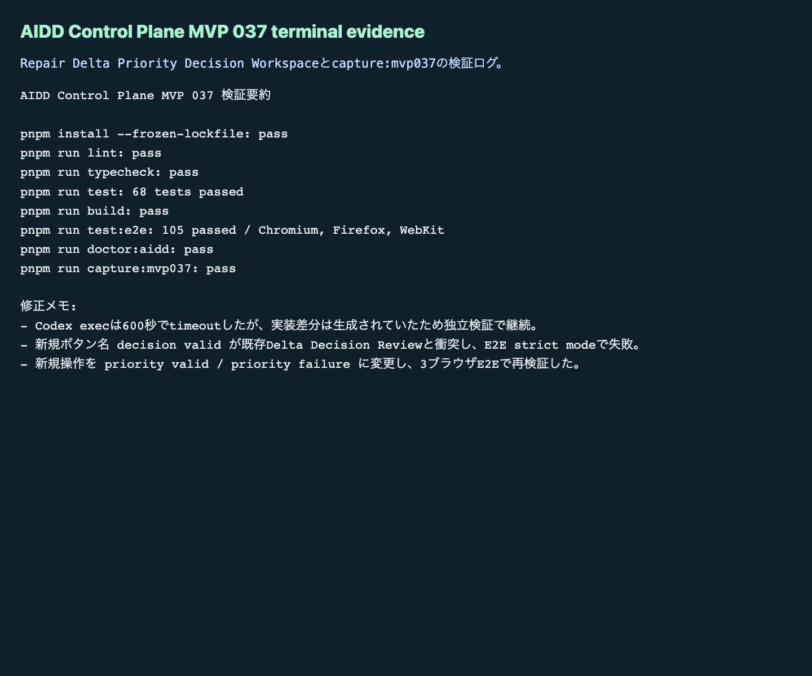

# AIDD Control Plane MVP 037：修正候補を「全部やる」から「次に採用する1つ」へ絞る

> 2026-07-04 / Codex Mastery Lab  
> 記事種別: Experiment / SaaS  
> 将来の書籍章: 第10章 Verification Evidence、第11章 Review Record、第18章 AIDD Control PlaneのMVP

## 読者の悩み

AIに実装を任せたあと、失敗ログから改善案は出せます。けれど、次の依頼文に全部入れると、また別の問題が起きます。

- 直すべきことが多すぎて、次の1回の作業がぼやける
- 証跡不足と実装バグを同じ優先度で扱ってしまう
- 「保留」や「却下」の理由が残らない
- 採用していない修正候補までAI Task Packetへ混ざる
- Firefox除外やrollback不足を見逃したまま次へ進む

MVP 036では、失敗ログを `failed` / `evidence_missing` / `timeout` のrepair deltaに変換しました。今回は、そのrepair deltaを **採用 / 保留 / 却下** に分ける **Repair Delta Priority Decision Workspace** を追加しました。

## 今回の仮説

> 修正候補を全部流し込まず、採用済みdeltaだけを次回AI Task Packet / Codex promptへ進めれば、AI駆動開発の次インクリメントは小さく、検証可能になる。

買い物メモで考えると分かりやすいです。冷蔵庫を見て「足りないもの」を全部書き出しても、今日作る料理に必要なものだけを買うとは限りません。今夜必要なもの、週末でよいもの、今回は買わないものを分ける必要があります。AI開発のrepair deltaも同じです。

## 実験内容

今回作ったのは **Repair Delta Priority Decision Workspace** です。

```text
Verification Run Detail
  -> Evidence Repair Delta Generator
  -> Repair Delta Priority Decision Workspace
  -> 次回AI Task Packet / Codex prompt
```

実装前に `experiments/aidd-control-plane-mvp-037/README.md`、`AI_TASK_PACKET.md`、`CODEX_PROMPT.md` を作成し、AIDD-Spec v0.1と `standards/aidd-control-plane-mvp-v0.1.md` に接続しました。

追加した主な要素は次です。

1. `RepairDeltaPriorityDecisionWorkspace` の型、factory、evaluatorを追加
2. UIに `Repair Delta Priority Decision Workspace` セクションを追加
3. `priority empty` / `priority valid` / `priority failure` を追加
4. valid状態で `adopted` / `deferred` / `rejected` を混在表示
5. 採用済みdeltaだけを `Adopted repair delta export` に出す
6. failure状態で未判断、理由不足、証跡不足、rollback不足、Firefox除外、未採用delta混入、local path/host/<private-network>混入を検出

## 画面キャプチャ

### empty：まだ判断するrepair deltaがない



### valid：採用・保留・却下を分ける



### failure：未判断や証跡不足を止める



### terminal evidence



## 失敗と修正

今回のCodex実行は `codex exec --sandbox danger-full-access` を使いました。プロセスは600秒でtimeoutしましたが、実装差分は生成されていたため、Codexの自己申告ではなく独立検証へ進みました。

最初のE2Eは失敗しました。原因は、新しく追加したボタン名を `decision valid` にしたことで、既存のDelta Decision Reviewのボタンと衝突したことです。Playwright strict modeが「同じ名前のボタンが複数ある」と止めてくれました。

修正として、新規セクションの操作名を `priority valid` / `priority failure` に変更しました。その後、Chromium / Firefox / WebKitの3ブラウザE2Eで成功しました。

## 検証ログ

保存先は `experiments/aidd-control-plane-mvp-037/artifacts/aidd-control-plane-mvp-037/terminal/` です。

| コマンド | 結果 |
| --- | --- |
| `pnpm install --frozen-lockfile` | pass |
| `pnpm run lint` | pass |
| `pnpm run typecheck` | pass |
| `pnpm run test` | 68 tests passed |
| `pnpm run build` | pass |
| `pnpm run test:e2e` | 105 tests passed / Chromium, Firefox, WebKit |
| `pnpm run doctor:aidd` | pass |
| `pnpm run capture:mvp037` | pass |

`doctor:aidd` の要約です。

```text
doctor:aidd passed
checked MVP: AIDD Control Plane MVP 037 Repair Delta Priority Decision Workspace
```

## 読者が使えるチェックリスト

| チェック項目 | 何を確認したいのか | なぜ必要か |
| --- | --- | --- |
| 採用 / 保留 / 却下を分ける | 次の1インクリメントで本当に扱う修正だけを選んだか | AI依頼を大きくしすぎないため |
| 採用理由を書く | なぜ今やるのか説明できるか | レビューで判断を追えるようにするため |
| 保留理由を書く | 今回やらない候補が迷子になっていないか | Learning Logへ戻すため |
| 却下理由を書く | 危険な修正や目的外の修正を止めたか | 品質を下げる修正を混ぜないため |
| 証跡パスを書く | 判断の根拠がterminal / screenshotで追えるか | 一次情報として記事やレビューに使うため |
| rollback条件を書く | 採用後に戻す条件があるか | 失敗した変更を残さないため |
| Firefox除外を検出する | 3ブラウザE2Eを浅くしていないか | 成功扱いのごまかしを防ぐため |
| 未採用delta混入を検出する | 保留・却下したdeltaが次回packetへ入っていないか | 次回依頼の焦点を守るため |

## AIDD-Spec / SaaSへの接続

今回、`standards/aidd-control-plane-mvp-v0.1.md` に `Repair Delta Priority Decision Workspace` を追加しました。

AIDD Control Planeの価値は、AIに「もっと直して」と投げることではありません。失敗ログから生まれた候補を、次に採用するものだけに絞り、証跡とrollback条件を付けて渡すことです。

これにより、AIDD-Specの流れは次のように一段具体化しました。

```text
Verification Evidence
  -> Review Record
  -> Evidence Repair Delta
  -> Priority Decision
  -> 次回AI Task Packet
```

noteで読まれる記事としても、単なるAI量産記事ではなく、実際に失敗し、直し、3ブラウザで検証した一次情報を残せます。

## 次回

次回は、採用済みrepair deltaを次回AI Task Packetへ反映する直前に、複数の採用候補をまとめた「実行前優先順位セット」としてレビューします。特に、採用済みが複数ある場合に、次の1回へ入れる範囲と、Learning Logへ戻す範囲をさらに分けます。
