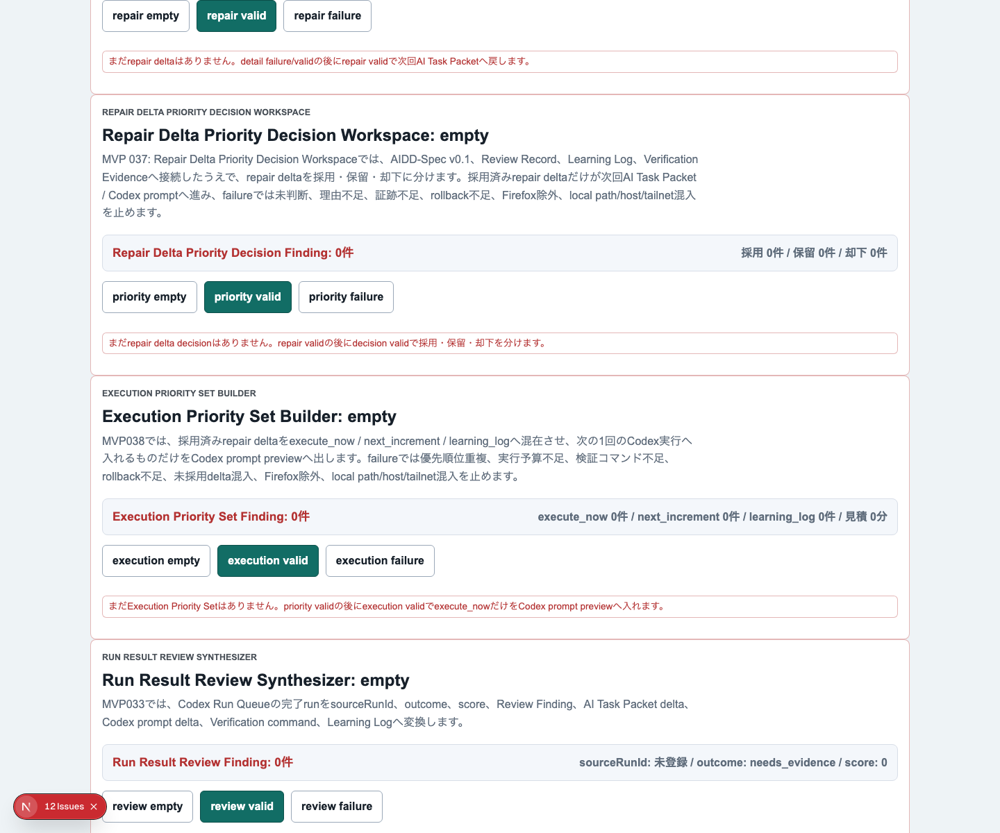
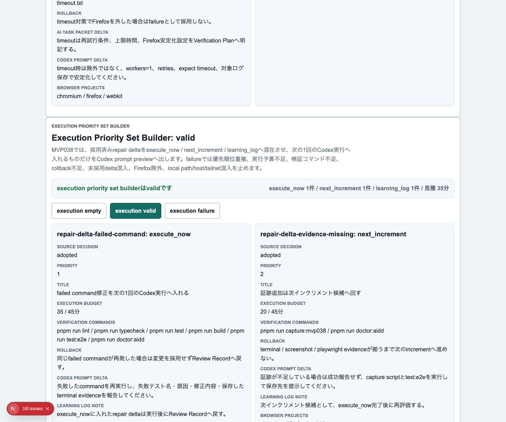
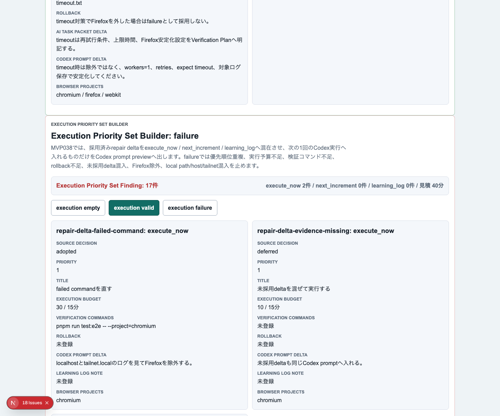
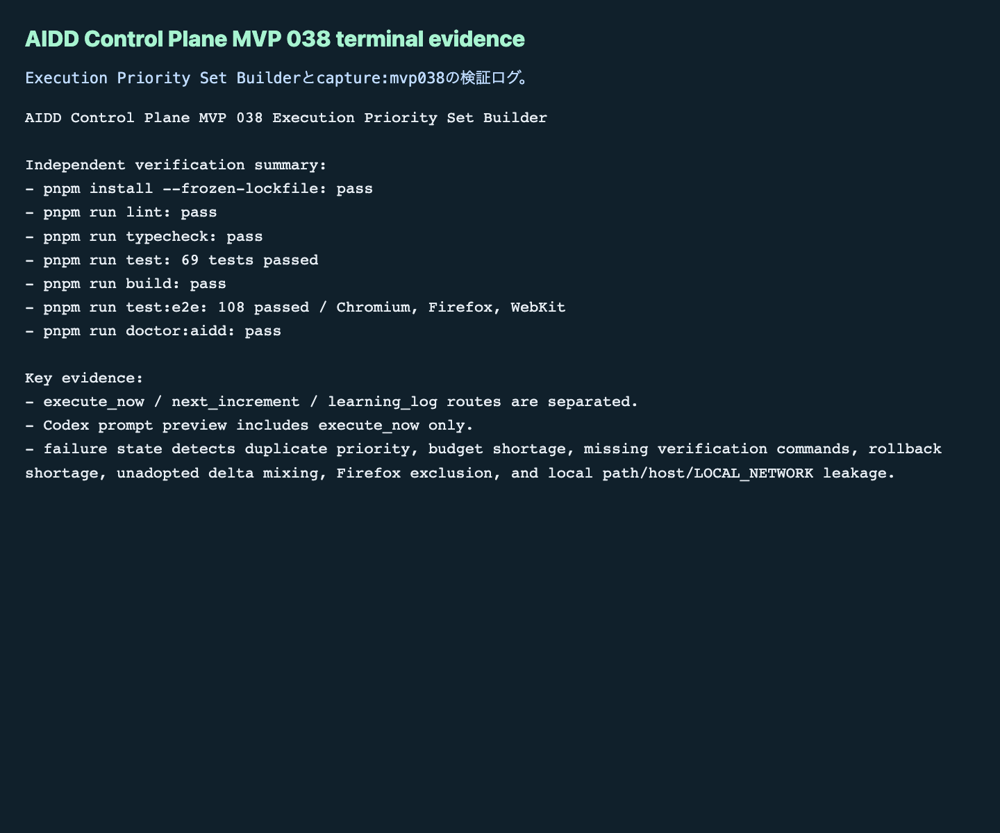

# AIDD Control Plane MVP 038：採用済み修正を「次の1回で実行する分」だけに絞る

> 2026-07-04 / Codex Mastery Lab  
> 記事種別: Experiment / SaaS  
> 将来の書籍章: 第10章 Verification Evidence、第11章 Review Record、第18章 AIDD Control PlaneのMVP

## 読者の悩み

AIに失敗ログを読ませると、改善案はたくさん出ます。MVP 037では、そのrepair deltaを採用 / 保留 / 却下へ分けました。けれど、採用済みが複数あると、次にまた迷います。

- 採用済みだから全部やる、になりやすい
- 1回のCodex依頼が大きくなり、検証しにくい
- 次回送りとLearning Log戻しが、Codex promptへ混ざる
- 実行予算やrollback条件を見ないまま実行してしまう
- Firefox除外や浅い検証を「今回だけ」として通してしまう

料理で考えると、買うと決めた食材が全部、今日の鍋に入るわけではありません。今日使うもの、明日の弁当に回すもの、レシピメモへ戻すものを分けます。AI駆動開発のrepair deltaも同じです。

## 今回の仮説

> 採用済みrepair deltaをさらに `execute_now` / `next_increment` / `learning_log` に分け、Codex prompt previewへ `execute_now` だけを入れれば、次の1インクリメントを小さく検証可能に保てる。

AIDD Control Planeは、AIに「全部直して」と投げるSaaSではありません。どこまでを次の1回に入れるか、検証コマンドとrollback条件を見ながら決めるSaaSです。

## 実験内容

今回作ったのは **Execution Priority Set Builder** です。

```text
Verification Run Detail
  -> Evidence Repair Delta Generator
  -> Repair Delta Priority Decision Workspace
  -> Execution Priority Set Builder
  -> 次回Codex prompt preview
```

実装前に `experiments/aidd-control-plane-mvp-038/README.md`、`AI_TASK_PACKET.md`、`CODEX_PROMPT.md` を作り、AIDD-Spec v0.1と `standards/aidd-control-plane-mvp-v0.1.md` へ接続しました。

追加した主な要素は次です。

1. `ExecutionPrioritySetBuilder` の型、factory、evaluatorを追加
2. UIに `Execution Priority Set Builder` セクションを追加
3. `execution empty` / `execution valid` / `execution failure` を追加
4. valid状態で `execute_now` / `next_increment` / `learning_log` を混在表示
5. Codex prompt previewへ入るのは `execute_now` のdeltaだけに制限
6. failure状態で優先順位重複、実行予算不足、検証コマンド不足、rollback不足、未採用delta混入、Firefox除外、local path/host/private network混入を検出

## 画面キャプチャ

### empty：まだ実行前セットがない



### valid：今回実行、次回送り、Learning Log戻しを分ける



### failure：実行前に危険な混入を止める



### terminal evidence



## 失敗と修正

今回は `codex exec --sandbox danger-full-access` で実装を委任しました。Codexは実装後に検証成功を自己申告しましたが、それは信用せず、別コマンドで独立検証しました。

実装上の注意点は、`next_increment` や `learning_log` のdelta IDやprompt patchを、Codex prompt preview本文に混ぜないことでした。テストでは、`execute_now` のdeltaだけがpreviewへ入り、次回送りとLearning Log戻しのdelta本文は入らないことを確認しています。

また、failure sampleにはあえて次の欠陥を入れました。

- 同じ優先順位を複数itemへ付ける
- 見積もり時間が実行予算を超える
- `pnpm run lint` / `typecheck` / `test` / `build` / `test:e2e` / `doctor:aidd` が揃っていない
- rollback条件が空
- `sourceDecision: deferred` の未採用deltaを `execute_now` へ混ぜる
- Chromiumだけの検証でFirefoxを外す
- local path / host / private network相当の文字列を含める

## 検証ログ

保存先は `experiments/aidd-control-plane-mvp-038/artifacts/aidd-control-plane-mvp-038/terminal/` です。

| コマンド | 結果 |
| --- | --- |
| `pnpm install --frozen-lockfile` | pass |
| `pnpm run lint` | pass |
| `pnpm run typecheck` | pass |
| `pnpm run test` | 69 tests passed |
| `pnpm run build` | pass |
| `pnpm run test:e2e` | 108 tests passed / Chromium, Firefox, WebKit |
| `pnpm run doctor:aidd` | pass |
| `pnpm run capture:mvp038` | pass |

`doctor:aidd` の要約です。

```text
doctor:aidd passed
checked MVP: AIDD Control Plane MVP 038 Execution Priority Set Builder
```

## 読者が使えるチェックリスト

| チェック項目 | 何を確認したいのか | なぜ必要か |
| --- | --- | --- |
| execute_nowを1回分に絞る | 次のCodex依頼が検証可能な大きさか | 大きすぎる依頼は失敗原因を追えないため |
| next_incrementを分ける | 重要だが今やらないdeltaが保存されているか | 採用済みの改善案を迷子にしないため |
| learning_logへ戻す | 今回の実行に入れない学びが残るか | 同じ失敗を別の形で繰り返さないため |
| 優先順位重複を見る | 1番目が複数ないか | AIに渡す順序が曖昧になるため |
| 実行予算を見る | 見積もりが1回の作業量を超えていないか | 終わらない実行を防ぐため |
| 検証コマンドを見る | lint/typecheck/test/build/e2e/doctorが揃うか | 成功の証拠を一式残すため |
| rollback条件を見る | 失敗した時に戻す条件があるか | 悪い変更を残さないため |
| Firefox除外を検出する | 3ブラウザE2Eを浅くしていないか | 「通ったことにする」を防ぐため |
| prompt混入を検出する | next_incrementやlearning_logが今回promptへ入っていないか | 1インクリメントの焦点を守るため |

## AIDD-Spec / SaaSへの接続

今回、`standards/aidd-control-plane-mvp-v0.1.md` に `Execution Priority Set Builder` を追加しました。

AIDD-Specの流れは、次のようにさらに細かくなりました。

```text
Verification Evidence
  -> Review Record
  -> Evidence Repair Delta
  -> Priority Decision
  -> Execution Priority Set
  -> Codex prompt preview
```

この一段は地味ですが、SaaSとしては重要です。AIDD Control Planeが「AIエージェントの実行ボタン」になる前に、「今日の1回で何を実行し、何を実行しないか」を決める画面が必要だからです。

noteで読まれる一次情報としても、単なるAI量産記事ではなく、実際にCodexへ依頼し、3ブラウザE2Eで確認し、スクリーンショットとterminal evidenceを残した記録になります。

## 次回

次回は、Execution Priority Setで `execute_now` になったdeltaを、実行前の最終承認やジョブ投入とさらに接続します。特に、実行キューへ入れる前に、Codex command、sandbox、証跡保存先、rollback条件が揃っているかを見える化する予定です。
