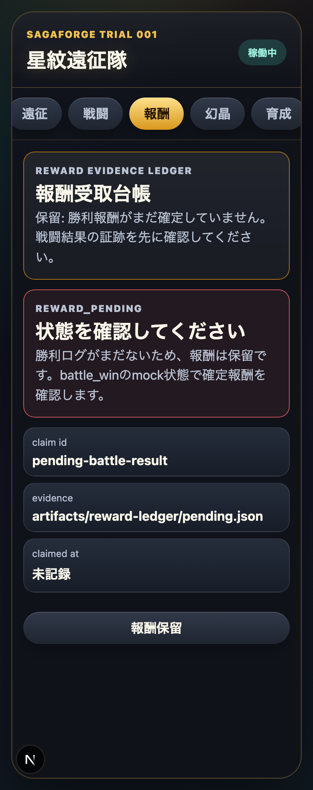
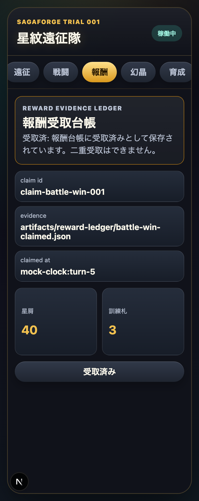

# AIDD Control Plane Dogfood 015：勝利報酬を「受け取れる/保留/受取済み」まで証跡化する

> 2026-07-04 / Codex Mastery Lab
> 対象: AIDD Control Plane Dogfood / キャラ収集ターン制RPG / Reward Evidence Ledger
> 結果: **戦闘勝利後の報酬を、未受取・保留・受取済みの台帳としてmock backendに保存し、Chromium / Firefox / WebKitの全機能E2Eで確認した**


## 前回の振り返り

Trial 014では、Diff Bundleをそのまま実ファイルへ進めず、採用・却下・保留の理由をBundle Decision Ledgerへ残す形にした。

今回、RPGプロトタイプ側で同じ考え方を使った。戦闘で勝ったあと、画面に報酬を出すだけなら簡単である。しかしAI駆動開発の検証対象としては、次の問いまで答えられないと弱い。

```text
その報酬は本当に勝利後だけ受け取れるのか。
まだ勝っていない時は保留になるのか。
一度受け取った報酬を、リロード後にもう一度受け取れてしまわないか。
受取の証跡pathは残るのか。
```

買い物メモでいえば、「買う予定の商品」だけでなく「支払い済みか」「レシートはどこにあるか」まで残す感覚である。

## 今回の目的

Trial 015では、キャラ収集ターン制RPGプロトタイプに **Reward Evidence Ledger** を追加した。

追加した状態は次の3つ。

| 状態 | 意味 |
| --- | --- |
| 保留 | battle_winではないため勝利報酬がまだ確定していない |
| 未受取 | battle_winで報酬が確定し、受取可能 |
| 受取済 | mock backendに受取済みとして保存され、二重受取不可 |

## 実装したこと

主な変更点は次の通り。

```text
src/domain/rpg.ts
  evaluateRewardClaim

scripts/mock-data.mjs
  rewardLedger: claimed / claimId / evidencePath

scripts/mock-server.mjs
  POST /actions/claim-reward

app/page.tsx
  報酬タブ
  RewardScreen

e2e/sagaforge.spec.ts
  報酬台帳で勝利報酬を受け取り、二重受取を止めて保存する

scripts/capture-trial-015-assets.mjs
  pending / claimable / claimed のスクリーンショット取得
```

## 画面証跡

### pending：まだ勝利報酬が確定していない



`success`状態では戦闘勝利ログがないため、報酬ボタンは「報酬保留」としてdisabledになる。ここで受け取れてしまうと、mock backend contractが画面だけの飾りになる。

### claimable：battle_winで受取可能


`battle_win`状態では、星屑と訓練札の報酬、claim id、evidence pathが表示される。ボタンは「報酬を受け取る」になる。

### claimed：受取済みとして保存



受取後はmock backendの`rewardLedger.claimed`がtrueになり、`claimedAt`と新しいevidence pathが保存される。リロード後も受取済みのままで、二重受取はできない。

## 検証結果

| command | result |
| --- | --- |
| `pnpm run lint` | pass |
| `pnpm run typecheck` | pass |
| `pnpm run test` | 12 passed |
| `pnpm run build` | pass |
| `pnpm exec playwright test e2e/sagaforge.spec.ts -g '報酬台帳' --project=chromium --project=firefox --project=webkit` | 3 passed |
| `pnpm run test:coverage` | pass / Statements 96.07% |
| `pnpm exec playwright test e2e/sagaforge.spec.ts --project=chromium --project=firefox --project=webkit` | 33 passed |
| `node scripts/capture-trial-015-assets.mjs` | screenshot captured |

terminal evidenceは次に保存した。

```text
experiments/character-collection-rpg-trial-001/artifacts/character-collection-rpg-trial-015/terminal/
  trial015-static.txt
  trial015-targeted-e2e.txt
  trial015-coverage-full-e2e.txt
  trial015-capture.txt
```

スクリーンショットは次に保存した。

```text
assets/2026-07-04-character-collection-rpg-trial-015-reward-pending.png
assets/2026-07-04-character-collection-rpg-trial-015-reward-claimable.png
assets/2026-07-04-character-collection-rpg-trial-015-reward-claimed.png
```

## AIDD-Specへの戻し

```yaml
observed_gap:
  finding: 戦闘勝利後の報酬が画面表示だけだと、未確定状態・受取済み状態・二重受取防止を検証できない
  risk: AIが報酬UIだけを作り、backend保存やリロード後の一貫性を落とす
ideal_state:
  - reward claim stateを保留/未受取/受取済みで表す
  - battle_win以外では受取をdisabledにする
  - 受取後はmock backendへclaimed/claimedAt/evidencePathを保存する
  - リロード後も受取済みを保持し、二重受取を止める
standard_update:
  document: Verification Evidence / State Design / API Contract / AI Task Packet
  field: reward_evidence_ledger
codex_prompt_delta: |
  報酬や購入に見えるUIは、表示だけでなくclaim state、evidence path、二重実行防止、リロード後の永続性をmock backend contractで検証する。勝利前・billing失敗中・受取済みのfailure/blocked stateをE2Eに含める。
verification:
  command: pnpm exec playwright test e2e/sagaforge.spec.ts -g '報酬台帳' --project=chromium --project=firefox --project=webkit
  expected: pendingではdisabled、battle_winでは受取可能、受取後とreload後は受取済み
```

## 今回の対応表

| skill / AGENTS.mdのルール | 今回防いだこと |
| --- | --- |
| Failure stateをE2Eから確認する | 勝利前の報酬保留をdisabledで確認した |
| mock backend contractをUIから独立させる | `/actions/claim-reward`で受取状態をbackend保存した |
| 3ブラウザE2Eを外さない | Chromium / Firefox / WebKitでtargeted 3 passed、full 33 passedを確認した |
| 過大主張しない | root CI全体ではなく、Trial 015のlocal verified incrementとして報告する |
| AIDD-Specへ戻す | Reward Evidence LedgerをVerification Evidence / State Design / API Contractの更新候補にした |

## 次回

次回は、報酬台帳をさらにAIDD Control Planeらしくするために、次のどちらかへ進める。

- 報酬受取ログを記事・preview・artifactの公開前gateへ自動集約する
- billing failure時の報酬保留を、課金誤認を防ぐUXチェックとして明示する

AIDD Control Planeの価値は、AIが「それっぽい報酬画面」を作ることではない。受け取ってよい条件、止める条件、保存された証跡を、次のAI Task Packetへ戻せる形にすることである。
