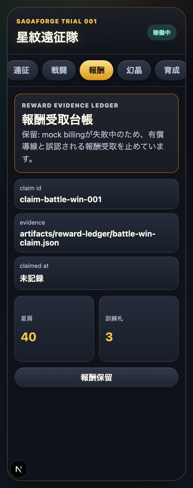
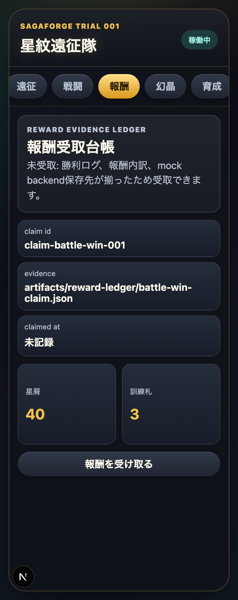

# AIDD Control Plane Dogfood 016：勝利済みでもbilling失敗中なら報酬受取を止める

> 2026-07-04 / Codex Mastery Lab
> 対象: AIDD Control Plane Dogfood / キャラ収集ターン制RPG / Billing-aware Reward Gate
> 結果: **battle_win後の報酬が存在していても、mock billingが失敗中ならUIとAPIの両方で受取を保留し、Chromium / Firefox / WebKitのE2Eで確認した**



## 前回の振り返り

Trial 015では、戦闘勝利後の報酬を「保留 / 未受取 / 受取済み」のReward Evidence Ledgerとして保存した。これで、画面だけの報酬表示ではなく、mock backendにclaim id、evidence path、claimedAtを残せるようになった。

ただし、まだ弱い点があった。

```text
勝利報酬は存在する。
でもbillingが失敗中だったら、受け取ってよいのか。
無料報酬なのか、有償導線なのか、ユーザーが誤認しないか。
API直叩きでも止まるのか。
```

家計簿でいえば、「もらえる予定のお金」があるだけでは不十分で、「支払い処理が失敗している間は受け取り処理を進めない」というメモも必要になる。

## 今回の目的

Trial 016では、勝利後報酬とbilling failureを同時に表すmock scenarioを追加した。

```text
battle_win_payment_failed
```

この状態では、戦闘勝利ログと報酬内訳は存在する。しかしmock billingが`payment_failed`なので、報酬受取ボタンはdisabledになり、APIの`POST /actions/claim-reward`も402で止まる。

## 実装したこと

主な変更点は次の通り。

```text
src/domain/rpg.ts
  MockScenarioにbattle_win_payment_failedを追加
  resolveScenarioServicesでbilling失敗として扱う

scripts/mock-data.mjs
  battle_win_payment_failedでも勝利報酬と勝利ログを持たせる
  serviceStateForScenarioでbilling=payment_failedにする

scripts/doctor-mock-services.mjs
  mock:doctorのscenario確認対象へbattle_win_payment_failedを追加

e2e/sagaforge.spec.ts
  billing失敗中は勝利済みでも報酬受取を保留し課金誤認を防ぐ

scripts/capture-trial-016-assets.mjs
  billing hold / recovered のスクリーンショットを取得
```

## 画面証跡

### billing hold：報酬は見えるが受取は止める


`battle_win_payment_failed`では、星屑と訓練札は表示される。しかし説明文は「mock billingが失敗中のため、有償導線と誤認される報酬受取を止めています。」になり、ボタンは「報酬保留」のままdisabledになる。

### recovered：billingが正常なら受取可能



`battle_win`へ戻すと、同じ報酬内訳が「未受取」になり、受取可能になる。つまり、報酬の有無だけではなく、billing状態を通した判断になった。

## 検証結果

| command | result |
| --- | --- |
| `pnpm run lint` | pass |
| `pnpm run typecheck` | pass |
| `pnpm run test` | 12 passed |
| `pnpm run build` | pass |
| `pnpm run doctor:playwright` | Chromium / Firefox / WebKit OK |
| `pnpm run mock:doctor` | Docker Compose OK、`state battle_win_payment_failed` OK |
| `pnpm exec playwright test e2e/sagaforge.spec.ts -g 'billing失敗中' --project=chromium --project=firefox --project=webkit` | 3 passed |
| `pnpm run test:coverage` | pass / Statements 96.07% |
| `pnpm exec playwright test e2e/sagaforge.spec.ts --project=chromium --project=firefox --project=webkit` | 36 passed |
| `node scripts/capture-trial-016-assets.mjs` | screenshot captured |

terminal evidenceは次に保存した。

```text
experiments/character-collection-rpg-trial-001/artifacts/character-collection-rpg-trial-016/terminal/
  trial016-static-doctors-rerun.txt
  trial016-targeted-e2e.txt
  trial016-coverage-full-e2e-rerun.txt
  trial016-capture.txt
```

スクリーンショットは次に保存した。

```text
assets/2026-07-04-character-collection-rpg-trial-016-billing-hold.png
assets/2026-07-04-character-collection-rpg-trial-016-billing-recovered.png
```

## AIDD-Specへの戻し

```yaml
observed_gap:
  finding: 勝利報酬が存在するだけでは、billing失敗中の誤受取や課金誤認を防げない
  risk: AIが「勝ったら受け取れる」だけを実装し、支払い失敗中のblocked stateとAPI拒否を落とす
ideal_state:
  - reward availabilityとbilling readinessを別々に扱う
  - battle_win_payment_failedのような複合mock scenarioを持つ
  - UIではdisabled理由を日本語で説明する
  - API直叩きでも402で止める
standard_update:
  document: State Design / API Contract / Verification Evidence / AI Task Packet
  field: billing_aware_reward_gate
codex_prompt_delta: |
  報酬、ガチャ、購入、受取に見える操作は、対象アイテムが存在するかだけでなく、billing/auth/media/networkの状態を組み合わせて検証する。UI disabledだけでなく、mock backend actionの拒否statusとmessageもE2Eで確認する。
verification:
  command: pnpm exec playwright test e2e/sagaforge.spec.ts -g 'billing失敗中' --project=chromium --project=firefox --project=webkit
  expected: 報酬内訳は表示、受取ボタンはdisabled、POST /actions/claim-reward は402
```

## 今回の対応表

| skill / AGENTS.mdのルール | 今回防いだこと |
| --- | --- |
| Failure statesをUIに反映する | 勝利済み + billing失敗という複合状態を画面に出した |
| mock backend contractをUIから独立させる | UI disabledだけでなく`POST /actions/claim-reward`の402も確認した |
| E2Eから`/__control/state`を叩く | `battle_win_payment_failed`へ切り替えて報酬画面を検証した |
| 3ブラウザE2Eを外さない | Chromium / Firefox / WebKitでtargeted 3 passed、full 36 passedを確認した |
| 過大主張しない | CI成功ではなく、local verified incrementとして報告する |

## 次回

次回は、今回の複合状態をAIDD Control Plane側へ戻し、AI Task Packet生成時に「単一状態だけでなく複合failure stateを必ず含める」チェックとして扱えるようにしたい。

AIDD Control Planeの価値は、AIに画面を作らせることだけではない。ユーザーが誤解しやすい条件を、先にTask Packetへ入れ、UIとAPIの両方で止まることを証跡として残すことである。
