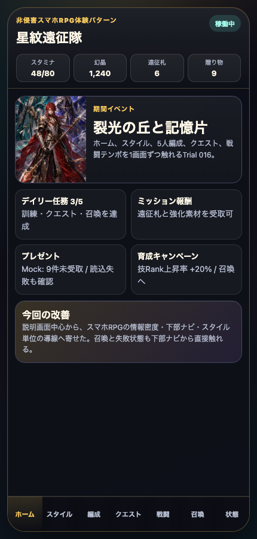
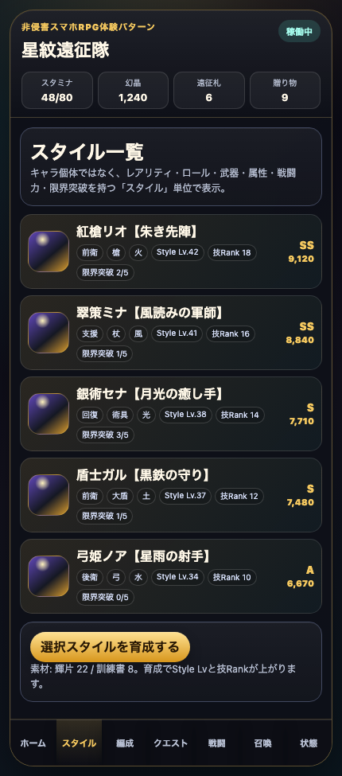
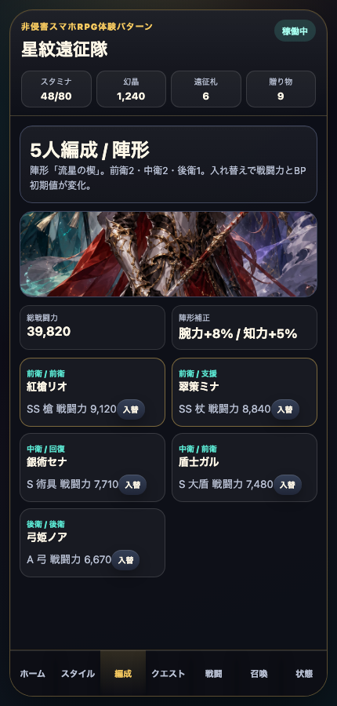
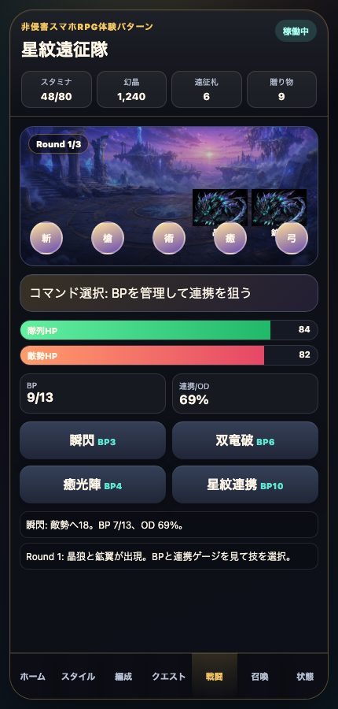
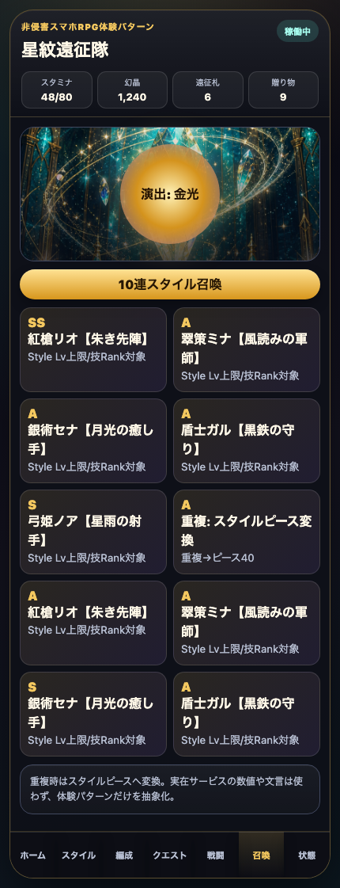

# AIDD Control Plane Dogfood 016：SagaForgeを「汎用RPG」からスマホキャラ収集RPGの骨格へ寄せる

> 2026-07-04 / Codex Mastery Lab  
> 対象: AIDD Control Plane Dogfood / キャラ収集ターン制RPG / Playable Preview改善  
> 結果: **触れるプレイアブル版に、ホーム高密度化、スタイルカード、5人編成、クエスト選択、Round/BP/連携ゲージ付きバトル、10連スタイル召喚を追加した。**

公開プレイアブル: `/sagaforge-app/index.html`



## ユーザー評価を受け止める

前回までのSagaForge / 星紋遠征隊は、ユーザーから「全然ロマサガRSとは程遠い」と評価された。

この指摘は妥当だった。前回までの弱さは、単に見た目が豪華ではないことではない。もっと根本的に、スマホのキャラ収集RPGでユーザーが期待する操作の骨格が足りなかった。

| 足りなかった点 | なぜ遠く感じたか |
| --- | --- |
| ホームが説明画面寄り | 上部リソース、イベント、ミッション、プレゼントなどの「毎日触る情報密度」が薄かった |
| キャラ単位の表示が中心 | キャラ収集RPGで重要な「スタイル」「レアリティ」「武器」「属性」「限界突破」「戦闘力」が弱かった |
| 編成が3〜4人の確認に近い | 5人編成、陣形、前衛/中衛/後衛、入れ替えによる戦力変化が薄かった |
| クエスト導線が弱い | 消費スタミナ、推奨戦力、初回報酬を見て出撃する流れが足りなかった |
| 戦闘が単純 | Round、BP、複数スキル、連携/OD風ゲージ、敵複数、ログ、勝利報酬のテンポが足りなかった |
| 召喚結果が抽象的 | 10連結果がスタイルカードとして並び、重複時ピース変換を想起できる形になっていなかった |

今回の判断は、記事より先に「触れるプレイアブルURL」を改善すること。文章で説明する前に、ユーザーが開いて前より構造が近づいたと分かる状態を優先した。

## 今回潰した差分

### 1. ホームを高密度スマホRPG風にした

上部にスタミナ、幻晶、遠征札、贈り物を表示し、イベントバナー、デイリー任務、ミッション報酬、プレゼント、育成キャンペーンを置いた。


単なるプロトタイプ説明ではなく、「今日ログインして何を触るか」が見える入口へ寄せた。

### 2. スタイルカード一覧を追加した

キャラではなく「スタイル」単位で、次を表示するようにした。

- レアリティ: SS / S / A
- ロール: 前衛 / 支援 / 回復 / 後衛
- 武器種: 槍 / 杖 / 術具 / 大盾 / 弓
- 属性: 火 / 風 / 光 / 土 / 水
- 戦闘力
- Style Lv
- 技Rank
- 限界突破



「育成する」ボタンでStyle Lvと技Rankが上がる表示も入れた。まだ本格的な育成ツリーではないが、少なくともキャラ名だけの一覧からは前進した。

### 3. 5人編成と陣形を入れた

編成画面は、5人編成、陣形「流星の楔」、前衛2・中衛2・後衛1、総戦闘力、陣形補正を表示するようにした。



「入替」を押すと隊列が変わり、総戦闘力と補正が変化する。まだドラッグ入れ替えではないが、「編成を触ると数値が変わる」入口を作った。

### 4. クエスト選択からバトルへ遷移できるようにした

クエスト画面には、消費スタミナ、推奨戦力、初回報酬を表示した。

- 裂光の丘 1-1
- 記憶片の洞窟 HARD
- 遠征: 星霧の街道

選択して「出撃」を押すと戦闘画面へ移動する。HARDは条件不足を出せるようにし、失敗状態も残した。

### 5. 戦闘テンポを一段近づけた

戦闘には次を追加した。

- Round 1/3
- 複数敵
- 5人分の隊列マーカー
- 隊列HP / 敵勢HP
- BP 10/13
- 連携/OD風ゲージ
- 複数スキル: 瞬閃、双竜破、癒光陣、星紋連携
- BP不足ログ
- Round移行ログ
- 勝利報酬ログ



「ボタンでHPが少し変わる」だけではなく、BPを消費し、BPが回復し、連携ゲージが上がり、Roundが進む形にした。

### 6. 10連召喚をスタイルカード風にした

召喚画面では、10連結果をSS/S/Aのスタイルカードとして表示し、重複時はピース変換になる説明を入れた。公式確率、公式文言、公式UIコピーは使っていない。



### 7. 召喚・状態も下部ナビから直接触れるようにした

初回版ではホーム/スタイル/編成/クエスト/戦闘の5タブが中心で、召喚と失敗状態が導線として弱かった。今回の追加確認で、下部ナビを7タブにし、**召喚** と **状態** を常時触れる入口にした。これで「10連結果」と「通信エラー/スタミナ不足/決済失敗」をユーザーが迷わず試せる。

## 失敗状態も残した

Playableの状態画面では、次を切り替えられる。

- 通信エラー
- 読込タイムアウト
- スタミナ不足
- 決済失敗
- 編成条件不足

今回はmock backendそのものの拡張ではなく、静的プレイアブルの体験改善が中心。ただし、AIDD-Spec上の重要な観点である「成功状態だけを作らない」は維持した。

## 検証結果

| command | result |
| --- | --- |
| `python3 scripts/build_preview.py` | preview再生成成功 |
| `node scripts/capture-sagaforge-playable-trial016.mjs` | screenshots captured / Round visible / style cards確認 |
| `python3 -m http.server 4177 --directory preview` + `curl` | `/sagaforge-app/index.html` と主要画像がHTTP 200 |
| 公開プレイアブルURLのHEAD確認 | HTTP 200 |
| 公開プレイアブル主要画像のHEAD確認 | HTTP 200 |

terminal evidenceは次に保存した。

```text
experiments/character-collection-rpg-trial-001/artifacts/character-collection-rpg-trial-016/terminal/trial016-playable-improvement.txt
```

スクリーンショットは次に保存した。

```text
assets/2026-07-04-character-collection-rpg-trial-016-playable-home.png
assets/2026-07-04-character-collection-rpg-trial-016-style-cards.png
assets/2026-07-04-character-collection-rpg-trial-016-formation.png
assets/2026-07-04-character-collection-rpg-trial-016-battle-tempo.png
assets/2026-07-04-character-collection-rpg-trial-016-gacha-results.png
assets/2026-07-04-character-collection-rpg-trial-016-failure-state.png
```

## AIDD-Specへの戻し

```yaml
observed_gap:
  finding: 見た目のRPG化だけでは、ユーザーが期待するスマホキャラ収集RPGの体験構造に届かない
  risk: AIが「ファンタジー風の絵」「攻撃ボタン」「召喚ボタン」だけで満足し、ホーム/スタイル/編成/クエスト/戦闘テンポの関係を落とす
ideal_state:
  - ホームに日次導線とリソースを置く
  - キャラではなくスタイル単位で育成・レアリティ・武器・属性・戦闘力を表す
  - 5人編成、陣形、前衛/後衛、入れ替えによる数値変化を持つ
  - クエスト選択からバトルへ進める
  - 戦闘にRound、BP、連携/OD風ゲージ、複数敵、複数スキル、ログ、報酬を入れる
standard_update:
  document: AI Task Packet / Interaction Pattern Contract / Verification Evidence
  field: character_collection_rpg_core_loop
codex_prompt_delta: |
  キャラ収集RPGプロトタイプでは、単なるファンタジーUIではなく、ホーム、スタイル一覧、5人編成、クエスト選択、BP/連携ゲージ付きターン制バトル、10連スタイル召喚、失敗状態を同じプレイアブルで触れるようにする。
verification:
  command: node scripts/capture-sagaforge-playable-trial016.mjs
  expected: ホーム、スタイルカード、編成入替、クエスト出撃、Round/BP/連携付き戦闘のスクリーンショットが保存される
```

## まだ遠い点

今回で「汎用RPG」からは少し離れたが、まだロマサガRS的な期待には遠い。

- 戦闘アニメーション、連携演出、OD発動の気持ちよさがまだ弱い
- スタイル育成が数値加算だけで、能力値上昇、技閃き、技Rank演出が弱い
- クエスト進行が1画面選択で、章/イベント/難易度/周回導線が薄い
- 編成入れ替えがボタン式で、装備・耐性・属性相性まで見られない
- 召喚演出が静的で、段階演出や結果の見せ方がまだ簡易
- Next.js本体への完全な戻し込みとmock backend E2Eは今回の主作業ではない

## 次に潰す差分

次回は、次の1〜3個に絞って改善する。

1. **戦闘テンポ強化**: OD発動、連携カットイン、技Rank上昇、勝利報酬ポップを追加する。  
2. **育成画面強化**: Style Lv、能力値、技Rank、素材消費、ピース限界突破を専用画面にする。  
3. **クエスト周回導線**: NORMAL/HARD、初回報酬、周回報酬、スタミナ不足から回復導線までつなげる。

## 今回の対応表

| skill / AGENTS.mdのルール | 今回防いだこと |
| --- | --- |
| ユーザー評価を受け止める | 「全然遠い」を単なる見た目不足ではなく、ホーム/スタイル/編成/戦闘テンポの不足として分解した |
| 記事化よりプレイアブル改善を優先 | `playables/sagaforge-app/index.html` を先に更新し、previewへコピーした |
| 実在IPをコピーしない | アプリ本体には実在IP名、公式素材、公式文言、公式確率を入れていない |
| 1サイクルで差分を1〜3個潰す | 今回はホーム高密度化、スタイル/5人編成、BP/連携付きバトルに集中した |
| 触れるURLを維持する | `/sagaforge-app/index.html` の公開HTTP 200と主要画像HTTP 200を確認した |

## 公開URL

公開URLはcronレポート側に記載する。記事本文にはローカル環境名や内部ホスト名を残さない。
