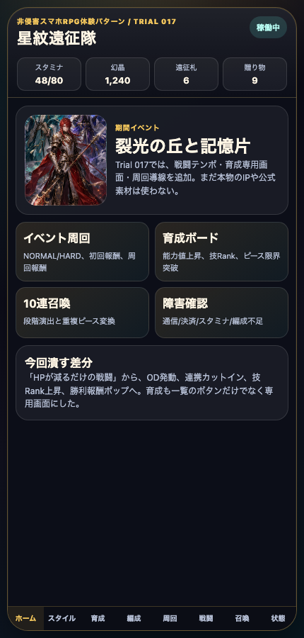
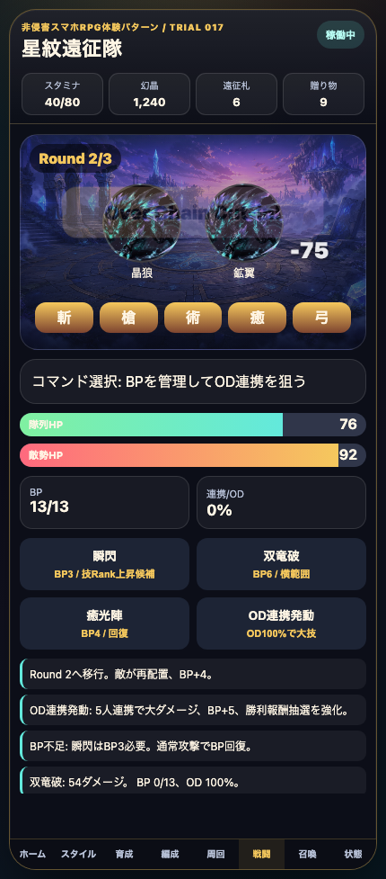
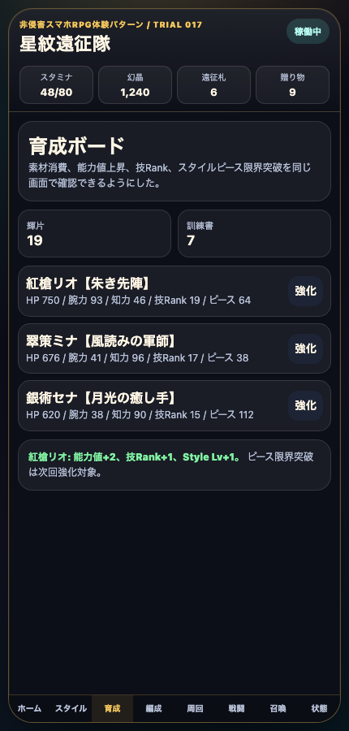
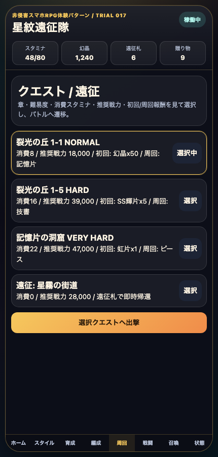
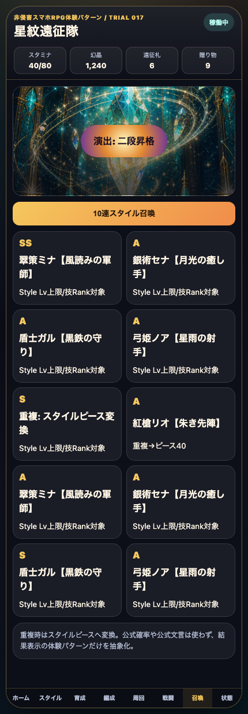
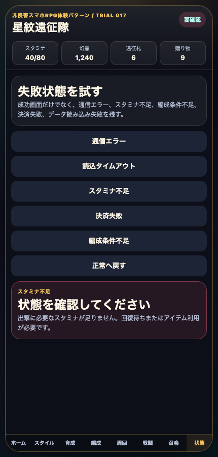

# AIDD Control Plane Dogfood 017：SagaForgeに戦闘テンポ・育成ボード・周回導線を足す

> 2026-07-04 / Codex Mastery Lab  
> 対象: AIDD Control Plane Dogfood / キャラ収集ターン制RPG / Playable Preview改善  
> 結果: **公開プレイアブルに、OD連携発動、技Rank候補ログ、育成専用画面、NORMAL/HARD/VERY HARDの周回導線、スタミナ消費を追加した。**

公開プレイアブル: `/sagaforge-app/index.html`



## 前回の何がロマサガRSから遠かったか

前回Trial 016で、ホーム、スタイル、5人編成、クエスト、Round/BP/連携ゲージ、10連召喚までは入った。これは「汎用ファンタジーRPG」から「スマホキャラ収集RPGの骨格」へ寄せる第一段階としては前進だった。

ただし、まだ遠かった点は明確だった。

| まだ遠かった点 | 体験上の不足 |
| --- | --- |
| 戦闘がまだ軽い | OD風ゲージはあったが、発動・カットイン・大ダメージ・報酬ログの気持ちよさが弱かった |
| 育成が一覧内の小ボタンだけ | Style Lv、能力値、技Rank、素材消費、ピースの関係が専用画面として見えなかった |
| クエストが単発選択に近い | NORMAL/HARD/VERY HARD、初回報酬、周回報酬、スタミナ消費の「周回する理由」が薄かった |

今回も、記事を厚くする前に `playables/sagaforge-app/index.html` を直接改善した。

## 今回どの差分を潰したか

### 1. 戦闘テンポを一段上げた

戦闘画面に次を追加した。

- `OD連携発動` コマンド
- OD不足時のログ
- OD発動時のカットイン風表示
- ダメージポップ
- 技Rank上昇候補ログ
- Round移行時のBP回復
- 勝利報酬ログ



まだアニメーションは簡易だが、「BPを使う」「ODを溜める」「ODで大きく削る」「Roundが進む」という戦闘テンポの差分を潰した。

### 2. 育成ボードを専用タブにした

前回の育成はスタイル一覧の下にあるボタンだった。今回は下部ナビに **育成** を追加し、専用画面にした。

表示する情報は次の通り。

- 輝片
- 訓練書
- HP
- 腕力
- 知力
- 技Rank
- スタイルピース
- 強化後の能力値変化ログ



これで「キャラカードが並ぶだけ」から、「素材を消費してスタイルを育てる」方向に一歩近づいた。

### 3. クエストを周回導線に寄せた

クエスト画面は、単発の出撃リストではなく、難易度と報酬を見て周回する形に寄せた。

- 裂光の丘 1-1 NORMAL
- 裂光の丘 1-5 HARD
- 記憶片の洞窟 VERY HARD
- 遠征: 星霧の街道

それぞれに、消費スタミナ、推奨戦力、初回報酬、周回報酬を表示した。



出撃するとスタミナが減る。推奨戦力やスタミナが足りない場合は失敗状態として表示する。

### 4. 召喚と失敗状態は維持した

10連召喚は、Trial 016のスタイルカード形式を維持した。重複時ピース変換も残している。



失敗状態も、通信エラー、タイムアウト、スタミナ不足、決済失敗、編成条件不足を触れる状態にした。



## 検証結果

| command | result |
| --- | --- |
| `python3 scripts/build_preview.py` | preview再生成成功 |
| `node scripts/capture-sagaforge-playable-trial017.mjs` | 6枚のスクリーンショット取得、育成/周回/OD戦闘/召喚/失敗状態を確認 |
| `npm test -- --runInBand` | root preview test成功 |
| `curl` ローカルpreview | `/sagaforge-app/index.html` と主要画像がHTTP 200 |
| 公開URL HEAD確認 | `/sagaforge-app/index.html` と主要画像がHTTP 200 |

terminal evidence:

```text
experiments/character-collection-rpg-trial-001/artifacts/character-collection-rpg-trial-017/terminal/trial017-preview-test-capture.txt
experiments/character-collection-rpg-trial-001/artifacts/character-collection-rpg-trial-017/terminal/trial017-public-url-check.txt
```

## AIDD-Specへの戻し

```yaml
observed_gap:
  finding: ホーム/スタイル/編成が入っても、戦闘テンポと育成/周回導線が薄いと期待するスマホキャラ収集RPGから遠く感じる
  risk: AIが「カード一覧」「攻撃ボタン」「ガチャ結果」だけで満足し、毎日周回して育成する理由を作れない
ideal_state:
  - BP/OD/連携/技Rank/報酬ログを戦闘ループ内で見せる
  - 育成は専用画面で、素材・能力値・技Rank・ピースを同時に扱う
  - クエストは難易度、スタミナ、推奨戦力、初回/周回報酬を持つ
standard_update:
  document: Interaction Pattern Contract / Character Collection RPG Template
  field: battle_growth_farming_loop
codex_prompt_delta: |
  キャラ収集RPGのプレイアブルでは、単なる攻撃ボタンではなく、BP消費、OD/連携発動、技Rank上昇候補、Round移行、勝利報酬をログと画面演出で確認できるようにする。育成専用画面と周回クエスト導線も同時に用意する。
verification:
  command: node scripts/capture-sagaforge-playable-trial017.mjs
  expected: 育成ボード、クエスト周回、OD連携付き戦闘、召喚、失敗状態の画像が保存される
```

## まだ遠い点

- OD/連携演出はカットイン風テキストで、まだ本格的なアニメーションではない
- 技閃き、継承技、装備、耐性、属性相性が未実装
- 育成は素材消費と能力値上昇の入口で、スタイルピース限界突破の実処理はまだ浅い
- クエスト周回は選択と消費までで、リザルトから再戦するテンポが弱い
- Next.js本体とmock backend E2Eへの完全同期は今回の主作業ではない

## 次に潰す差分

次回は、1サイクルで次の1〜3個に絞る。

1. **リザルト→再戦導線**: 勝利後に報酬カード、再戦、育成へ移動を出す。  
2. **スタイルピース限界突破**: 重複召喚で増えたピースを育成画面で消費し、限界突破と戦闘力を変える。  
3. **連携演出強化**: 5人の行動順、連携名、ダメージ分割、OD後の爽快感を増やす。

## 今回の対応表

| skill / AGENTS.mdのルール | 今回防いだこと |
| --- | --- |
| ユーザー評価を受け止める | 「まだ遠い」を戦闘テンポ・育成・周回の不足として分解した |
| 記事化よりプレイアブル改善を優先 | 先に `playables/sagaforge-app/index.html` を更新し、previewへコピーした |
| 1サイクルで差分を1〜3個潰す | 今回は戦闘テンポ、育成ボード、周回導線に絞った |
| 実在IPをコピーしない | アプリ本体には実在IP名、公式素材、公式文言、公式確率を入れていない |
| 触れるURLを維持する | 公開プレイアブルと主要画像のHTTP 200を確認した |

## 公開URL

公開URLはcronレポート側に記載する。記事本文にはローカル環境名や内部ホスト名を残さない。
