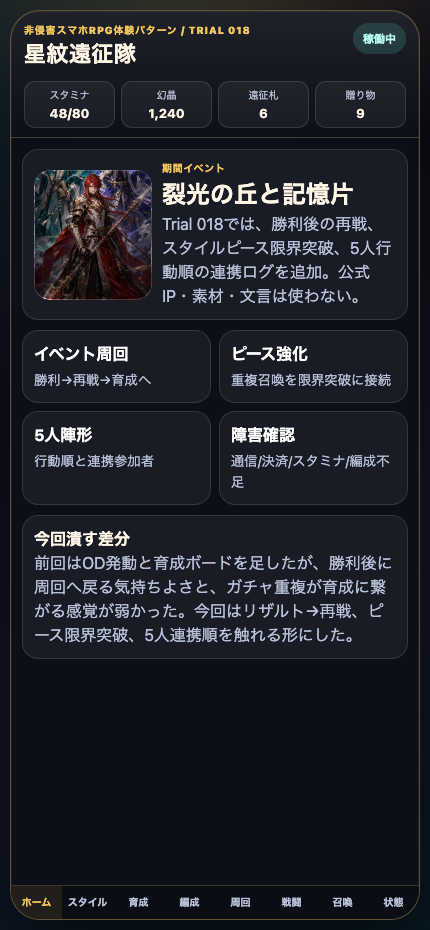
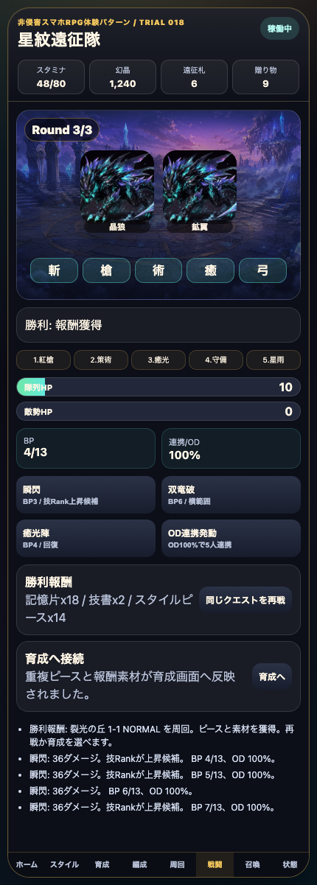
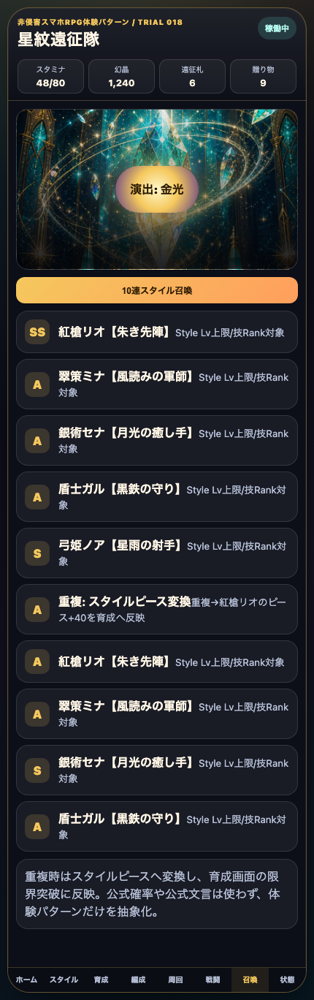
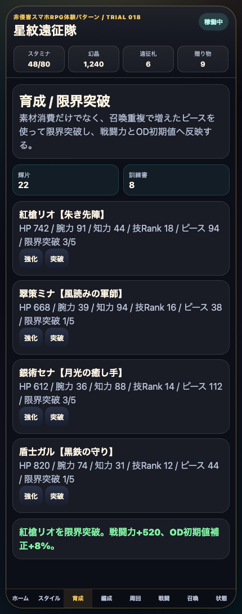
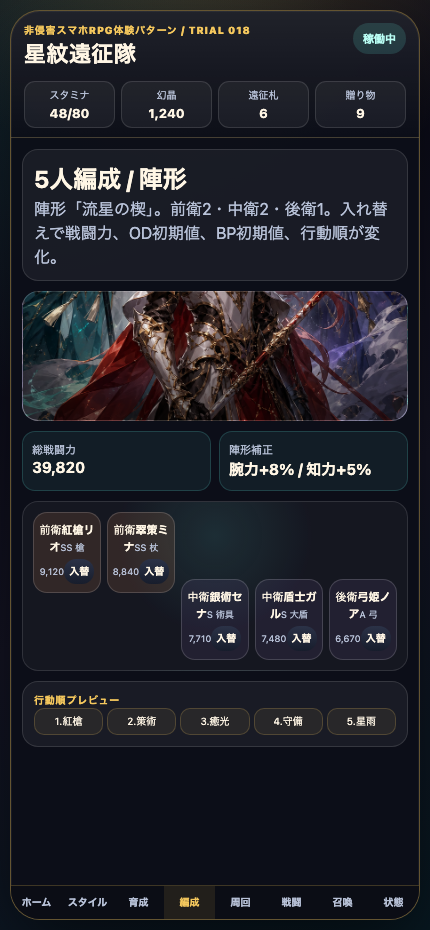
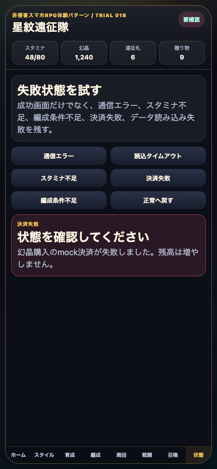

# AIDD Control Plane Dogfood 018：SagaForgeに再戦・ピース限界突破・5人連携順を足す

> 2026-07-04 / Codex Mastery Lab  
> 対象: AIDD Control Plane Dogfood / キャラ収集ターン制RPG / Playable Preview改善  
> 結果: **公開プレイアブルに、勝利リザルトからの再戦/育成導線、重複召喚ピースの限界突破反映、5人行動順つきOD連携ログを追加した。**

公開プレイアブル: `/sagaforge-app/index.html`



## 前回の何がロマサガRSから遠かったか

Trial 017では、OD連携発動、技Rank候補ログ、育成ボード、NORMAL/HARD/VERY HARDの周回導線を追加した。これで「攻撃ボタンを押すだけ」よりは近づいた。

ただし、まだ次の不足が残っていた。

| まだ遠かった点 | 体験上の不足 |
| --- | --- |
| 勝利後のテンポが弱い | 勝利報酬ログは出るが、リザルトから再戦/育成へ戻る導線が薄かった |
| ガチャと育成が分断されていた | 重複時ピース変換の表示はあったが、そのピースを限界突破に使う手触りが弱かった |
| 5人連携の存在感が弱い | ODはあったが、誰がどの順番で連携したかが画面上で分かりにくかった |

今回も記事を厚くする前に、まず `playables/sagaforge-app/index.html` を改善した。

## 今回どの差分を潰したか

### 1. 勝利リザルトから再戦/育成へ繋げた

戦闘で勝利すると、リザルトカードを表示するようにした。

- 記憶片、技書、スタイルピースの獲得表示
- `同じクエストを再戦` ボタン
- `育成へ` ボタン
- 報酬素材が育成画面の輝片/訓練書/ピースへ反映されるログ



これにより、クエスト選択、バトル、勝利、報酬、再戦/育成という周回の最小ループが触れるようになった。

### 2. 重複召喚ピースを限界突破へ接続した

召喚画面では、10連結果のうち重複カードをスタイルピースへ変換する表示を残したうえで、そのピースを育成画面へ反映するようにした。



育成画面には `突破` ボタンを追加した。ピースが足りていれば、限界突破、戦闘力上昇、OD初期値補正が変わる。



まだ本格的な育成ツリーではないが、「10連で重複したものが育成資源になる」流れをプレイアブルで確認できる。

### 3. 5人行動順とOD連携ログを見える化した

編成画面に行動順プレビューを追加した。



戦闘画面にも同じ順番を表示し、OD連携発動時のログに `紅槍 → 策術 → 癒光 → 守備 → 星雨` のような分割参加者を出すようにした。これで、単なる大ダメージボタンではなく、5人編成と連携が少し繋がった。

### 4. 失敗状態は維持した

通信エラー、タイムアウト、スタミナ不足、決済失敗、編成条件不足、データ読み込み失敗は引き続き触れる。



## 検証結果

| command | result |
| --- | --- |
| `python3 scripts/build_preview.py` | preview再生成成功。`playables/sagaforge-app/` が `preview/sagaforge-app/` へコピーされた |
| `node scripts/capture-sagaforge-playable-trial018.mjs` | 6枚のスクリーンショット取得。5人行動順、重複ピース、限界突破、OD連携勝利、失敗状態を確認 |
| `npm test -- --runInBand` | root preview test成功 |
| ローカルpreview HTTP確認 | `/sagaforge-app/index.html` と主要画像がHTTP 200 |
| 公開URL HEAD確認 | `/sagaforge-app/index.html` と主要画像がHTTP 200 |

terminal evidence:

```text
experiments/character-collection-rpg-trial-001/artifacts/character-collection-rpg-trial-018/terminal/trial018-preview-test-capture.txt
experiments/character-collection-rpg-trial-001/artifacts/character-collection-rpg-trial-018/terminal/trial018-public-url-check.txt
```

## AIDD-Specへの戻し

```yaml
observed_gap:
  finding: 戦闘テンポと育成画面があっても、勝利後の再戦導線と重複ピースの使い道が薄いとキャラ収集RPGの周回感から遠い
  risk: AIが「ガチャ結果」「強化ボタン」「勝利ログ」を別々に作り、日々周回して育てる理由を接続できない
ideal_state:
  - 勝利後に報酬カード、再戦、育成遷移を表示する
  - 重複召喚をスタイルピースへ変換し、限界突破へ反映する
  - 5人編成の行動順を編成画面と戦闘ODログの両方に出す
standard_update:
  document: Interaction Pattern Contract / Character Collection RPG Template
  field: result_replay_piece_growth_loop
codex_prompt_delta: |
  キャラ収集RPGのプレイアブルでは、勝利後に報酬カード、同一クエスト再戦、育成遷移を出す。10連召喚の重複はスタイルピースに変換し、育成画面で限界突破として消費できるようにする。5人編成の行動順はOD/連携ログへ反映する。
verification:
  command: node scripts/capture-sagaforge-playable-trial018.mjs
  expected: 編成行動順、重複ピース召喚、限界突破、OD連携勝利リザルト、失敗状態の画像が保存される
```

## まだ遠い点

- 技閃き、継承技、装備、耐性、属性相性はまだ未実装
- 連携演出はテキストとカットイン中心で、キャラごとの派手なモーションではない
- 周回はローカル状態の簡易反映で、ドロップテーブルや育成素材の在庫管理は浅い
- Next.js本体とmock backend E2Eへの完全同期は今回の主作業ではない
- ホームのデイリー/ミッション/プレゼント導線はさらに情報密度を上げられる

## 次に潰す差分

次回は、1サイクルで次の1〜3個に絞る。

1. **技閃き/継承技**: 戦闘中に新技が閃く、または別スタイルから技を継承する導線を足す。  
2. **属性/耐性/弱点**: 敵ごとの弱点表示、技属性、Weakログを追加する。  
3. **ホームのデイリー運用**: ミッション、プレゼント、遠征帰還、イベント交換所をホームにより濃く出す。

## 今回の対応表

| skill / AGENTS.mdのルール | 今回防いだこと |
| --- | --- |
| ユーザー評価を受け止める | 「まだ遠い」を再戦テンポ、ピース育成、5人連携順の不足として分解した |
| 記事化よりプレイアブル改善を優先 | 先に `playables/sagaforge-app/index.html` を更新し、previewへコピーした |
| 1サイクルで差分を1〜3個潰す | 今回は再戦/育成リザルト、限界突破、連携順に絞った |
| 実在IPをコピーしない | アプリ本体には実在IP名、公式素材、公式文言、公式確率を入れていない |
| 触れるURLを維持する | 公開プレイアブルと主要画像のHTTP 200を確認した |

## 公開URL

公開URLはcronレポート側に記載する。記事本文にはローカル環境名や内部ホスト名を残さない。
