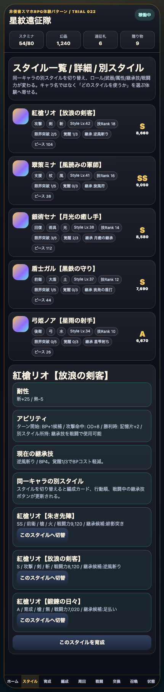
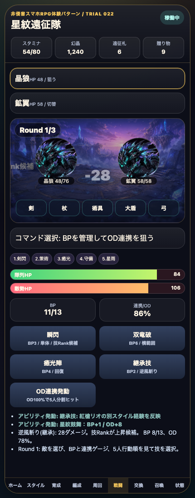

# SagaForge Trial 022: 同一キャラの複数スタイルと継承技をプレイアブルに入れる

前回までで、星紋遠征隊はホーム、5人編成、クエスト、Round制バトル、育成、召喚、交換所まで触れる状態になった。けれど、ユーザーの「全然ロマサガRSとは程遠い」という評価に照らすと、まだ大きな不足が残っていた。

> 注意: アプリ本体では実在IP、公式素材、商標、ロゴ、公式文言、公式確率、公式UIの完全コピーは使わない。この記事では、期待される体験パターンを説明する文脈としてのみ実在タイトル名に触れる。

## 前回の何がロマサガRSから遠かったか

Trial 021で交換所、スタイル詳細、耐性、アビリティ発動ログは入った。しかし、まだ次の点が弱かった。

| 不足 | なぜ遠く見えるか | 今回の扱い |
|---|---|---|
| 同一キャラの複数スタイル感が薄い | 「キャラを1枚持つ」一般的RPGに見え、スタイル収集・使い分けの判断がない | スタイル詳細に別スタイル候補を追加し、切替で編成と戦闘へ反映 |
| 継承技が説明止まり | スタイル詳細には継承技があったが、バトルで押せない | バトルに「継承技」コマンドを追加 |
| スタイル選択が編成テンポへつながらない | 詳細画面を見ても、行動順・戦力・コマンドが変わる感覚が薄い | 切替後に5人編成カード、行動順、武器表示、継承技ボタンを更新 |

## 今回どの差分を潰したか

今回のMVPは、見た目の豪華さではなく「スタイル単位で遊ぶ構造」を1段階だけ具体化することに絞った。

1. **別スタイル切替**
   - 紅槍リオ、翠策ミナ、銀術セナ、盾士ガル、弓姫ノアに別スタイル候補を追加。
   - 例: `紅槍リオ【朱き先陣】` から `紅槍リオ【放浪の剣客】` へ切替できる。

2. **継承技のバトル反映**
   - バトル画面に `継承技` ボタンを追加。
   - 現在スタイルの継承技名とBPコストが表示される。
   - 押すとログに「継承技: 別スタイル経験を反映」と出る。

3. **編成への反映**
   - 編成カードに `継承: 技名` を表示。
   - スタイル切替で総戦闘力、武器種、ロール、行動順ラベルが変わる。

## 触れる導線

- プレイアブル: プレビュー配信の `/sagaforge-app/index.html`

## スクリーンショット





## 実装メモ

変更対象は、安定して触れる静的プレイアブル版を優先した。

- `playables/sagaforge-app/index.html`
  - Trial 022へ更新。
  - `styleVariants` を追加。
  - `switchVariant()` で同一キャラの別スタイル切替を実装。
  - `useInheritedSkill()` で継承技コマンドを実装。
  - `renderParty()` で編成、行動順、バトルの武器表示、継承技ボタンを同期。
- `scripts/build_preview.py`
  - Trial 022記事と画像コピー対象を追加。
  - `playables/sagaforge-app/` が `preview/sagaforge-app/` にコピーされる状態を維持。

## 検証ログ

今回の検証は、静的プレイアブルを中心に行った。

```text
python3 scripts/build_preview.py
node /tmp/check-sagaforge-022.mjs
curl -I <preview-host>/sagaforge-app/index.html
curl -I <preview-host>/sagaforge-app/assets/party-key-art.png
```

主な確認内容:

- スタイル画面で別スタイル切替ボタンが表示される。
- 切替後、スタイル名・ロール・武器・継承技が画面に反映される。
- バトル画面に継承技ボタンがあり、クリックでログが増える。
- `scripts/build_preview.py` 後も `preview/sagaforge-app/index.html` が存在する。
- 公開URLと主要画像URLが `http=200` を返す。

## まだ遠い点

今回で「スタイル構造」は一歩近づいたが、まだロマサガRS的な期待には遠い。

- スタイル切替はあるが、**キャラ詳細・所持スタイル一覧・未所持スタイル表示** まではない。
- 技Rankや能力値上昇はログ中心で、**戦闘後リザルトの気持ちよさ** がまだ弱い。
- バトルはBP/OD/継承技があるが、**連携演出、行動順、敵行動、状態異常、耐性相性** はまだ薄い。
- ガチャは10連結果表示だけで、**演出段階、被りピース、天井/交換、スタイル詳細への遷移** が弱い。

## 次に潰す差分

次回は、次の1〜3個に絞る。

1. **戦闘リザルト強化**
   - HP、能力値、技Rank、スタイル経験値、報酬カードをもっと気持ちよく表示する。
2. **敵行動と耐性/弱点**
   - ただ殴るだけでなく、弱点属性、Resist、敵の全体攻撃、回復判断を入れる。
3. **ガチャからスタイル詳細へ**
   - 10連結果のカードを押すと、スタイル詳細/育成/編成へ移動できるようにする。

## AIDD-Specへの学び

今回の差分は、AIDD Task Packetに「キャラ収集RPG」とだけ書いても不足することを示している。必要なのは、次のような具体的な体験契約だった。

- キャラではなくスタイル単位でカードを持つ。
- 同一キャラに複数スタイルがある。
- 別スタイルの技を継承候補として表示する。
- 継承技は説明だけでなく、戦闘コマンドとして触れる。
- スタイル切替は編成戦力、行動順、戦闘UIへ反映される。

これは「完成イメージを雑に伝える」だけでは抜けやすい。料理のレシピで言えば、材料名だけでなく、下ごしらえ、火加減、盛り付けまで書く必要がある。AIDD-Specでは、この粒度をAI Task Packetの受け入れ条件に入れるべきだと分かった。
