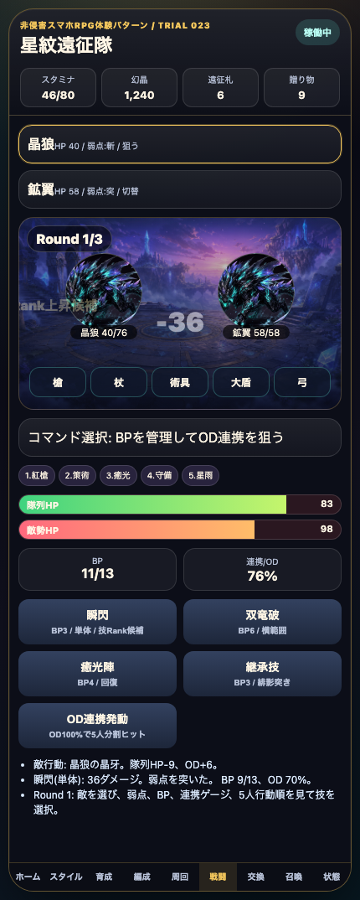
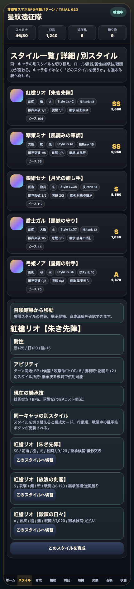

# SagaForge Trial 023: 敵行動・弱点・勝利リザルト・召喚詳細導線を足す

前回までで、星紋遠征隊はホーム、スタイル、5人編成、クエスト、BP/OD風バトル、育成、召喚、交換所まで触れる状態になった。けれど、ユーザーの「全然ロマサガRSとは程遠い」という評価に照らすと、まだ単なる一般的なファンタジーRPGに見える部分が残っていた。

> 注意: アプリ本体では実在IP、公式素材、商標、ロゴ、公式文言、公式確率、公式UIの完全コピーは使わない。この記事では、期待される体験パターンを説明する文脈としてのみ実在タイトル名に触れる。

## 前回の何がロマサガRSから遠かったか

Trial 022では、同一キャラの複数スタイル、別スタイル切替、継承技コマンドを入れた。これは「キャラではなくスタイル単位で集める」方向へ寄せる改善だった。一方で、まだ次の不足があった。

| 不足 | なぜ遠く見えるか | 今回の扱い |
|---|---|---|
| 戦闘後の成長が弱い | 勝っても素材が増えるだけに見え、周回でキャラが伸びる感覚が薄い | 勝利リザルトに能力値、技Rank、スタイルEXP、次の判断を表示 |
| 敵が反撃しない | ボタンを押すだけのデモに見え、ターン制バトルの読み合いがない | 敵行動、被ダメ、回復判断、敗北導線を追加 |
| 弱点・相性がない | どの技を選んでも同じで、BP/技選択の意味が薄い | 敵カードに弱点を表示し、Weak時にダメージ/OD/ログを変化 |
| 召喚結果が行き止まり | 10連結果を見ても育成や編成に戻る理由が弱い | 結果カードクリックでスタイル詳細へ遷移、重複ピースを反映 |

## 今回どの差分を潰したか

今回のMVPは「周回する理由がある」手触りを1段階だけ強くすることに絞った。

1. **敵行動と弱点表示**
   - 敵カードに `弱点: 斬 / 突 / 陽 / 術` を表示。
   - スキル選択後、敵が `晶牙` や `翼刃` で反撃する。
   - HPが低いとログに「回復判断が必要」と出る。

2. **WeakとBP/ODの意味づけ**
   - 弱点を突くと `Weak! 技Rank上昇候補` と表示。
   - Weak時はダメージとOD上昇が増え、どの技を押すかに少し意味が出た。

3. **勝利リザルトの強化**
   - 勝利後に `能力値アップ`、`技Rank+1`、`スタイルEXP`、`勝利報酬` をカード表示。
   - `育成へ`、`交換所へ`、`編成を見直す` の導線を並べた。

4. **召喚結果からスタイル詳細へ**
   - 10連結果カードを押すとスタイル詳細へ移動する。
   - 重複カードでは追加ピースを入れ、限界突破候補として見せる。

## 触れる導線

- プレイアブル: プレビュー配信の `/sagaforge-app/index.html`
- 推奨確認順: ホーム → 周回 → 出撃 → 戦闘で敵弱点を見てスキル選択 → 勝利リザルト → 召喚 → 結果カードクリック → スタイル詳細

## スクリーンショット





## 実装メモ

変更対象は、ユーザーがすぐ触れる静的プレイアブル版を優先した。

- `playables/sagaforge-app/index.html`
  - Trial 023へ更新。
  - `weaknessBonus()` を追加し、敵弱点とWeakログを実装。
  - `enemyTurn()` を追加し、敵反撃、被ダメ、回復判断、敗北導線を実装。
  - `nextRound()` の敵データに弱点、攻撃力、技名を追加。
  - 勝利リザルトに能力値、技Rank、スタイルEXP、次の判断カードを追加。
  - `openGachaStyle()` を追加し、召喚結果カードからスタイル詳細へ遷移。
- `scripts/build_preview.py`
  - Trial 023記事と画像コピー対象を追加。
  - `playables/sagaforge-app/` が `preview/sagaforge-app/` にコピーされる状態を維持。

## 検証ログ

今回の検証は、静的プレイアブルのDOM操作とプレビュー生成を中心に行った。

```text
python3 scripts/build_preview.py
node /tmp/check-sagaforge-023.mjs
curl -I <preview-host>/sagaforge-app/index.html
curl -I <preview-host>/sagaforge-app/assets/party-key-art.png
```

主な確認内容:

- 公開URLが `http=200` を返す。
- 主要画像が `http=200` を返す。
- 戦闘画面で敵弱点が見える。
- スキル実行後に敵行動ログが増える。
- 召喚結果カードを押すとスタイル詳細へ移動する。
- `scripts/build_preview.py` 後も `preview/sagaforge-app/index.html` が存在する。

## まだ遠い点

今回で「戦闘と周回の意味」は少し近づいたが、まだロマサガRS的な期待には遠い。

- 敵行動は入ったが、**状態異常、耐性、全体/単体の見極め、敵ごとの行動パターン** はまだ薄い。
- 勝利リザルトはカード化したが、**能力値アップ演出やテンポの気持ちよさ** はまだ弱い。
- 召喚結果から詳細へ行けるが、**未所持/所持済み、天井/交換、提供一覧風の判断材料** はまだない。
- 編成は5人と陣形があるが、**陣形位置による被弾、ロール別の役割、オート周回判断** が弱い。

## 次に潰す差分

次回は、次の1〜3個に絞る。

1. **陣形位置と敵攻撃対象**
   - 前衛が狙われやすい、後衛が安全、盾役がかばう、などを入れる。
2. **勝利リザルト演出**
   - 能力値アップを順番に表示し、周回で伸びる気持ちよさを強める。
3. **召喚から交換/突破へ**
   - 重複ピースを限界突破ボタンへ直結し、召喚→育成のループを短くする。

## AIDD-Specへの学び

「キャラ収集RPG」とだけ書いても、AIは見た目だけのカードやバトルボタンを作りがちだった。今回の改善から、AI Task Packetには次のような受け入れ条件が必要だと分かる。

- 敵には弱点、攻撃、行動ログがある。
- プレイヤーの技選択はBP、OD、Weak、被ダメに影響する。
- 勝利後は素材だけでなく、能力値、技Rank、スタイルEXPが表示される。
- 召喚結果は行き止まりではなく、スタイル詳細、育成、限界突破へ接続する。

料理のレシピで言えば、「カレーを作る」だけでは足りない。具材を切る順番、炒める時間、味見のタイミングまで書くと再現性が上がる。同じように、AIDD-Specでは「どの画面が、次のどの判断へつながるか」をチェックリストに落とす必要がある。
