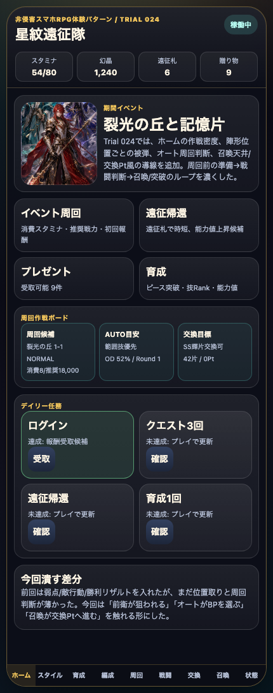
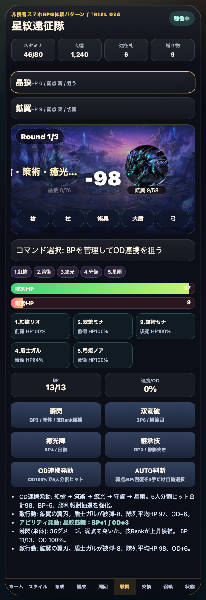
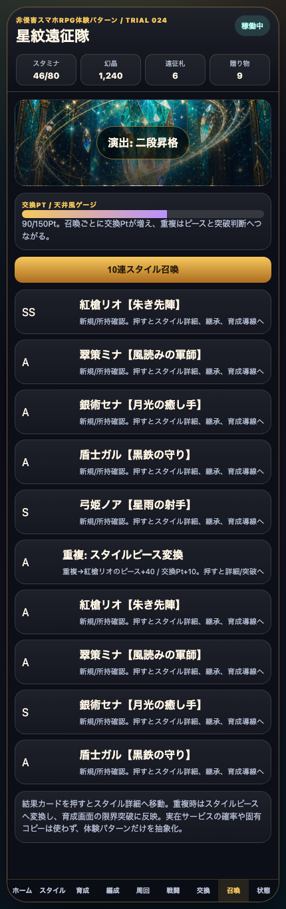

# SagaForge Trial 024: 陣形位置の被弾・AUTO判断・召喚交換Ptで周回ループを濃くする

前回までで、星紋遠征隊はホーム、スタイル、5人編成、クエスト、BP/OD風バトル、育成、召喚、交換所まで触れる状態になった。とはいえ、ユーザーからの「全然ロマサガRSとは程遠い」という評価に照らすと、まだ「キャラ収集スマホRPGの周回判断」よりも「ボタン付き一般RPG」に見える部分が残っていた。

> 注意: アプリ本体では実在IP、公式素材、商標、ロゴ、公式文言、公式確率、公式UIの完全コピーは使わない。この記事では、期待される体験パターンを説明する文脈としてのみ実在タイトル名に触れる。

## 前回の何がロマサガRSから遠かったか

Trial 023では敵行動、弱点、勝利リザルト、召喚結果からスタイル詳細へ進む導線を追加した。これで「戦闘後に育成へ戻る」流れは少し出たが、まだ次が弱かった。

| 不足 | なぜ遠く見えるか | 今回の扱い |
|---|---|---|
| 陣形が数値表示で止まる | 5人編成に見えても、位置によって狙われ方や守り方が変わらない | 陣形ごとの被弾予測と、戦闘中の位置HPを追加 |
| 周回判断が手動ボタンの集合 | スマホRPGらしい「AUTOで回すが、BP/OD/回復を見る」感覚が薄い | AUTO判断ボタンを追加し、弱点/BP/HPを3手だけ自動選択 |
| 召喚が10連結果で止まる | スタイル収集から交換Pt、重複ピース、限界突破へ戻る導線が弱い | 交換Pt/天井風ゲージと重複ピース説明を追加 |
| ホームの情報密度がまだ薄い | どこを周回し、何を交換し、今AUTOで何をするかが見えない | 周回作戦ボードを追加 |

## 今回どの差分を潰したか

今回のMVPは、見た目の豪華さではなく「周回前に判断する情報」と「戦闘中の位置意味」を増やすことに絞った。

1. **ホームに周回作戦ボードを追加**
   - 選択中クエスト、消費スタミナ、推奨戦力を表示。
   - AUTO目安として、BPがあるなら範囲技、足りなければBP温存と表示。
   - 記憶片と交換Ptの状態をホームで見えるようにした。

2. **陣形位置と被弾予測を追加**
   - 編成画面に「狙われやすい / 被弾低め」の予測を表示。
   - 戦闘画面に5人それぞれの位置HPを表示。
   - 敵行動ログが、誰に当たったかを出すようになった。

3. **AUTO判断を追加**
   - `AUTO判断` を押すと、弱点、BP、隊列HP、ODを見て3手だけ自動で技を選ぶ。
   - HPが低ければ回復、ODが溜まれば連携、突弱点なら範囲技、それ以外は低BP技を選ぶ。
   - 完全なオート周回ではないが、「周回テンポ」へ1段近づけた。

4. **召喚に交換Pt/天井風ゲージを追加**
   - 10連ごとに交換Ptが増える。
   - 重複はピースと限界突破候補として見せる。
   - 実在サービスの確率や固有UIは使わず、収集RPGの判断パターンだけを抽象化した。

## 触れる導線

- プレイアブル: プレビュー配信の `/sagaforge-app/index.html`
- 推奨確認順: ホーム → 周回作戦ボード → 編成 → 陣形変更 → 周回 → 戦闘 → AUTO判断 → 召喚 → 交換Pt/結果カード → スタイル詳細

## スクリーンショット







## 実装メモ

変更対象は、ユーザーがすぐ触れる静的プレイアブル版を優先した。

- `playables/sagaforge-app/index.html`
  - Trial 024へ更新。
  - `weeklyOps` 周回作戦ボードを追加。
  - 陣形ごとの被弾予測と `positionHp` を追加。
  - 敵行動が対象スタイル名と位置HPへ影響するように変更。
  - `autoBattlePlan()` を追加し、弱点/BP/OD/HPを見て3手だけ自動選択。
  - 召喚に `pity` 交換Pt風ゲージを追加。
- `scripts/build_preview.py`
  - Trial 024記事と画像コピー対象を追加。
  - `playables/sagaforge-app/` が `preview/sagaforge-app/` にコピーされる状態を維持。

## 検証ログ

今回の検証は、静的プレイアブルのDOM操作、スクリーンショット取得、プレビュー生成、公開URL 200確認を中心に行った。

```text
node --check <extracted script from playables/sagaforge-app/index.html>
python3 scripts/build_preview.py
pnpm exec playwright screenshot/DOM check for playable
curl -I <preview-host>/sagaforge-app/index.html
curl -I <preview-host>/sagaforge-app/assets/party-key-art.png
```

主な確認内容:

- ホームで `周回作戦ボード` が表示される。
- 編成画面で `被弾予測 / 位置役割` が表示される。
- 戦闘画面で `AUTO判断` と位置HPが表示される。
- AUTO判断後に敵行動ログと位置HPが更新される。
- 召喚画面で `交換Pt / 天井風ゲージ` が表示される。
- `scripts/build_preview.py` 後も `preview/sagaforge-app/index.html` が存在する。

## まだ遠い点

今回で「陣形の位置」「AUTO判断」「召喚交換Pt」は入ったが、まだロマサガRS的な期待には遠い。

- AUTOは3手の簡易判断で、実際の周回速度、演出スキップ、再戦継続までは弱い。
- 陣形位置の被弾は入ったが、かばう、カウンター、状態異常、耐性、バフ/デバフはまだ薄い。
- 召喚は交換Pt風になったが、未所持/所持済み一覧、交換所、ピックアップ切替はまだない。
- ホームの情報密度は上がったが、イベント複数本、ミッション報酬、プレゼント詳細、ショップ導線はまだ浅い。

## 次に潰す差分

次回は、次の1〜3個に絞る。

1. **AUTO周回の継続性**
   - 勝利後に同じクエストへ戻り、スタミナと報酬を見ながら再戦できる導線を強める。
2. **バフ/デバフ/状態異常**
   - 腕力低下、知力上昇、毒/麻痺風の状態をログとUIに出す。
3. **召喚交換所**
   - 交換Ptが一定値に達したら、対象スタイルやピースと交換できる導線を入れる。

## AIDD-Specへの学び

「5人編成」「ターン制バトル」「ガチャ」と書くだけでは、AIは画面部品を並べるだけになりやすい。今回の改善から、AI Task Packetには次のような受け入れ条件が必要だと分かる。

- 陣形は数値補正だけでなく、位置ごとの被弾や役割に影響する。
- AUTOは単なるランダム実行ではなく、HP、BP、OD、弱点の判断ログを残す。
- 召喚は結果表示だけでなく、交換Pt、重複ピース、限界突破、詳細確認へ接続する。
- ホームは説明ではなく、今どこを周回し、何を交換し、何を育成するかを示す。

料理のレシピで言えば、「材料を並べた」だけでは料理にならない。火加減、味見、盛り付け、次に食べる順番まで書くと体験が再現しやすくなる。同じように、AIDD-Specでは画面部品よりも「判断のつながり」を受け入れ条件にする必要がある。
