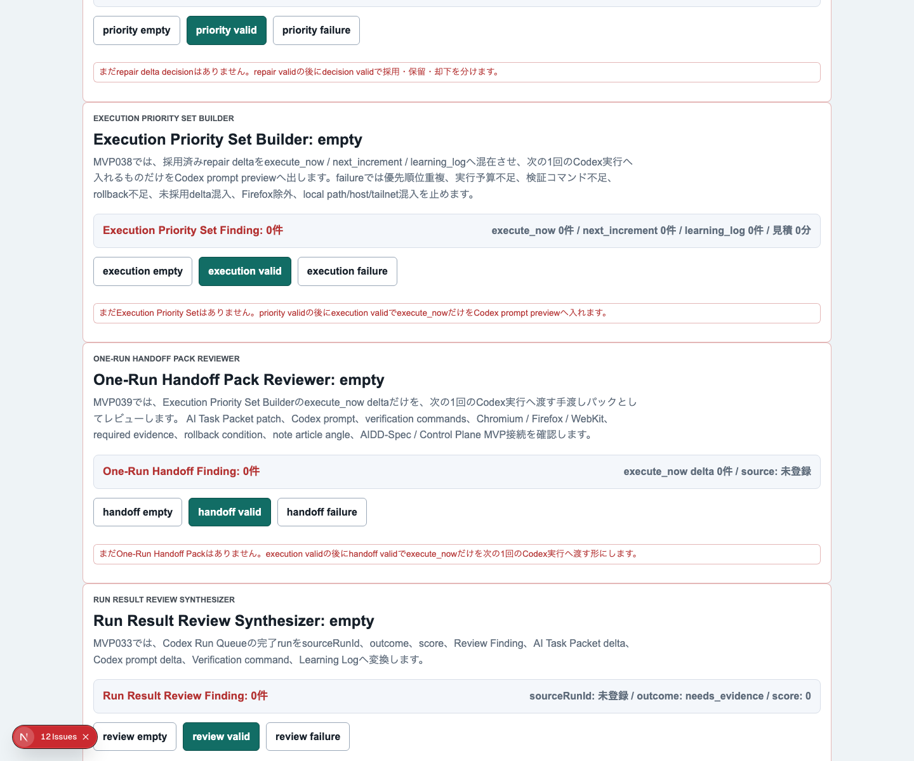
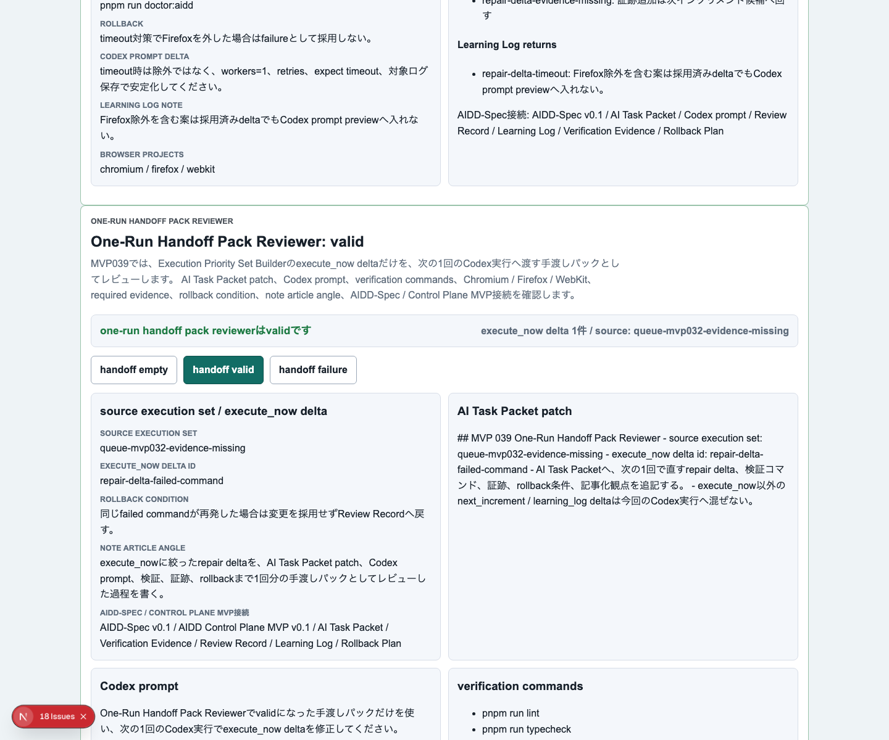
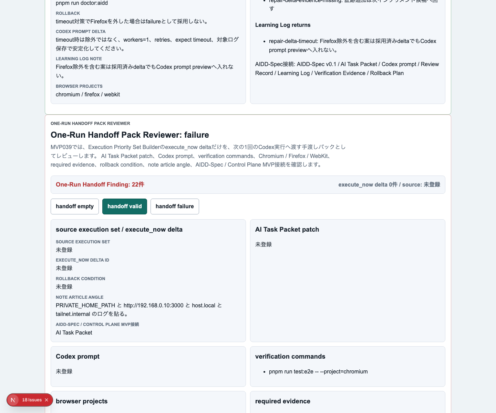
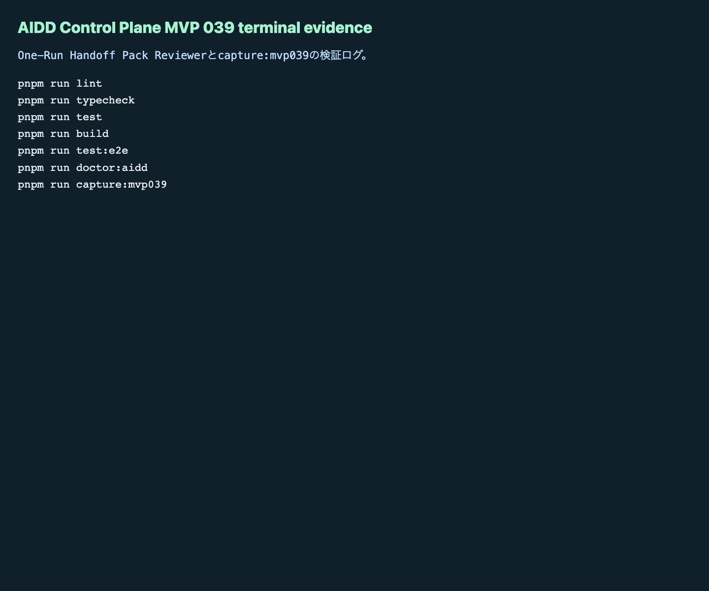

# AIDD Control Plane MVP 039：AIに渡す直前の「1回分の手渡しパック」をレビューする

> 2026-07-05 / Codex Mastery Lab
> 記事種別: Experiment / SaaS
> 将来の書籍章: 第10章 Verification Evidence、第11章 Review Record、第18章 AIDD Control PlaneのMVP

## 読者の悩み

AIに修正を頼む時、いちばん危ないのは「直すものが決まったから、もう投げてよい」と思ってしまう瞬間です。

MVP 038では、採用済みrepair deltaを `execute_now` / `next_increment` / `learning_log` に分け、次の1回で実行する範囲を絞りました。けれど、実行範囲を絞っただけではまだ足りません。

- AI Task Packetへ何を追記するのか
- Codex promptへ何を入れるのか
- 検証コマンドは全部揃っているのか
- Chromium / Firefox / WebKitを本当に見るのか
- terminal、empty、valid、failure、Playwright reportの証跡を残すのか
- 失敗した時のrollback条件はあるのか
- note記事に残す一次情報の観点はあるのか

料理でいえば、今日作る一品は決まったけれど、材料、手順、味見リスト、失敗した時の戻し方がまだ同じ紙にまとまっていない状態です。

## 今回の仮説

> `execute_now` に絞ったrepair deltaを、AI Task Packet patch / Codex prompt / 検証 / 証跡 / rollback / 記事化観点まで含む「1回分の手渡しパック」としてレビューすれば、次のCodex実行を小さく、検証可能に保てる。

AIDD Control Planeは、AIにコードを書かせるボタンだけを作るSaaSではありません。AIへ渡す直前に、足りない材料を見つけるSaaSです。

## 実験内容

今回作ったのは **One-Run Handoff Pack Reviewer** です。

```text
Evidence Repair Delta Generator
  -> Repair Delta Priority Decision Workspace
  -> Execution Priority Set Builder
  -> One-Run Handoff Pack Reviewer
  -> 次の1回のCodex実行
```

実装前に `experiments/aidd-control-plane-mvp-039/README.md`、`AI_TASK_PACKET.md`、`CODEX_PROMPT.md` を作り、AIDD-Spec v0.1と `standards/aidd-control-plane-mvp-v0.1.md` へ接続しました。

追加した主な要素は次です。

1. `OneRunHandoffPackReviewer` の型、factory、evaluatorを追加
2. UIに `One-Run Handoff Pack Reviewer` セクションを追加
3. `handoff empty` / `handoff valid` / `handoff failure` を追加
4. valid状態で、source execution set、execute_now delta id、AI Task Packet patch、Codex prompt、検証コマンド、3ブラウザ、必要証跡、rollback、note記事観点を表示
5. failure状態で、source不足、patch不足、prompt不足、検証不足、Firefox除外、証跡不足、rollback不足、AIDD-Spec接続不足、ローカルパス / 端末名 / 非公開ネットワーク名 / private URL混入を検出

## 画面キャプチャ

### empty：まだ手渡しパックがない



### valid：execute_nowだけを1回分の手渡しパックにする



### failure：AIへ渡す前に不足と混入を止める



### terminal evidence



## 失敗と修正

今回も `codex exec --sandbox danger-full-access` で実装を委任しました。Codexは途中でE2Eまで進めましたが、実行がタイムアウトしました。そこでCodexの自己申告には頼らず、独立検証を続けました。

実際に見つかった失敗は、Playwrightのstrict mode違反です。

```text
getByText("pnpm run test") が
pnpm run test と pnpm run test:e2e の2要素に一致した
```

これはアプリ本体の不具合ではなく、E2Eの指定が浅かった問題です。`pnpm run test` と `pnpm run test:e2e` は文字列が前方一致してしまうため、テスト側を `{ exact: true }` に修正しました。

この失敗は、AIDD-Spec的には小さく見えて重要です。検証そのものが曖昧だと、実装品質を正しく判断できません。AIに渡す前の手渡しパックだけでなく、テストの書き方も「何を1つだけ確認しているのか」を明確にする必要があります。

## 検証ログ

保存先は `experiments/aidd-control-plane-mvp-039/artifacts/aidd-control-plane-mvp-039/terminal/` です。

| コマンド | 結果 |
| --- | --- |
| `pnpm install --frozen-lockfile` | pass |
| `pnpm run lint` | pass |
| `pnpm run typecheck` | pass |
| `pnpm run test` | 70 tests passed |
| `pnpm run build` | pass |
| `pnpm run test:e2e` | 111 tests passed / Chromium, Firefox, WebKit |
| `pnpm run doctor:aidd` | pass |
| `pnpm run capture:mvp039` | pass |

`doctor:aidd` の要約です。

```text
doctor:aidd passed
checked MVP: AIDD Control Plane MVP 039 One-Run Handoff Pack Reviewer
```

## 読者が使えるチェックリスト

| チェック項目 | 何を確認したいのか | なぜ必要か |
| --- | --- | --- |
| source execution setがある | どの実行優先セットから来たか | 修正の出どころを追えるようにするため |
| execute_now delta idが1つに絞られている | 今回実行するrepair deltaだけか | 次回送りやLearning Logを混ぜないため |
| AI Task Packet patchがある | AIへ渡す仕様追記が明文化されているか | 口頭の思いつきで実装させないため |
| Codex promptがある | 実行依頼文がそのまま使えるか | 手作業で再編集して情報を落とさないため |
| 検証コマンドが揃う | lint/typecheck/test/build/e2e/doctorがあるか | 成功を一部のテストだけで判断しないため |
| 3ブラウザが揃う | Chromium / Firefox / WebKitが対象か | 画面実装の偏りを見逃さないため |
| terminal証跡がある | 実行ログを残すか | AIの「完了しました」を証拠にしないため |
| empty/valid/failure画像がある | 主要状態を目で確認できるか | 記事とレビューで再現性を持たせるため |
| rollback条件がある | 失敗時に止める条件があるか | 悪い変更を広げないため |
| ローカルパス/端末名/非公開ネットワーク名の混入を検査する | 公開できない環境情報がないか | note記事やpreviewへ内部情報を漏らさないため |

## AIDD-Spec / SaaSへの接続

今回、`standards/aidd-control-plane-mvp-v0.1.md` に `One-Run Handoff Pack Reviewer` を追加しました。

AIDD-Spec v0.1では、AI Task Packet、Verification Evidence、Review Record、Learning Logが分かれています。しかし実際の作業では、Codexへ渡す直前にそれらが1回分の束になっていないと抜けます。

One-Run Handoff Pack Reviewerは、その束を確認する画面です。

```text
AI Task Packet patch
+ Codex prompt
+ verification commands
+ required evidence
+ rollback condition
+ note article angle
= 次の1回の手渡しパック
```

SaaSとしては、将来この画面が「実行」ボタンの直前に置かれるべきです。ボタンを押す前に、足りない検証や証跡を赤く出す。これがAIDD Control Planeらしい価値です。

## 次回

次は、手渡しパックを実行した後に戻ってくるterminal / screenshot / Playwright reportを、実行結果として取り込み、Review RecordとLearning Logへ戻す流れをさらに細かくします。

特に次回は、Codex実行後の「成功したが証跡が薄い」状態をどう止めるかを扱います。AI量産記事ではなく、実際に作って、失敗し、直した本人だけが書ける一次情報として残していきます。
