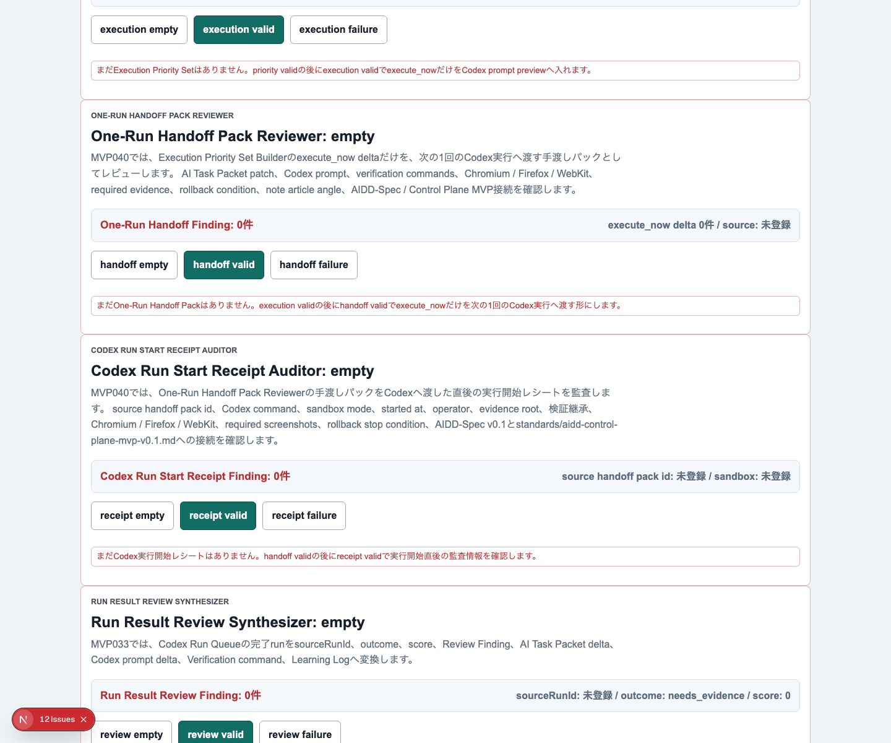
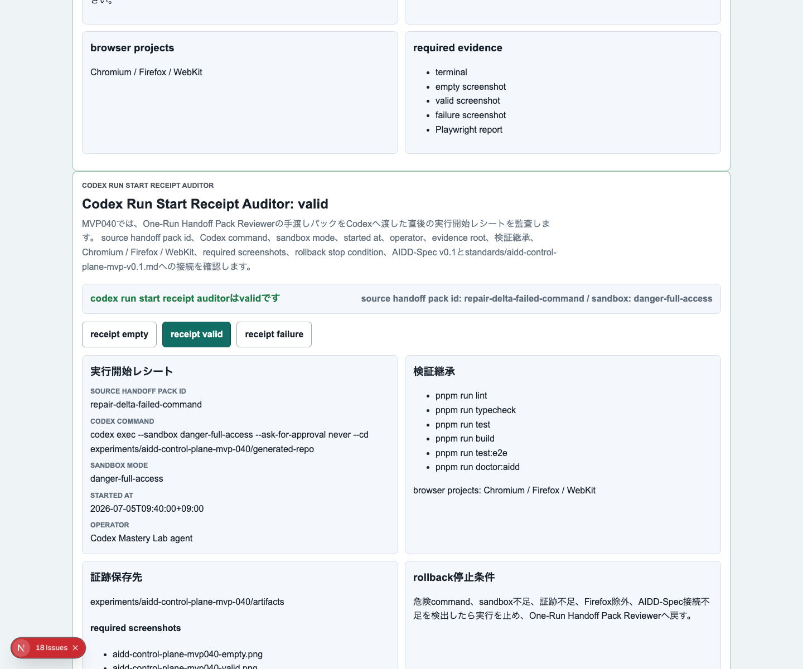
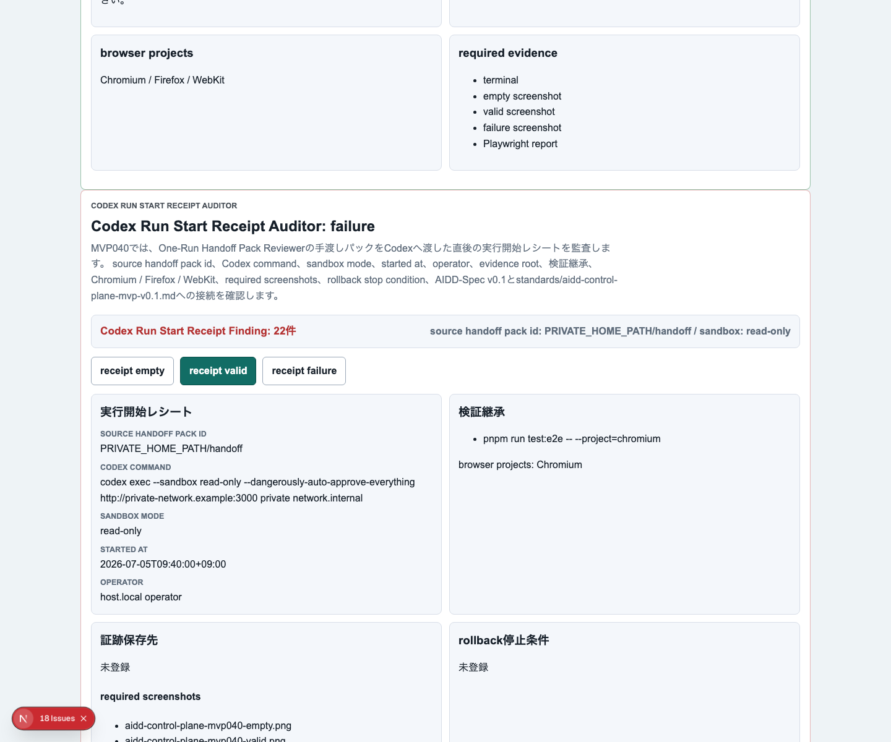
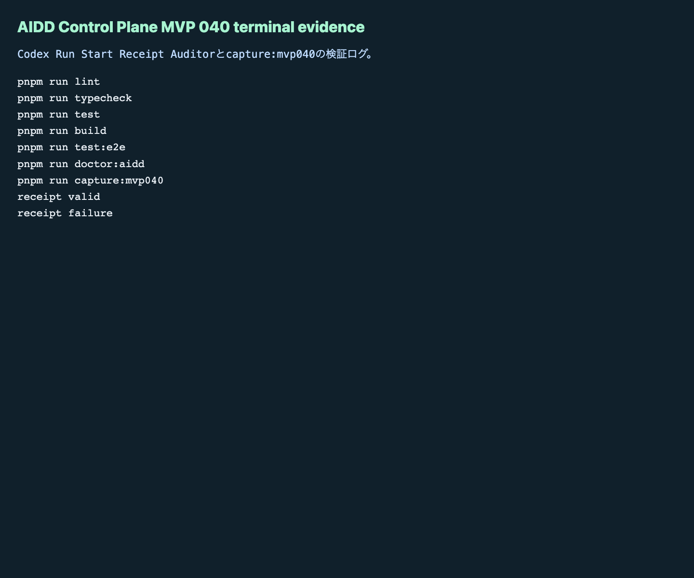

# AIDD Control Plane MVP 040：AIに投げた「その瞬間」のレシートを残す

> 2026-07-05 / Codex Mastery Lab  
> 記事種別: Experiment / SaaS  
> 将来の書籍章: 第10章 Verification Evidence、第11章 Review Record、第18章 AIDD Control PlaneのMVP

## 読者の悩み

AIに渡す指示を丁寧に作っても、実行した瞬間の記録が残っていないことがあります。

- どのAI Task Packetを投げたのか
- どのCodex commandを使ったのか
- sandbox modeは何だったのか
- 検証ログとスクリーンショットをどこへ保存する予定だったのか
- 3ブラウザE2Eを本当に引き継いだのか
- 失敗したらどこで止めるのか

MVP 039では、次の1回に渡す手渡しパックをレビューしました。けれど、手渡しパックを作っただけではまだ「実際に投げた記録」にはなりません。

宅配でたとえると、荷物の中身チェックは終わったけれど、受付番号・受付時刻・届け先・控えがない状態です。あとから問題が起きた時に追えません。

## 今回の仮説

> One-Run Handoff PackをCodexへ渡した直後に、command、sandbox、開始時刻、担当、証跡保存先、検証継承、rollback停止条件を「実行開始レシート」として固定すれば、後続のVerification Evidenceと記事化がぶれにくくなる。

AIDD Control Planeは、AIにコードを書かせるボタンではありません。AIに渡す前後の確認、証跡、レビュー、学習ログをつなぐSaaSです。

## 実験内容

今回作ったのは **Codex Run Start Receipt Auditor** です。

```text
One-Run Handoff Pack Reviewer
  -> Codex Run Start Receipt Auditor
  -> 独立検証
  -> Verification Evidence
  -> Review Record / Learning Log
```

実装前に `experiments/aidd-control-plane-mvp-040/README.md`、`AI_TASK_PACKET.md`、`CODEX_PROMPT.md` を作り、AIDD-Spec v0.1と `standards/aidd-control-plane-mvp-v0.1.md` へ接続しました。

追加した主な要素は次です。

1. `CodexRunStartReceiptAuditor` の型、factory、evaluatorを追加
2. UIに `Codex Run Start Receipt Auditor` セクションを追加
3. `receipt empty` / `receipt valid` / `receipt failure` を追加
4. valid状態で、source handoff pack id、Codex command、sandbox mode、started at、operator、evidence root、検証コマンド、3ブラウザ、必要画像、rollback停止条件、AIDD-Spec接続を表示
5. failure状態で、危険command、sandbox不足、evidence root不足、Firefox除外、terminal/failure screenshot不足、rollback不足、AIDD-Spec接続不足、local path / host / private network URL混入を検出

## 画面キャプチャ

### empty：まだ実行開始レシートがない



### valid：Codexへ渡した直後の条件を固定する



### failure：危険な実行条件と証跡不足を止める



### terminal evidence



## 失敗と修正

今回も `codex exec --sandbox danger-full-access` で実装を委任しました。ただしCodex CLIが通常PATHから見つからず、最初の実行は次で失敗しました。

```text
codex: command not found
```

環境にはCodex CLI自体は存在していたため、フルパスで起動して実装を進めました。この失敗は、AIDD Control Planeの題材そのものです。実行開始レシートには、単に「Codexを使った」と書くだけでなく、実際に使ったcommand、sandbox mode、証跡保存先、失敗時の戻し先が必要です。

Codex実行は途中でタイムアウトしましたが、変更は生成されていました。そこで自己申告を信用せず、独立検証を個別に実行しました。

## 検証ログ

保存先は `experiments/aidd-control-plane-mvp-040/artifacts/aidd-control-plane-mvp-040/terminal/` です。公開用ログはローカルパスを `<workspace>` へサニタイズしました。

| コマンド | 結果 |
| --- | --- |
| `pnpm install --frozen-lockfile` | pass |
| `pnpm run lint` | pass |
| `pnpm run typecheck` | pass |
| `pnpm run test` | 71 tests passed |
| `pnpm run build` | pass |
| `pnpm run test:e2e` | 114 tests passed / Chromium, Firefox, WebKit |
| `pnpm run doctor:aidd` | pass |
| `pnpm run capture:mvp040` | pass |

`doctor:aidd` の要約です。

```text
doctor:aidd passed
checked MVP: AIDD Control Plane MVP 040 Codex Run Start Receipt Auditor
```

## 読者が使えるチェックリスト

| チェック項目 | 何を確認したいのか | なぜ必要か |
| --- | --- | --- |
| source handoff pack idがある | どの手渡しパックを実行したか | あとから修正の出どころを追うため |
| Codex commandがある | 実際に投げたコマンドが分かるか | 「たぶんこの実行」では検証できないため |
| sandbox modeが明示されている | 実行権限が分かるか | 危険な自動実行や想定外の制限を見逃さないため |
| started at / operatorがある | いつ誰が開始したか | Review Recordで時系列を追うため |
| evidence rootがある | 証跡保存先が決まっているか | ログや画像が散らばるのを防ぐため |
| 検証コマンドが継承されている | lint/typecheck/test/build/e2e/doctorが残っているか | 手渡し時点で決めた品質ゲートを落とさないため |
| Chromium / Firefox / WebKitが揃う | 3ブラウザE2Eを維持しているか | 1ブラウザだけの成功を過信しないため |
| required screenshotsが揃う | empty/valid/failure/terminal evidenceを残すか | note記事とレビューで状態を目視確認するため |
| rollback停止条件がある | 失敗時にどこで止めるか | 悪い変更を広げないため |
| local path / host / private network URLを検査する | 公開できない環境情報が混じっていないか | previewやnoteへ内部情報を漏らさないため |

## SaaS / AIDD-Specへの接続

今回のMVPで、AIDD Control Planeの流れは「AIへ渡す前」から「AIへ渡した直後」へ進みました。

AIDD-Spec上は、AI Task Packetだけでなく、Verification EvidenceとReview Recordの入口になります。実行開始レシートがあると、後続で「このログはどの依頼の結果か」「どのスクリーンショットが不足しているか」「次回AI Task Packetへ何を戻すか」を機械的に扱いやすくなります。

## 次回

次は、実行開始レシートの後に実際の検証結果を束ねる **Verification Evidence Receipt / Command Result Binder** を進めるのが自然です。開始条件だけでなく、各コマンドのexit code、ログ、スクリーンショット、失敗分類を同じ単位で扱えるようにします。
