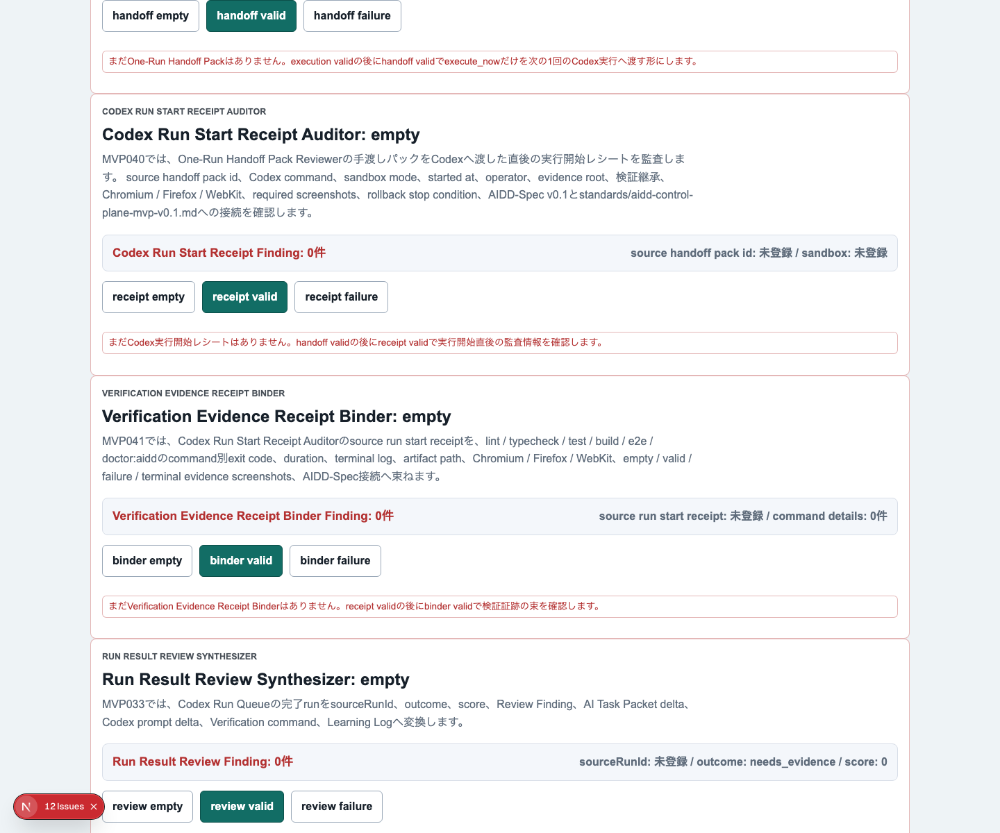
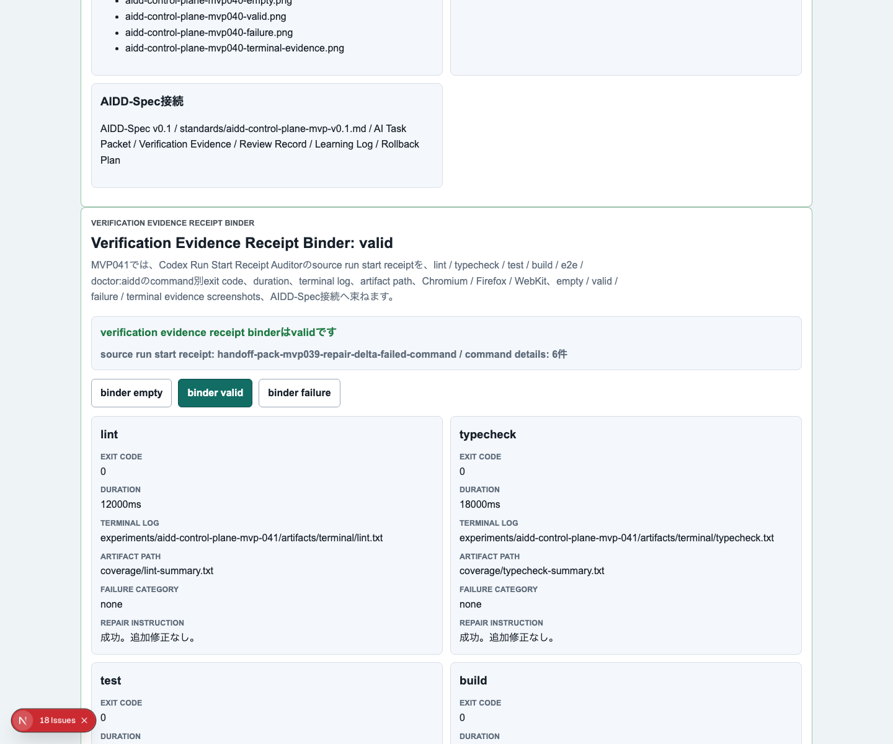
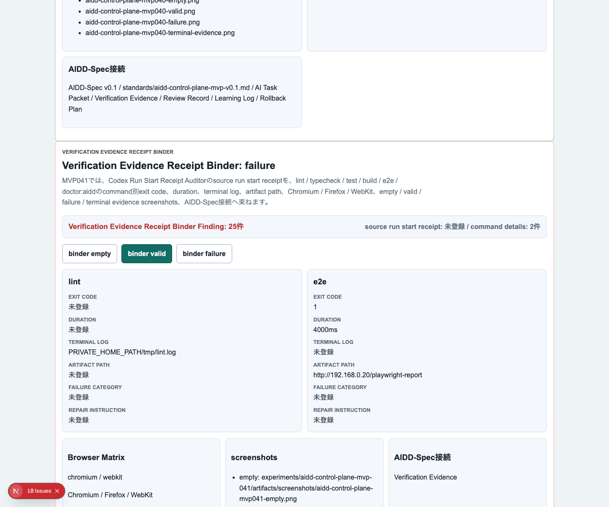
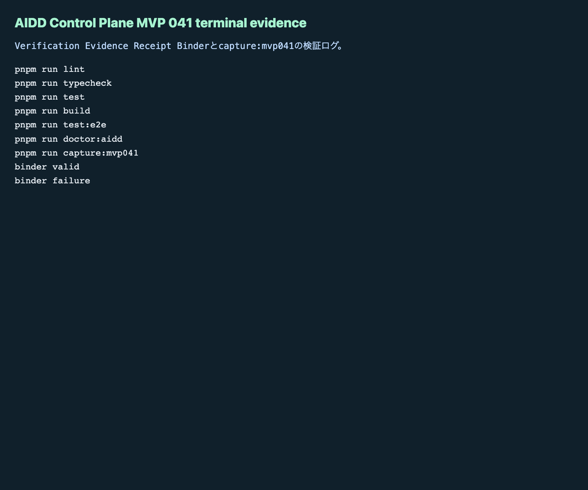

# AIDD Control Plane MVP 041：検証結果を「1行ずつ」束ねる

> 2026-07-05 / Codex Mastery Lab  
> 記事種別: Experiment / SaaS  
> 将来の書籍章: 第10章 Verification Evidence、第11章 Review Record、第18章 AIDD Control PlaneのMVP

## 読者の悩み

AIにコードを書かせたあと、最後にこういう報告を見たことがないでしょうか。

> lint、test、buildは通りました。

一見よさそうですが、これだけではあとから追えません。

- どのコマンドを個別に実行したのか
- exit codeはいくつだったのか
- ログはどこに残したのか
- Playwright reportやterminal evidenceはどこか
- Chromium / Firefox / WebKitを本当に全部回したのか
- 失敗したコマンドに修正指示が付いているのか

MVP 040では、Codexへ渡した直後の「実行開始レシート」を作りました。今回のMVP 041では、その次に必要な「検証結果のレシート明細」を作ります。

家計簿でたとえると、「今月の支出は大丈夫です」ではなく、レシート1枚ごとの金額、店名、日付、分類を残すイメージです。AI駆動開発でも、検証結果を1行ずつ残さないと、Review RecordやLearning Logへ戻せません。

## 今回の仮説

> Codex Run Start Receiptに紐づく lint / typecheck / test / build / e2e / doctor:aidd の結果を、exit code、duration、terminal log、artifact path、失敗分類、修正指示として束ねれば、Verification Evidenceから次回AI Task Packetへの戻しが機械的になる。

AIDD Control Planeは、AIにコードを書かせるボタンではありません。AIへ渡す前、渡した直後、検証した後、失敗を次回指示へ戻すところまでをつなぐSaaSです。

## 実験内容

今回作ったのは **Verification Evidence Receipt Binder** です。

```text
Codex Run Start Receipt Auditor
  -> Verification Evidence Receipt Binder
  -> Review Record
  -> Learning Log
  -> 次回AI Task Packet Delta
```

実装前に `experiments/aidd-control-plane-mvp-041/README.md`、`AI_TASK_PACKET.md`、`CODEX_PROMPT.md` を作り、AIDD-Spec v0.1と `standards/aidd-control-plane-mvp-v0.1.md` へ接続しました。

追加した主な要素は次です。

1. `VerificationEvidenceReceiptBinder` の型、factory、evaluatorを追加
2. UIに `Verification Evidence Receipt Binder` セクションを追加
3. `binder empty` / `binder valid` / `binder failure` を追加
4. valid状態で、source run start receipt、command別exit code、duration、terminal log、artifact path、3ブラウザ、スクリーンショット、AIDD-Spec接続を表示
5. failure状態で、source不足、command別detail不足、exit code不足、artifact不足、失敗分類不足、修正指示不足、Firefox除外、terminal/failure screenshot不足、doctor:aidd不足、local path / host / private network URL混入を検出

## 画面キャプチャ

### empty：まだ検証証跡レシートがない



### valid：検証コマンド結果を1つのレシートへ束ねる



### failure：証跡不足と浅い検証を止める



### terminal evidence



## 失敗と修正

今回も `codex exec --sandbox danger-full-access` で実装を委任しました。通常PATHではCodex CLIが見つからなかったため、実体のあるフルパスから実行しました。

また、Codex実行はタイムアウトしました。ここで自己申告を信用せず、生成済み差分を独立検証しました。最初のE2Eでは新規テストだけが3ブラウザで失敗しました。

原因は、Playwrightの strict mode です。画面内に `Chromium / Firefox / WebKit` や `失敗分類不足` が複数箇所に出ていたため、1要素に決められませんでした。

修正内容は、テスト側で `.first()` を使い、意図した表示確認に絞ることでした。これはアプリ品質というより、証跡用UIが同じ語を複数箇所で表示する時のテスト設計の問題です。

## 検証ログ

保存先は `experiments/aidd-control-plane-mvp-041/artifacts/aidd-control-plane-mvp-041/terminal/` です。公開用ログはローカルパスを `<workspace>` へサニタイズしました。

| コマンド | 結果 |
| --- | --- |
| `pnpm install --frozen-lockfile` | pass |
| `pnpm run lint` | pass |
| `pnpm run typecheck` | pass |
| `pnpm run test` | 72 tests passed |
| `pnpm run build` | pass |
| `pnpm run test:e2e` | 117 tests passed / Chromium, Firefox, WebKit |
| `pnpm run doctor:aidd` | pass |
| `pnpm run capture:mvp041` | pass |

`doctor:aidd` の要約です。

```text
doctor:aidd passed
checked MVP: AIDD Control Plane MVP 041 Verification Evidence Receipt Binder
```

## 読者が使えるチェックリスト

| チェック項目 | 何を確認したいのか | なぜ必要か |
| --- | --- | --- |
| source run start receiptがある | どの実行開始レシートに紐づく検証か | 検証ログだけが孤立するのを防ぐため |
| command別detailがある | lint/typecheck/test/build/e2e/doctor:aiddを個別に追えるか | 「全部通ったらしい」を避けるため |
| exit codeがある | 成功/失敗を機械的に判定できるか | 人間の要約に依存しないため |
| durationがある | 異常に遅い検証がないか | flaky testや重い処理を早期に見つけるため |
| terminal logがある | 実行出力を再確認できるか | Review Recordで根拠を示すため |
| artifact pathがある | Playwright reportやbuild artifactを辿れるか | 画面証跡とログを同じ単位で扱うため |
| failure categoryがある | 失敗を種類別に分類できるか | 次回AI Task Packetへ戻す粒度を揃えるため |
| repair instructionがある | 次に何を直すかが分かるか | Learning Logを実行可能な指示に変えるため |
| 3ブラウザE2Eがある | Chromium / Firefox / WebKitを維持したか | 1ブラウザだけの成功を過信しないため |
| failure screenshotがある | 失敗状態を目視確認できるか | 記事・レビュー・再現時に状態を共有するため |
| local path / host / private network URLを検査する | 公開できない環境情報が混じっていないか | previewやnoteへ内部情報を漏らさないため |

## SaaS / AIDD-Specへの接続

今回のMVPで、AIDD Control Planeの流れは「実行開始条件」から「検証結果の明細」へ進みました。

AIDD-Spec上は Verification Evidence の具体化です。AI Task Packetに品質ゲートを書くだけでなく、各ゲートの実行結果、証跡、失敗分類、修正指示まで残すことで、次回のAI Task Packet Deltaを作りやすくなります。

noteで読まれる記事にする上でも、この一次情報が強いです。AI量産記事ではなく、実際にCodexへ投げ、失敗し、E2Eを直し、ログとスクリーンショットを残した人だけが書ける内容になります。

## 次回

次は、Verification Evidence Receiptから **Review Record / Learning Logへの自動下書き** を進めるのが自然です。今回束ねたcommand別結果を、標準finding、AI Task Packet delta、Codex prompt deltaへ変換できるようにします。
