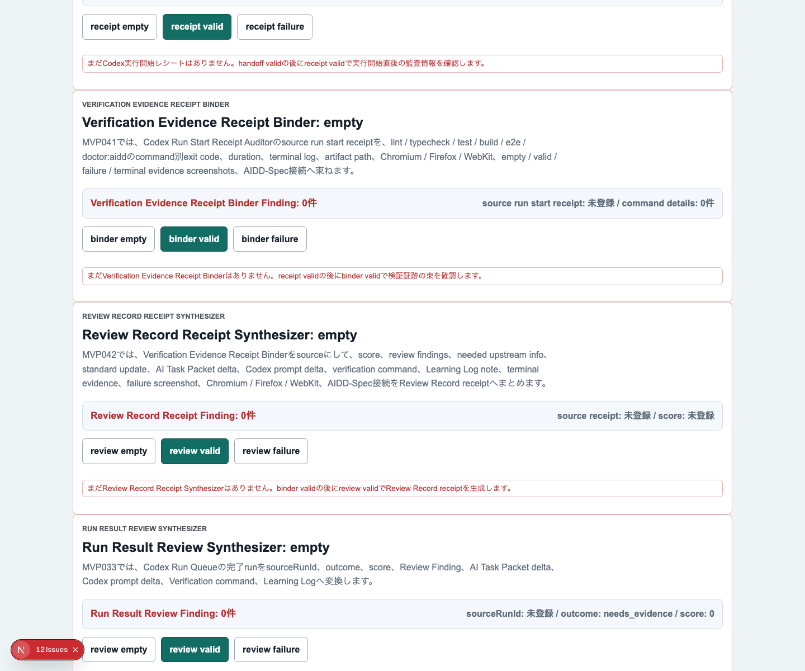
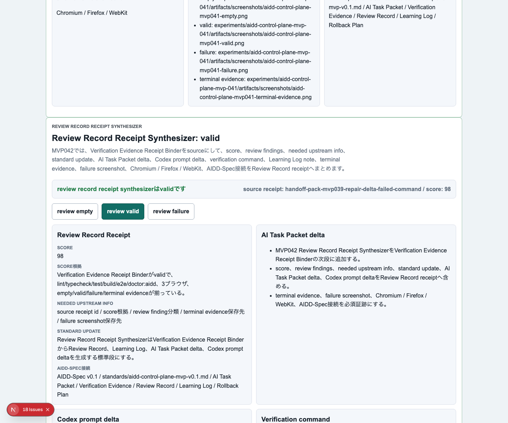
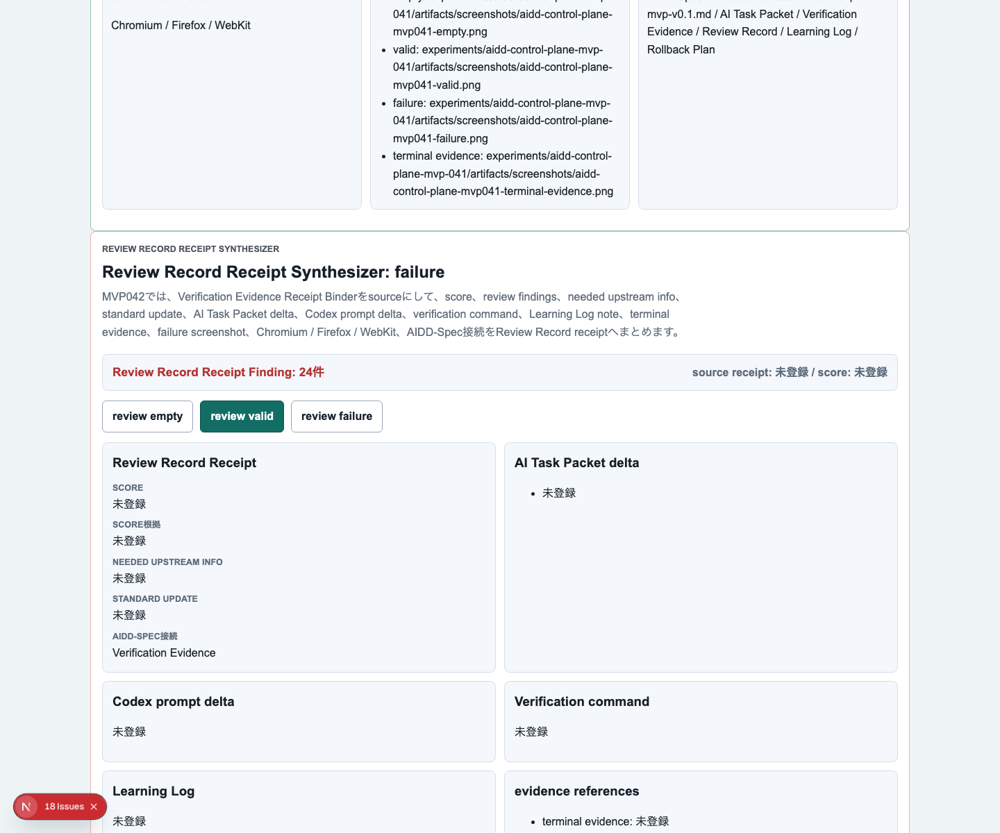
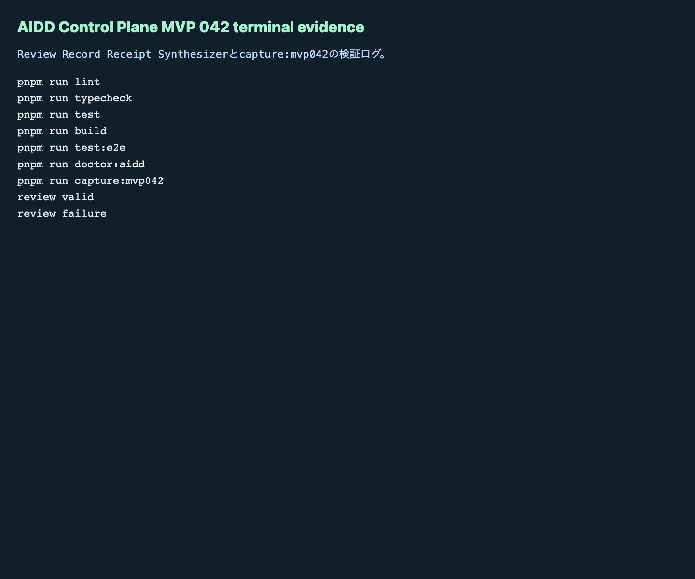

# AIDD Control Plane MVP 042：検証結果をReview Recordへ自動で戻す

> 2026-07-05 / Codex Mastery Lab  
> 記事種別: Experiment / SaaS  
> 将来の書籍章: 第10章 Verification Evidence、第11章 Review Record、第12章 Learning Log、第18章 AIDD Control PlaneのMVP

## 読者の悩み

AIにコードを書かせたあと、lint、test、build、E2Eのログを残せるようになっても、最後にこう詰まることがあります。

> で、結局この結果を次の依頼にどう戻せばいいの？

MVP 041では、検証コマンドを1行ずつ束ねる **Verification Evidence Receipt Binder** を作りました。今回のMVP 042では、その束を **Review Record / Learning Log / 次回AI Task Packet delta** へ変換する入口を作りました。

料理でたとえると、買い物レシートを残すだけでは献立改善になりません。「野菜が足りない」「次回はこの材料を買う」「同じ失敗を防ぐメモを書く」までつなげて、初めて次の料理がよくなります。

## 今回の仮説

> Verification Evidence Receipt Binderの結果から、score、finding分類、needed upstream information、standard update、AI Task Packet delta、Codex prompt delta、verification command、Learning Logを同じ単位で生成すれば、検証ログが次回のAI依頼へ戻りやすくなる。

AIDD Control Planeは「AIにコードを書かせるボタン」ではありません。AIへ渡す前、実行直後、検証後、レビュー後、次回依頼までをつなぐSaaSです。

```text
Codex Run Start Receipt
  -> Verification Evidence Receipt Binder
  -> Review Record Receipt Synthesizer
  -> Learning Log
  -> 次回AI Task Packet delta
```

## 実験内容

今回作ったのは **Review Record Receipt Synthesizer** です。

実装前に `experiments/aidd-control-plane-mvp-042/README.md`、`AI_TASK_PACKET.md`、`CODEX_PROMPT.md` を作り、AIDD-Spec v0.1と `standards/aidd-control-plane-mvp-v0.1.md` へ接続しました。

追加した主な要素は次です。

1. `ReviewRecordReceiptSynthesizer` の型、empty/valid/failure factory、evaluatorを追加
2. UIに `Review Record Receipt Synthesizer` セクションを追加
3. `review empty` / `review valid` / `review failure` を追加
4. valid状態で、score根拠、review findings、needed upstream info、standard update、AI Task Packet delta、Codex prompt delta、verification command、Learning Log、evidence referencesを表示
5. failure状態で、source不足、score根拠不足、finding分類不足、needed upstream info不足、delta不足、prompt不足、検証コマンド不足、Learning Log接続不足、Firefox除外、terminal/failure screenshot不足、local path / host / private network URL混入を検出

## 画面キャプチャ

### empty：まだReview Record receiptがない



### valid：検証証跡からReview Recordへ変換する



### failure：レビューへ戻す前に不足を止める



### terminal evidence



## 失敗と修正

今回も `codex exec --sandbox danger-full-access` で実装を委任しました。Codexは実装途中まで進みましたが、E2E実行中にタイムアウトしました。ここでCodexの自己申告は採用せず、生成済み差分を独立検証しました。

最初のE2Eでは、新規MVP 042ケースだけが3ブラウザで失敗しました。原因はPlaywright strict modeです。

```text
getByLabel('Review Record Receipt Finding details').getByText('Learning Log')
resolved to 2 elements
```

画面内の本文と見出しに同じ `Learning Log` が出ていたため、1つの要素に絞れませんでした。修正はテスト側で `{ exact: true }` を付け、見出しとしての `Learning Log` を確認することでした。

この失敗は、AI駆動開発でよくある「画面は動くが、証跡用テストが曖昧」問題です。AIDD-Specでは、UI文言だけでなく、テストがどの領域を確認するかもpacketへ書く必要があります。

## 検証ログ

保存先は `experiments/aidd-control-plane-mvp-042/artifacts/aidd-control-plane-mvp-042/terminal/` です。公開用ログはローカルパスを `<workspace>` などへサニタイズしました。

| コマンド | 結果 |
| --- | --- |
| `pnpm install --frozen-lockfile` | pass |
| `pnpm run lint` | pass |
| `pnpm run typecheck` | pass |
| `pnpm run test` | 73 tests passed |
| `pnpm run build` | pass |
| `pnpm run test:e2e` | 初回fail。strict mode修正後、120 tests passed / Chromium, Firefox, WebKit |
| `pnpm run doctor:aidd` | pass |
| `pnpm run capture:mvp042` | pass |

`doctor:aidd` の要約です。

```text
doctor:aidd passed
checked MVP: AIDD Control Plane MVP 042 Review Record Receipt Synthesizer
```

E2E再実行の要約です。

```text
120 passed (5.4m)
```

## 読者が使えるチェックリスト

| チェック項目 | 何を確認したいのか | なぜ必要か |
| --- | --- | --- |
| source receiptがある | どの検証証跡からReview Recordを作ったか | レビュー結果だけが孤立するのを防ぐため |
| score根拠がある | 点数の理由を説明できるか | 「なんとなく合格」を避けるため |
| finding分類がある | defectを種類別に扱えるか | 次回AI依頼へ戻す粒度を揃えるため |
| needed upstream infoがある | どの上流情報が足りなかったか | AIDD-Specのテンプレート改善へつなげるため |
| standard updateがある | 標準へ戻す候補があるか | 一回きりの修正で終わらせないため |
| AI Task Packet deltaがある | 次回依頼のどこを増やすか | AIへ渡す入力を具体的に改善するため |
| Codex prompt deltaがある | 次のCodex実行で何を強めるか | 同じ失敗を繰り返さないため |
| verification commandがある | 修正後に何を実行するか | レビューを実行可能な作業へ変えるため |
| Learning Log接続がある | 今回の学びを残したか | チーム内で再利用できる一次情報にするため |
| 3ブラウザE2Eがある | Chromium / Firefox / WebKitを維持したか | 1ブラウザだけの成功を過信しないため |
| terminal/failure screenshotがある | ログと失敗画面が両方あるか | 後から同じ判断を再確認できるため |
| local path / host / private network URLを検査する | 公開できない環境情報が混じっていないか | noteやpreviewへ内部情報を漏らさないため |

## SaaS / AIDD-Specへの接続

MVP 042で、AIDD Control Planeの流れは次のように一段進みました。

```text
検証した
  -> レシートとして束ねた
  -> Review Recordへ変換した
  -> Learning Logと次回AI Task Packet deltaへ戻した
```

AIDD-Spec側では、Verification EvidenceとReview Recordの間に、今回のような「変換レシート」が必要だと分かりました。単にログを保存するだけでは、AIへの次回依頼が改善されません。

SaaSとしては、次にこのReview Record receiptを使って、複数の修正候補から「次の1インクリメントで何を実行するか」をさらに選別できます。

## 次回

次回は、Review Record receiptから次回実行候補を作るだけでなく、どの候補を即実行するか、どれをLearning Logへ戻すかをより明確にする予定です。AI量産記事ではなく、実際にCodexで失敗し、直し、証跡を残した本人しか書けない一次情報として積み上げます。
