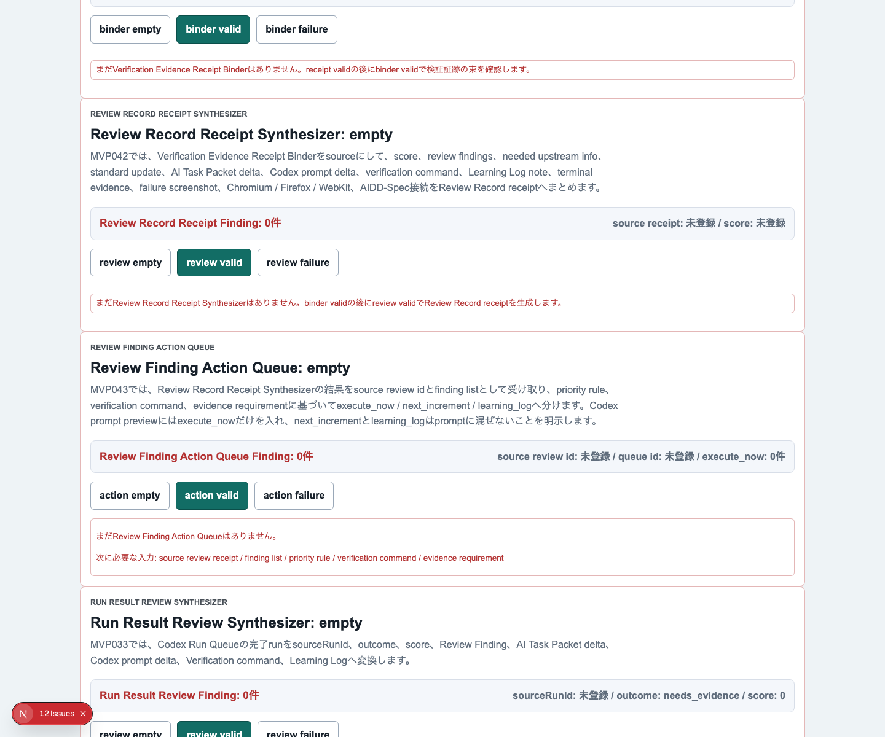
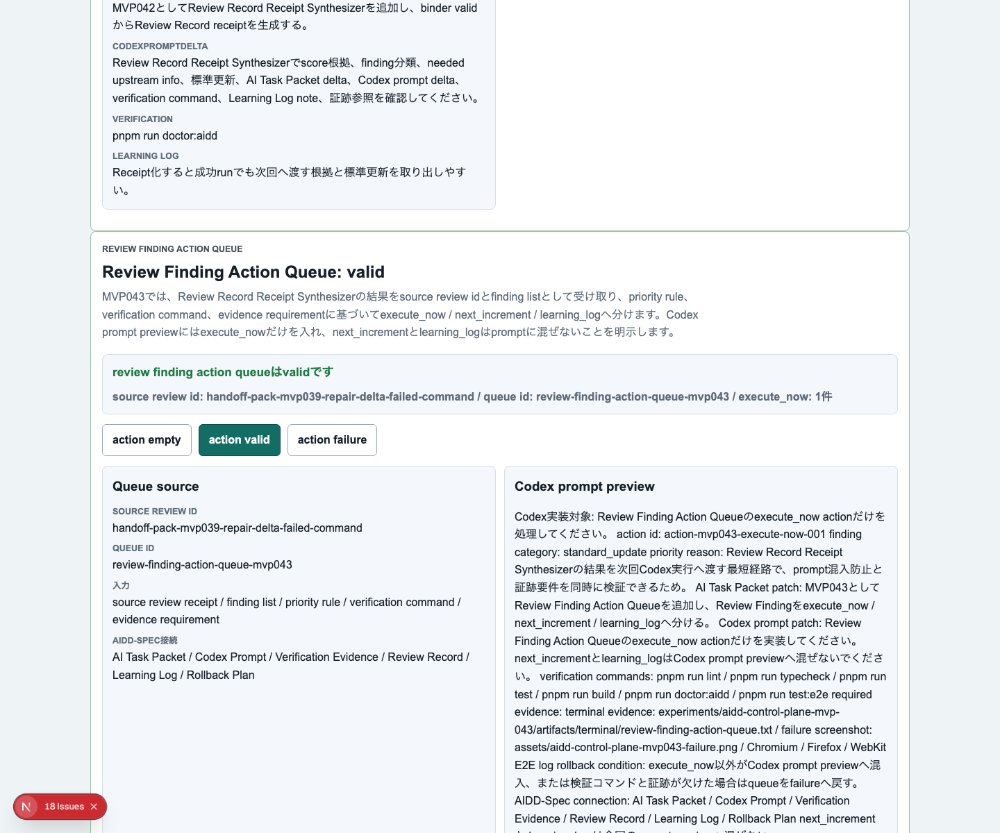
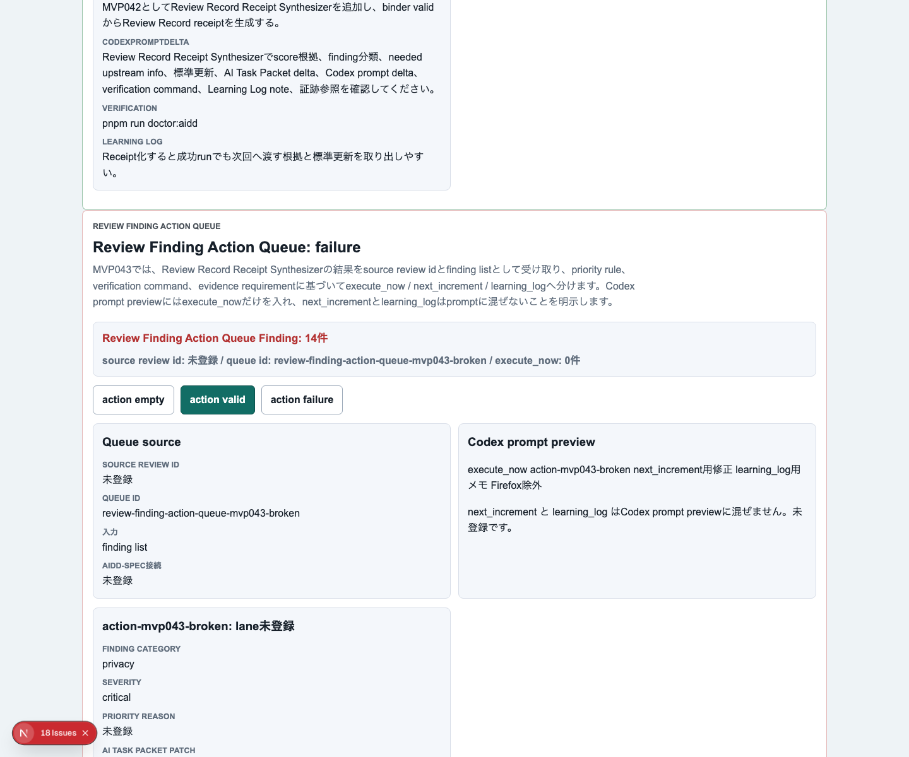
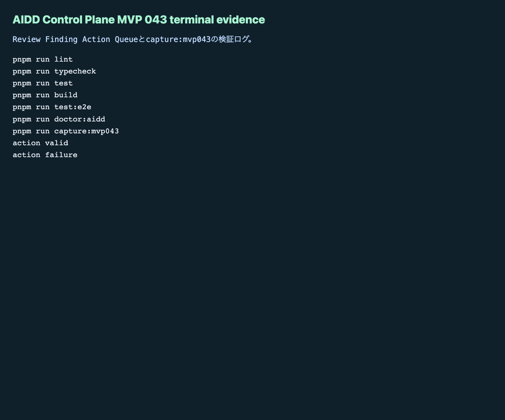

# AIDD Control Plane MVP 043：Review Findingを次の1手に変えるAction Queue

> 2026-07-05 / Codex Mastery Lab  
> 記事種別: Experiment / SaaS  
> 将来の書籍章: 第9章 AI Task Packet、第10章 Verification Evidence、第11章 Learning Log、第12章 雑プロンプト vs AI Task Packet、第18章 AIDD Control PlaneのMVP

## タイトル案

Review Findingを次の1手に変える：Action Queueでexecute_nowだけをCodexへ渡す

## 読者の悩み

今日の問いはこれです。

> 検証結果からReview Recordを作ったあと、次のCodex依頼に「今やること」だけを安全に渡せるか？

MVP 042では、Verification Evidence Receipt BinderからReview Record / Learning Log / 次回AI Task Packet deltaを合成する **Review Record Receipt Synthesizer** を作りました。これで「検証ログをレビュー形式へ戻す」入口はできました。

しかし、現場ではここで次の詰まり方をします。

- findingが複数出る
- どれを今直すのか分からない
- どれは次回送りなのか分からない
- Learning Logへ残すだけのものまでCodex promptへ混ざる
- promptが膨らみ、1回の実行範囲が広がる
- rollbackや証跡条件が抜ける

家計簿でたとえると、支出一覧はできたが「今月すぐ止める支出」「来月見直す支出」「メモとして残すだけの支出」が分かれていない状態です。全部を同時に直そうとすると、結局どれも中途半端になります。

そこで今回は、Review Findingを **execute_now / next_increment / learning_log** に分け、次のCodex prompt previewには **execute_nowだけ** を入れるAction Queueを作りました。

## 前回の振り返り

前回のMVP 042では、検証コマンドの結果をReview Recordへ変換するところまで進めました。

```text
Codex Run Start Receipt
  -> Verification Evidence Receipt Binder
  -> Review Record Receipt Synthesizer
  -> Review Record / Learning Log / 次回AI Task Packet delta
```

この流れで、検証ログは「読み返せる証拠」から「次回改善へ戻せるレビュー素材」になりました。

ただし、Review Record Receipt Synthesizerの出力はまだ「候補の束」です。次のCodexに渡すには、さらに次の判断が必要です。

1. 今回の1回で実装するfindingはどれか
2. 次回incrementへ送るfindingはどれか
3. Learning Logへ残すだけのfindingはどれか
4. Codex promptに混ぜてはいけない内容は何か
5. 実行前に必要な検証コマンドと証跡は何か
6. 失敗したらどこでrollbackするか

この判断を人間の頭の中に置くと、AI駆動開発はまた属人的になります。AIDD Control Planeにするなら、画面とデータモデルで止める必要があります。

## 今回の仮説

今回の仮説は、Review Findingを **execute_now / next_increment / learning_log** に分け、Codex prompt previewへ入れてよいものを **execute_nowだけ** に制限すれば、次の1回の実行範囲を守れる、というものです。

その仮説を試すために作ったのが **Review Finding Action Queue** です。

役割は、Review Record Receipt Synthesizerの結果からReview Findingを受け取り、次の行動キューに変換することです。

```text
Review Record Receipt Synthesizer
  -> Review Finding Action Queue
      - execute_now
      - next_increment
      - learning_log
  -> Codex prompt previewにはexecute_nowのみ
```

重要なのは、単なるTODOリストではないことです。Action Queueの各itemには、次を持たせます。

| 項目 | 目的 |
| --- | --- |
| action id | 後から証跡と紐づけるため |
| finding category | 欠陥の種類を分類するため |
| severity | 優先度判断の材料にするため |
| lane | execute_now / next_increment / learning_logを分けるため |
| priority reason | なぜ今やる/送る/記録するのかを説明するため |
| AI Task Packet patch | 次回packetにどう反映するか |
| Codex prompt patch | Codexへ渡す指示差分 |
| verification commands | 修正後に何を実行するか |
| required evidence | 証跡として何を残すか |
| rollback condition | どの条件で戻すか |
| AIDD-Spec connection | どの標準成果物へ戻すか |

## 実験環境

```text
Machine: Apple M4 Mac mini / 16GB RAM / 256GB SSD
OS: macOS 26.5.1
Codex CLI: codex-cli 0.142.3
Repo: codex-mastery-lab
実験ディレクトリ: experiments/aidd-control-plane-mvp-043
```

環境確認ログは次に保存しました。

```text
logs/2026-07-05-env-precheck.log
```

実験前のgit状態には、前回以前の未コミット差分も残っていました。

```text
 M assets/2026-07-05-character-collection-rpg-trial-028-battle-stage.png
 M preview/assets/2026-07-05-character-collection-rpg-trial-028-battle-stage.png
?? logs/2026-07-05-env-precheck.log
?? scripts/codex_usage_kpi.py
```

この既存差分は今回のCodex promptで「触らない」と明示しました。実験では `experiments/aidd-control-plane-mvp-043/`、`assets/aidd-control-plane-mvp043-*.png`、標準文書、記事、preview更新だけを追加対象にしました。

## 実験内容：実際にCodexへ渡した日本語プロンプト

今回のプロンプト全文は `experiments/aidd-control-plane-mvp-043/CODEX_PROMPT.md` に保存しています。主要部分をそのまま載せます。

```text
目的: experiments/aidd-control-plane-mvp-043/generated-repo に、AIDD Control Plane MVP 043「Review Finding Action Queue」を実装してください。

前提:
- experiments/aidd-control-plane-mvp-042/generated-repo をコピーして土台にしてよい。
- UI文言・テスト名・サンプルデータは日本語を基本にする。
- 重い依存追加は禁止。既存のNext.js/TypeScript/Vitest/Playwright構成を使う。
- 既存の未コミット変更（assets/2026-07-05-character-collection-rpg-trial-028-battle-stage.png、preview/assets/...、scripts/codex_usage_kpi.py、logs/2026-07-05-env-precheck.log）は触らない。

実装したい機能:
Review Record Receipt Synthesizerの結果を入力として、Review Findingを次の行動キューに変換するUIを作る。

必須状態:
1. empty
   - まだReview Finding Action Queueがないことを表示
   - 次に必要な入力として source review receipt / finding list / priority rule / verification command / evidence requirement を表示
2. valid
   - source review id
   - queue id
   - findingごとの action item
   - action itemには action id, finding category, severity, lane(execute_now / next_increment / learning_log), priority reason, AI Task Packet patch, Codex prompt patch, verification commands, required evidence, rollback condition, AIDD-Spec connection を持たせる
   - execute_now だけをCodex prompt previewに入れる
   - next_increment と learning_log はpromptに混ぜないことを明示
3. failure
   - source不足
   - priority reason不足
   - lane不足
   - verification command不足
   - rollback不足
   - required evidence不足
   - Firefox除外
   - terminal / failure screenshot不足
   - local path / host / private network URL混入
   - execute_now以外のprompt混入
   - AIDD-Spec接続不足
   を検出して日本語で表示する
```

このプロンプトの意図は、Codexに「新機能を足して」とだけ頼まないことです。後工程で困ること、つまり検証、証跡、rollback、prompt混入、3ブラウザE2Eまで先に渡しました。

## 実行コマンド

```bash
codex exec --sandbox danger-full-access "$(cat experiments/aidd-control-plane-mvp-043/CODEX_PROMPT.md)" \
  2>&1 | tee experiments/aidd-control-plane-mvp-043/artifacts/aidd-control-plane-mvp-043/terminal/codex-mvp043.log
```

Codex実行は600秒でタイムアウトしました。これは「実装が失敗した」というより、E2E実行中にHermes側のコマンド制限に当たった形です。ここでCodexの自己申告を採用せず、生成済み差分をこちらで検証し直しました。

タイムアウト直前のログでは、Codexは実装、unit test、doctor、E2Eの途中まで進めていました。

```text
CodexはMVP 042を土台に043を作成
Review Finding Action Queueの型、factory、evaluatorを追加
VitestとPlaywrightを追加
capture:mvp043とdoctor:aiddを追加
Firefoxも通過中です。設定の120秒timeout内で安定しており、ここまで失敗はありません。
[Command timed out after 600s]
```

## 生成された主なファイル

主な生成物は次です。

```text
experiments/aidd-control-plane-mvp-043/PLAN.md
experiments/aidd-control-plane-mvp-043/CODEX_PROMPT.md
experiments/aidd-control-plane-mvp-043/generated-repo/src/lib/intake.ts
experiments/aidd-control-plane-mvp-043/generated-repo/app/page.tsx
experiments/aidd-control-plane-mvp-043/generated-repo/tests/intake.test.ts
experiments/aidd-control-plane-mvp-043/generated-repo/e2e/intake-wizard.spec.ts
experiments/aidd-control-plane-mvp-043/generated-repo/scripts/doctor-aidd.mjs
experiments/aidd-control-plane-mvp-043/generated-repo/scripts/capture-mvp043.mjs
```

unit testでは、valid時にexecute_now / next_increment / learning_logが3つに分かれ、prompt previewにはexecute_nowだけが入ることを確認しています。

```ts
expect(validQueue.actionItems.map((item) => item.lane)).toEqual(["execute_now", "next_increment", "learning_log"]);
expect(validQueue.codexPromptPreview).toContain("action-mvp043-execute-now-001");
expect(validQueue.codexPromptPreview).not.toContain("action-mvp043-next-increment-001");
expect(validQueue.codexPromptPreview).not.toContain("action-mvp043-learning-log-001");
```

E2Eでも同じ観点をブラウザで確認しています。

```ts
await expect(page.getByLabel("Codex prompt preview")).toContainText("action-mvp043-execute-now-001");
await expect(page.getByLabel("Codex prompt preview")).not.toContainText("action-mvp043-next-increment-001");
await expect(page.getByLabel("Codex prompt preview")).not.toContainText("action-mvp043-learning-log-001");
await expect(page.getByLabel("Codex prompt preview")).toContainText("next_increment と learning_log はCodex prompt previewに混ぜません");
```

## 画面キャプチャ

今回はGIFではなく、状態別スクリーンショットを保存しました。Control Planeの検証対象が「フォーム操作の滑らかさ」ではなく「状態と検査結果の読み取り」だったためです。

### empty：まだAction Queueがない



### valid：execute_nowだけがprompt previewへ入る



### failure：不足・混入・証跡不足を止める



### terminal evidence



## 失敗/修正

今回の明確な失敗は2つありました。

1つ目は、Codex実行が600秒でタイムアウトしたことです。実装途中で壊れたわけではありませんが、長いE2EをCodexに任せ切ると、最後の結果だけが曖昧になります。そこで、Codex後にHermes側で品質ゲートを個別実行しました。

2つ目は、capture scriptの初回失敗です。

```text
$ node scripts/capture-mvp043.mjs
page.goto: net::ERR_CONNECTION_REFUSED at http://127.0.0.1:3030/
```

原因は単純で、capture scriptは `http://127.0.0.1:3030` のアプリが起動している前提でした。そこでNext.js dev serverを起動してから再実行しました。

```bash
pnpm exec next dev --hostname 127.0.0.1 --port 3030
pnpm run capture:mvp043
```

再実行は成功し、`assets/aidd-control-plane-mvp043-*.png` と `experiments/aidd-control-plane-mvp-043/artifacts/screenshots/` にスクリーンショットが保存されました。

この失敗から分かったのは、capture scriptにも「起動前提」を明記する必要があることです。今後はcaptureコマンド自体がdev serverの起動確認をするか、記事内で必ず起動手順を明示します。

## 検証ログ

Codexのあと、こちらで次を実行しました。

```bash
pnpm install --frozen-lockfile
pnpm run lint
pnpm run typecheck
pnpm run test
pnpm run test:coverage
pnpm run build
pnpm run doctor:aidd
pnpm run mock:doctor
pnpm run test:e2e
pnpm run capture:mvp043
```

結果の要約です。

| コマンド | 結果 |
| --- | --- |
| `pnpm install --frozen-lockfile` | pass |
| `pnpm run lint` | pass |
| `pnpm run typecheck` | pass |
| `pnpm run test` | 74 tests passed |
| `pnpm run test:coverage` | 74 tests passed / src/lib/intake.ts 96.89% statements |
| `pnpm run build` | pass。Next.js ESLint plugin warningあり |
| `pnpm run doctor:aidd` | pass |
| `pnpm run mock:doctor` | pass |
| `pnpm run test:e2e` | 123 passed / Chromium, Firefox, WebKit |
| `pnpm run capture:mvp043` | 初回fail、dev server起動後pass |

E2Eの最後は次の通りです。

```text
Running 123 tests using 1 worker
...
✓  123 [webkit] › e2e/intake-wizard.spec.ts:1158:1 › Review Finding Action QueueでReview Findingを行動キューへ変換しexecute_nowだけをprompt previewへ入れる (1.7s)

123 passed (6.4m)
```

`doctor:aidd` もMVP 043として通りました。

```text
doctor:aidd passed
checked MVP: AIDD Control Plane MVP 043 Review Finding Action Queue
```

## 監査結果

今回の監査カテゴリは、Verification Evidence / Review Record接続、Operations / Maintenance、Build / Lint / Typecheck / Consoleです。

```yaml
findings:
  - category: Verification Evidence / Review Record
    finding: Review Findingをそのまま次回promptへ渡すと、execute_now以外のnext_incrementやlearning_logまで混入する
    severity: high
    observed_by: unit test / Playwright E2E
    ideal_state: Review Findingはlaneで分類され、Codex prompt previewへ入るのはexecute_nowだけである
    fix_instruction: Review Finding Action Queueを追加し、lane、priority reason、verification commands、required evidence、rollback conditionを必須にする
    needed_upstream_info:
      - Review Record Receipt
      - Priority Rule
      - Evidence Requirement
      - Rollback Condition
    standard_update:
      document: standards/aidd-control-plane-mvp-v0.1.md
      field: MVP機能 / Review Finding Action Queue
    codex_prompt_delta: |
      Review Findingをexecute_now / next_increment / learning_logへ分類し、execute_now以外をCodex prompt previewへ混ぜないことをE2Eで検証する。
    verification:
      command: pnpm run test:e2e
      expected: 3ブラウザでpass

  - category: Operations / Maintenance
    finding: capture scriptはdev server起動前提を持っており、単体実行では接続拒否になる
    severity: medium
    observed_by: capture:mvp043 初回失敗ログ
    ideal_state: capture手順は起動前提、URL、失敗時の再実行手順を証跡に残す
    fix_instruction: capture前にNext.js dev serverを起動し、失敗ログと再実行ログを両方保存する
    needed_upstream_info:
      - Verification Plan
      - Runbook
      - Evidence Capture Contract
    standard_update:
      document: Verification Evidence
      field: capture_prerequisites
    codex_prompt_delta: |
      capture scriptを作る場合は、起動URL、前提サーバー、失敗時の再実行手順をREADMEまたはVerification Planに明記する。
    verification:
      command: pnpm exec next dev --hostname 127.0.0.1 --port 3030 && pnpm run capture:mvp043
      expected: empty / valid / failure / terminal evidence のpngが保存される
```

## 逆算：前工程で何を渡すべきだったか

今回の欠陥候補から逆算すると、AI Task Packetには最初から次の情報が必要でした。

| 後工程で困ったこと | 前工程で必要だった情報 | AIDD-Spec成果物 | AI Task Packetに入れる項目 |
| --- | --- | --- | --- |
| findingが複数あり、次に何をやるか迷う | priority rule | Review Record / AI Task Packet | lane分類と優先理由 |
| 次回promptへ不要な内容が混ざる | prompt inclusion rule | Codex Prompt Contract | execute_nowのみprompt previewへ入れる |
| 証跡不足のまま実行される | evidence requirement | Verification Evidence | terminal / failure screenshot / 3ブラウザE2E |
| 失敗時に戻せない | rollback condition | Rollback Plan | rollback条件と停止条件 |
| 標準へ戻らない | AIDD-Spec connection | Learning Log / Spec Improvement | どの標準文書へ反映するか |

つまり、次回からCodexに渡すpacketには、単に「このfindingを直して」ではなく、次のように書く必要があります。

```text
Review Findingを次のlaneに分類する。
- execute_now: 今回の1回のCodex実行で扱うもの。Codex prompt previewに入れてよい。
- next_increment: 次回以降に扱うもの。今回のprompt previewに入れてはいけない。
- learning_log: 学びとして残すもの。今回のprompt previewに入れてはいけない。

各action itemには priority reason / verification commands / required evidence / rollback condition / AIDD-Spec connection を必ず持たせる。
execute_now以外がprompt previewに混入したらfailureとして表示し、E2Eで検証する。
```

## AIDD-Spec / AIDD Control Plane SaaSへの接続

`standards/aidd-control-plane-mvp-v0.1.md` に、MVP機能として **Review Finding Action Queue** を追加しました。

追加した標準項目は次です。

```text
Review Finding Action Queue:
Review Record Receipt Synthesizerで作られたReview Findingを、次に実行する行動キューへ変換し、execute_now / next_increment / learning_logを混ぜずに扱う。
```

検出項目として、source不足、priority reason不足、lane不足、verification command不足、rollback不足、required evidence不足、Firefox除外、terminal/failure screenshot不足、execute_now以外のprompt混入、local path / host / private network URL混入、AIDD-Spec接続不足を追加しました。

`book/outline.md` には、今日の記事を第9章、第10章、第11章、第12章、第18章の素材として追記しました。

## SaaS化した場合の機能仮説

AIDD Control Plane上では、このAction Queueは次のUIになります。

1. Review Finding一覧が表示される
2. 各findingにlaneを選ぶ
3. priority reasonを書かないと進めない
4. execute_nowだけが右側のCodex prompt previewへ入る
5. next_increment / learning_logが混ざると赤く止まる
6. verification commandsとrequired evidenceが不足すると実行ボタンが押せない
7. rollback conditionがないとRun Authorization Gateへ進めない
8. local pathやhost名が混ざると公開前チェックで止まる

これは「AIに何をやらせるか」を決める画面というより、「AIに今やらせないことを守る画面」です。AI駆動開発では、作業を増やすより、1回の作業範囲を守るほうが大事な場面が多いと感じました。

## 読者が使えるチェックリスト

- [ ] Review Findingをそのまま次回promptへ貼っていないか
- [ ] findingごとにexecute_now / next_increment / learning_logを分けたか
- [ ] execute_now以外がprompt previewへ混ざっていないか
- [ ] priority reasonを書いたか
- [ ] verification commandsを書いたか
- [ ] required evidenceを書いたか
- [ ] rollback conditionを書いたか
- [ ] Firefoxを含む3ブラウザE2Eを除外していないか
- [ ] terminal evidenceとfailure screenshotを要求したか
- [ ] local path / host / private network URL混入を検査したか

## まとめ

MVP 043で分かったことは、Review Findingは「指摘」ではなく「次の行動候補」まで変換しないと、AI Task Packetへ戻りきらないということです。

今回のAction Queueによって、次の流れが一段つながりました。

```text
Verification Evidence
  -> Review Record
  -> Review Finding
  -> Review Finding Action Queue
  -> execute_nowだけをCodex prompt previewへ
```

特に重要だったのは、next_incrementとlearning_logを「今回はやらないもの」として明示的に扱うことです。AIは与えたものを全部実行対象にしがちです。だから、人間側の説明書には「やること」だけでなく「今はやらないこと」も機械的に分かる形で書く必要があります。

## 今回の学び

- Codexは実装そのものは進められるが、長いE2Eまで任せ切るとタイムアウトで結果が曖昧になる
- execute_nowだけをprompt previewへ入れる制約は、unit testとE2Eで検証できる
- capture scriptはdev server起動前提を持つため、Verification Planに前提を書く必要がある
- Review Findingは、priority reason、verification commands、required evidence、rollback conditionが揃って初めて次回実行に渡せる
- AIDD Control Planeの価値は「全部をAIへ渡す」ではなく「今渡してよいものだけを絞る」ことにある

## 次回

次回は、このAction Queueから実際の **One-run Codex command** を作る前に、実行予算、所要時間、失敗時の停止条件をもう一段チェックしたいです。特にM4 Mac mini / 16GB RAMの制約では、3ブラウザE2Eを毎回フルで回すと重くなります。どの検証を毎回必須にし、どれを節目で回すかを、AIDD-SpecのVerification Planとして整理します。

## 付録：証跡パス

```text
Article: articles/2026-07-05-aidd-control-plane-mvp-043.md
Experiment: experiments/aidd-control-plane-mvp-043
Generated repo: experiments/aidd-control-plane-mvp-043/generated-repo
Terminal logs: experiments/aidd-control-plane-mvp-043/artifacts/aidd-control-plane-mvp-043/terminal
Screenshots: assets/aidd-control-plane-mvp043-*.png
Standard update: standards/aidd-control-plane-mvp-v0.1.md
```
