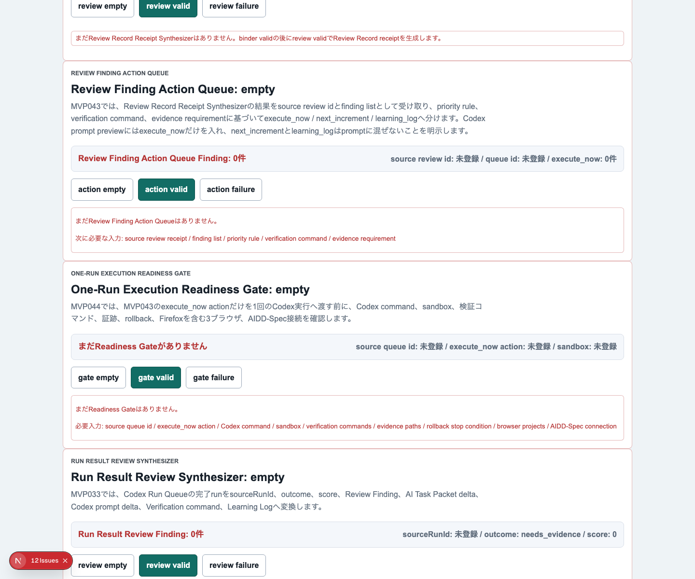
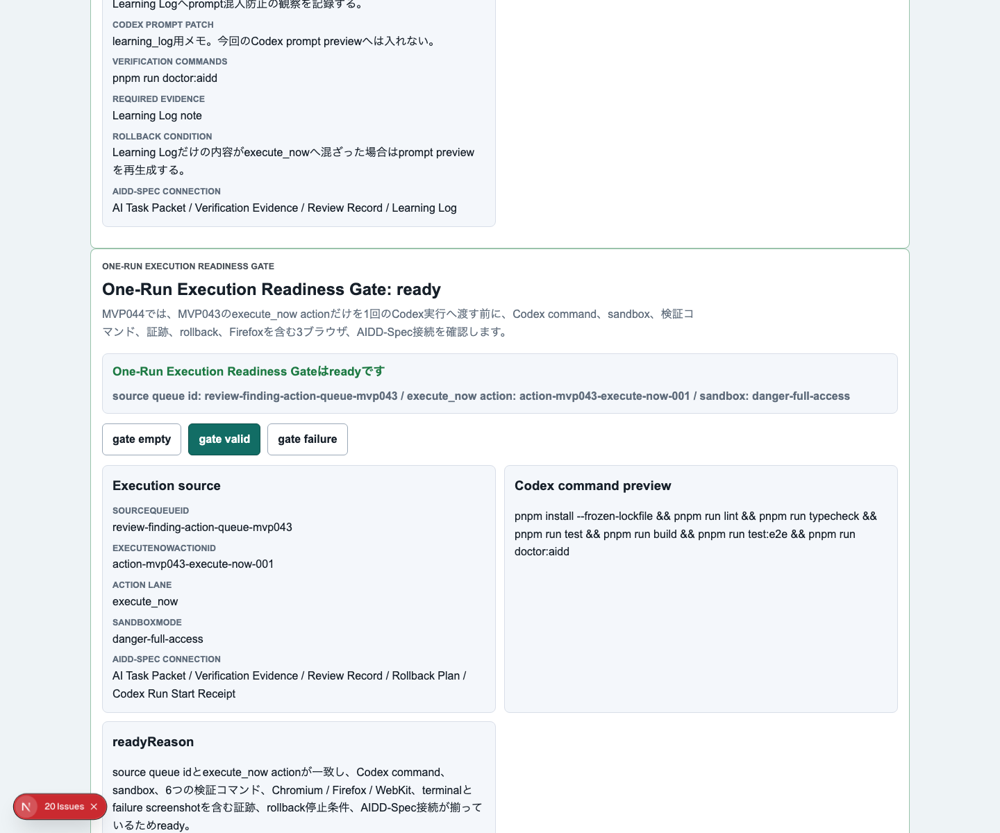
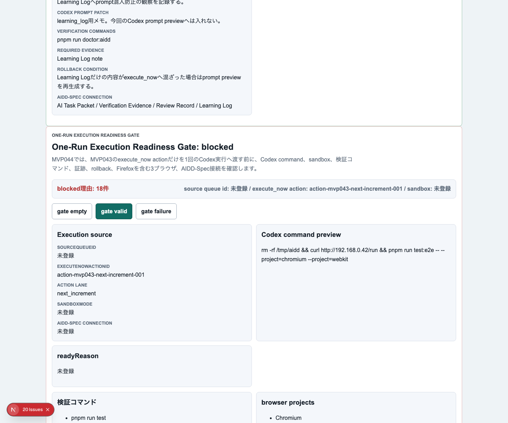
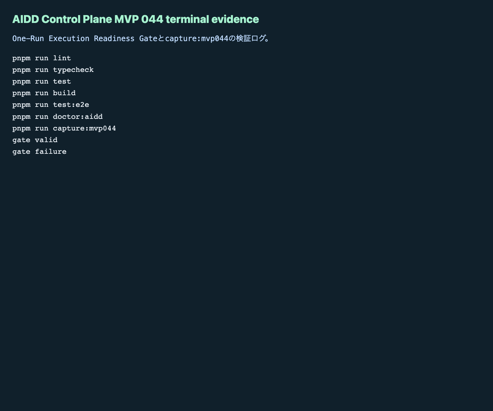

# AIDD Control Plane MVP 044：Codexを走らせる直前に止めるReadiness Gate

> 2026-07-05 / Codex Mastery Lab  
> 記事種別: Experiment / SaaS  
> 将来の書籍章: 第9章 AI Task Packet、第10章 Verification Evidence、第11章 Learning Log、第12章 雑プロンプト vs AI Task Packet、第18章 AIDD Control PlaneのMVP

## タイトル案

Codexを走らせる直前に止める：One-Run Execution Readiness Gateで「準備不足の実行」を防ぐ

## 読者の悩み

AIにコードを書かせるとき、いちばん危ない瞬間は「よし、次はこれを直して」と思った直後かもしれません。

前回のMVP 043では、Review Findingを `execute_now` / `next_increment` / `learning_log` に分け、Codex prompt previewには `execute_now` だけを入れる **Review Finding Action Queue** を作りました。これで「今やること」は絞れます。

しかし、実行直前にはまだ落とし穴があります。

- Codex commandに危険な操作が混ざる
- sandbox指定が抜ける
- lint / typecheck / test / build / E2E / doctorの一部が抜ける
- Firefoxを含む3ブラウザE2Eが抜ける
- terminal evidenceやfailure screenshotの保存先が抜ける
- rollback停止条件が曖昧なまま走る
- ローカルパスやprivate network URLが混ざる

旅行の持ち物でたとえると、行き先は決めたのに、出発前のチェックリストを見ずに家を出るような状態です。忘れ物に気づくのは、たいてい現地についてからです。

そこで今回は、Codexを実際に走らせる直前の最終確認として **One-Run Execution Readiness Gate** を作りました。

## 今回の仮説

今回の仮説は次です。

> `execute_now` itemをCodexへ渡す前に、command / sandbox / verification / evidence / rollback / 3ブラウザ / 秘匿情報混入をready / blockedで判定すれば、「準備不足の実行」を減らせる。

AIDD Control Planeは、単にAIを起動するボタンではありません。AIに渡してよい状態かを確認し、足りないものがあれば止めるSaaSにしたい。そのため、今回のMVPは「実行」ではなく「実行前に止める」機能です。

## 実験内容

MVP 044では、前回のReview Finding Action Queueの次段に **One-Run Execution Readiness Gate** を追加しました。

```text
Review Finding Action Queue
  -> execute_now item
  -> One-Run Execution Readiness Gate
      - ready: Codexへ渡す準備が整っている
      - blocked: 実行前に直すべき不足がある
  -> Codex Run Start Receipt
```

Codexへ渡したAI Task Packetでは、次の3状態を必須にしました。

| 状態 | 画面で確認すること | なぜ必要か |
| --- | --- | --- |
| empty | まだReadiness Gateがない。必要入力を表示する | 何を集めれば実行準備になるかを先に見せるため |
| ready | source queue、execute_now action、Codex command、sandbox、検証、証跡、rollback、3ブラウザ、AIDD-Spec接続がそろう | 「走らせてよい理由」を説明可能にするため |
| blocked | source不足、危険command、Firefox除外、証跡不足、rollback不足、local path混入などを検出する | 実行後に証拠不足で詰まるのを防ぐため |

## 画面キャプチャ

### empty：まだ実行準備ゲートがない



emptyでは、source queue id、execute_now action、Codex command、sandbox、verification commands、evidence paths、rollback stop condition、browser projects、AIDD-Spec connectionが必要だと表示します。

### ready：1回のCodex実行へ進める状態



readyでは、`execute_now` actionだけが対象になり、Codex command preview、検証コマンド、Chromium / Firefox / WebKit、terminal / empty / valid / failure screenshot / Playwright report、rollback停止条件が見える状態になります。

### blocked：準備不足の実行を止める



blockedでは、execute_now以外の混入、危険command、sandbox不足、Firefox除外、failure screenshot不足、rollback不足、local path / host / private network URL混入、AIDD-Spec接続不足を日本語で表示します。

### terminal evidence



## 失敗と修正

今回の実装では、Codex実行自体が時間制限で完了前に止まりました。ただし、実装差分は生成されていたため、Codexの自己申告は採用せず、Hermes側で独立検証しました。

独立検証で見つかった主な失敗はE2Eのstrict mode違反です。

```text
getByText('pnpm run test') が `pnpm run test` と `pnpm run test:e2e` の2要素に一致した
```

これはアプリ機能の失敗ではなく、テストの指定が曖昧だったことが原因です。テストを `exact: true` に修正し、3ブラウザE2Eを再実行しました。

この失敗はAIDD-Spec的には大事です。AIに「テストを書いて」と頼むだけでは、テストの曖昧さまで防げません。AI Task Packetには「似た文言を含む項目はexact matchかrole/labelで一意に取る」といった検証観点を入れる価値があります。

## 検証ログ

今回、最終的に次の品質ゲートを個別実行しました。

| コマンド | 結果 | メモ |
| --- | --- | --- |
| `pnpm install --frozen-lockfile` | pass | lockfile固定で依存解決 |
| `pnpm run lint` | pass | ESLintエラーなし |
| `pnpm run typecheck` | pass | TypeScriptエラーなし |
| `pnpm run test` | pass | 76 tests passed |
| `pnpm run test:coverage` | pass | coverage report生成 |
| `pnpm run build` | pass | Next.js build成功。既存ESLint plugin警告あり |
| `pnpm run test:e2e` | pass | 126 tests passed。Chromium / Firefox / WebKit |
| `pnpm run mock:doctor` | pass | mock service contract確認 |
| `pnpm run doctor:aidd` | pass | MVP 044必須tokenと証跡条件を確認 |

E2Eの最終結果は次です。

```text
126 passed
```

## 読者が使えるチェックリスト

Codexを走らせる前に、最低限このチェックをおすすめします。

| チェック項目 | 何を確認したいのか | なぜ必要か |
| --- | --- | --- |
| execute_nowだけか | 今回実行する修正だけがpromptに入っているか | 1回の実行範囲が広がりすぎるのを防ぐため |
| commandは安全か | `rm -rf`、外部URL実行、不要なsudoなどがないか | AI実行の副作用を小さくするため |
| sandboxは明示したか | workspace-write / danger-full-accessなどが意図通りか | 実行権限の前提をレビュー可能にするため |
| 検証コマンドは揃ったか | lint / typecheck / test / build / E2E / doctorがあるか | 「動いた気がする」で終わらせないため |
| 3ブラウザE2Eか | Chromium / Firefox / WebKitが対象か | 1ブラウザだけの偶然の成功を避けるため |
| 証跡保存先はあるか | terminal、empty、valid、failure、Playwright reportを残すか | 後からレビュー・記事化・標準更新へ戻すため |
| rollback条件はあるか | どの失敗で止めるかが書かれているか | 失敗時に次の行動を迷わないため |
| ローカル情報混入はないか | local path、host名、private network URLがないか | 公開記事や証跡の安全性を保つため |

## AIDD-Spec / SaaSへの接続

今回のMVP 044は、AIDD-Specの次の成果物に接続します。

- AI Task Packet
- Verification Evidence
- Review Record
- Rollback Plan
- Codex Run Start Receipt

また、`standards/aidd-control-plane-mvp-v0.1.md` に **One-Run Execution Readiness Gate** を追加しました。

ここで重要なのは、AIDD Control Planeを「AIを自動実行するSaaS」として急がないことです。むしろ最初に必要なのは、AIを走らせる前に、準備不足なら止めることです。

AI量産記事ではなく、実験した本人しか書けない一次情報が強い理由もここにあります。失敗ログ、修正、スクリーンショット、検証コマンド、標準への反映まで残すと、読者が自分の現場に持ち帰れるチェックリストになります。

## 次回

次回は、このReadiness Gateを通過した内容を **Codex Run Start Receipt** へより安全に接続するか、あるいは実行後の証跡を自動で束ねる方向へ進めます。

今回の学びはシンプルです。

> AIに走らせる前に、走らせてよい状態かを確認する。  
> その確認自体をSaaSの画面とテストにする。

これが、誰でもベストに近いAI駆動開発フローを再現するための次の小さな部品です。
