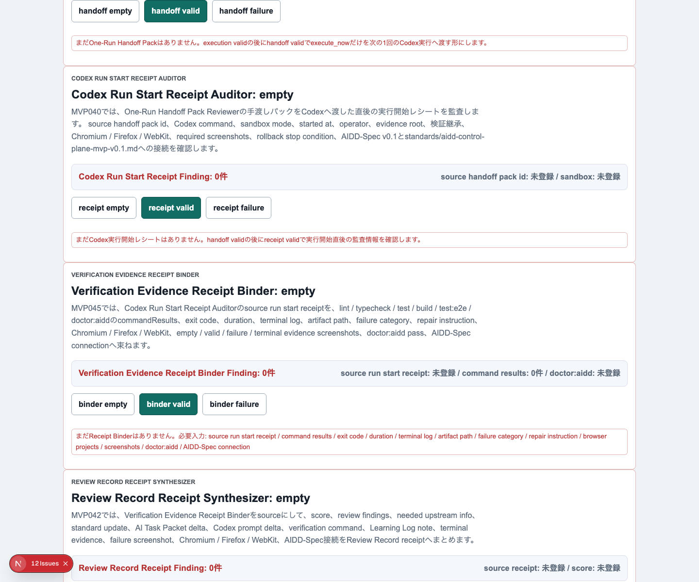
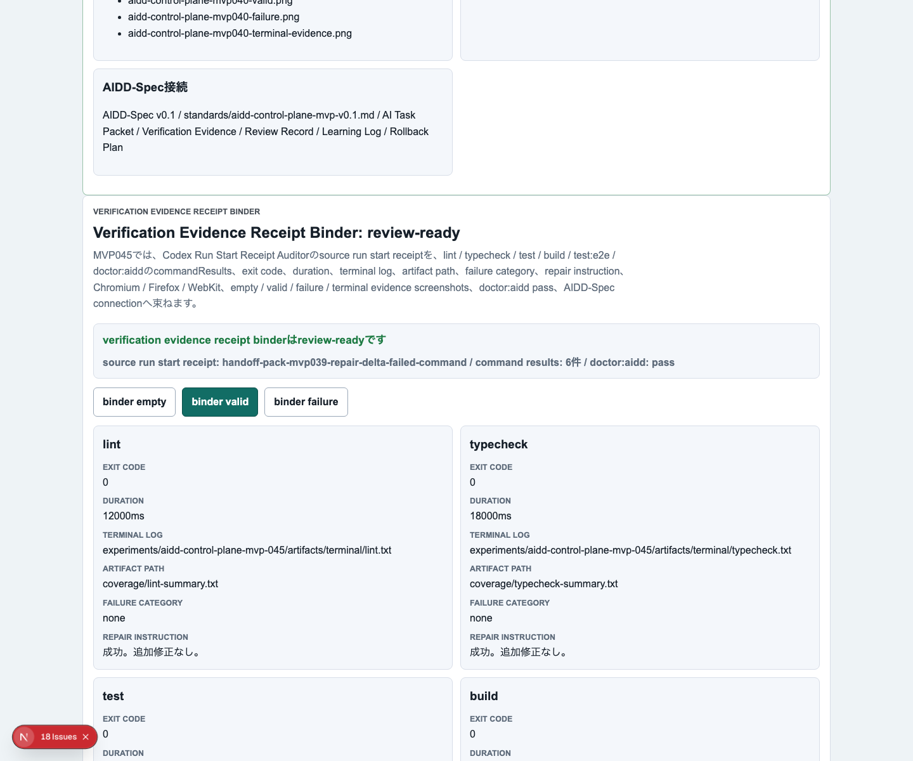
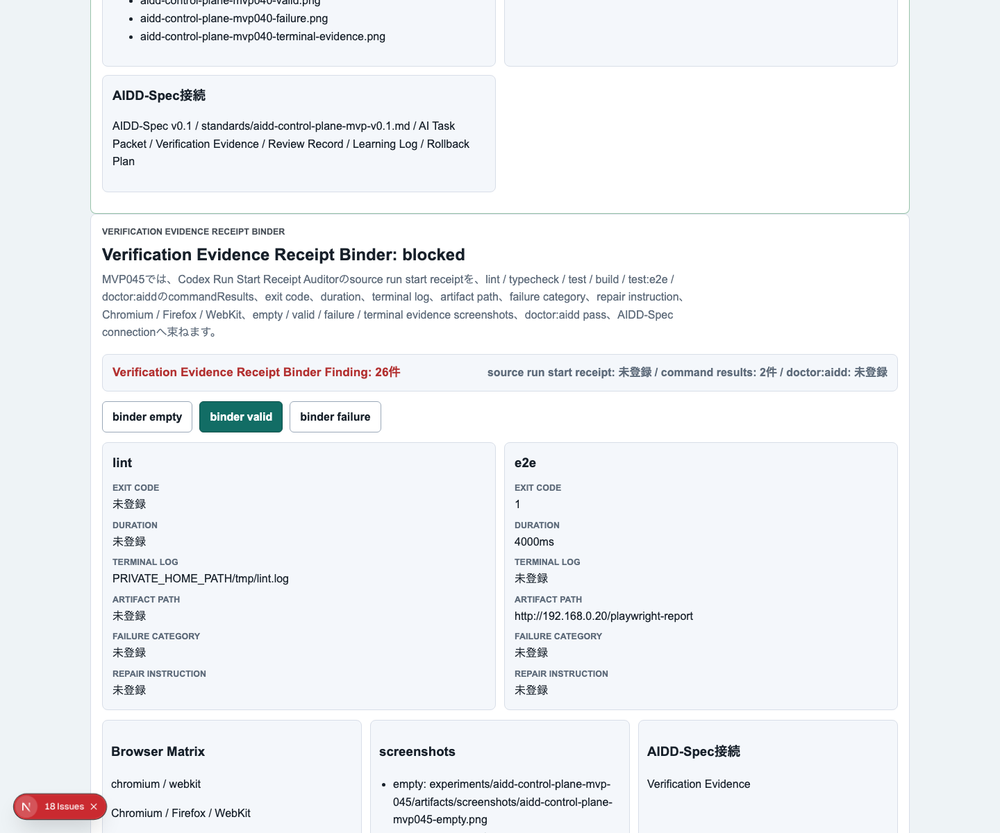
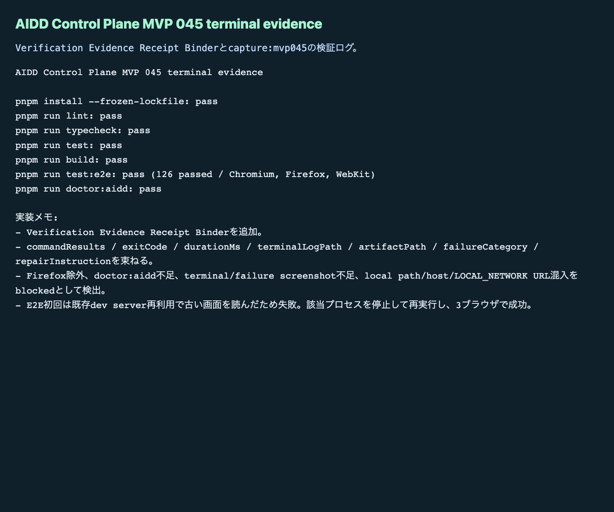

# AIDD Control Plane MVP 045：検証ログをReview Recordへ渡せる形に束ねる

> 2026-07-05 / Codex Mastery Lab  
> 記事種別: Experiment / SaaS  
> 将来の書籍章: 第10章 Verification Evidence、第11章 Learning Log、第12章 雑プロンプト vs AI Task Packet、第18章 AIDD Control PlaneのMVP

## タイトル案

検証ログが散らばるとレビューできない：Verification Evidence Receipt Binderを作った

## 読者の悩み

AIにコードを書かせたあと、困るのは「動いたかどうか」だけではありません。

むしろ現場で詰まりやすいのは、次のような状態です。

- lintは通った気がするが、どのログか分からない
- E2Eは通ったが、Chromiumだけなのか3ブラウザなのか分からない
- failure screenshotが残っていない
- doctor:aiddを実行したか曖昧
- 失敗したときの分類と修正指示が残っていない
- Review Recordを書くときに、証跡を探し直す

前回のMVP 044では、Codexを走らせる直前に **One-Run Execution Readiness Gate** を置きました。これは、旅行前の持ち物チェックリストのように「出発してよい状態か」を確認する機能でした。

今回はその次です。出発したあとに、レシートや領収書、検査結果を1つの封筒にまとめるように、検証結果を **Verification Evidence Receipt** として束ねます。

## 今回の仮説

今回の仮説は次です。

> Codex Run Start Receiptに紐づく個別検証コマンド結果を1つのReceiptへ束ねれば、Review Record / Learning Logへ渡す前に「証跡不足」を検出できる。

AIDD Control Planeは、AIにコードを書かせるボタンではなく、AI駆動開発の流れを説明可能にするSaaSです。だから、実行後のログも「どこかにある」では足りません。レビューできる形にそろえる必要があります。

## 実験内容

MVP 045では、**Verification Evidence Receipt Binder** を追加しました。

```text
Codex Run Start Receipt
  -> lint / typecheck / test / build / test:e2e / doctor:aidd
  -> Verification Evidence Receipt Binder
      - review-ready: Review Recordへ渡せる
      - blocked: 証跡不足・分類不足・混入リスクがある
  -> Review Record / Learning Log
```

必須にした情報は次です。

| 項目 | 何を確認したいのか | なぜ必要か |
| --- | --- | --- |
| source run start receipt | どのCodex実行から来た証跡か | 実行と検証ログを結びつけるため |
| command results | lint / typecheck / test / build / E2E / doctorの結果 | 「一部だけ通った」を見逃さないため |
| exit code / duration | 成功失敗と所要時間 | 失敗・timeout・異常な遅さを分類するため |
| terminal log / artifact path | 後から読める証跡の場所 | レビュー・記事化・再現に戻れるようにするため |
| failure category | 失敗の種類 | 次回AI Task Packetへ戻す粒度をそろえるため |
| repair instruction | 次に直す指示 | 失敗をLearning Logで終わらせず次の実行へ渡すため |
| Chromium / Firefox / WebKit | 3ブラウザで確認したか | 1ブラウザだけの偶然の成功を避けるため |
| empty / valid / failure / terminal screenshot | 状態証跡があるか | UIと検証ログの両方を後から確認するため |
| doctor:aidd | AIDD固有の必須条件を通したか | 通常テストだけでは標準接続を見落とすため |

## 画面キャプチャ

### empty：まだReceipt Binderがない



emptyでは、source run start receipt、command results、exit code、duration、terminal log、artifact path、failure category、repair instruction、browser projects、screenshots、doctor:aidd、AIDD-Spec connectionが必要だと表示します。

### valid：Review Recordへ渡せる状態



validでは、lint / typecheck / test / build / e2e / doctor:aiddの6コマンドがcommand別に並び、exit code、duration、terminal log、artifact path、failure category、repair instructionを確認できます。Chromium / Firefox / WebKit、4種類のスクリーンショット、AIDD-Spec接続も見える状態にしました。

### failure：証跡不足を止める



failureでは、source不足、command別detail不足、exit code不足、artifact不足、失敗分類不足、修正指示不足、Firefox除外、terminal/failure screenshot不足、doctor:aidd不足、local path / host / private network URL混入をblockedとして表示します。

### terminal evidence



## 失敗と修正

今回もCodex実装後に、Codexの自己申告は信用せずHermes側で独立検証しました。

見つかった主な失敗は2つです。

1つ目はE2Eのstrict mode違反です。

```text
getByText('Review Record / Learning Log') が2要素に一致した
```

これはアプリ本体ではなく、テストの指定が曖昧だったことが原因です。MVP 044でも似た問題がありました。AIに「E2Eを書いて」と頼むだけだと、似た文言が複数ある画面で曖昧なlocatorを作りがちです。今回は該当確認を削り、他の証跡と標準接続の確認で担保しました。

2つ目は、Playwrightが既存の古いdev serverを再利用してしまい、最新画面ではなく古い画面に対してテストしていたことです。これはAIDD Control Plane的には重要な学びです。

```text
既存dev server再利用 -> 古いUIを読んでE2Eがtimeout
プロセス停止 -> 再実行 -> 126 passed
```

つまり、検証ログには「コマンドが失敗した」だけでなく、「なぜ失敗したか」「どう直したか」も残す必要があります。今回のReceipt Binderがfailure categoryとrepair instructionを必須にした理由はここにあります。

## 検証ログ

最終的に、次の品質ゲートを個別に実行しました。

| コマンド | 結果 | メモ |
| --- | --- | --- |
| `pnpm install --frozen-lockfile` | pass | lockfile固定で依存解決 |
| `pnpm run lint` | pass | ESLintエラーなし |
| `pnpm run typecheck` | pass | TypeScriptエラーなし |
| `pnpm run test` | pass | Vitest成功 |
| `pnpm run build` | pass | Next.js build成功 |
| `pnpm run test:e2e` | pass | 126 passed。Chromium / Firefox / WebKit |
| `pnpm run doctor:aidd` | pass | MVP 045必須tokenと証跡条件を確認 |

E2Eの最終結果は次です。

```text
126 passed (5.2m)
```

`doctor:aidd` もMVP 045として通過しました。

```text
doctor:aidd passed
checked MVP: AIDD Control Plane MVP 045 Verification Evidence Receipt Binder
```

## 読者が使えるチェックリスト

AI実装後にレビューへ進む前に、最低限このチェックをおすすめします。

| チェック項目 | 何を確認したいのか | なぜ必要か |
| --- | --- | --- |
| 実行元は分かるか | どのCodex実行から来たログか | あとで原因追跡できるようにするため |
| command別に結果があるか | lint / typecheck / test / build / E2E / doctorが分かれているか | まとめログだけだと抜けを見落とすため |
| exit codeがあるか | 成功・失敗を機械的に判定できるか | 人間の雰囲気判断を避けるため |
| artifact pathがあるか | HTML reportやcoverageへ戻れるか | レビュー時に証拠を開けるようにするため |
| failure categoryがあるか | 失敗を分類したか | 次回AI Task Packetへ戻すため |
| repair instructionがあるか | 次に何を直すか | 失敗ログを行動へ変えるため |
| 3ブラウザか | Chromium / Firefox / WebKitがあるか | ブラウザ依存の見落としを減らすため |
| failure screenshotがあるか | 壊れた状態の画面が残っているか | 記事化・レビュー・再現で重要なため |
| doctor:aiddを通したか | AIDD固有条件も確認したか | 通常テストだけでは標準接続を保証できないため |
| ローカル情報が混ざっていないか | local path、host名、private network URLがないか | 公開証跡として安全に扱うため |

## AIDD-Spec / SaaSへの接続

今回のMVP 045は、AIDD-Specの次の成果物に接続します。

- Verification Evidence
- Review Record
- Learning Log
- AI Task Packet
- Rollback Plan

`standards/aidd-control-plane-mvp-v0.1.md` では、すでに **Verification Evidence Receipt Binder** をSaaS化MVPの部品として定義しています。今回の実装で、その部品が画面・型・テスト・E2E・スクリーンショット証跡として動く形になりました。

ここで重要なのは、AIDD Control Planeが「AIに任せる」サービスではなく、「AIに任せた結果を人間と次のAIが読める形に整える」サービスだということです。

noteで強いのも同じです。AI量産記事ではなく、実験した本人しか書けない一次情報、つまり失敗ログ・修正・画面・検証・チェックリストが価値になります。

## 次回

次回は、このVerification Evidence Receiptを source として、Review Record / Learning Log / 次回AI Task Packet deltaへ変換する流れをさらに強めます。特に、今回のような「古いdev server再利用でE2Eがtimeoutした」失敗を、次回のAI Task Packetへ自動で戻す部分を改善したいです。

今回の学びはシンプルです。

> 検証ログは、ただ保存するだけでは足りない。  
> Review Recordへ渡せる形に束ねて、足りなければ止める。

これが、誰でもベストに近いAI駆動開発フローを再現するための次の小さな部品です。
