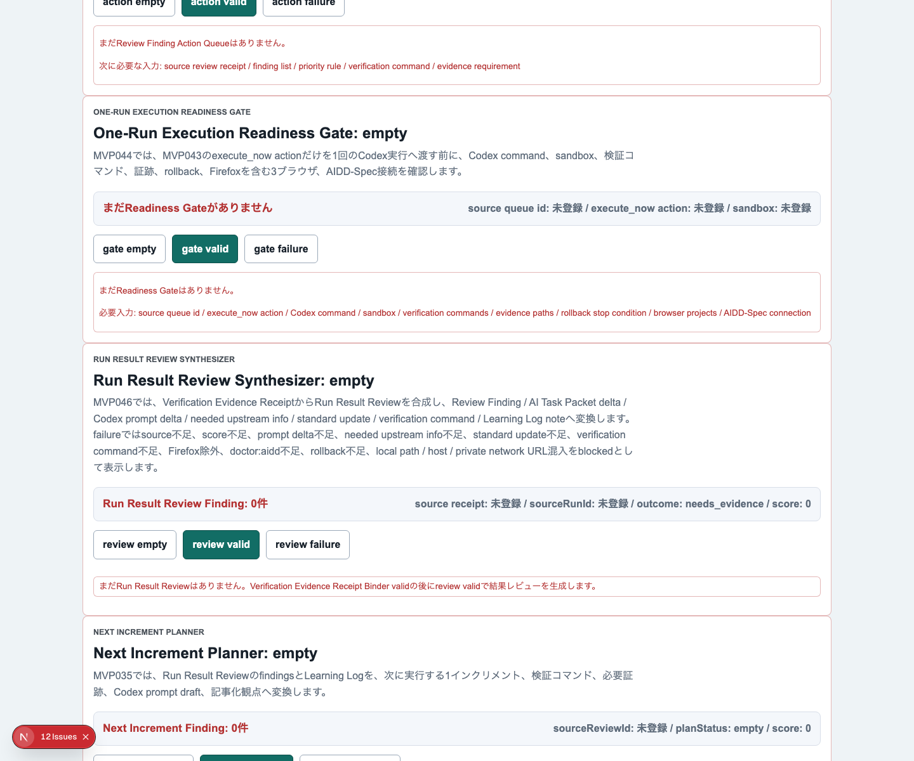
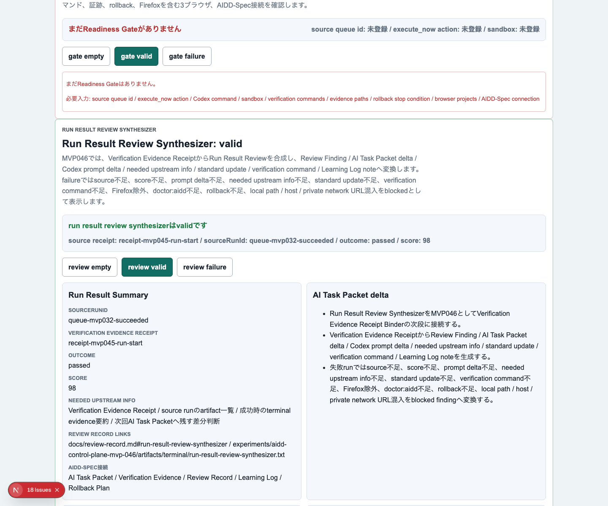
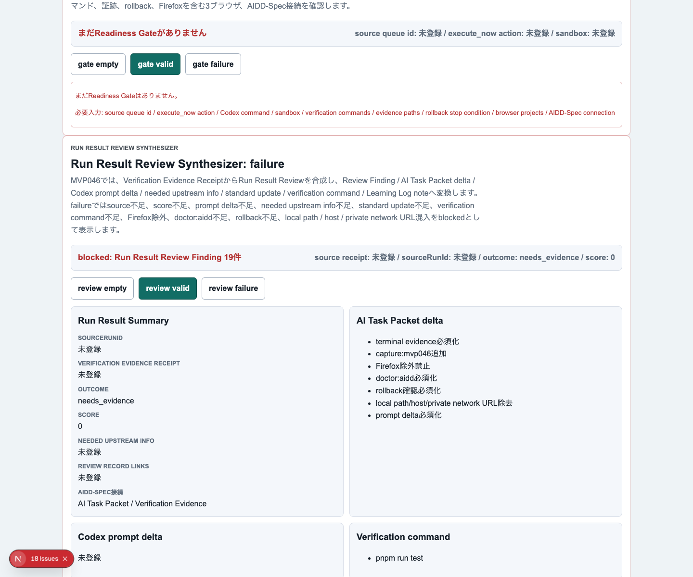
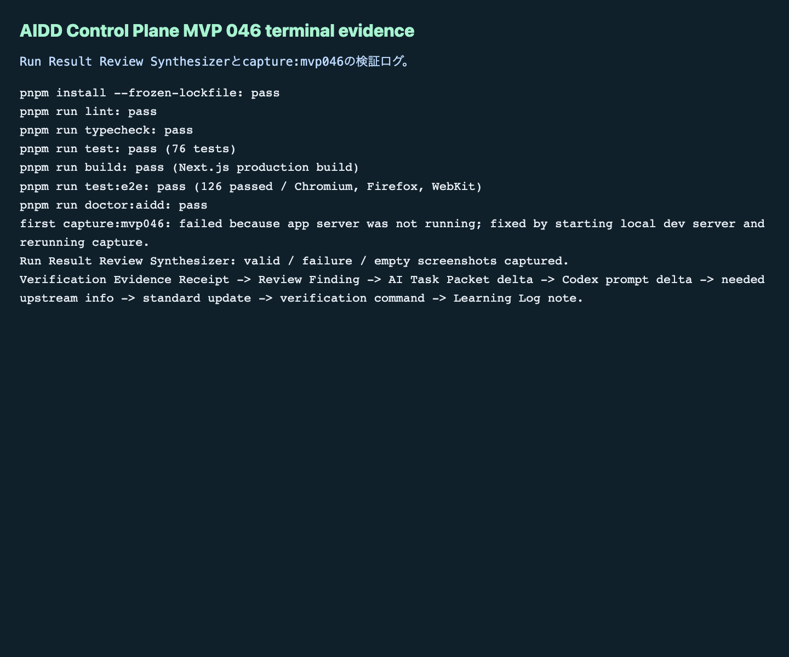

# AIDD Control Plane MVP 046：検証結果を次のAI依頼へ戻すSynthesizerを作る

> 2026-07-05 / Codex Mastery Lab
> 記事種別: Experiment / SaaS
> 将来の書籍章: 第10章 Verification Evidence、第11章 Learning Log、第12章 雑プロンプト vs AI Task Packet、第18章 AIDD Control PlaneのMVP

## タイトル案

「テストが通った/落ちた」で止めない：検証結果を次のAI Task Packetへ戻す仕組み

## 読者の悩み

AIに実装を任せると、最後にこうなりがちです。

- テストログはあるが、次に何を直すべきか分からない
- 失敗を「E2Eが落ちた」で終わらせてしまう
- 次のCodex promptに、前回の失敗が反映されない
- Review RecordとLearning Logを書く前に、証跡を読み直す必要がある
- AIが作った修正依頼が、検証コマンドやrollback条件まで含んでいない

前回のMVP 045では、lint / typecheck / test / build / E2E / doctor:aiddのログを **Verification Evidence Receipt Binder** で束ねました。これはレシートを封筒にまとめる作業でした。

今回は、その封筒を読んで「次の買い物メモ」に変える段階です。つまり、検証結果を **Review Finding / AI Task Packet delta / Codex prompt delta / Verification command / Learning Log** へ変換します。

## 今回の仮説

今回の仮説は次です。

> Verification Evidence Receiptから標準形式のReview Findingとprompt deltaを生成できれば、失敗ログを次の1インクリメントへ戻しやすくなる。

AIDD Control Planeは、単にログを保存するだけの置き場ではありません。AI駆動開発で大事なのは、失敗を次の依頼に戻すことです。料理でいえば「味が薄かった」という感想を、次回のレシピに「塩を小さじ半分足す」と書き戻すようなものです。

## 実験内容

MVP 046では、**Run Result Review Synthesizer** を追加しました。

```text
Verification Evidence Receipt
  -> Run Result Review Synthesizer
      - Review Finding draft
      - AI Task Packet delta
      - Codex prompt delta
      - needed upstream info
      - standard update
      - verification command
      - Learning Log note
  -> 次回のAI Task Packet / CODEX_PROMPT / Review Record
```

必須にした項目は次です。

| 項目 | 何を確認したいのか | なぜ必要か |
| --- | --- | --- |
| source run id | どの実行結果から作った修正材料か | 前回の実行と次回依頼をつなぐため |
| outcome / score | 成功・失敗・品質スコア | 雰囲気ではなく判断基準で扱うため |
| terminal / screenshot evidence | ログと画面証跡 | レビュー時に裏取りできるようにするため |
| browser coverage | Chromium / Firefox / WebKit | 1ブラウザだけの成功を防ぐため |
| doctor:aidd | AIDD固有条件の検査 | 通常テストだけでは標準接続を保証できないため |
| rollback | 戻せる条件 | AI修正が外れたときに安全に戻すため |
| privacy | local path / host混入検査 | 公開記事・証跡で漏えいを避けるため |
| Review Finding | 何が問題か | レビュー記録として残すため |
| AI Task Packet delta | 次回依頼で追加すべき条件 | 同じ失敗を繰り返さないため |
| Codex prompt delta | Codexに渡す具体文 | AIが実行できる粒度にするため |
| needed upstream info | 事前に足りなかった情報 | AIDD-Specのテンプレート改善へ戻すため |
| standard update | 標準文書の更新候補 | 個別修正を標準へ育てるため |
| verification command | 次回の確認コマンド | 修正の完了条件を明確にするため |
| Learning Log note | 学びの要約 | 次回記事・書籍・SaaS改善へ再利用するため |

## 画面キャプチャ

### empty：まだReview Synthesizerがない



emptyでは、Run Result Review Synthesizerが何を材料として必要とするかを見せます。ログがあるだけでは不十分で、source run id、score、prompt delta、verification command、rollback、privacy確認までそろって初めて次回へ渡せます。

### valid：検証結果を次のAI依頼へ戻せる状態



validでは、Verification Evidence ReceiptからReview Finding、AI Task Packet delta、Codex prompt delta、needed upstream info、standard update、verification command、Learning Log noteが見える状態になりました。

ここで大事なのは、prompt deltaだけを作らないことです。AIに渡す文面だけでは、また「それっぽい修正」で終わります。AIDD-Spec側の不足、検証コマンド、rollback条件まで一緒に持たせます。

### failure：次回依頼へ戻してはいけない状態を止める



failureでは、source不足、score不足、prompt delta不足、needed upstream info不足、standard update不足、verification command不足、Firefox除外、doctor:aidd不足、rollback不足、local path / host / private network URL混入をblockedとして表示します。

### terminal evidence



## 失敗と修正

今回もCodex実装後に、Codexの自己申告は信用せずHermes側で独立検証しました。

最初に見つかった失敗はE2Eのstrict mode違反です。

```text
getByLabel('Run Result Review Finding').getByText('verification')
  -> 5要素に一致してstrict mode violation
```

これはアプリの機能というより、テストの指定が曖昧だったことが原因です。`verification` という単語が説明文にも項目名にも出ていたため、Playwrightが1つに絞れませんでした。

修正はシンプルです。

```text
getByText('verification', { exact: true })
```

この失敗も、AIDD Control Planeの題材として重要です。AIにE2Eを書かせると、似た文言が複数ある画面で曖昧なlocatorを作りがちです。だから、次回AI Task Packetには「項目名確認はexact指定またはrole/labelで一意化する」を戻す必要があります。

もう1つの失敗はスクリーンショット取得です。

```text
capture:mvp046 -> ERR_CONNECTION_REFUSED
```

原因はアプリサーバーを起動せずにcapture scriptを実行したことでした。これは実装品質の問題ではなく、証跡取得手順の問題です。修正として、`pnpm exec next dev -p 3030` でローカルサーバーを起動してから再実行し、empty / valid / failure / terminal evidenceを取得しました。

## 検証ログ

最終的に、次の品質ゲートを個別に実行しました。

| コマンド | 結果 | メモ |
| --- | --- | --- |
| `pnpm install --frozen-lockfile` | pass | lockfile固定で依存解決 |
| `pnpm run lint` | pass | ESLintエラーなし |
| `pnpm run typecheck` | pass | TypeScriptエラーなし |
| `pnpm run test` | pass | Vitest 76 tests |
| `pnpm run build` | pass | Next.js build成功。ESLint plugin警告は既存構成警告として記録 |
| `pnpm run test:e2e` | pass | 126 passed。Chromium / Firefox / WebKit |
| `pnpm run doctor:aidd` | pass | MVP 046必須tokenと証跡条件を確認 |
| `pnpm run capture:mvp046` | pass | 1回目はserver未起動で失敗、server起動後に成功 |

E2Eの最終結果は次です。

```text
126 passed (6.1m)
```

`doctor:aidd` もMVP 046として通過しました。

```text
doctor:aidd passed
checked MVP: AIDD Control Plane MVP 046 Run Result Review Synthesizer
```

## 読者が使えるチェックリスト

AI実装後の失敗ログを、次の依頼へ戻す前にこのチェックを使えます。

| チェック項目 | 何を確認したいのか | なぜ必要か |
| --- | --- | --- |
| sourceは明確か | どの実行結果から来た修正か | 原因追跡できるようにするため |
| scoreがあるか | 品質を数値または段階で見たか | 感想だけで次へ進まないため |
| findingが標準形か | category / finding / severity / ideal / fixがあるか | Review Recordに残せるようにするため |
| prompt deltaがあるか | 次回AIへ渡す文があるか | 失敗を実行可能な依頼へ変えるため |
| needed upstream infoがあるか | 事前情報の不足を特定したか | AIDD-Spec改善へ戻すため |
| standard updateがあるか | 標準文書のどこを直すか | 個別の学びを再利用可能にするため |
| verification commandがあるか | 修正後に何を実行するか | 完了条件を曖昧にしないため |
| 3ブラウザか | Firefox / WebKitも含むか | ブラウザ依存を見落とさないため |
| rollback条件があるか | 外したとき戻せるか | AI修正の安全性を確保するため |
| 公開リスクを見たか | local path / host / private network URLがないか | 記事・証跡として安全に扱うため |

## AIDD-Spec / SaaSへの接続

今回のMVP 046は、AIDD-Specの次の成果物に接続します。

- Verification Evidence
- Review Record
- Learning Log
- AI Task Packet
- Review Process
- Rollback Plan

`standards/aidd-control-plane-mvp-v0.1.md` では、Run Result Review Synthesizerを「Codex Run Queueの実行結果を、標準Review Finding、AI Task Packet delta、Codex prompt delta、Verification command、Learning Logへ合成する」部品として扱います。

ここでSaaSとしての価値が少しはっきりします。AIDD Control Planeは、AIが書いたコードをただ眺める画面ではありません。検証結果を読み、次のAI依頼に戻し、同じ失敗を減らすためのコントロール面です。

noteで強いのも同じです。AI量産記事ではなく、実際に失敗し、直し、ログと画像を残した一次情報に価値があります。今回の記事でいうと、strict mode違反やcapture失敗は、きれいに隠すものではなく、次のチェックリストに変える材料です。

## 次回

次回は、Run Result Review Synthesizerで作った修正材料を、さらに **Review Finding Action Queue** や次回の1インクリメント計画へつなげます。

今回の学びはシンプルです。

> 検証結果は、保存して終わりではない。
> Review FindingとAI Task Packet deltaに変換して、次のAI依頼へ戻す。

これが、誰でもベストに近いAI駆動開発フローを再現するための次の小さな部品です。
